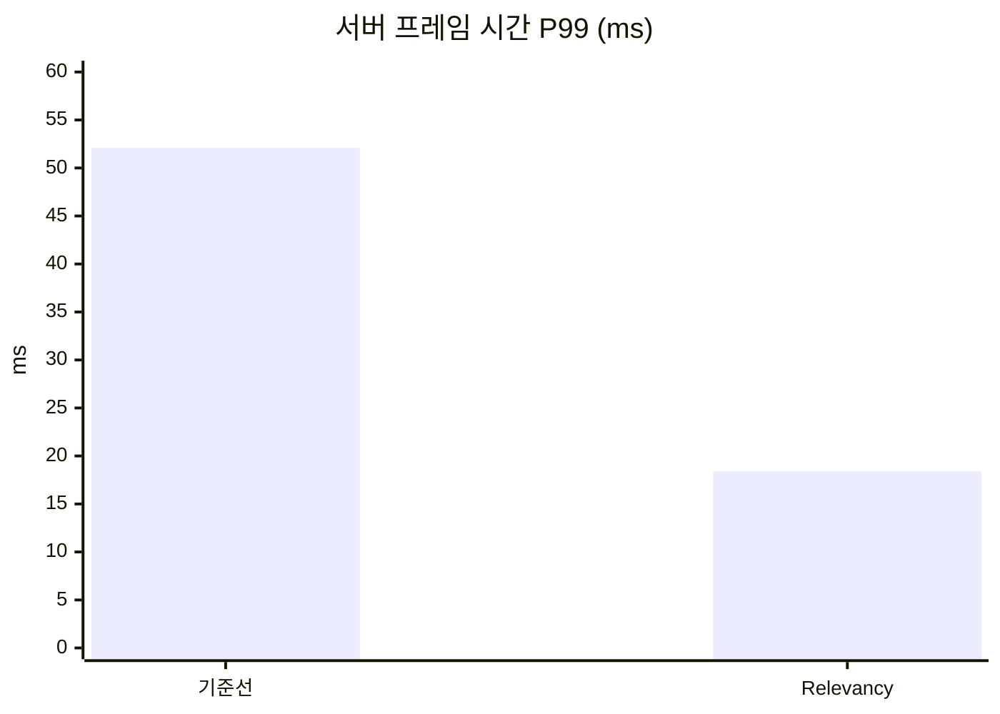

# 포스팅 틀과 시각 자료

포스팅을 쓸 때 따르는 독자, 틀, 문장 규칙, 시각 자료 규칙이다. 용어는 [AGENTS.md](../../AGENTS.md)의 "규칙"에, 수치의 이름은 [measurement.md](measurement.md)의 "수치의 이름과 출처"에 있다. 틀과 문장 규칙은 사용자가 포스팅 0\~4를 읽고 낸 문제로 2026-10-03에 바꿨다([ADR-0015](../Decisions/0015-post-body-and-measurement-record.md)). 따라 쓸 본보기는 [Relevancy와 Net Cull Distance](../../Posts/02-relevancy/README.md)와 그 [측정 기록](../../Posts/02-relevancy/measurements.md)이다.

이 문서는 [단기 설계 문서](https://github.com/hon454/ue-dedicated-server-optimization-lab/blob/post-04-update-frequency/Docs/Planning/2026-10-01-short-term-portfolio-design.md) 7절, 8.4절, 8.6절과 [단기 구현 계획](https://github.com/hon454/ue-dedicated-server-optimization-lab/blob/post-04-update-frequency/Docs/Planning/2026-10-01-short-term-implementation-plan.md)의 "시각 자료 규칙"을 옮긴 것이다(2026-10-03).

## 독자와 분량

- **독자**: UE 네트워킹과 멀티플레이의 초급에서 중급 사이인 개발자다. `bReplicates`, 프로퍼티 리플리케이션, RPC는 안다. NetDriver 내부, 액터 채널, Consider List, Insights 읽는 법은 모른다. Relevancy와 Dormancy는 이름만 들어 봤다.
- **읽는 시간**: 글 하나에 3\~5분이다.
- **분량**: 본문은 표, 코드, 이미지, 링크 주소를 뺀 글로 2,500\~3,500자다. 공백은 세고 줄바꿈은 세지 않는다. 3,500자를 넘으면 수치와 단서를 측정 기록으로 옮긴다([ADR-0018](../Decisions/0018-post-length-in-characters.md), 2026-10-06. 포스팅 1\~8이 2,711\~3,545자).
- **출력 형식의 우선순위**: 같은 내용이면 글보다 도식이, 도식보다 움직이는 도식이 낫다(2026-10-03, 사용자가 참고한 Karpathy의 글). 개념 설명은 글을 늘리지 않고 도식에 맡긴다.

## 본문과 측정 기록

포스팅 폴더에 파일 두 개를 둔다. 태그 하나(`post-NN-이름`)를 붙인다.

| 파일 | 싣는 것 | 싣지 않는 것 |
| --- | --- | --- |
| `Posts/NN-이름/README.md`(본문) | 문제, 원리, 코드 변경, 결과, 배운 것. 수치는 유효 숫자 세 자리 | 실행 라벨(`relevancy2-r3`), 계산식, 엔진 소스의 파일과 줄 번호, 세 실행의 표, CSV 표, Insights 캡처, 빌드와 촬영의 경위 |
| `Posts/NN-이름/measurements.md`(측정 기록) | 본문의 수치마다 정밀한 값과 출처를 대응시킨 표, 세 실행의 Insights 값, CSV 표, 계산식, 내역 표, Insights 캡처, 엔진 소스 위치, 빌드와 시각 자료의 사정, 확인하지 않은 것 | |

- 근거는 없애지 않고 자리를 옮긴다. 본문의 수치는 모두 측정 기록의 "본문의 수치와 출처" 표에 있어야 한다. 근거의 종류는 셋 중 하나다: 직접 측정한 값(측정 조건 명시), 엔진 소스에서 확인한 값(파일과 심볼 명시), 계산으로 얻은 값(식 명시).
- 본문은 요약 끝에서 측정 기록을 한 번 링크한다.
- 측정 기록에는 분량 한도와 문장 규칙을 적용하지 않는다.
- `candidates.md`는 글을 쓰기 전에 에이전트가 사용자의 판단을 위해 준비하는 자료다(Insights에서 읽은 값, 후보 기법, 에이전트 의견). 측정 기록은 Insights에서 읽은 원래 값을 `candidates.md`로 링크하고 다시 적지 않아도 된다.

## 틀

기법을 적용하는 포스팅은 다음 순서를 따른다. 섹션 제목에는 그 글의 주장을 붙인다("문제: 서버가 모든 액터를 모든 클라이언트에게 보낸다").

1. **요약**: 결론 2\~3문장, 수치 표 3\~4행(근거 칸 없음), 전후 대표 이미지, 측정 기록 링크.
2. **문제**: 직전 구성의 서버가 어디에 시간과 대역폭을 쓰는지. 증거는 하나만 든다(작은 표나 그림). 직전 글의 내용은 한 문장과 링크로 받고 다시 쓰지 않는다.
3. **원리**: 기법이 리플리케이션 흐름의 어디를 줄이는지. 새 용어를 정의하고, 흐름도에 줄이는 지점을 표시한다. 끝에 "예상"을 적는다(무엇이 얼마나 줄 것인가, 계산 한 줄).
4. **적용**: 핵심 코드 변경(diff)과 태그 링크.
5. **결과**: 예상과 실제의 대조 표, 차트 하나, 남은 비용, 클라이언트 화면에서 달라진 점(정확성 확인).
6. **배운 것과 한계**: 세 개 이내. 측정 환경의 한계는 테스트베드 글로 링크한다. 끝에 다음 글을 두세 문장으로 예고한다.

기법이 없는 포스팅은 같은 순서에서 필요 없는 섹션을 뺀다.

- **환경을 설명하는 글(테스트베드)**: 요약, 무엇을 띄우는가, 어떻게 측정하는가, 측정 조건으로 고정한 것, 수치를 어디까지 믿을 수 있는가, 다음. 규모를 정한 경위와 보정 실행은 측정 기록에 둔다.
- **진단하는 글(기준선)**: 요약, 기준선의 구성, 원리(서버가 한 프레임에 하는 일), 문제, 선택(기법과 순서), 배운 것과 한계. 독자가 흐름을 알아야 문제의 수치를 읽을 수 있어서 "원리"를 "문제" 앞에 둔다. 세 기법이 함께 쓰는 공통 흐름도를 이 글의 "원리"에 두고, 기법 글은 자기가 쓰는 검사만 꺼내 그리고 이 흐름도로 링크한다.
- **이미 다룬 기법을 새 기준선에 다시 적용하는 글**: 기법 글과 같은 여섯 섹션을 쓰되 이렇게 줄인다(포스팅 6, 2026-10-05 사용자 결정). "문제"는 새 기준선에서 기법의 효과를 바꾸는 조건 하나와 증거 하나다. "원리"는 원래 글로 링크하고, 그 조건에서 기법이 무엇을 빼고 무엇을 남기는지 한 문단과 도식 하나로 쓴 뒤 "예상"을 적는다. "적용"은 새 코드 없이 구성별 실행 인자 표와 태그다. "결과"는 구성 표와 차트, 1막과 기법별 몫의 비교를 넣는다. 1막과 2막의 절댓값은 비교하지 않고 비율만 비교한다.
- **테스트베드를 확장하고 새 기준선을 잡는 글**: 요약, 무엇을 더했는가(요소마다 뒤의 어느 글에 재료가 되는지), 새 기준선(어디에 시간과 대역폭을 쓰는가, 1막 기준선과 비교), 밀집과 분산, 배운 것과 한계(끝에 다음 글 예고). "원리"는 기준선 글로 링크하고, 규모를 정한 경위와 보정 실행은 측정 기록에 둔다(포스팅 5, 2026-10-04 사용자 결정).
- **측정만 하는 진단 글(2막)**: 기법 글과 같은 여섯 섹션을 쓰되 "적용" 자리에 "측정"을 둔다(포스팅 7, 2026-10-06 사용자 결정). 순서는 요약, 문제(내역을 모르는 비용과 증거 하나), 원리(그 비용이 생기는 흐름, 끝에 "예상"), 측정(더 켠 타이머, 더 센 것, 대조 실행의 실행 인자 표와 태그), 결과(예상과 실제의 대조), 배운 것과 한계(끝에 다음 글 예고)다. 서버의 동작을 바꾸지 않으므로 코드는 측정을 위해 더한 것만 싣는다. 측정 때문에 서버 시간이 달라지는 실행은 비율로만 읽는다고 "측정"에 적는다.

2막에는 기법을 적용하지 않는 포스팅이 세 종류 있다([ADR-0014](../Decisions/0014-act-2-testbed-expansion.md)): 환경을 설명하는 포스팅(테스트베드 확장과 새 기준선), 이미 다룬 기법을 새 기준선에 다시 적용하는 포스팅, 측정만 하는 진단 포스팅. 위의 순서는 1막의 글을 다시 쓰면서 정한 것이고, 환경을 설명하는 포스팅의 틀은 포스팅 5에서, 기법을 다시 적용하는 포스팅의 틀은 포스팅 6에서, 진단 포스팅의 틀은 포스팅 7에서 정했다([2막 구현 계획](../Planning/2026-10-03-act-2-implementation-plan.md) 태스크 21.3). 2막의 진단 글은 1막의 기준선 글과 달리 "문제"를 "원리" 앞에 둔다.

"문제"와 "원리"는 에이전트가 초안을 쓰고 사용자가 승인한다. Insights 분석의 판단과 기법의 선택, 순서는 사용자가 한다(AGENTS.md "사람에게 넘기는 일"). 처음 틀(요약, 관찰, 선택, 적용, 결과, 한계와 다음)은 태그 `post-04-update-frequency`까지의 글에 남아 있다. 그 전에 있던 "Iris에서는" 섹션은 [ADR-0011](../Decisions/0011-no-iris-preview-section.md)로 뺐다.

## 문장 규칙

본문에 적용한다. ASD-STE100(항공 정비 문서용 통제 언어 규격)의 규칙을 한국어에 맞게 옮긴 것이다. 규격은 문장을 20\~25단어 이하로, 문단을 여섯 문장 이하로, 문단마다 주제 하나로, 능동태로, 한 단어를 한 뜻으로 쓰게 한다.

- **한 문장에 사실 하나를 쓴다.** 60자 안팎으로 쓰고 80자를 넘기지 않는다.
- **한 문단에 주제 하나를 쓴다.** 다섯 문장을 넘기지 않는다.
- **주어를 밝힌 능동문으로 쓴다.** "서버가 자원 노드를 비교한다"로 쓰고 "자원 노드가 비교된다"로 쓰지 않는다.
- **한 용어는 한 뜻으로만 쓴다.** 같은 것을 다른 말로 바꿔 부르지 않는다. 용어는 AGENTS.md의 "포스팅과 루트 README의 용어와 부르는 법"을 따른다.
- **새 용어는 처음 나올 때 한 문장으로 정의한다.** 틱 예산, 연결, 액터 채널, Consider List처럼 독자가 모르는 말이다. 다른 글에서 정의했어도 그 글에서 처음 쓸 때 다시 정의한다.
- **한 문장에 숫자는 둘, 괄호는 하나까지 쓴다.** 범위(`17.60~17.76ms`)는 숫자 하나로 센다.
- **수치는 유효 숫자 세 자리로 쓴다.** 198.43ms는 198ms, 17.64ms는 17.6ms, 28,048바이트/초는 28,000바이트/초다. 세어서 얻은 개수(5,001개, 42,408번)는 줄이지 않는다.
- **단서는 필요한 곳에만 쓴다.** 추정은 "추정한다"로 한 번 적는다. "읽지 않았다", "확인하지 않았다"의 목록은 측정 기록의 "확인하지 않은 것"에 둔다. 구별되지 않는 차이는 본문에서도 "구별되지 않았다"고 적는다.

초안을 쓴 뒤 문장 길이, 문장당 숫자와 괄호 수를 세어 확인한다.

## 정확성 확인

포스팅마다 최적화가 클라이언트 화면에 준 변화를 확인하고 적는다. 수동 확인용 스크립트(`Scripts/run-manual.ps1`)가 클라이언트 두 개를 같은 자리에 띄운다. 예: 관련성 적용 후 노드가 나타나는 거리, Dormancy 적용 후 채집 결과가 다른 클라이언트에 전달되는지, Dormant 상태의 액터가 멀어진 뒤에도 클라이언트에 남는 동작.

## 시각 자료

리플리케이션 최적화는 수치만으로는 와닿지 않으므로, 클라이언트가 실제로 무엇을 받고 있는지를 그림으로 보여준다. 글보다 그림이 먼저 보이게 한다. 내려다보기 화면의 전후 비교가 각 포스팅의 대표 이미지다.

시각 자료는 두 종류다. **증거**는 실행에서 찍은 것(스크린샷, 영상, Insights 캡처)이고, **설명**은 원리를 그린 것(흐름도, 개념도)이다. 증거는 지금처럼 적극적으로 모으되, 본문에는 다음 기준으로 넣는다.

- 주장 하나에 시각 자료 하나를 넣는다. 같은 주장을 표, 차트, 캡처로 거듭 보이지 않는다.
- "원리"에는 흐름도를 하나 넣는다. Mermaid `flowchart`로 그리고, 기법이 줄이는 지점을 색으로 표시한다. 세 기법이 함께 쓰는 공통 흐름도는 기준선 글에 있다.
- Mermaid로 그릴 수 없는 것(지도, 시간에 따른 변화)은 SVG 파일로 만든다. 움직임이 설명에 필요하면 SMIL 애니메이션을 넣는다. 만드는 스크립트를 `Scripts/make-<이름>.ps1`로 남긴다(`Scripts/make-relevancy-map.ps1`, `Scripts/make-dormancy-trail.ps1`). 겹치는 영역은 `clipPath`로, 지나온 자취는 `mask`와 `stroke-dashoffset`으로 그리면 점마다 애니메이션을 넣지 않아도 된다. 움직이는지는 Edge 헤드리스(`--headless=new --virtual-time-budget=<ms> --screenshot=<파일>`)로 두 시점을 찍어 확인한다. 시간에 따른 순서만 보이면 되는 것은 마크다운 표로 그려도 된다(Net Update Frequency 글의 프레임 표). 실제 값으로 그린 것과 예시로 그린 것을 캡션에 적는다.
- 차트는 본문에 하나만 넣는다. 틱 예산처럼 비교할 기준이 있으면 선으로 함께 그린다. 축 이름이 길면 `xychart-beta horizontal`로 눕힌다. 세로 차트에서는 GitHub의 폭에서 마지막 축 이름이 잘린다(루트 README의 "Net Update Frequency").
- GitHub는 Mermaid 도식의 오른쪽 아래에 확대 단추(약 100px 사각형)를 겹쳐 그린다. 폭이 좁은 화면에서는 가로 흐름도의 마지막 칸이 가려진다. 마지막 칸 뒤에 보이지 않는 여백 칸을 둔다: `마지막 ~~~ Pad["여백여백여백"]`, `classDef pad fill:none,stroke:none,color:transparent`, `class Pad pad`. 칸 이름은 투명한 글자 여섯 자다. 공백으로 쓰면 GitHub가 칸을 좁게 그려 마지막 칸이 가려진다. 새 흐름도는 푸시하기 전에 GitHub의 파일 편집 화면에서 Preview 탭으로 확인한다(창 폭 약 800px, 저장하지 않는다). 상태 도식은 세로 배치로 둔다.
- 흐름도가 한 화면보다 길어지면 `subgraph`마다 `direction LR`을 주어 줄 단위로 나누고, 검사는 마름모 대신 육각형(`{{ }}`)으로 그린다. 기준선 글의 공통 흐름도는 세로 배치에서 약 1,370px이었고 세 줄로 바꿔 약 540px이 됐다(680px 폭). 한 줄에는 칸을 셋까지 두고, 칸 이름이 길면 `<br/>`로 줄을 나눠 칸을 좁힌다. 넷 이상이면 GitHub가 도식을 폭에 맞춰 줄여서 글자가 본문보다 훨씬 작아진다(기준선 글의 두 줄 배치, 테스트베드 글의 한 줄 배치가 그랬다). 줄 사이의 화살표는 칸이 아니라 `subgraph`끼리 잇는다. 칸을 바깥과 이으면 Mermaid가 그 `subgraph`의 `direction`을 무시한다.
- Insights 캡처는 측정 기록에 넣는다. 본문에는 캡처에서 읽은 값을 작은 표로 옮긴다.
- 전후 영상은 달라진 쪽 하나만 넣어도 된다. 나머지는 측정 기록에 파일 이름을 적는다.

| 자료 | 만드는 방법 | 담당 |
| --- | --- | --- |
| 흐름도 | Mermaid `flowchart` | 에이전트 |
| 개념도(움직이는 도식 포함) | `Scripts/make-<이름>.ps1`이 만드는 SVG | 에이전트 |
| 화면 위 글자 | 모든 클라이언트가 자신에게 존재하는 노드 수와 NPC 수를 화면에 표시 | 코드 |
| 내려다보기 화면 | 클라이언트 하나가 위에서 내려다보며, 자신에게 존재하는 노드와 NPC 위치에 색 점을 그림 | 코드 |
| 자동 스크린샷 | 3인칭 클라이언트 하나와 내려다보기 클라이언트가 공통 시작 신호 이후 15초마다 저장 | 코드, 에이전트가 골라 포스팅에 넣음 |
| 수치 차트 | GitHub가 그려 주는 Mermaid 막대 차트 | 에이전트 |
| Insights 전후 스크린샷 | Timing Insights, Network Insights | 에이전트가 찍어 후보로 줌, 사람이 고름 |
| 전후 영상 | 10초 안팎의 화면 녹화(`Scripts/capture-video.ps1`, 측정 실행과 따로) | 에이전트가 허가를 받고 찍음, 사람이 고름 |

화면 표시와 스크린샷의 비용은 클라이언트에 들고, 클라이언트가 가진 액터 수에 따라 달라진다. 서버와 클라이언트의 코어를 분리해([measurement.md](measurement.md) "재현성") 이 차이가 서버 수치에 섞이는 것을 줄인다. 내려다보기 클라이언트의 카메라 위치는 서버의 관련성 판정 기준으로 쓰이지 않는다. 서버는 폰 위치를 기준으로 판정한다([engine-notes.md](../Reference/engine-notes.md) "관련성 판정의 기준 위치").

### 자동으로 모이는 것

시나리오를 실행하면 클라이언트 두 개가 공통 시작 신호 이후 15초마다 스크린샷을 `Saved/Screenshots/Lab/`에 남긴다. 순번 NN은 시작 신호로부터 15 × (NN + 1)초가 지난 시점이라서, 다른 실행의 같은 순번은 같은 시점이다.

| 파일 이름 | 내용 |
| --- | --- |
| `<라벨>-tpp-NN.png` | 0번 클라이언트의 3인칭 화면. 검증용 노드 옆에 서서 채집한다. 화면 왼쪽 위 상자에 라벨, 자리와 역할, 경과 시간, 이 클라이언트에 존재하는 노드 수와 NPC 수, 위치가 찍힌다(두 화면 공통) |
| `<라벨>-topdown-NN.png` | 1번 클라이언트의 내려다보기 화면. 이 클라이언트에 존재하는 노드는 초록 점, 고갈된 노드는 검은 점, NPC는 빨간 점이다 |

에이전트는 측정이 끝나면 이미지를 직접 열어 보고, 내용이 잘 보이는 것을 골라 `Posts/NN-이름/images/`에 복사한다. 적용 전 이미지는 `before-`, 적용 후 이미지는 `after-`를 앞에 붙인다(예: `before-topdown.png`, `after-topdown.png`). 전후 이미지는 같은 순번에서 고른다.

에이전트는 수치 차트도 만든다. 포스팅의 "결과" 섹션에 Mermaid `xychart-beta` 막대 차트를 하나 넣고, README의 누적 수치 표 아래에도 넣는다. 차트 하나에 지표 하나만 넣는다.

````markdown

````

위 숫자는 형식을 보여주는 예시다. 실제 측정값을 넣는다.

### 에이전트가 찍어 후보로 주고 사람이 고르는 것

| 자료 | 언제 | 파일 이름 |
| --- | --- | --- |
| Timing Insights 프레임 그래프와 타이머 트리 | 포스팅마다 적용 후. 적용 전은 직전 포스팅의 것을 쓴다 | `before-timing.png`, `after-timing.png` |
| Network Insights 패킷 내용 화면 | 포스팅마다 적용 후. 적용 전은 직전 포스팅의 것을 쓴다 | `before-network.png`, `after-network.png` |
| 클라이언트 화면 영상 10초 안팎(GIF, 폭 960px, 8fps, 48색. 2026-10-02 사용자 결정으로 15fps에서 줄임) | 정확성 확인 항목이 움직임일 때 | `before-clip.gif`, `after-clip.gif` |
| 8개 창이 떠 있는 전체 화면 | 테스트베드 포스팅에 한 번 | `all-clients.png` |

Insights 스크린샷은 에이전트가 `Scripts/capture-insights.ps1`로 찍어 후보로 주고(2026-10-01 사용자 결정, [insights-reading.md](insights-reading.md)), 사람이 고르거나 직접 찍는다. 고른 캡처는 측정 기록에 넣는다. 전후를 같은 확대 수준으로, 두 북마크 사이의 구간에서 찍는다. 본문이 인용하는 값에 번호 붙은 외곽선 상자를 최대 3개 그린다(`Scripts/annotate-image.ps1`). 원본은 그대로 둔다.

영상과 전체 화면은 에이전트가 `Scripts/capture-video.ps1`로 찍는다(2026-10-02 사용자 결정). 찍기 전 허가와 측정 실행과의 분리는 AGENTS.md의 규칙 "화면을 찍기 전에 허가를 받는다", "영상은 수치를 쓰는 측정 실행에서 찍지 않는다"를 따른다. 8개 창이 필요하면 시각 자료 전용 라벨(`visual1`, `visual2`, …)로 `run-scenario.ps1`을 돌리고 `-AllowMeasuring`을 준다. 이 라벨의 수치는 비교에 쓰지 않는다. 전후 영상은 자동 이동 클라이언트의 정해진 정사각형 경로를 같은 창 배치로 찍는다. 찍은 뒤 `Saved/Screenshots/Lab/<이름>-preview.png`를 열어 원하는 장면이 담겼는지 확인한다. 창 좌표와 인자는 [STATUS.md](../STATUS.md)의 "명령"에 있다.

NPC 하나의 움직임을 전후로 비교할 때는 `run-scenario.ps1`에 `-ShowcaseNpc`를 준다(`visualN` 라벨에서만 받는다). 서버 인자 `-LabShowcaseNpc`가 0번 자리 앞 10m에 NPC 하나를 더 스폰해 0번 3인칭 화면의 오른쪽 절반을 가로지르는 10m 직선을 300cm/s로 왕복시킨다. 위치가 시작 신호 뒤의 경과 시간만으로 정해져 두 실행의 같은 시각에 같은 자리에 있다. 0번 창의 영역만 60fps MP4로 찍고, 자르기와 느린 재생은 ffmpeg로 따로 한다(`visual9`, `visual10`, [Net Update Frequency 포스팅의 후보 자료](../../Posts/04-update-frequency/candidates.md) 6절).
