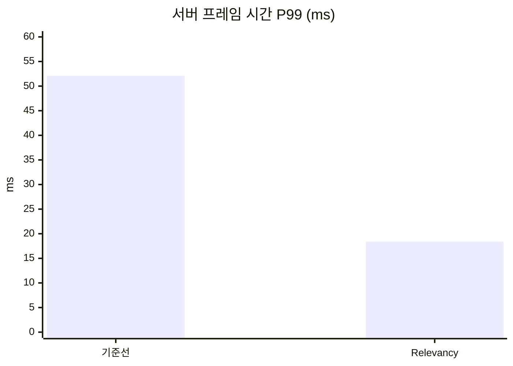

# 포스팅 틀과 시각 자료

포스팅을 쓸 때 따르는 틀과 시각 자료 규칙이다. 문체와 용어는 [AGENTS.md](../../AGENTS.md)의 "규칙"에, 수치의 이름은 [measurement.md](measurement.md)의 "수치의 이름과 출처"에 있다.

이 문서는 [단기 설계 문서](https://github.com/hon454/ue-dedicated-server-optimization-lab/blob/post-04-update-frequency/Docs/Planning/2026-10-01-short-term-portfolio-design.md) 7절, 8.4절, 8.6절과 [단기 구현 계획](https://github.com/hon454/ue-dedicated-server-optimization-lab/blob/post-04-update-frequency/Docs/Planning/2026-10-01-short-term-implementation-plan.md)의 "시각 자료 규칙"을 옮긴 것이다(2026-10-03).

## 틀

포스팅은 `Posts/NN-이름/README.md`에 두고, 태그 하나(`post-NN-이름`)를 붙인다. 모든 포스팅이 같은 순서를 따른다.

1. **요약**: 한 문단과 전후 수치 표
2. **관찰**: Insights 스크린샷과 함께, 무엇이 가장 큰 비용인지
3. **선택**: 후보 기법들과, 이것을 고른 이유(구현 비용 대 기대 효과)
4. **적용**: 핵심 코드 변경과 태그 링크
5. **결과**: 같은 시나리오로 재측정한 수치와 스크린샷, 클라이언트 화면에서 달라진 점
6. **한계와 다음**: 이 측정이 말해주지 않는 것, 다음 포스팅 예고

처음 틀에는 "적용" 다음에 "Iris에서는"(실행해 보지 않은 예고) 섹션이 있었고, [ADR-0011](../Decisions/0011-no-iris-preview-section.md)로 뺐다. "관찰"과 "선택"은 사용자가 쓰고, 에이전트는 `Posts/NN-이름/candidates.md`에 자료를 준비한다(AGENTS.md "사람에게 넘기는 일").

2막에는 기법을 적용하지 않는 포스팅이 세 종류 있다([ADR-0014](../Decisions/0014-act-2-testbed-expansion.md)): 환경을 설명하는 포스팅(테스트베드 확장과 새 기준선), 이미 다룬 기법을 새 기준선에 다시 적용하는 포스팅, 측정만 하는 진단 포스팅. 이 포스팅들은 "선택"과 "적용"이 맞지 않는다. 어느 섹션을 빼고 무엇으로 바꿀지는 그 종류의 첫 포스팅을 쓸 때 사용자와 정해 여기에 적는다([2막 구현 계획](../Planning/2026-10-03-act-2-implementation-plan.md) 태스크 21.3). 1막의 [테스트베드와 측정 방법](../../Posts/00-testbed/README.md)이 환경을 설명하는 포스팅의 예다.

포스팅에 쓰는 모든 수치와 설정값에는 근거를 함께 적는다. 근거의 종류는 셋 중 하나다: 직접 측정한 값(측정 조건 명시), 엔진 소스에서 확인한 값(파일과 심볼 명시), 계산으로 얻은 값(식 명시).

## 정확성 확인

포스팅마다 최적화가 클라이언트 화면에 준 변화를 확인하고 적는다. 수동 확인용 스크립트(`Scripts/run-manual.ps1`)가 클라이언트 두 개를 같은 자리에 띄운다. 예: 관련성 적용 후 노드가 나타나는 거리, Dormancy 적용 후 채집 결과가 다른 클라이언트에 전달되는지, Dormant 상태의 액터가 멀어진 뒤에도 클라이언트에 남는 동작.

## 시각 자료

리플리케이션 최적화는 수치만으로는 와닿지 않으므로, 클라이언트가 실제로 무엇을 받고 있는지를 그림으로 보여준다. 글보다 그림이 먼저 보이게 한다. 내려다보기 화면의 전후 비교가 각 포스팅의 대표 이미지다.

| 자료 | 만드는 방법 | 담당 |
| --- | --- | --- |
| 화면 위 글자 | 모든 클라이언트가 자신에게 존재하는 노드 수와 NPC 수를 화면에 표시 | 코드 |
| 내려다보기 화면 | 클라이언트 하나가 위에서 내려다보며, 자신에게 존재하는 노드와 NPC 위치에 색 점을 그림 | 코드 |
| 자동 스크린샷 | 3인칭 클라이언트 하나와 내려다보기 클라이언트가 공통 시작 신호 이후 15초마다 저장 | 코드, 에이전트가 골라 포스팅에 넣음 |
| 수치 차트 | GitHub가 그려 주는 Mermaid 막대 차트 | 에이전트 |
| Insights 전후 스크린샷 | Timing Insights, Network Insights | 에이전트가 찍어 후보로 줌, 사람이 고름 |
| 전후 영상 | 10초 안팎의 화면 녹화(`Scripts/capture-video.ps1`, 측정 실행과 따로) | 에이전트가 허가를 받고 찍음, 사람이 고름 |

화면 표시와 스크린샷의 비용은 클라이언트에 들고, 클라이언트가 가진 액터 수에 따라 달라진다. 서버와 클라이언트의 코어를 분리해([measurement.md](measurement.md) "재현성") 이 차이가 서버 수치에 섞이는 것을 줄인다. 내려다보기 클라이언트의 카메라 위치는 서버의 관련성 판정 기준으로 쓰이지 않는다. 서버는 폰 위치를 기준으로 판정한다([engine-notes.md](../Reference/engine-notes.md) "관련성 판정의 기준 위치").

### 자동으로 모이는 것

시나리오를 실행하면 클라이언트 두 개가 공통 시작 신호 이후 15초마다 스크린샷을 `Saved/Screenshots/Lab/`에 남긴다. 순번 NN은 시작 신호로부터 15 × (NN + 1)초가 지난 시점이라서, 다른 실행의 같은 순번은 같은 시점이다.

| 파일 이름 | 내용 |
| --- | --- |
| `<라벨>-tpp-NN.png` | 0번 클라이언트의 3인칭 화면. 검증용 노드 옆에 서서 채집한다. 화면 왼쪽 위 상자에 라벨, 자리와 역할, 경과 시간, 이 클라이언트에 존재하는 노드 수와 NPC 수, 위치가 찍힌다(두 화면 공통) |
| `<라벨>-topdown-NN.png` | 1번 클라이언트의 내려다보기 화면. 이 클라이언트에 존재하는 노드는 초록 점, 고갈된 노드는 검은 점, NPC는 빨간 점이다 |

에이전트는 측정이 끝나면 이미지를 직접 열어 보고, 내용이 잘 보이는 것을 골라 `Posts/NN-이름/images/`에 복사한다. 적용 전 이미지는 `before-`, 적용 후 이미지는 `after-`를 앞에 붙인다(예: `before-topdown.png`, `after-topdown.png`). 전후 이미지는 같은 순번에서 고른다.

에이전트는 수치 차트도 만든다. 포스팅의 "결과" 섹션과 README의 누적 수치 표 아래에 Mermaid `xychart-beta` 막대 차트를 넣는다. 차트 하나에 지표 하나만 넣는다.

````markdown

````

위 숫자는 형식을 보여주는 예시다. 실제 측정값을 넣는다.

### 에이전트가 찍어 후보로 주고 사람이 고르는 것

| 자료 | 언제 | 파일 이름 |
| --- | --- | --- |
| Timing Insights 프레임 그래프와 타이머 트리 | 포스팅마다 적용 후. 적용 전은 직전 포스팅의 것을 쓴다 | `before-timing.png`, `after-timing.png` |
| Network Insights 패킷 내용 화면 | 포스팅마다 적용 후. 적용 전은 직전 포스팅의 것을 쓴다 | `before-network.png`, `after-network.png` |
| 클라이언트 화면 영상 10초 안팎(GIF, 폭 960px, 8fps, 48색. 2026-10-02 사용자 결정으로 15fps에서 줄임) | 정확성 확인 항목이 움직임일 때 | `before-clip.gif`, `after-clip.gif` |
| 8개 창이 떠 있는 전체 화면 | 테스트베드 포스팅에 한 번 | `all-clients.png` |

Insights 스크린샷은 에이전트가 `Scripts/capture-insights.ps1`로 찍어 후보로 주고(2026-10-01 사용자 결정, [insights-reading.md](insights-reading.md)), 사람이 고르거나 직접 찍는다. 전후를 같은 확대 수준으로, 두 북마크 사이의 구간에서 찍는다. 본문이 인용하는 값에 번호 붙은 외곽선 상자를 최대 3개 그린다(`Scripts/annotate-image.ps1`). 원본은 그대로 둔다.

영상과 전체 화면은 에이전트가 `Scripts/capture-video.ps1`로 찍는다(2026-10-02 사용자 결정). 찍기 전 허가와 측정 실행과의 분리는 AGENTS.md의 규칙 "화면을 찍기 전에 허가를 받는다", "영상은 수치를 쓰는 측정 실행에서 찍지 않는다"를 따른다. 8개 창이 필요하면 시각 자료 전용 라벨(`visual1`, `visual2`, …)로 `run-scenario.ps1`을 돌리고 `-AllowMeasuring`을 준다. 이 라벨의 수치는 비교에 쓰지 않는다. 전후 영상은 자동 이동 클라이언트의 정해진 정사각형 경로를 같은 창 배치로 찍는다. 찍은 뒤 `Saved/Screenshots/Lab/<이름>-preview.png`를 열어 원하는 장면이 담겼는지 확인한다. 창 좌표와 인자는 [STATUS.md](../STATUS.md)의 "명령"에 있다.

NPC 하나의 움직임을 전후로 비교할 때는 `run-scenario.ps1`에 `-ShowcaseNpc`를 준다(`visualN` 라벨에서만 받는다). 서버 인자 `-LabShowcaseNpc`가 0번 자리 앞 10m에 NPC 하나를 더 스폰해 0번 3인칭 화면의 오른쪽 절반을 가로지르는 10m 직선을 300cm/s로 왕복시킨다. 위치가 시작 신호 뒤의 경과 시간만으로 정해져 두 실행의 같은 시각에 같은 자리에 있다. 0번 창의 영역만 60fps MP4로 찍고, 자르기와 느린 재생은 ffmpeg로 따로 한다(`visual9`, `visual10`, [Net Update Frequency 포스팅의 후보 자료](../../Posts/04-update-frequency/candidates.md) 6절).
