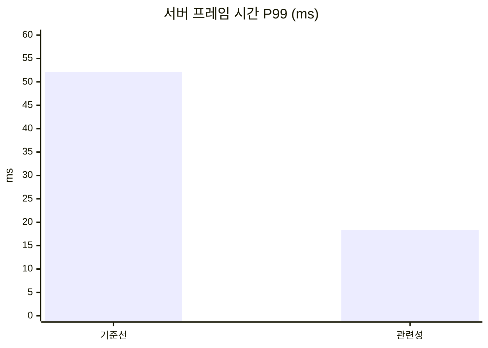

# 단기 포트폴리오 구현 계획

> **에이전트에게:** 이 계획을 태스크 순서대로 실행한다. 단계는 체크박스(`- [ ]`)로 추적하고, 끝낸 단계는 이 파일에서 체크한다. 이 프로젝트는 단위 테스트를 쓰지 않는다. 검증은 "빌드 성공, 시나리오 완주, CSV 수치"다([AGENTS.md](../../AGENTS.md)).

**목표:** 언리얼 엔진 5.8.3 Dedicated Server에서 레거시 리플리케이션 최적화를 기법 하나당 포스팅 하나로 보여주는 레포를 완성한다.

**구조:** TPP 템플릿 프로젝트에 C++ 클래스 여섯 개를 추가한다(템플릿의 캐릭터 클래스는 `ALabCharacter`로 이름만 바꿔 남겼다). 서버가 시작할 때 자원 노드와 AI NPC를 고정 시드로 생성하고, 모든 클라이언트가 준비되면 공통 시작 신호를 보낸다. 측정 서브시스템이 수치를 CSV로 남긴 뒤 서버를 종료한다. PowerShell 스크립트 하나가 서버와 클라이언트 전부를 띄우고 정리한다.

**기술:** Unreal Engine 5.8.3 소스 빌드, C++, PowerShell, Unreal Insights, Git LFS

**설계 문서:** [2026-10-01-short-term-portfolio-design.md](2026-10-01-short-term-portfolio-design.md)

---

## 이 계획의 코드에 대한 전제

이 계획의 C++ 코드는 엔진 소스를 볼 수 없는 환경(Mac)에서 UE 5.4\~5.6 기준 지식으로 작성했고 컴파일해 보지 않았다. 5.8.3에서 이름이 바뀐 API가 있을 수 있다. 컴파일 오류가 나면 추측으로 고치지 말고 엔진 헤더에서 현재 이름을 확인한다. 달라졌을 가능성이 있는 지점은 태스크 2.5의 표와 각 태스크의 "확인" 단계에 적어 두었다.

2026-10-01에 태스크 1\~7.2를 구현하면서 이 문서를 실제 구성에 맞췄다. 프로젝트 이름과 위치(`DSOptLab.uproject`, 레포 루트), 접두사(`Lab`), 문서 위치(`Docs/`)를 반영했고, 구현이 끝난 태스크의 초안 코드는 지우고 저장소의 파일을 가리키게 했다. 초안과 달라진 코드는 [engine-notes.md](engine-notes.md) 라절에 있다. 아직 구현하지 않은 "기법별 코드"는 초안 그대로다.

2026-10-01에 다른 모델(Codex)의 리뷰를 받아 측정 정의, 공통 시작 신호, 실패 처리, CPU 코어 분리를 보강했다.

## 표기

- **[사람]**: 사용자가 직접 한다. 에이전트는 이 단계에 도달하면 무엇을 해야 하는지 알리고 기다린다.
- 표기가 없는 단계는 에이전트가 한다.
- 경로는 레포 루트 기준이다. 언리얼 프로젝트(`DSOptLab.uproject`)가 레포 루트에 있고, 문서는 `Docs/`, 포스팅은 `Posts/`에 둔다.
- 이 프로젝트에서 만드는 클래스, 실행 인자, 저장 폴더의 접두사는 `Lab`이다(`ALabResourceNode`, `-LabNodes=`, `Saved/LabMetrics/`).
- PowerShell 스크립트 실행: `powershell -ExecutionPolicy Bypass -File Scripts/<이름>.ps1 <인자>`

## 수치의 이름과 출처

같은 이름으로 다른 값을 부르지 않는다.

| 이름 | 정의 | 출처 | 쓰는 곳 |
| --- | --- | --- | --- |
| `work` | 월드 틱 시작부터 프레임 끝까지의 경과 시간. CPU 실행 시간이 아니라 경과 시간이라서 그 구간의 스레드 대기와 OS 스케줄링 지연이 들어간다 | CSV | `Docs/STATUS.md`, 에이전트의 전후 비교 |
| `netflush` | 액터 틱 종료부터 프레임 끝까지의 경과 시간. 리플리케이션 전용 시간이 아니다 | CSV | `Docs/STATUS.md`, 보조 지표 |
| 서버 프레임 시간 | Timing Insights의 프레임 시간 | Insights | 포스팅과 README의 표 |
| 리플리케이션 시간 | Insights 타이머 `GameNetDriver`의 프레임당 Incl(선택 구간의 Incl ÷ `WorldTick`의 Count). 태스크 8.5에서 사용자가 골랐고(2026-10-01) 이후 바꾸지 않는다 | Insights | 포스팅과 README의 표 |
| 연결당 송신 대역폭 | 측정 구간의 연결당 초당 송신 바이트 | CSV와 Network Insights | 둘 다 |
| 연결당 열린 액터 채널 수 | 연결 하나에 열려 있는 액터 채널 수. 휴면 액터는 채널이 닫히므로 "클라이언트에 존재하는 액터 수"와 다르다 | CSV | 둘 다 |
| 클라이언트에 존재하는 액터 수 | 클라이언트 화면 위 글자의 노드 수와 NPC 수 | 스크린샷 | 포스팅 |
| `saturated_ratio` | 측정 구간에 모든 연결에서 송신 한도 때문에 중간에 끊긴 리플리케이션 횟수 ÷ 리플리케이션 시도 횟수. 엔진이 `ServerReplicateActors`에서 연결마다 남기는 기록(`UNetConnection::GetSaturationAnalytics`)의 차다. 2026-10-01에 정의를 바꿨다. 그 전의 `smoke` 행은 프레임 끝의 `IsNetReady()`로 잰 값이다 | CSV | `Docs/STATUS.md`, 해석의 전제 |

`Docs/STATUS.md`의 측정 결과 표에는 CSV 값을 CSV 열 이름 그대로 적는다. 포스팅과 README의 표에는 사람이 Insights에서 읽은 값을 쓴다. 서버는 측정 구간의 시작과 끝에 `Lab_MeasureStart`, `Lab_MeasureEnd` 북마크를 트레이스에 남기므로, Insights에서 이 두 북마크 사이를 본다.

## 일정이 넘칠 때

줄이는 순서는 다음과 같다. 위에서부터 줄인다.

1. 중복 시각 자료. 직전 포스팅의 적용 후 트레이스와 이미지를 다음 포스팅의 적용 전 자료로 그대로 쓴다. 새로 찍지 않는다.
2. "Iris에서는" 섹션. 세 문장 안쪽의 미검증 예고로 줄인다.
3. 포스팅 4. 다음 주로 넘기고 README에 "예정"으로 둔다.

측정 검증(태스크 8)과 사람이 쓰는 "관찰", "선택" 섹션은 줄이지 않는다. 믿을 수 있는 네 편이 믿을 수 없는 다섯 편보다 낫다.

## 시각 자료 규칙

포스팅마다 시각 자료를 적극적으로 모은다. 글보다 그림이 먼저 보이게 한다.

**자동으로 모이는 것 (에이전트가 수집)**

시나리오를 실행하면 클라이언트 두 개가 공통 시작 신호 이후 15초마다 스크린샷을 `Saved/Screenshots/Lab/`에 남긴다. 순번 NN은 시작 신호로부터 15 × (NN + 1)초가 지난 시점이라서, 다른 실행의 같은 순번은 같은 시점이다.

| 파일 이름 | 내용 |
| --- | --- |
| `<라벨>-tpp-NN.png` | 0번 클라이언트의 3인칭 화면. 검증용 노드 옆에 서서 채집한다. 화면 왼쪽 위 상자에 라벨, 자리와 역할, 경과 시간, 이 클라이언트에 존재하는 노드 수와 NPC 수, 위치가 찍힌다(두 화면 공통) |
| `<라벨>-topdown-NN.png` | 1번 클라이언트의 내려다보기 화면. 이 클라이언트에 존재하는 노드는 초록 점, 고갈된 노드는 검은 점, NPC는 빨간 점이다 |

에이전트는 측정이 끝나면 이미지를 직접 열어 보고, 내용이 잘 보이는 것을 골라 `Posts/NN-이름/images/`에 복사한다. 적용 전 이미지는 `before-`, 적용 후 이미지는 `after-`를 앞에 붙인다(예: `before-topdown.png`, `after-topdown.png`). 전후 이미지는 같은 순번에서 고른다.

에이전트는 수치 차트도 만든다. 포스팅의 "결과" 섹션과 README의 누적 수치 표 아래에 Mermaid `xychart-beta` 막대 차트를 넣는다. GitHub가 바로 그려 주므로 별도 도구가 필요 없다. 차트 하나에 지표 하나만 넣는다.

````markdown

````

위 숫자는 형식을 보여주는 예시다. 실제 측정값을 넣는다.

**사람이 모으는 것**

| 자료 | 언제 | 파일 이름 |
| --- | --- | --- |
| Timing Insights 프레임 그래프와 타이머 트리 | 포스팅마다 적용 후. 적용 전은 직전 포스팅의 것을 쓴다 | `before-timing.png`, `after-timing.png` |
| Network Insights 패킷 내용 화면 | 포스팅마다 적용 후. 적용 전은 직전 포스팅의 것을 쓴다 | `before-network.png`, `after-network.png` |
| 클라이언트 화면 영상 10초 안팎(GIF 또는 MP4) | 정확성 확인 항목이 움직임일 때 | `before-clip.gif`, `after-clip.gif` |
| 8개 창이 떠 있는 전체 화면 | 테스트베드 포스팅에 한 번 | `all-clients.png` |

Insights 스크린샷은 에이전트가 찍어 후보로 주고(2026-10-01 사용자 결정, `Docs/Guides/insights-reading.md`), 사람이 고르거나 직접 찍는다. 영상은 Windows 게임 바(Win+Alt+R)나 ShareX로 녹화한다. Insights 스크린샷은 전후를 같은 확대 수준으로, 두 북마크 사이의 구간에서 찍는다.

## 파일 구조

| 파일 | 책임 |
| --- | --- |
| `Source/DSOptLab/LabScenarioConfig.h/.cpp` | 실행 인자에서 시나리오 값(개수, 시드, 측정 시간, 클라이언트 역할)을 읽는다 |
| `Source/DSOptLab/LabResourceNode.h/.cpp` | 자원 노드 액터. 체력과 고갈 여부를 리플리케이트한다 |
| `Source/DSOptLab/LabNpc.h/.cpp` | AI NPC 액터. 시작 신호 이후 서버에서 배회하고 이동을 리플리케이트한다 |
| `Source/DSOptLab/LabGameMode.h/.cpp` | 월드 생성(노드, NPC), 공통 시작 신호, 플레이어 배치 |
| `Source/DSOptLab/LabPlayerController.h/.cpp` | 준비 보고, 자동 이동, 자동 채집, 채집 RPC, 화면 표시와 자동 스크린샷 |
| `Source/DSOptLab/LabMetricsSubsystem.h/.cpp` | 서버 측정. 준비와 측정 구간을 관리하고 CSV를 남긴 뒤 서버를 종료한다. 연결이 바뀌면 실패로 끝낸다 |
| `Source/DSOptLab/LabCharacter.h/.cpp` | 템플릿의 캐릭터 클래스. 이름만 바꿨다. `BP_ThirdPersonCharacter`의 부모다 |
| `Scripts/common.ps1` | 다른 스크립트가 불러 쓴다. `.uproject`의 `EngineAssociation`을 레지스트리에서 찾아 엔진 경로를 정한다 |
| `Scripts/build.ps1` | 에디터 타깃 빌드 |
| `Scripts/run-scenario.ps1` | 측정 실행. 서버와 클라이언트를 서로 다른 코어에 배정해 띄우고, 실패를 검출하고, 정리한다 |
| `Scripts/run-manual.ps1` | 수동 확인용. 측정 없이 서버와 클라이언트 두 개를 같은 위치에 띄운다 |
| `README.md` | 허브 |
| `Posts/NN-이름/README.md` | 포스팅 |

---

# 테스트베드 구축 (태스크 1\~7)

## 태스크 1: 레포와 프로젝트 만들기

- [x] **1.1 [사람] 레포를 만든다.** 레포 이름을 정하고(예: `ue-dedicated-server-lab`) Windows PC에 폴더를 만든 뒤 `git init -b main`을 실행한다. Git LFS를 설치하고 `git lfs install`을 실행한다.

- [x] **1.2 [사람] 계획 폴더의 파일을 레포에 복사한다.** `CLAUDE.md`는 루트에, `STATUS.md`는 `Docs/`에, `backlog.md`, `job-posting-ue5-dedicated-server.md`, `pc-specs.md`, 설계 문서, 이 계획 문서는 `Docs/Planning/`에 둔다.

- [x] **1.3 [사람] 언리얼 프로젝트를 만든다.** 5.8.3 에디터의 프로젝트 브라우저에서 Games → Third Person, C++, 시작용 콘텐츠 없음, 이름 `DSOptLab`. 프로젝트는 레포 루트에 둔다. 결과로 루트에 `DSOptLab.uproject`, `Source/`, `Config/`, `Content/`가 있어야 한다.

- [x] **1.4 [사람] 맵을 만든다.** 에디터에서 다음을 한다.
  1. File → New Level → Basic
  2. 기존 Floor 액터를 삭제한다.
  3. Place Actors에서 Cube를 놓고 Location `(0, 0, -50)`, Scale `(2000, 2000, 1)`로 설정한다. 기본 큐브는 한 변이 100cm라서 2km × 2km 바닥이 되고 윗면이 Z=0이다.
  4. PlayerStart를 `(0, 0, 100)`에 둔다.
  5. `/Game/Maps/L_Lab`으로 저장한다.
  6. 에디터를 닫는다.

- [x] **1.5 문서를 설계 문서 4절의 구조로 옮기고 링크를 고친다.** `CLAUDE.md`에서 문서를 가리키는 링크는 `Docs/STATUS.md`, `Docs/Planning/<파일>`이다. `Docs/Planning/` 안의 문서에서는 `../../CLAUDE.md`, `../STATUS.md`를 쓴다. `Docs/STATUS.md`에서는 `Planning/<파일>`을 쓴다.

- [x] **1.6 `.gitignore`를 고친다.** 레포를 만들 때 들어간 GitHub의 Unreal 템플릿(루트 기준, `Binaries/`, `Intermediate/`, `Saved/`, `DerivedDataCache/`, `*.sln` 등)을 그대로 쓰고 아래만 더한다.

```gitignore
# IDE
.idea/
*.slnx

# 트레이스
*.utrace
```

- [x] **1.7 `.gitattributes`를 만든다.**

```gitattributes
*.uasset filter=lfs diff=lfs merge=lfs -text
*.umap filter=lfs diff=lfs merge=lfs -text
*.png filter=lfs diff=lfs merge=lfs -text
*.jpg filter=lfs diff=lfs merge=lfs -text
*.gif filter=lfs diff=lfs merge=lfs -text
*.mp4 filter=lfs diff=lfs merge=lfs -text
```

- [x] **1.8 커밋한다.**

```bash
git add -A
git commit -m "chore: add planning docs and DSOptLab project from Third Person template"
```

## 태스크 2: 빌드 스크립트와 엔진 소스 확인

**파일:** 생성 `Scripts/common.ps1`, `Scripts/build.ps1`

- [x] **2.1 `Scripts/common.ps1`을 만든다.** 엔진 경로를 저장소에 적지 않는다. `DSOptLab.uproject`의 `EngineAssociation`을 이 PC의 레지스트리에서 찾는다(소스 빌드는 `HKCU\Software\Epic Games\Unreal Engine\Builds`, 런처 설치본은 `HKLM\SOFTWARE\EpicGames\Unreal Engine\<버전>`). 에디터가 `.uproject`를 열 때와 같은 방법이라 에디터와 스크립트가 같은 엔진을 쓴다.

- [x] **2.2 [사람] 엔진을 연결한다.** `DSOptLab.uproject`의 `EngineAssociation`이 이 PC에 등록된 5.8.3 소스 빌드를 가리켜야 한다. 이 PC에서는 `UE_DSOptLab`(= `G:\Epic Games\UE_Source`)이다. 다른 PC에서는 `.uproject`를 우클릭해 "Switch Unreal Engine version"으로 고른다.

- [x] **2.3 `Scripts/build.ps1`을 만든다.**

코드는 저장소의 위 파일에 있다. 계획 초안의 코드는 구현하면서 [engine-notes.md](engine-notes.md) 라절의 내용대로 고쳤다.

- [x] **2.4 빌드한다.**

실행: `powershell -ExecutionPolicy Bypass -File Scripts/build.ps1`
기대: 마지막 줄 근처에 `Result: Succeeded`, 종료 코드 0.

- [x] **2.5 엔진 소스에서 확인한다.** 연결한 엔진의 경로 아래 `Engine/Source/Runtime/`에서 다음을 찾아, 결과를 `Docs/Planning/engine-notes.md`에 항목별로 적는다(찾은 값, 파일 경로, 줄 번호, 한 줄 결론). 기본값 세 개는 `Docs/STATUS.md`의 "확정할 값" 표에도 적는다. 이 파일은 테스트베드 포스팅의 근거이자 이후 태스크의 코드를 맞추는 기준이다.

**가. 기본값과 이름**

| 찾을 것 | 위치 | 심볼 |
| --- | --- | --- |
| 서버 틱 기본값과 실행 중 적용값 | `Engine/Config/BaseEngine.ini`, `Engine/Private/NetDriver.cpp`, `Engine/Private/GameEngine.cpp` | `NetServerMaxTickRate`, `GetNetServerMaxTickRate`, `UGameEngine::GetMaxTickRate` |
| 컬 거리와 업데이트 빈도 기본값 | `Engine/Private/Actor.cpp` | `NetCullDistanceSquared`, `NetUpdateFrequency`, `MinNetUpdateFrequency` |
| 설정자 이름 | `Engine/Classes/GameFramework/Actor.h` | `SetNetUpdateFrequency`, `SetNetCullDistanceSquared`, `SetNetDormancy`, `SetReplicatingMovement` |
| 연결당 송신 한도 | `Engine/Config/BaseEngine.ini`, `BaseGame.ini`, `Engine/Private/GameNetworkManager.cpp` | `MaxClientRate`, `MaxInternetClientRate`, `ConfiguredInternetSpeed`, `ConfiguredLanSpeed` |
| 연결 통계 멤버 | `Engine/Classes/Engine/NetConnection.h`, `Engine/Private/NetConnection.cpp` | `OutTotalBytes`(증가 위치와 포함 범위), `ActorChannelsNum`, `CurrentNetSpeed`, `IsNetReady`(인자), `QueuedBits`, 채널 수 상한 |
| 종료 코드를 주는 종료 요청 | `Core/Public/GenericPlatform/GenericPlatformMisc.h` | `RequestExitWithStatus` |

**나. 동작 순서와 방식**

| 확인할 것 | 위치 | 왜 필요한가 |
| --- | --- | --- |
| 한 프레임 안의 순서: 틱 속도 제한 대기, 월드 틱 시작 델리게이트, 액터 틱 후 델리게이트, `TickFlush`, `OnEndFrame` | `Launch/Private/LaunchEngineLoop.cpp`(`FEngineLoop::Tick`), `Engine/Private/UnrealEngine.cpp`(`UpdateTimeAndHandleMaxTickRate`), `Engine/Private/LevelTick.cpp`(`UWorld::Tick`) | 태스크 6의 `work`와 `netflush`가 대기 시간을 포함하지 않는지, `TickFlush`가 `netflush` 구간 안에 있는지 확정한다. 순서가 가정과 다르면 태스크 6의 델리게이트를 순서에 맞는 것으로 바꾼다 |
| 이 프로젝트가 실제로 쓰는 리플리케이션 시스템 | `Engine/Private/NetDriver.cpp`(리플리케이션 시스템 생성), `Engine/Private/GameModeBase.cpp`, Iris 관련 설정과 콘솔 변수 | 5.8.3의 기본이 Iris일 수 있다. 레거시로 고정하는 설정을 찾아 `Config/DefaultEngine.ini`에 넣고, 서버 로그에서 무엇으로 확인하는지 적는다 |
| 관련성 판정의 기준 위치 | `Engine/Private/PlayerController.cpp`(`GetPlayerViewPoint`, `ServerUpdateCamera`), `Engine/Private/NetDriver.cpp`(`FNetViewer`), `Engine/Private/Actor.cpp`(`IsNetRelevantFor`), `Engine/Classes/Camera/PlayerCameraManager.h`(`bUseClientSideCameraUpdates`) | 내려다보기 클라이언트의 카메라가 350m 위에 있다. 서버가 이 위치를 관련성 기준으로 쓰면 150m 컬 거리 안에 아무것도 들어오지 않는다. 태스크 5의 코드는 `bUseClientSideCameraUpdates = false`로 막는데, 이 플래그가 5.8.3에서 그 역할을 하는지 확인한다 |
| 월드 서브시스템 생성 범위 | `Engine/Public/Subsystems/WorldSubsystem.h` | `ShouldCreateSubsystem`, `DoesSupportWorldType`의 시그니처 |
| 디버그 점의 깊이 처리 | `Engine/Public/DrawDebugHelpers.h` | `DrawDebugPoint`의 인자 순서와 `SDPG_Foreground` |
| 스크린샷 요청 | `Engine/Public/UnrealClient.h` | `FScreenshotRequest::RequestScreenshot`의 인자 |
| 업데이트 빈도의 스케줄링 | `Engine/Private/NetDriver.cpp` | `NextUpdateTime`, `net.UseAdaptiveNetUpdateFrequency`의 기본값. 정적 노드가 이미 적응형 감소를 받는지 |
| 휴면 액터와 관련성 | `Engine/Private/NetDriver.cpp`, `Engine/Private/DataChannel.cpp` | 휴면으로 채널이 닫힌 액터가 관련성 밖으로 나갔을 때 클라이언트에서 제거되는지 |

- [x] **2.6 템플릿 구성을 확인한다.**
  - `Content` 아래에서 `BP_ThirdPersonCharacter.uasset`의 위치를 찾는다. `/Game/ThirdPerson/Blueprints/BP_ThirdPersonCharacter`가 아니면 태스크 5의 `LabGameMode.cpp`에서 경로를 실제 위치로 바꾼다.
  - `Source/DSOptLab/` 아래에 템플릿이 만든 플레이어 컨트롤러 클래스가 있는지 확인한다. 결과(2026-10-01): 템플릿 컨트롤러는 입력 매핑을 블루프린트에서 지정하고 있었다. 템플릿 컨트롤러를 지우고 `ALabPlayerController`가 `APlayerController`를 상속하면서 입력 매핑을 직접 등록한다.

- [x] **2.7 레거시 리플리케이션으로 고정한다.** 2.5의 확인 결과에 따라 `Config/DefaultEngine.ini`에 필요한 설정을 넣는다. 기본이 이미 레거시이고 Replication Graph가 꺼져 있으면 아무것도 넣지 않고 그 사실을 `engine-notes.md`에 적는다.

- [x] **2.8 커밋한다.**

```bash
git add Scripts/common.ps1 Scripts/build.ps1 Docs/STATUS.md Docs/Planning/engine-notes.md Config
git commit -m "build: add build script and record engine source findings"
```

## 태스크 3: 시나리오 설정

**파일:** 생성 `Source/DSOptLab/LabScenarioConfig.h`, `Source/DSOptLab/LabScenarioConfig.cpp`

- [x] **3.1 `LabScenarioConfig.h`를 만든다.**

코드는 저장소의 위 파일에 있다. 계획 초안의 코드는 구현하면서 [engine-notes.md](engine-notes.md) 라절의 내용대로 고쳤다.

- [x] **3.2 `LabScenarioConfig.cpp`를 만든다.**

코드는 저장소의 위 파일에 있다. 계획 초안의 코드는 구현하면서 [engine-notes.md](engine-notes.md) 라절의 내용대로 고쳤다.

## 태스크 4: 자원 노드와 AI NPC

**파일:** 생성 `Source/DSOptLab/LabResourceNode.h/.cpp`, `Source/DSOptLab/LabNpc.h/.cpp`

두 클래스 모두 기준선(설계 문서 6절)에 따라 `bAlwaysRelevant = true`로 시작한다. NPC는 "계속 움직이는 리플리케이트 액터"의 대역이다. 길 찾기나 행동 트리 같은 AI 비용은 없다. 테스트베드 포스팅의 한계에 이 점을 적는다.

- [x] **4.1 `LabResourceNode.h`를 만든다.**

코드는 저장소의 위 파일에 있다. 계획 초안의 코드는 구현하면서 [engine-notes.md](engine-notes.md) 라절의 내용대로 고쳤다.

- [x] **4.2 `LabResourceNode.cpp`를 만든다.**

코드는 저장소의 위 파일에 있다. 계획 초안의 코드는 구현하면서 [engine-notes.md](engine-notes.md) 라절의 내용대로 고쳤다.

- [x] **4.3 `LabNpc.h`를 만든다.**

코드는 저장소의 위 파일에 있다. 계획 초안의 코드는 구현하면서 [engine-notes.md](engine-notes.md) 라절의 내용대로 고쳤다.

- [x] **4.4 `LabNpc.cpp`를 만든다.**

코드는 저장소의 위 파일에 있다. 계획 초안의 코드는 구현하면서 [engine-notes.md](engine-notes.md) 라절의 내용대로 고쳤다.

- [x] **4.5 빌드한다.**

실행: `powershell -ExecutionPolicy Bypass -File Scripts/build.ps1`
기대: `Result: Succeeded`.
확인: `SetReplicatingMovement`에서 오류가 나면 태스크 2.5에서 확인한 이름을 쓴다.

- [x] **4.6 커밋한다.**

```bash
git add Source/DSOptLab/LabScenarioConfig.* Source/DSOptLab/LabResourceNode.* Source/DSOptLab/LabNpc.*
git commit -m "feat: add scenario config, resource node, and npc actors"
```

## 태스크 5: 게임 모드와 플레이어 컨트롤러

**파일:** 생성 `Source/DSOptLab/LabGameMode.h/.cpp`, `Source/DSOptLab/LabPlayerController.h/.cpp`. 수정 `Config/DefaultEngine.ini`

실행마다 측정 시작 시점의 월드가 같도록, 클라이언트와 NPC는 서버의 공통 시작 신호를 받은 뒤에만 움직인다. 흐름은 다음과 같다.

1. 클라이언트는 폰을 얻으면 자기 자리 번호(`-LabSlot=`)를 서버에 보고한다.
2. 서버는 시작 신호를 낼 때 플레이어를 자리 번호에 해당하는 위치로 옮기고, 그 위치를 클라이언트에 알려 준다. NPC의 배회도 이때 시작한다.
3. 측정 실행(`-LabMeasure`)에서는 측정 서브시스템이 모든 클라이언트의 보고를 받은 뒤 시작 신호를 낸다. 그 외 실행에서는 서버가 뜨자마자 시작 상태가 되고, 보고하는 클라이언트를 바로 출발시킨다.

0번 자리 옆에는 검증용 노드 하나를 고정 배치한다. 채집 담당 클라이언트(`-LabAutoHarvest`)는 이동하지 않고 이 노드를 반복해서 채집한다. 2초마다 한 번, 세 번에 고갈, 20초 뒤 재생이라서 약 26초 주기로 상태 변화가 생긴다.

- [x] **5.1 `LabPlayerController.h`를 만든다.**

코드는 저장소의 위 파일에 있다. 계획 초안의 코드는 구현하면서 [engine-notes.md](engine-notes.md) 라절의 내용대로 고쳤다.

- [x] **5.2 `LabPlayerController.cpp`를 만든다.**

코드는 저장소의 위 파일에 있다. 계획 초안의 코드는 구현하면서 [engine-notes.md](engine-notes.md) 라절의 내용대로 고쳤다.

확인 결과(2026-10-01): `DrawDebugPoint`와 `RequestScreenshot`은 초안의 시그니처 그대로다. `bUseClientSideCameraUpdates`는 클라이언트에서만 꺼서는 부족해서, `ALabPlayerController::SpawnPlayerCameraManager`에서 서버와 클라이언트 양쪽, 모든 플레이어에 대해 끈다. 근거는 [engine-notes.md](engine-notes.md) 나절 "관련성 판정의 기준 위치"에 있다.

- [x] **5.3 `LabGameMode.h`를 만든다.**

코드는 저장소의 위 파일에 있다. 계획 초안의 코드는 구현하면서 [engine-notes.md](engine-notes.md) 라절의 내용대로 고쳤다.

- [x] **5.4 `LabGameMode.cpp`를 만든다.** 태스크 2.6에서 캐릭터 블루프린트 경로가 달랐다면 `PawnFinder`의 경로를 바꾼다.

코드는 저장소의 위 파일에 있다. 계획 초안의 코드는 구현하면서 [engine-notes.md](engine-notes.md) 라절의 내용대로 고쳤다.

노드 수는 `-LabNodes` 값보다 하나 많다(검증용 노드). 포스팅과 `Docs/STATUS.md`에 개수를 적을 때 이 하나를 포함해 적는다.

- [x] **5.5 `Config/DefaultEngine.ini`의 `[/Script/EngineSettings.GameMapsSettings]` 섹션을 고친다.** 아래 세 키가 있으면 값을 바꾸고 없으면 추가한다. 섹션의 다른 키는 그대로 둔다.

```ini
[/Script/EngineSettings.GameMapsSettings]
GameDefaultMap=/Game/Maps/L_Lab.L_Lab
ServerDefaultMap=/Game/Maps/L_Lab.L_Lab
GlobalDefaultGameMode=/Script/DSOptLab.LabGameMode
```

- [x] **5.6 빌드한다.**

실행: `powershell -ExecutionPolicy Bypass -File Scripts/build.ps1`
기대: `Result: Succeeded`.

- [x] **5.7 커밋한다.**

```bash
git add Source/DSOptLab/LabGameMode.* Source/DSOptLab/LabPlayerController.* Config/DefaultEngine.ini
git commit -m "feat: add game mode with seeded world and common start signal, and player controller"
```

## 태스크 6: 측정 서브시스템

**파일:** 생성 `Source/DSOptLab/LabMetricsSubsystem.h/.cpp`

서버가 `-LabMeasure`로 실행되면 동작한다. 순서는 다음과 같다.

1. 기대한 수의 클라이언트가 준비를 보고할 때까지 기다린다.
2. 게임 모드에 시작 신호를 내게 하고 준비 구간에 들어간다.
3. 준비 구간이 끝나면 측정 구간 동안 프레임마다 표본을 모은다.
4. `Saved/LabMetrics/summary.csv`에 한 줄을 덧붙이고 종료 코드 0으로 서버를 종료한다.

준비 구간이나 측정 구간에 연결 수가 바뀌면 그 실행은 실패다. CSV를 쓰지 않고 종료 코드 1로 끝낸다. 연결 하나가 빠지면 송신 바이트 합계가 줄고 서버 부하도 줄어서, 그 수치를 최적화 효과로 잘못 읽게 되기 때문이다.

수치의 정의는 이 문서 앞의 "수치의 이름과 출처" 표에 있다. `work`와 `netflush`가 틱 속도 제한의 대기 시간을 포함하지 않는다는 것은 태스크 2.5의 프레임 순서 확인이 근거다. 순서가 가정과 달랐다면 이 태스크의 델리게이트를 그 결과에 맞춰 바꾼다.

- [x] **6.1 `LabMetricsSubsystem.h`를 만든다.**

코드는 저장소의 위 파일에 있다. 계획 초안의 코드는 구현하면서 [engine-notes.md](engine-notes.md) 라절의 내용대로 고쳤다.

- [x] **6.2 `LabMetricsSubsystem.cpp`를 만든다.** 태스크 2.5에서 연결 통계 멤버의 이름이나 `IsNetReady`의 인자가 달랐다면 `SampleConnections`를 그에 맞춘다.

코드는 저장소의 위 파일에 있다. 계획 초안의 코드는 구현하면서 [engine-notes.md](engine-notes.md) 라절의 내용대로 고쳤다.

- [x] **6.3 빌드한다.**

실행: `powershell -ExecutionPolicy Bypass -File Scripts/build.ps1`
기대: `Result: Succeeded`.
확인: 델리게이트 시그니처, `DoesSupportWorldType`, `IsNetReady`, `RequestExitWithStatus`, `TRACE_BOOKMARK`에서 오류가 나면 태스크 2.5의 확인 결과에 맞춘다.

- [x] **6.4 커밋한다.**

```bash
git add Source/DSOptLab/LabMetricsSubsystem.*
git commit -m "feat: add server metrics subsystem with start signal, failure handling, and CSV summary"
```

## 태스크 7: 실행 스크립트

**파일:** 생성 `Scripts/run-scenario.ps1`, `Scripts/run-manual.ps1`

서버와 클라이언트는 같은 PC에서 돈다. 최적화를 적용하면 클라이언트가 받는 액터가 줄어 클라이언트의 부하도 줄고, 그만큼 서버가 CPU를 더 쉽게 얻는다. 이 효과가 서버 수치에 섞이지 않도록 서버와 클라이언트를 서로 다른 물리 코어에 고정한다. 서버는 논리 프로세서 0\~7(물리 코어 4개와 그 SMT 짝), 클라이언트는 나머지를 쓴다. 캐시와 메모리 대역폭 경합은 남는다. 이 점을 테스트베드 포스팅의 한계에 적는다.

- [x] **7.1 `Scripts/run-scenario.ps1`을 만든다.**

코드는 저장소의 위 파일에 있다. 계획 초안의 코드는 구현하면서 [engine-notes.md](engine-notes.md) 라절의 내용대로 고쳤다.

- [x] **7.2 `Scripts/run-manual.ps1`을 만든다.** 수동 확인용이다. 측정하지 않고, 클라이언트 두 개를 0번 자리에 나란히 띄운다. 첫 번째는 검증용 노드를 채집하고, 두 번째는 사람이 직접 조작한다.

코드는 저장소의 위 파일에 있다. 계획 초안의 코드는 구현하면서 [engine-notes.md](engine-notes.md) 라절의 내용대로 고쳤다.

- [x] **7.3 작은 규모로 처음 실행한다.** 처음 실행은 셰이더 컴파일 때문에 오래 걸리므로 수치는 버린다.

실행: `powershell -ExecutionPolicy Bypass -File Scripts/run-scenario.ps1 -Label smoke1 -Clients 2 -Nodes 100 -Npcs 10 -Warmup 20 -Measure 30 -NoTrace`
기대: 서버 콘솔 창과 클라이언트 창 두 개가 뜨고, 서버가 스스로 종료하고, 마지막에 헤더와 `smoke1-r1`로 시작하는 한 줄이 출력되고, 종료 코드가 0이다.

다시 실행할 때는 라벨을 바꾼다(`smoke2`, `smoke3`).

실패 시 확인할 것:

| 증상 | 확인 |
| --- | --- |
| 서버가 "Waiting for 2 ready clients"에서 멈춤 | `Saved/Logs/client0-smoke1-r1.log`에서 접속 오류를 찾는다. 셰이더 컴파일이 오래 걸렸으면 다른 라벨로 다시 실행한다. 서버 로그의 `ready=` 값이 올라오지 않으면 `ServerReportReady`가 호출되는지 본다. |
| 클라이언트가 떨어지거나 폰이 없음 | 서버 로그에서 `BP_ThirdPersonCharacter` 로드 실패를 찾는다. 태스크 2.6의 경로를 다시 확인한다. |
| 서버 종료 코드가 0이 아닌데 CSV 행은 있음 | 서버 로그 끝에서 종료 과정의 오류를 찾는다. 에디터 빌드 실행 파일이 종료 시 다른 코드를 돌려주는 것이 원인이면, 종료 코드 검사를 서버 로그의 `Run failed` 문자열 검사로 바꾼다. |
| 로그 파일 이름이 다름 | `-LOG=` 인자가 5.8.3에서 다르게 동작하면 `Saved/Logs/`의 실제 파일 이름을 쓴다. |
| 프로세스 선호도 설정에서 오류 | 프로세스가 이미 종료된 것이다. 해당 프로세스의 로그를 본다. |
| `RESTART: clientN exited before the start signal` | 시작 신호 전에 클라이언트가 죽어 스크립트가 다시 띄운 것이다. 실행은 유효하다. 다시 띄운 횟수를 `Docs/STATUS.md`에 적는다. 원인은 `Saved/Logs/`의 해당 클라이언트 백업 로그에서 본다 |
| `FAIL: UnrealEditor is already running` | 에디터나 이전 실행의 프로세스가 남아 있다. 닫고 다시 실행한다 |
| `FAIL: label ... was already used` | 실패한 실행의 로그나 트레이스가 남아 있는 라벨이다. 새 라벨을 쓴다 |
| `FAIL: processor affinity was re-applied ... after measuring started` | 측정 중에 코어 고정이 풀렸던 실행이다. 새 라벨로 다시 실행한다. 반복되면 `-Warmup`을 늘릴지 사용자에게 묻는다 |
| `FAIL: trace file is missing or empty` | 서버 로그의 `LogTrace` 줄을 본다 |

- [x] **7.4 서버 로그에서 전제를 확인한다.** `Saved/Logs/server-smoke1-r1.log`에서 다음을 찾아 `Docs/Planning/engine-notes.md`에 적는다.
  - 태스크 2.5에서 정한 방법으로, 레거시 리플리케이션이 쓰이고 있는가.
  - `LogLabMetrics`의 `net_speed` 값. 설정 파일의 한도와 같은가, 협상으로 달라졌는가.
  - 측정 구간의 프레임 수가 30Hz × 30초 = 900 근처인가. 크게 다르면 서버 틱 적용값을 다시 확인한다.

- [x] **7.5 코어 배정을 확인한다.** 실행 중에 다음을 실행해 서버와 클라이언트의 선호도가 다른지 본다. 서버는 255, 클라이언트는 4294967040이어야 한다(논리 프로세서 32개 기준). Windows에서 SMT 짝이 인접한 번호(0과 1, 2와 3)인지는 `Get-CimInstance Win32_Processor | Select-Object NumberOfCores, NumberOfLogicalProcessors`로 코어 16, 논리 32를 확인하는 것으로 갈음한다.

```powershell
Get-Process UnrealEditor | Select-Object Id, ProcessorAffinity
```

- [x] **7.6 [사람] 화면을 확인한다.** 새 라벨로 다시 실행하고 클라이언트 창에서 다음을 본다.
  - 0번 클라이언트는 실린더 옆에 서 있고, 그 실린더가 약 6초 뒤 사라졌다가 20초 뒤 다시 나타난다.
  - 1번 클라이언트는 위에서 내려다보는 화면이고, 초록 점과 빨간 점이 보이고, 캐릭터가 스스로 걷는다.
  - 화면 위에 노란 글자로 `<라벨>-r1 | on this client: nodes=101 npcs=10`이 보인다.
  - 원뿔(NPC)이 움직인다.

- [x] **7.7 자동 스크린샷을 확인한다.** `Saved/Screenshots/Lab/`에 `<라벨>-r1-tpp-00.png`와 `<라벨>-r1-topdown-00.png`가 있는지 보고, 두 이미지를 직접 열어 글자와 점이 찍혔는지 확인한다. 점이 보이지 않거나 알아보기 어려우면 `TickOverlay`의 점 크기(5, 7)와 `TopDownHeight`를 조정하고 다시 실행한다.

- [x] **7.8 수동 실행을 확인한다.**

실행: `powershell -ExecutionPolicy Bypass -File Scripts/run-manual.ps1 -Nodes 100 -Npcs 10`
기대: 창 두 개가 같은 장소에서 뜨고, 두 창 모두에서 검증용 실린더가 사라졌다 나타난다. Enter를 누르면 모두 종료된다.

- [x] **7.9 커밋한다.**

```bash
git add Scripts/run-scenario.ps1 Scripts/run-manual.ps1 Docs/Planning/engine-notes.md
git commit -m "build: add scenario runner with core pinning and failure detection, and manual runner"
```

---

# 규모 확정과 테스트베드 포스팅 (태스크 8\~9)

## 태스크 8: 시나리오 규모와 기준선 확정

설계 문서 8.1절의 출발값을 실측으로 확정한다. 이 태스크가 끝나면 규모는 다시 바꾸지 않는다. 현재 코드는 기준선 상태(`bAlwaysRelevant = true`)다.

- [x] **8.1 출발값으로 트레이스와 함께 실행한다.**

실행: `powershell -ExecutionPolicy Bypass -File Scripts/run-scenario.ps1 -Label calib-a`
기대: `calib-a-r1` 한 줄과 `Saved/Traces/calib-a-r1.utrace`.
확인: `.utrace`가 생기지 않으면 `-trace`, `-NetTrace`, `-tracefile` 인자를 `Engine/Source/Runtime/Core/Private/ProfilingDebugging/TraceAuxiliary.cpp`에서 확인해 스크립트를 고친다.

- [x] **8.2 PC 자원을 확인한다.** 실행 중에 다음을 실행해 메모리를 본다. 합계가 64GB의 80%(51GB)를 넘으면 클라이언트 수를 줄인다. 작업 관리자에서 논리 프로세서 0\~7의 사용률도 본다. 서버 코어가 계속 100%에 붙어 있으면 그 사실을 `Docs/STATUS.md`에 적는다.

```powershell
Get-Process UnrealEditor | Select-Object Id, @{n='RAM_GB';e={[math]::Round($_.WorkingSet64/1GB,1)}}
```

UE 프로세스의 합계만으로는 부족하다. 다른 프로그램이 메모리를 많이 쓰고 있으면 합계가 51GB보다 훨씬 작아도 모자란다(2026-10-01 점검 때 UE 없이 사용 가능 23.7GB, 커밋 56.0GB였다). 실행 **전**과 실행 중에 시스템의 사용 가능 메모리와 커밋도 본다. 실행 중 사용 가능 메모리가 4GB 아래로 내려가면 그 실행의 수치는 쓰지 않고, 다른 프로그램을 닫은 뒤 새 라벨로 다시 실행한다. GPU 메모리와 사용률도 함께 적는다(클라이언트 8개가 VRAM 24GB를 나눠 쓴다).

```powershell
"Available GB: {0:N1}" -f ((Get-Counter '\Memory\Available MBytes').CounterSamples[0].CookedValue / 1024)
"Committed GB: {0:N1}" -f ((Get-Counter '\Memory\Committed Bytes').CounterSamples[0].CookedValue / 1GB)
nvidia-smi --query-gpu=memory.used,memory.total,utilization.gpu --format=csv
```

에이전트가 실행 중에 이 명령을 돌리려면 시나리오를 백그라운드로 실행한다.

- [x] **8.3 초기 전송이 준비 구간 안에 끝나는지 확인한다.** `Saved/Logs/server-calib-a-r1.log`에서 `LogLabMetrics`의 5초 간격 줄을 본다. `open_actor_channels_per_conn`이 측정 시작(`Measuring` 줄) 전에 노드 수 + NPC 수 + 플레이어 수 근처에 도달해 더 늘지 않아야 한다. 측정 중에도 늘고 있으면 `-Warmup`을 늘려 새 라벨로 다시 실행한다. 채널 수가 어느 값에서 멈춰 올라가지 않으면 태스크 2.5에서 확인한 채널 수 상한과 비교한다.

- [x] **8.4 기준선의 조건을 확인한다.** 아래 세 가지를 **표의 순서대로** 판단해 `Docs/STATUS.md`에 적는다. 네 번째 조건(가장 큰 비용이 네트워크)은 8.5에서 사람이 Insights로 판단한다.

| 순서 | 조건 | 판단 방법 |
| --- | --- | --- |
| 1 | 초기 전송 완료 | 8.3을 통과했는가 |
| 2 | 송신 한도 포화 | `saturated_ratio`가 0.01 이상인가. 서버 로그의 5초 간격 줄에서 `saturated_replications`의 앞 숫자가 측정 구간에도 계속 늘고 있으면 포화다 |
| 3 | 지속적인 예산 초과 | `over_budget_frames`가 `frames`의 절반 이상인가. 한두 프레임의 튐으로 P99만 넘는 것은 해당하지 않는다. **포화가 없는 실행에서만 판단한다** |

순서의 이유(2026-10-01): 포화 상태에서는 서버가 한도에 걸린 연결의 리플리케이션을 중간에 끊어 `work`가 작게 나온다. 그 상태에서 예산 초과를 판단해 노드를 늘리면 규모를 잘못 키운다. 그래서 포화면 먼저 8.4a의 1\~2단계로 한도를 올리고, 포화가 없는 실행에서 예산 초과를 판단한다.

포화가 없는 실행에서 예산 초과가 지속적이지 않으면 노드 수를 두 배씩 늘려(`-Nodes 10000`, `-Nodes 20000`) 새 라벨로 다시 실행하고 같은 표를 다시 판단한다. 노드 수를 바꾸면 NPC의 배치도 달라진다(같은 난수열을 쓴다).

- [x] **8.4a 포화 상태면 송신 한도를 올린다.** 사용자가 미리 정한 방침이므로 다시 묻지 않고 진행한다. 이 시리즈는 서버 처리 비용의 전후 비교를 보여주려는 것인데, 포화 상태에서는 서버가 한도에 걸린 연결의 리플리케이션을 미뤄서 기준선의 비용이 실제보다 작게 나오기 때문이다. 네트워크가 루프백이라 한도를 올려도 부작용이 없다.
  1. 태스크 2.5에서 찾은 설정 키 세 개(`[/Script/Engine.Player] ConfiguredInternetSpeed`, `[/Script/OnlineSubsystemUtils.IpNetDriver] MaxClientRate`와 `MaxInternetClientRate`)로 `Config/`의 프로젝트 설정에서 연결당 송신 한도를 충분히 큰 값(초당 10,000,000바이트)으로 올린다. 엔진 설정 파일은 고치지 않는다.
  2. 새 라벨로 한 번 실행해 `saturated_ratio`가 0이고 서버 로그의 `net_speed`가 올린 값인지 확인한다. `net_speed`가 그대로면 다른 설정 키나 클라이언트 쪽 설정이 한도를 정하고 있는 것이므로 태스크 2.5의 확인 결과로 돌아간다.
  3. **한도를 10,000,000으로 둔 채 8.4의 예산 초과 판단과 노드 증설을 끝내 규모를 먼저 정한다.** 한도의 고정은 규모가 정해진 뒤에 한 번만 한다. 노드 수가 바뀌면 송신량도 바뀌기 때문이다.
  4. 규모가 정해진 실행의 `out_bytes_per_sec_per_conn`과 `frames`를 읽어 30Hz 환산 송신량을 계산하고, 한도를 그 값의 약 두 배(올림해서 깔끔한 수)로 고정한다.
     - 환산 송신량 = `out_bytes_per_sec_per_conn` × 30 ÷ (`frames` ÷ 측정 초).
     - 환산하는 이유(2026-10-01): 기준선은 틱 예산을 넘겨 30Hz를 지키지 못하므로 움직이는 액터의 송신량이 그만큼 작게 실측된다. 최적화로 30Hz가 돌아오면 송신량이 늘어 실측의 두 배를 넘을 수 있다. 측정 도중에 한도를 다시 바꾸면 그 전 구성과 조건이 달라져 기준선부터 다시 재야 한다.
     - 변하지 않는 노드는 틱이 올라가도 바이트가 거의 늘지 않으므로 환산값은 실제보다 클 수 있다. 한도가 넉넉해지는 쪽이라 포화를 피한다는 목적에는 안전하다.
     - 두 배의 근거: 송신량에 여유를 두되, 한도가 없는 것과 같은 값은 피한다.
  5. 고정한 값으로 다시 실행해 `saturated_ratio`가 0인지 확인하고, 8.3과 8.4를 다시 판단한다.
  6. 바꾼 설정 키, 엔진 기본값, 실측 송신량, 실제 틱(`frames` ÷ 측정 초), 환산 송신량, 고정한 값을 `Docs/STATUS.md`의 "확정할 값"과 "기준선 조건"에 적는다. 테스트베드 포스팅에 "측정 조건으로 송신 한도를 올렸다"는 사실과 이유, 환산식을 적는다.

  사전 추정: 기준선에서 연결당 약 135\~180KB/s가 필요하다. NPC 300명 × 초당 30회 × 한 번에 15\~20바이트로 계산한 값이며 실측 전의 추정이다. 실측값이 크게 다르면 그 사실을 테스트베드 포스팅에 적는다.

- [x] **8.5 [사람] Insights로 대조하고 지표를 고정한다.** Unreal Insights로 마지막 보정 실행의 `.utrace`를 열어 `Lab_MeasureStart`와 `Lab_MeasureEnd` 북마크 사이에서 다음을 확인하고 에이전트에게 알려준다.
  - 서버 프레임에서 가장 큰 비용이 네트워크 쪽인가. 아니면 무엇인가.
  - 리플리케이션 시간으로 쓸 타이머 하나를 고른다(예: `ServerReplicateActors` 또는 `NetDriver TickFlush` 계열 중 하나). 이름을 `Docs/STATUS.md`에 적고 이후 모든 포스팅에서 같은 타이머를 쓴다.
  - 그 타이머의 프레임당 시간과 CSV의 `netflush_avg_ms`는 어떤 관계인가. 프레임 시간과 `work_avg_ms`는 어떤 관계인가.
  - Network Insights에서 연결 하나의 송신량이 CSV의 `out_bytes_per_sec_per_conn`과 비슷한가.

- [x] **8.6 [사람] 기준선을 확정한다.** 에이전트는 8.2\~8.5의 결과를 표로 정리해 보고하고, 사용자가 확정한다. 포화 상태의 처리는 아래 표대로 이미 정해져 있다. 그 밖의 상황에서는 에이전트가 설정이나 규모를 임의로 바꾸지 않고 사용자가 정한다.

| 상황 | 선택지 |
| --- | --- |
| 초기 전송 완료, 지속적인 예산 초과, 포화 아님, 가장 큰 비용이 네트워크 | 이 규모로 확정한다 |
| 포화 상태 | **송신 한도를 올린다(2026-10-01 사용자 결정).** 8.4a의 절차로 프로젝트 설정의 연결당 송신 한도를 올려 포화를 없앤 뒤 다시 보정한다. 포화 상태를 기준선으로 받아들이는 방법은 쓰지 않는다 |
| 노드 20,000개에서도 예산 초과가 지속적이지 않음 | (가) 틱 예산 초과 대신 "리플리케이션 시간이 프레임의 대부분"을 기준으로 삼는다. (나) 클라이언트 수나 NPC 수를 늘린다 |
| 가장 큰 비용이 네트워크가 아님 | 그 비용이 무엇인지 확인하고, 테스트베드 코드의 문제면 고친다 |

- [x] **8.7 확정값을 `Docs/STATUS.md`에 적는다.** "확정할 값" 표의 확정값과 근거 칸을 채운다. "명령"에 빌드 명령과, 확정 규모의 시나리오 명령을 `-Label`과 `-Runs` 없이 적는다. 이후 모든 측정은 이 명령에 `-Label <새 라벨> -Runs 3`을 더해 실행한다. 같은 구성을 다시 측정할 때는 라벨 뒤에 번호를 붙인다(`baseline`, `baseline2`).

- [x] **8.8 커밋한다.**

```bash
git add Docs/STATUS.md Scripts Docs/Planning/engine-notes.md Config
git commit -m "chore: fix scenario scale and baseline conditions after calibration"
```

## 태스크 9: README 허브와 테스트베드 포스팅

**파일:** 생성 `README.md`, `Posts/00-testbed/README.md`

- [x] **9.1 `README.md`를 확정값으로 갱신한다.** README는 2026-10-01에 먼저 만들었다(소개, 포스팅 표, 진행 방식, 테스트베드, 누적 수치, 한계, 실행 방법, 레포 구조, 다음 주제). 규모가 "보정 전의 출발값"으로 적혀 있고 스크린샷이 작은 규모 실행의 것이다. 다음을 `Docs/STATUS.md`의 확정값으로 바꾼다.
  - "테스트베드 한눈에 보기"의 규모 문단과 준비 구간 길이, 스크린샷 설명.
  - "실행 방법"의 시나리오 명령(확정 규모의 명령을 더한다).
  - "지표"의 리플리케이션 시간 타이머 이름.
  - "측정의 한계"의 송신 한도 문장(올렸다면 올린 값과 이유).
  - 포스팅 표의 0번을 링크와 "완료"로.
  - README와 포스팅, `Docs/`의 문서 어디에도 며칠째인지를 나타내는 일정 표현을 쓰지 않는다(2026-10-01 사용자 지시). 단계는 이 문서의 큰 제목(테스트베드 구축, 규모 확정과 테스트베드 포스팅, 기준선과 첫 번째 기법, 나머지 두 기법, 마무리)과 태스크 번호로 부른다.

- [x] **9.2 `Posts/00-testbed/README.md`를 쓴다.** 테스트베드 포스팅은 기법을 적용하지 않으므로 설계 문서 7절의 틀 대신 아래 구성을 쓴다. 에이전트가 전부 초안을 쓰고, 사람이 스크린샷을 넣고 다듬는다.

| 섹션 | 넣을 내용 | 출처 |
| --- | --- | --- |
| 요약 | 이 시리즈가 무엇을 하는지, 테스트베드의 규모 | `Docs/STATUS.md` 확정값 |
| 월드 구성 | 세 요소와 각각의 비용 패턴 표, 검증용 노드와 채집 주기, 클라이언트 화면 스크린샷 | 설계 문서 5절 |
| 실행 방식 | 패키징하지 않고 에디터 빌드로 실행하는 이유, 스크립트가 하는 일, 공통 시작 신호, 코어 배정 | `Scripts/run-scenario.ps1` |
| 시나리오 규모와 근거 | 확정값 표. 출발값에서 어떻게 조정했는지와 각 값의 근거. 기준선 조건 세 가지의 판단 결과 | `Docs/STATUS.md`, 태스크 8의 보정 실행 CSV 줄 |
| 엔진에서 확인한 것 | 서버 틱, 컬 거리, 업데이트 빈도, 연결당 송신 한도, 쓰이는 리플리케이션 시스템. 값마다 파일 경로와 줄 번호 | `Docs/Planning/engine-notes.md` |
| 측정 절차 | 준비 구간, 측정 구간, 3회 중앙값과 각각의 근거. 실패로 처리하는 조건 | 설계 문서 8.2절, 태스크 8.3의 관찰 |
| 지표 | 이 문서 앞의 "수치의 이름과 출처" 표를 독자용으로 풀어 쓴다. 한 프레임 안의 순서 그림(대기, 틱 시작, 액터 틱, 플러시, 프레임 끝)과 `work`, `netflush`의 구간. 열린 액터 채널 수와 클라이언트에 존재하는 액터 수의 차이 | `engine-notes.md`의 프레임 순서, 태스크 8.5 |
| 한계 | 설계 문서 8.5절의 한계 전부 | 설계 문서 8.5절 |
| 다음 | 포스팅 1 예고 | |

모든 수치에 근거를 적는다(`AGENTS.md` 규칙).

- [x] **9.3 자동 스크린샷을 넣는다.** `Posts/00-testbed/images/`에는 README용으로 `overlay2-r1`의 `tpp.png`(순번 01), `topdown.png`(순번 00)가 이미 있다. 아래의 확정 규모 이미지로 덮어쓴다. 태스크 8의 확정 규모 실행에서 나온 3인칭 화면 한 장과 내려다보기 화면 한 장을 골라 `Posts/00-testbed/images/`에 `tpp.png`, `topdown.png`로 복사하고 본문에 넣는다. 내려다보기 화면에는 점 색의 의미를 설명하는 캡션을 단다.

- [ ] **9.4 [사람] 나머지 시각 자료를 넣는다.** 8개 창이 떠 있는 전체 화면(`all-clients.png`), Timing Insights 한 장, Network Insights 한 장, 클라이언트가 걷는 10초 영상 하나를 `Posts/00-testbed/images/`에 넣는다. 에이전트가 본문의 자리 표시를 이미지 링크로 바꾼다.

- [ ] **9.5 `Docs/STATUS.md`를 갱신하고 커밋, 태그한다.** 포스팅 진행표에서 0번을 "완료"로 바꾸고 태그 이름을 적는다.

```bash
git add README.md Posts/00-testbed Docs/STATUS.md
git commit -m "docs: add README hub and post 0 (testbed and measurement method)"
git tag post-00-testbed
```

- [ ] **9.6 [사람] GitHub에 올린다.** 원격 저장소(`origin`)는 이미 있다. `git push origin main --tags`를 실행한다.

---

# 기준선과 첫 번째 기법 (태스크 10\~11)

## 태스크 10: 포스팅 1, 무법지대 측정

**파일:** 생성 `Posts/01-baseline/README.md`

코드 변경이 없다. 기준선은 태스크 4에서 넣은 `bAlwaysRelevant = true` 상태다.

- [ ] **10.1 기준선을 3회 측정한다.**

실행: `Docs/STATUS.md`의 확정 시나리오 명령에 `-Label baseline -Runs 3`을 더해 실행한다.
기대: `baseline-r1`, `baseline-r2`, `baseline-r3` 세 줄과 `.utrace` 세 개, 종료 코드 0.

- [ ] **10.2 세 값과 중앙값을 `Docs/STATUS.md`의 "측정 결과"에 적는다.** CSV 열마다 세 실행의 값을 실행 라벨과 함께 모두 적고, 중앙값과 변동 폭(최댓값 - 최솟값)을 적는다. `frames`도 적는다. 서버가 30Hz를 유지하지 못하면 60초에 1,800프레임이 나오지 않는다.

- [ ] **10.3 후보 기법 자료를 준비한다.** `Posts/01-baseline/candidates.md`에 아래 표를 채워 쓴다. 엔진 소스 위치는 `Docs/Planning/engine-notes.md`와 5.8.3 소스에서 찾아 파일 경로와 심볼을 적는다. 에이전트는 Insights를 직접 열어 `Docs/Guides/insights-reading.md`의 순서로 값을 읽고, 같은 파일의 표 아래에 "에이전트 의견" 절을 따로 두어 판단에 도움이 되는 의견을 적는다(2026-10-01 사용자 결정). 의견에는 근거가 된 수치와 확인하지 않은 것을 함께 적는다. 기법과 순서는 사람이 고른다.

단기에 구현하는 기법은 앞의 세 개뿐이다. 사람은 이 세 개의 **순서**를 고른다. 나머지 세 개는 "관찰"에서 언급할 수 있는 참고 자료이고, 고르더라도 단기에는 구현하지 않고 `backlog.md`에 적는다.

| 기법 | 단기 구현 | 무엇을 줄이는가 | 구현 비용(바꿀 코드) | 관련 엔진 소스 | 클라이언트에 보이는 영향 |
| --- | --- | --- | --- | --- | --- |
| 관련성(기본 컬 거리 복원) | 예 | 연결당 고려 대상과 열린 채널 수 | 두 클래스에서 `bAlwaysRelevant` 제거 | `AActor::IsNetRelevantFor` | 멀리 있는 액터가 없음 |
| 자원 노드 휴면 | 예 | 변하지 않는 액터의 프레임당 고려 | 노드에 휴면 설정, 변경 전 깨우기 | `AActor::SetNetDormancy`, `FlushNetDormancy` | 깨우기를 빠뜨리면 변경이 전달되지 않음. 휴면 액터는 멀어져도 클라이언트에 남음 |
| NPC 업데이트 빈도 | 예 | 액터당 초당 고려 횟수 | 클래스에 빈도 설정 | `NetUpdateFrequency` 관련 | 움직임이 끊겨 보일 수 있음 |
| 적응형 업데이트 빈도 | 아니오 | 변하지 않는 액터의 고려 횟수 | 콘솔 변수 | `net.UseAdaptiveNetUpdateFrequency` | 없음 |
| 푸시 모델 | 아니오 | 프로퍼티 비교 비용 | 프로퍼티 등록 방식 변경 | `MARK_PROPERTY_DIRTY_FROM_NAME` | 표시를 빠뜨리면 변경이 전달되지 않음 |
| 기본 송신 한도에서의 포화와 우선순위 | 아니오 | 한도 안에서 무엇을 먼저 보낼지 | 설정 파일, `NetPriority` | 태스크 2.5에서 찾은 설정 | 포화 시 갱신 지연 |

- [ ] **10.4 [사람] Insights로 분석하고 "관찰"과 "선택" 섹션을 쓴다.** `Posts/01-baseline/README.md`에 두 섹션을 직접 쓴다. 에이전트가 10.3에서 읽어 둔 값과 의견, 캡처를 참고하고 판단은 직접 한다. 두 북마크 사이에서 볼 것:
  - Timing Insights: 서버 프레임에서 가장 큰 타이머는 무엇이고, 그 안에서 무엇이 시간을 쓰는가. 리플리케이션 비용을 **고려**(어떤 액터를 누구에게 보낼지 판단), **직렬화**(프로퍼티 비교와 쓰기), **송신**(패킷 전송)으로 나눠 볼 수 있는가.
  - Network Insights: 연결 하나의 패킷에 무엇이 들어 있는가. 어떤 액터 종류가 바이트를 차지하는가.
  - 가장 큰 비용은 무엇이고, 세 기법 중 어느 것이 가장 싼 값에 그것을 줄이는가.

  고른 기법을 에이전트에게 알려준다. 이것이 포스팅 2의 기법이다.

- [ ] **10.5 시각 자료를 모은다.** "시각 자료 규칙"에 따라 `baseline-r1`의 자동 스크린샷에서 3인칭 화면과 내려다보기 화면을 골라 `Posts/01-baseline/images/`에 복사한다. 기준선의 내려다보기 화면은 화면 가장자리까지 점이 차 있어야 한다. 사람은 Timing Insights와 Network Insights 스크린샷을 같은 폴더에 넣는다.

- [ ] **10.6 나머지 섹션 초안을 쓴다.** 포스팅 1은 측정만 하므로 "적용"은 기준선 코드(두 클래스의 `bAlwaysRelevant = true`)를 보여주고, **이 기준선이 엔진 기본 동작을 의도적으로 끈 인위적인 출발점**이라는 것과 그렇게 한 이유를 밝힌다. 포스팅 2의 개선은 "기본 동작의 복원"이고 그 뒤의 포스팅들이 "기본 동작 위의 개선"이라는 구분도 적는다. "결과"는 세 실행의 수치 표와 중앙값, 기준선 조건(포화 여부 포함)을 넣는다. "Iris에서는"은 Iris의 기본 필터링 동작을 짧게 예고하고 미검증임을 표기한다. "한계와 다음"에 사람이 고른 기법을 예고한다.

- [ ] **10.7 README와 `Docs/STATUS.md`를 갱신하고 커밋, 태그한다.** README의 포스팅 표에서 1번을 링크와 "완료"로 바꾸고, 누적 수치 표에 기준선 줄을 추가하고 그 아래에 Mermaid 차트를 넣는다. 포스팅과 README의 지표 표에는 사람이 Insights에서 읽은 값을 쓴다.

```bash
git add Posts/01-baseline README.md Docs/STATUS.md
git commit -m "docs: add post 1 (baseline measurement)"
git tag post-01-baseline
```

## 태스크 11: 포스팅 주기 (포스팅 2, 3, 4에 반복)

포스팅 2, 3, 4는 이 태스크를 한 번씩 반복한다. 포스팅 2는 "기준선과 첫 번째 기법" 단계에서, 포스팅 3과 4는 "나머지 두 기법" 단계에서 한다. 기법은 직전 포스팅의 "선택"에서 사람이 세 기법 중에 고른 것이다. 설계 문서의 가설 순서는 관련성, 휴면, 업데이트 빈도이고, 코드는 아래 "기법별 코드"에 있다. 순서가 가설과 다르면 번호와 폴더 이름, 태그 이름을 실제 순서에 맞춘다.

이 태스크의 체크박스는 반복해서 쓰므로 체크하지 않는다. 대신 `Docs/STATUS.md`의 "포스팅 주기 진행"에 현재 포스팅과 끝낸 단계 번호를 적는다.

아래에서 `NN`은 포스팅 번호, `이름`은 기법의 영문 짧은 이름이다(예: `02-relevancy`).

- **11.1 기법 하나를 구현한다.** "기법별 코드"의 해당 항목만 적용한다. 다른 변경을 섞지 않는다.

- **11.2 빌드한다.**

실행: `powershell -ExecutionPolicy Bypass -File Scripts/build.ps1`
기대: `Result: Succeeded`.

- **11.3 3회 측정한다.**

실행: `Docs/STATUS.md`의 확정 시나리오 명령에 `-Label 이름 -Runs 3`을 더해 실행한다.
기대: 세 줄과 `.utrace` 세 개, 종료 코드 0.

- **11.4 직전 구성과 비교해 `Docs/STATUS.md`의 "측정 결과"에 적는다.** 세 실행의 값, 중앙값, 변동 폭, 직전 구성 대비 변화를 적는다. 판단 규칙은 다음과 같다.
  - 중앙값의 변화가 두 구성의 변동 폭 중 큰 쪽보다 크면 차이가 있다고 적는다.
  - 그보다 작으면 "이 측정으로는 차이를 구별하지 못했다"고 적고, 직전 구성과 이번 구성을 각각 3회씩 새 라벨로 한 번 더 측정한다. 그래도 구별되지 않으면 그대로 결과로 삼는다.
  - 수치가 나빠졌거나 예상과 다른 방향이면 원인을 추측해 고치지 말고 그대로 사람에게 보고한다. `saturated_ratio`가 0.01 이상이면 그 구성이 송신 한도에 걸린 것이므로 함께 보고한다. 효과가 없었다는 결과도 포스팅 내용이다.

- **11.5 자동 시각 자료를 모은다.** "시각 자료 규칙"에 따라 이번 실행의 자동 스크린샷을 `after-tpp.png`, `after-topdown.png`로, 직전 구성 실행의 같은 순번 스크린샷을 `before-tpp.png`, `before-topdown.png`로 `Posts/NN-이름/images/`에 복사한다. 이미지를 직접 열어, 화면 위 글자의 노드 수와 NPC 수가 "기법별 코드"의 해당 항목에 적힌 예상과 맞는지 확인한다. 기법마다 예상이 다르다. 화면의 액터 수와 CSV의 열린 채널 수는 서로 다른 수치라서 같은 방향으로 움직이지 않을 수 있다.

- **11.6 [사람] 정확성을 확인하고 나머지 시각 자료를 모은다.** "기법별 코드"의 해당 항목에 적힌 확인 항목을 `Scripts/run-manual.ps1`로 띄운 화면에서 보고 캡처한다. 움직임이 관련된 항목은 영상을 찍는다. 적용 후의 Timing Insights와 Network Insights 스크린샷을 찍는다. 적용 전 스크린샷은 직전 포스팅의 것을 쓴다.

- **11.7 다음 후보 자료를 갱신한다.** 남은 기법이 있으면 `Posts/NN-이름/candidates.md`에 태스크 10.3의 표에서 이미 적용한 기법을 뺀 것을 쓴다. 순위나 추천을 적지 않는다.

- **11.8 [사람] Insights로 분석하고 "관찰"과 "선택"을 쓴다.** 이 포스팅의 "관찰"은 적용 전 트레이스에서 이 기법이 겨냥한 비용을 보여주는 것이고, "선택"은 직전 포스팅에서 이 기법을 고른 이유다. 적용 후 트레이스를 보고, 남은 기법 중 다음 것을 골라 에이전트에게 알려준다.

- **11.9 나머지 섹션 초안을 쓴다.** 전후 이미지는 표로 나란히 놓는다. 요약(전후 수치 표와 전후 내려다보기 화면), 적용(핵심 코드 변경과 태그 링크), Iris에서는("기법별 코드"의 해당 항목에 적힌 내용을 엔진 소스에서 확인한 범위까지만, 세 문장 안쪽, 미검증 표기), 결과(세 실행의 수치, 중앙값, 변동 폭, Mermaid 차트, 정확성 확인 내용과 영상), 한계와 다음.

- **11.10 README와 `Docs/STATUS.md`를 갱신하고 커밋, 태그한다.** README의 누적 수치 표와 Mermaid 차트에 이번 구성을 추가한다.

```bash
git add Source Posts/NN-이름 README.md Docs/STATUS.md
git commit -m "feat: add post NN (<기법 이름>)"
git tag post-NN-이름
```

- **11.11 [사람] 푸시한다.** `git push origin main --tags`

### 기법별 코드

#### 가. 관련성: 기본 컬 거리 복원 (`relevancy`)

**수정:** `Source/DSOptLab/LabResourceNode.cpp`, `Source/DSOptLab/LabNpc.cpp`

두 생성자에서 아래 두 줄을 지운다.

```cpp
	// 기준선: 거리와 무관하게 모든 연결에 보낸다.
	bAlwaysRelevant = true;
```

지우면 엔진 기본 컬 거리(태스크 2.5에서 확인한 값)가 적용된다. 값을 따로 설정하지 않는다. 컬 거리를 조정하는 것은 별개의 실험이라 이 포스팅에 넣지 않고 `backlog.md`에 둔다.

- **자동 스크린샷의 예상:** 화면의 노드 수와 NPC 수가 크게 준다. 균등 배치에서 반경 150m 안의 기대 노드 수는 5,000 × π × 150² ÷ 1,900² ≈ 98개다(배치 영역이 1.9km × 1.9km). 열린 채널 수도 함께 준다. 내려다보기 화면에서는 플레이어 주변 원 안에만 점이 있어야 한다. 점이 하나도 없으면 서버가 내려다보기 카메라 위치를 관련성 기준으로 쓰고 있는 것이다. 태스크 5.2의 확인 항목으로 돌아간다.
- **정확성 확인:** 관찰자 클라이언트로 걸어갈 때 노드와 NPC가 어느 거리에서 나타나고 사라지는가. 갑자기 나타나는 장면을 영상으로 찍는다.
- **핵심 시각 자료:** 내려다보기 화면의 전후 비교.
- **Iris에서는:** Iris는 공간 격자 필터로 같은 일을 한다. Iris 소스에서 `NetObjectGridFilter`를 찾아 설정 방식을 확인한다.

#### 나. 자원 노드 휴면 (`dormancy`)

**수정:** `Source/DSOptLab/LabResourceNode.cpp`

생성자의 `bReplicates = true;` 다음 줄에 추가한다.

```cpp
	// 상태가 바뀔 때만 깨워서 보낸다.
	NetDormancy = DORM_DormantAll;
```

`Harvest()`와 `Respawn()`에서 상태를 바꾸기 전에 깨운다. 두 함수의 전체 코드는 다음과 같다.

```cpp
void ALabResourceNode::Harvest()
{
	if (!HasAuthority() || bDepleted)
	{
		return;
	}

	FlushNetDormancy();

	--Health;
	if (Health <= 0)
	{
		bDepleted = true;
		OnRep_Depleted();
		GetWorldTimerManager().SetTimer(RespawnTimer, this, &ALabResourceNode::Respawn, RespawnSeconds, false);
	}
}

void ALabResourceNode::Respawn()
{
	FlushNetDormancy();

	Health = MaxHealth;
	bDepleted = false;
	OnRep_Depleted();
}
```

확인: 생성자에서 `NetDormancy`에 직접 대입할 수 없으면(접근 제한 또는 사용 중단 경고) 대입을 지우고, `BeginPlay`를 재정의해 `if (HasAuthority()) { SetNetDormancy(DORM_DormantAll); }`을 넣는다.

- **자동 스크린샷의 예상:** 열린 채널 수는 줄지만 화면의 노드 수는 줄지 않는다. 휴면에 들어간 액터는 채널이 닫혀도 클라이언트에 남기 때문이다. 관련성을 먼저 적용한 상태라면, 한 번 받은 노드는 플레이어가 멀어져도 클라이언트에 남아서 내려다보기 화면에 플레이어가 지나온 길을 따라 점이 남고, 화면의 노드 수는 시간이 갈수록 는다. 이것은 레거시의 동작이며 오류가 아니다. 태스크 2.5의 "휴면 액터와 관련성" 확인 결과와 맞는지 본다.
- **정확성 확인:** `run-manual.ps1`의 두 창에서 다음을 본다.
  1. 채집 담당이 검증용 노드를 고갈시킬 때 관찰자 화면에서도 사라지고, 20초 뒤 다시 나타나는가.
  2. 관찰자가 검증용 노드에서 200m 이상 멀어졌다가 돌아왔을 때, 그 사이에 바뀐 상태가 맞게 보이는가.
  3. 관찰자가 멀리 있을 때 화면의 노드 수가 줄지 않고 남아 있는가.
- **핵심 시각 자료:** 관찰자 화면에서 노드가 사라지는 영상, Network Insights에서 노드 관련 패킷 내용의 전후, 내려다보기 화면에 남은 점들.
- **포스팅에 적을 것:** 휴면 액터가 클라이언트에 남는 동작과 그 영향(클라이언트 메모리, 멀리 있는 동안의 상태 변화 전달 시점). 이를 해결하는 방법은 구현하지 않고 `backlog.md`에 적는다.
- **Iris에서는:** Iris에도 휴면 개념이 있으나 폴링과 더티 추적 방식이 달라 효과의 크기가 다를 수 있다. Iris 소스에서 `Dormancy`를 검색해 확인한다.

#### 다. NPC 업데이트 빈도 (`update-frequency`)

**수정:** `Source/DSOptLab/LabNpc.cpp`

생성자의 `SetReplicatingMovement(true);` 다음 줄에 추가한다.

```cpp
	// 초당 10회만 리플리케이션 대상으로 고려한다.
	SetNetUpdateFrequency(10.f);
```

10이라는 값의 근거: NPC의 속도가 300cm/s라서 고려 사이에 30cm를 움직인다. 서버 틱 30Hz의 3분의 1이다. 사람이 다른 값을 고르면 그 값을 쓰고 근거를 포스팅에 적는다.

확인: `SetNetUpdateFrequency`가 없으면 태스크 2.5에서 확인한 이름을 쓴다.

- **자동 스크린샷의 예상:** 화면의 액터 수와 열린 채널 수는 변하지 않는다. 변하는 것은 리플리케이션 시간과 대역폭이다. 관련성을 먼저 적용했다면 연결당 가까운 NPC가 몇 명뿐이라서 효과가 작을 수 있다. 균등 배치에서 반경 150m 안의 기대 NPC 수는 300 × π × 150² ÷ 1,900² ≈ 6명이다. 작게 나오면 그대로 적는다.
- **정확성 확인:** 관찰자 화면에서 가까운 NPC의 움직임이 끊겨 보이는가. 전후 영상을 찍는다.
- **핵심 시각 자료:** NPC 하나를 가까이에서 찍은 전후 영상.
- **포스팅에 적을 것:** 이 설정이 바꾸는 것은 NPC의 서버 틱이 아니라 리플리케이션 대상으로 고려하는 빈도다. 값 10이 클라이언트의 수신 간격 100ms를 보장하지도 않는다. 실제 전송은 서버 틱, 관련성, 포화의 영향을 받는다. 사람이 Network Insights에서 NPC 하나의 실제 갱신 간격을 읽어 함께 적는다. 끊김을 없애는 클라이언트 보간은 이 포스팅에 넣지 않고 `backlog.md`에 적는다.
- **Iris에서는:** Iris는 오브젝트별 폴링 주기로 같은 일을 한다. Iris 소스에서 `PollFrequency` 또는 `PollPeriod`를 검색해 확인한다.

---

# 나머지 두 기법 (태스크 12\~13)

- [ ] **태스크 12: 태스크 11을 포스팅 3에 대해 수행한다.**
- [ ] **태스크 13: 태스크 11을 포스팅 4에 대해 수행한다.**

이 단계에서 포스팅 4가 끝나지 않았으면 마무리 단계의 처음에 이어서 한다. 그래도 넘치면 "일정이 넘칠 때"의 순서를 따른다. 새 기법을 추가하지 않는다.

---

# 마무리 (태스크 14)

## 태스크 14: 전체 다듬기

- [ ] **14.1 밀린 작업을 끝낸다.** `Docs/STATUS.md`의 포스팅 진행표에서 "완료"가 아닌 것을 끝낸다.

- [ ] **14.2 포스팅을 처음부터 끝까지 읽으며 점검한다.** 포스팅마다 다음을 확인하고 고친다.
  - 설계 문서 7절의 일곱 섹션이 모두 있는가(테스트베드 포스팅 제외).
  - 지표 표의 지표가 모두 있고, README의 누적 수치 표와 값이 같은가.
  - 지표의 이름이 "수치의 이름과 출처" 표와 같은가. CSV 값을 Insights 지표 이름으로 부르거나, 열린 채널 수를 액터 수로 부른 곳이 없는가.
  - 모든 수치에 근거(측정 조건, 엔진 소스 위치, 계산식)가 있는가.
  - 이미지 링크가 깨지지 않았는가.
  - 포스팅마다 전후 내려다보기 화면, Insights 전후 스크린샷, Mermaid 차트가 있는가. 빠진 것은 사람에게 요청한다.
  - 태그 링크가 실제 태그를 가리키는가.

- [ ] **14.3 README를 마무리한다.** 포스팅 표의 상태, 누적 수치 표, 실행 방법의 명령을 최종값으로 맞춘다. 누적 수치 표 아래에 기준선 대비 최종 변화를 한 문단으로 적는다. 이 문단에서 "기본 관련성 복원으로 얻은 변화"와 "그 뒤의 기법으로 얻은 변화"를 나눠 적는다. 맨 아래에 "다음 주제" 절을 만들어 `Docs/Planning/backlog.md`의 우선순위 순 항목을 적는다.

- [ ] **14.4 기준선 태그에서 재현되는지 확인한다.** `post-01-baseline` 태그를 체크아웃해 빌드하고 시나리오를 1회 실행한 뒤, 결과가 `Docs/STATUS.md`의 기준선 수치의 변동 폭 근처인지 본다. 끝나면 main으로 돌아온다. 재현을 확인한 태그는 이것 하나다. README에 "모든 태그에서 재현을 확인했다"고 쓰지 않는다. 태그를 만든 뒤에 실행 명령이나 측정 정의를 고쳤다면, 어느 태그부터 적용되는지 README의 실행 방법에 적는다.

```bash
git stash -u
git checkout post-01-baseline
powershell -ExecutionPolicy Bypass -File Scripts/build.ps1
# Docs/STATUS.md의 확정 시나리오 명령에 -Label verify-baseline 을 더해 실행
git checkout main
git stash pop
powershell -ExecutionPolicy Bypass -File Scripts/build.ps1
```

- [ ] **14.5 [사람] 전체를 읽고 최종 확인한다.** 특히 직접 쓴 "관찰"과 "선택" 섹션을 면접에서 설명한다고 생각하고 읽는다.

- [ ] **14.6 `Docs/STATUS.md`를 갱신하고 커밋한다.** 단계를 "단기 완료"로 바꾼다.

```bash
git add -A
git commit -m "docs: polish posts and README hub"
```

- [ ] **14.7 [사람] 푸시한다.** `git push origin main --tags`

---

## 설계 문서와의 대응

| 설계 문서 | 태스크 |
| --- | --- |
| 2절 작업 규칙 | 스크립트가 에디터 빌드로 실행(7), 포스팅 주기가 기법 하나만 적용(11), 태그(9.5, 10.7, 11.10) |
| 4절 레포 구조 | 1.5, 1.6, 1.7, 9 |
| 5절 월드 구성 | 4, 5 |
| 6절 포스팅 구성, 기준선 정의 | 4(`bAlwaysRelevant`), 8.6, 10, 11, 12, 13 |
| 7절 포스팅 틀 | 10.4, 10.6, 11.8, 11.9, 14.2 |
| 8.1절 시나리오와 재현성 | 3, 5(고정 시드, 자리 번호, 공통 시작 신호, 검증용 노드), 7(창 크기, 30fps 제한, 코어 배정), 8 |
| 8.2절 절차 | 6(준비와 측정 구간, 실패 처리), 7(`-Runs`, 실패 검출), 8.3, 11.4 |
| 8.3절 지표 | "수치의 이름과 출처", 6(CSV), 8.5(Insights 타이머 고정) |
| 8.4절 정확성 확인 | 7.2(`run-manual.ps1`), 11.6과 기법별 확인 항목 |
| 8.5절 한계 | 9.1, 9.2 |
| 8.6절 시각 자료 | "시각 자료 규칙", 5(화면 표시와 자동 스크린샷), 7.7, 9.3, 10.5, 11.5 |
| 10절 완료 기준 | 14 |
| 11절 작업 방식 | 2, 6, 7(하네스), 10.3, 10.4(분담) |
