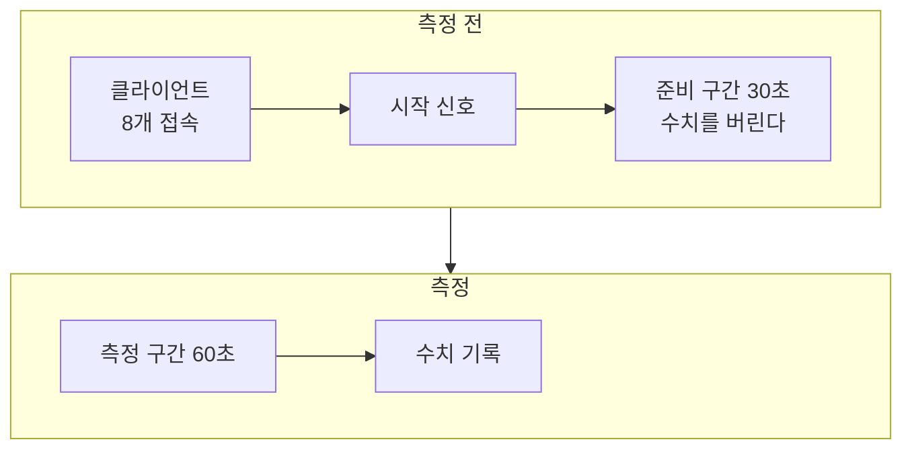

# 0. 테스트베드와 측정 방법

## 요약

이 시리즈는 언리얼 엔진 5.8.3 Dedicated Server에 최적화 기법을 하나씩 적용하고, 같은 시나리오를 다시 측정한다. 이 글은 기법을 적용하지 않는다. 무엇을 띄우고, 어떻게 측정하고, 그 수치를 어디까지 믿을 수 있는지를 정리한다.

| 항목 | 값 |
| --- | --- |
| 클라이언트 | 8개 |
| 자원 노드 | 5,001개 |
| AI NPC | 300명 |
| 맵 | 2km × 2km |
| 서버 틱 | 30Hz |
| 측정 | 준비 30초 뒤 60초, 구성마다 3회 |

클라이언트 8개가 한 서버에 접속한 모습이다. 이 규모에서 최적화가 없는 서버는 한 프레임에 약 198ms를 쓴다. 30Hz 서버가 한 프레임에 쓸 수 있는 시간은 33.3ms이고, 이 시간을 틱 예산이라고 부른다. 서버는 틱 예산의 약 6배를 쓴다.

확정한 값의 근거와 보정 실행의 수치는 [측정 기록](measurements.md)에 있다.

## 무엇을 띄우는가: 비용 패턴이 다른 세 가지 액터

| 요소 | 구현 | 비용 패턴 | 겨냥하는 기법 |
| --- | --- | --- | --- |
| 플레이어 캐릭터 | 클라이언트가 조종하는 3인칭 캐릭터 | 수가 적고 클라이언트마다 비용이 든다 | |
| 자원 노드 | 체력과 고갈 여부를 리플리케이트하는 실린더 | 수가 많고 거의 바뀌지 않는다 | Relevancy, Dormancy |
| AI NPC | 서버에서 배회하는 원뿔 | 수가 많고 계속 움직인다 | Net Update Frequency |

세 요소의 비용 패턴이 서로 달라서, 기법마다 겨냥하는 대상이 겹치지 않는다.

- 서버는 시작할 때 자원 노드와 NPC를 고정 시드로 생성한다. 그래서 실행마다 같은 자리에 놓인다.
- 클라이언트 하나는 제자리에서 자원 노드 하나를 반복해서 채집한다. 자원 노드는 채집 세 번에 고갈되고 20초 뒤 재생성된다. 이 클라이언트는 바뀐 상태가 실제로 전달되는지 확인하는 데 쓴다.
- 클라이언트 하나는 걸으면서 맵을 위에서 내려다본다. 나머지 여섯은 3인칭 화면으로 정해진 경로를 걷는다.

| 3인칭 화면 | 내려다보기 화면 |
| --- | --- |
|  |  |

모든 화면의 왼쪽 위에는 이 클라이언트에 존재하는 자원 노드와 NPC의 수가 찍힌다. 내려다보기 화면에서 초록 점은 자원 노드이고, 빨간 점은 NPC, 흰 점은 플레이어다. 클라이언트가 받지 않은 액터에는 점이 없다. 이 화면이 시리즈의 대표 이미지다.

## 어떻게 측정하는가

### 실행

- **패키징하지 않는다.** 서버와 클라이언트는 모두 에디터 빌드 실행 파일로 띄운다. 코드를 고친 뒤 빌드 한 번이면 다시 측정할 수 있다. 대신 절대 수치는 출시 빌드와 다르다.
- **실제 클라이언트가 렌더링한다.** 클라이언트 8개는 창을 띄우고 화면을 그린다. 그 화면이 이 시리즈의 시각 자료다.
- **스크립트 하나가 전부 실행한다.** [run-scenario.ps1](../../Scripts/run-scenario.ps1)이 서버와 클라이언트를 띄우고, 측정이 끝나면 정리한다.

### 측정 구간

- **준비 구간을 버린다.** 접속 직후에는 서버가 모든 액터의 처음 상태를 한꺼번에 보낸다. 이 구간은 정상 상태와 다르다.
- **구성마다 세 번 실행한다.** 세 값의 중앙값을 쓰고, 최댓값과 최솟값의 차이를 변동 폭으로 적는다.
- **변동 폭보다 큰 변화만 차이로 본다.** 두 구성의 중앙값 차이가 변동 폭보다 작으면 "구별되지 않았다"고 적는다.
- **실패한 실행의 수치는 쓰지 않는다.** 측정 도중 클라이언트가 빠진 실행이 그 예다. 클라이언트가 빠지면 서버 부하가 줄어서, 그 변화를 최적화의 효과로 잘못 읽게 된다.

### 지표

| 지표 | 뜻 | 출처 |
| --- | --- | --- |
| 서버 프레임 시간 | 서버가 한 프레임에 일한 시간. 틱 속도를 맞추려고 기다린 시간은 뺀다 | Unreal Insights |
| 리플리케이션 시간 | 그 가운데 네트워크 드라이버가 쓴 시간 | Unreal Insights |
| 연결당 송신 대역폭 | 서버가 클라이언트 하나에 초당 보낸 바이트 | Unreal Insights |
| 연결당 열린 액터 채널 수 | 서버가 클라이언트 하나에 열어 둔 액터 채널의 수 | 서버의 기록 |
| 클라이언트에 존재하는 액터 수 | 클라이언트 화면의 글자 | 스크린샷 |

Unreal Insights는 엔진이 남긴 트레이스에서 함수별 시간과 패킷 내용을 보는 도구다. 연결은 서버와 클라이언트 하나 사이의 통신이다. 액터 채널은 연결 안에서 액터 하나의 데이터가 가는 통로다.

열린 액터 채널 수와 클라이언트에 존재하는 액터 수는 다른 수치다. [자원 노드 Dormancy](../03-dormancy/README.md)에서 두 수치가 반대로 움직인다.

서버는 같은 구간의 수치를 CSV에도 직접 기록한다. 최적화가 없는 서버의 실행에서 Insights의 시간과 CSV의 시간은 0.1\~0.2% 차이로 맞았다.

## 측정 조건으로 고정한 두 가지

**연결당 송신 한도를 올렸다.** 엔진은 클라이언트 하나에 보내는 양을 초당 100,000바이트로 제한한다. 최적화가 없는 서버는 이 한도에 걸린다. 한도에 걸린 서버는 그 프레임의 남은 액터를 다음으로 미룬다. 그러면 처리 비용이 실제보다 작게 측정된다. 이 시리즈는 처리 비용의 전후를 비교하므로, 한도를 350,000바이트/초로 올려 고정했다.

**서버를 CPU 코어 여섯 개에 고정했다.** 처음에는 같은 구성의 실행이 세 배까지 달라졌다. 원인은 코어 하나였다. 그 코어에 운영체제의 인터럽트 처리가 몰려 있었고, 서버는 그 코어에서 CPU 시간을 크게 빼앗겼다.

| 서버를 고정한 코어 | 60초 동안 돈 프레임 |
| --- | --- |
| 문제의 코어 하나 | 153 |
| 그 코어를 뺀 여섯 개 | 340 |

그래서 서버는 그 코어를 뺀 여섯 개에, 클라이언트는 나머지 코어에 고정했다.

## 수치를 어디까지 믿을 수 있는가

- **절대 수치는 출시 빌드와 다르다.** 에디터 빌드 실행 파일을 쓰기 때문이다.
- **수치는 같은 조건의 전후 비교로만 읽어야 한다.** 서버와 클라이언트가 같은 PC에서 돌고, 네트워크는 루프백이다.
- **기준선은 인위적인 출발점이다.** 엔진의 기본 거리 판정을 일부러 껐고, 송신 한도를 올렸다.
- **NPC는 움직이는 액터의 대역이다.** 길 찾기나 행동 트리 같은 AI 비용은 측정하지 않는다.

## 다음

[Always Relevant 기준선](../01-baseline/README.md)은 이 규모의 서버가 어디에 시간을 쓰는지 측정한다. 그리고 Relevancy, Dormancy, Net Update Frequency 세 기법의 순서를 정한다.
