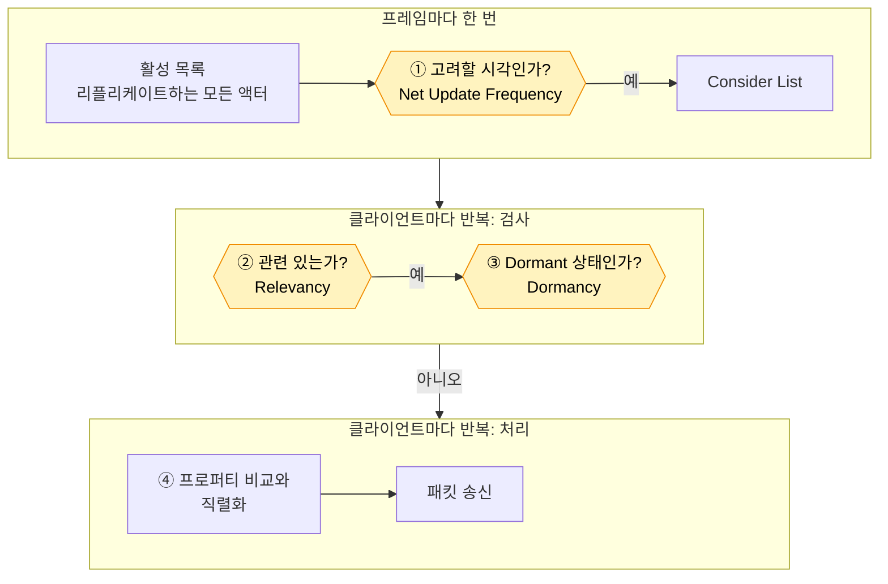

# 1. Always Relevant 기준선

## 요약

최적화가 없는 서버가 어디에 시간을 쓰는지 측정했다. 서버는 한 프레임에 198ms를 쓴다. 30Hz 서버가 한 프레임에 쓸 수 있는 시간은 33.3ms이고, 이 시간을 틱 예산이라고 부른다. 서버는 틱 예산의 약 6배를 쓰고, 그 95%가 리플리케이션이다.

가장 눈에 띄는 사실은 CPU를 쓰는 대상과 대역폭을 쓰는 대상이 다르다는 것이다. 서버는 리플리케이션 시간의 절반을 거의 바뀌지 않는 자원 노드에 쓴다. 반면 송신 비트의 76%는 NPC의 이동이다.

| 지표 | 기준선 |
| --- | --- |
| 서버 프레임 시간 평균 | 198ms |
| 리플리케이션 시간 | 189ms |
| 연결당 송신 대역폭 | 28,000바이트/초 |
| 클라이언트에 존재하는 액터 | 자원 노드 5,001개, NPC 300명 |

| 3인칭 화면 | 내려다보기 화면 |
| --- | --- |
|  |  |

클라이언트 두 개의 화면이다. 초록 점은 이 클라이언트가 받은 자원 노드이고, 빨간 점은 NPC, 흰 점은 플레이어다. 맵의 모든 액터를 받아서 화면 가장자리까지 점이 차 있다.

수치는 같은 시나리오를 세 번 실행한 중앙값이다. 실행별 값, 계산식, 엔진 소스 위치는 [측정 기록](measurements.md)에 있다. 표의 "연결"은 서버와 클라이언트 하나 사이의 통신을 뜻한다.

## 기준선: 엔진 기본 동작을 일부러 껐다

```cpp
// Source/DSOptLab/LabResourceNode.cpp, LabNpc.cpp의 생성자
bReplicates = true;

// 기준선: 거리와 무관하게 모든 연결에 보낸다.
bAlwaysRelevant = true;
```

이 기준선은 인위적인 출발점이다. 엔진은 아무 설정이 없어도 150m보다 먼 액터를 보내지 않는다. 그 동작을 그대로 두면 거리 판정의 효과를 측정할 수 없다. 그래서 자원 노드와 NPC에 `bAlwaysRelevant = true`를 주었다. "모든 액터를 모든 플레이어에게 보낸다"는 가장 단순한 서버가 출발점이다.

연결당 송신 한도도 엔진 기본값보다 올렸다. 이유는 [테스트베드와 측정 방법](../00-testbed/README.md)에 있다. 이 시점의 코드는 태그 [`post-01-baseline`](https://github.com/hon454/ue-dedicated-server-optimization-lab/tree/post-01-baseline)에 있다.

## 원리: 서버가 한 프레임에 하는 일

서버는 프레임마다 어떤 액터의 변화를 어느 클라이언트에게 보낼지 정한다. 엔진의 기본 리플리케이션 시스템은 이 일을 다음 순서로 한다. 이 시리즈의 세 기법은 모두 이 흐름의 검사 하나를 쓴다.



노란 칸이 검사다. 서버는 검사를 통과하지 못한 액터를 그 프레임에 건너뛴다.

- **① 고려할 시각인가.** 액터마다 다음 고려 시각이 있다. 그 간격을 정하는 값이 Net Update Frequency다. 시각이 된 액터만 Consider List에 들어간다. Consider List는 이번 프레임에 리플리케이션 대상으로 고려할 액터의 목록이다.
- **② 관련 있는가.** 서버는 액터가 그 클라이언트에게 필요한지 판정한다. 이 판정이 Relevancy이고, 기본 기준은 거리다.
- **③ Dormant 상태인가.** Dormancy는 바뀌지 않는 액터를 재워 두는 기능이다. 서버는 Dormant 상태인 액터를 건너뛴다.
- **④ 프로퍼티 비교와 직렬화.** 서버는 남은 액터를 우선순위로 정렬한 뒤 액터 채널에서 처리한다. 액터 채널은 액터 하나의 데이터가 클라이언트 하나로 가는 통로다. 서버는 지난번에 보낸 값과 지금 값을 비교하고, 바뀐 프로퍼티를 패킷에 쓴다.

검사 ①\~③은 값싸고, 처리 ④는 비싸다. 검사가 걸러 낼수록 서버가 하는 일이 줄어든다.

기준선에서는 세 검사가 아무것도 걸러 내지 않는다.

| 검사 | 기준선에서 | 이유 |
| --- | --- | --- |
| ① 고려할 시각 | 모두 통과 | 엔진 기본 간격 0.01초가 서버의 프레임 간격 약 0.2초보다 짧다 |
| ② Relevancy | 모두 통과 | `bAlwaysRelevant = true` |
| ③ Dormancy | 모두 통과 | 엔진 기본값은 액터를 Dormant 상태로 두지 않는다 |

그래서 모든 액터가 모든 클라이언트에 대해 ④까지 간다. 그 횟수는 프레임당 42,408번이다. 액터 5,301개에 클라이언트 8개를 곱한 값이다.

## 문제: CPU는 자원 노드가 쓰고, 대역폭은 NPC가 쓴다

Unreal Insights로 측정 구간 60초를 봤다. Unreal Insights는 엔진이 남긴 트레이스에서 함수별 시간과 패킷 내용을 보는 도구다.

| 대상 | 리플리케이션 시간(프레임당) | 송신 비트에서 차지하는 비율 |
| --- | --- | --- |
| 자원 노드 5,001개 | 98.5ms(52%) | 0.004% |
| NPC 300명 | 19.5ms(10%) | 76% |
| 네트워크 드라이버 자체 | 69.9ms(37%) | |

**자원 노드는 비교만 하고 보내지 않는다.** 서버는 60초 동안 클라이언트 하나에 자원 노드를 약 151만 번 처리했다. 그 가운데 실제로 보낸 것은 9번이다. 자원 노드는 채집될 때만 바뀌기 때문이다. 처리 한 번은 2.5마이크로초로 짧다. 하지만 서버는 그 처리를 프레임마다 40,008번 한다.

**NPC는 처리 시간이 작고 보내는 양이 많다.** NPC는 계속 움직인다. 그래서 서버는 프레임마다 NPC 300명의 위치를 모든 클라이언트에게 보낸다.

**네트워크 드라이버 자체 시간은 내역을 모른다.** 이 시간에는 ①\~③의 검사, 우선순위 정렬, 송신이 섞여 있다. 이 측정으로는 그 안을 나눠 볼 수 없다.

## 선택: 세 기법과 순서

| 순서 | 기법 | 쓰는 검사 | 겨냥하는 비용 |
| --- | --- | --- | --- |
| 1 | [Relevancy](../02-relevancy/README.md) | ② | 멀리 있는 자원 노드와 NPC의 처리와 송신 |
| 2 | [자원 노드 Dormancy](../03-dormancy/README.md) | ③ | 바뀌지 않는 자원 노드의 비교 |
| 3 | [NPC Net Update Frequency](../04-update-frequency/README.md) | ① | NPC 이동의 송신 |

**Relevancy 최적화를 먼저 적용한다.** 이유는 세 가지다. 첫째, 기준선이 끈 엔진 기본 동작을 먼저 되돌려야 뒤의 두 기법을 "기본 동작 위의 개선"으로 읽을 수 있다. 둘째, 코드 변경이 두 줄 삭제로 가장 작다. 셋째, 자원 노드의 CPU 비용과 NPC의 대역폭을 함께 줄인다.

**자원 노드 Dormancy를 두 번째로 적용한다.** Relevancy를 적용해도 서버는 가까운 자원 노드를 프레임마다 비교한다. Dormancy는 그 비교를 멈춘다. 이때는 Dormancy가 먼 자원 노드의 거리 검사도 줄일 것으로 예상했다. 이 예상은 틀렸고, [자원 노드 Dormancy](../03-dormancy/README.md)에서 바로잡는다.

**NPC의 Net Update Frequency 조정은 마지막에 적용한다.** 지금 적용하면 효과가 없기 때문이다. 빈도를 10으로 낮추면 NPC의 고려 간격은 0.1\~0.133초가 된다. 기준선의 프레임 간격은 약 0.2초라서 서버는 NPC를 여전히 매 프레임 고려한다. 서버가 30Hz로 돌아온 뒤에야 건너뛰는 프레임이 생긴다.

구현하지 않은 후보는 다음과 같다.

| 후보 | 구현하지 않은 이유 |
| --- | --- |
| Adaptive Net Update Frequency | 바뀌지 않는 액터의 고려 간격을 늘린다. 같은 비용을 Dormancy가 겨냥한다 |
| Push Model | 프로퍼티 비교 비용을 줄인다. 이 측정에서는 비교 비용이 따로 보이지 않아 효과를 가늠할 수 없다 |
| 송신 한도와 우선순위 | 기준선이 송신 한도에 걸리지 않아 줄일 대상이 없다 |

## 배운 것과 한계

- **비용이 큰 대상과 보내는 양이 큰 대상은 다를 수 있다.** 자원 노드는 CPU를, NPC는 대역폭을 쓴다. 그래서 두 가지를 따로 측정해야 한다.
- **기준선은 실행마다 흔들린다.** 세 실행의 서버 프레임 시간 평균은 179\~205ms였다. 이 측정은 25ms보다 작은 변화를 구별하지 못한다.
- **네트워크 드라이버 자체 시간의 내역을 모른다.** 세 기법이 이 시간을 얼마나 줄이는지는 적용한 뒤에 측정한다.

측정 환경의 한계는 [테스트베드와 측정 방법](../00-testbed/README.md)의 "한계"에 있다.

**다음 글.** [Relevancy와 Net Cull Distance](../02-relevancy/README.md)는 `bAlwaysRelevant = true` 두 줄을 지운다. 검사 ②가 다시 동작하면 클라이언트 하나가 받는 액터는 약 50분의 1이 된다.
