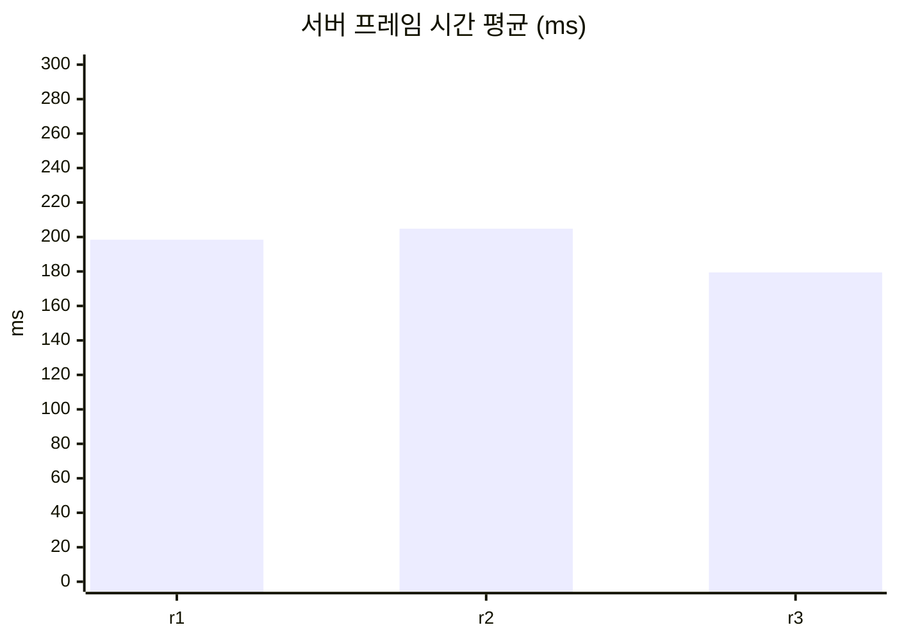
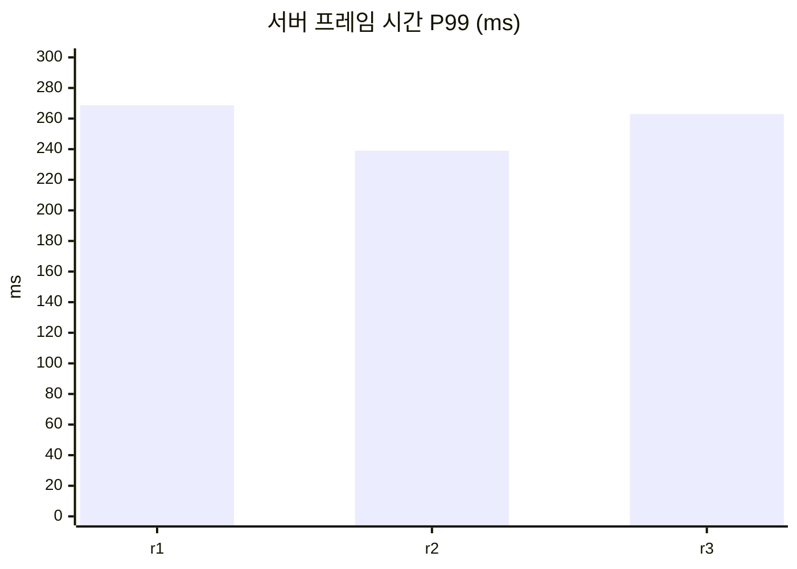
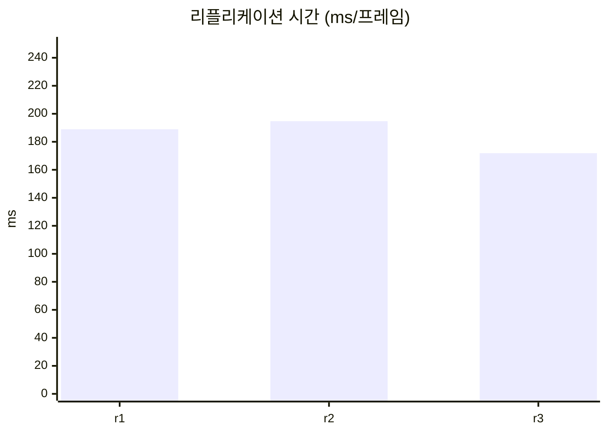
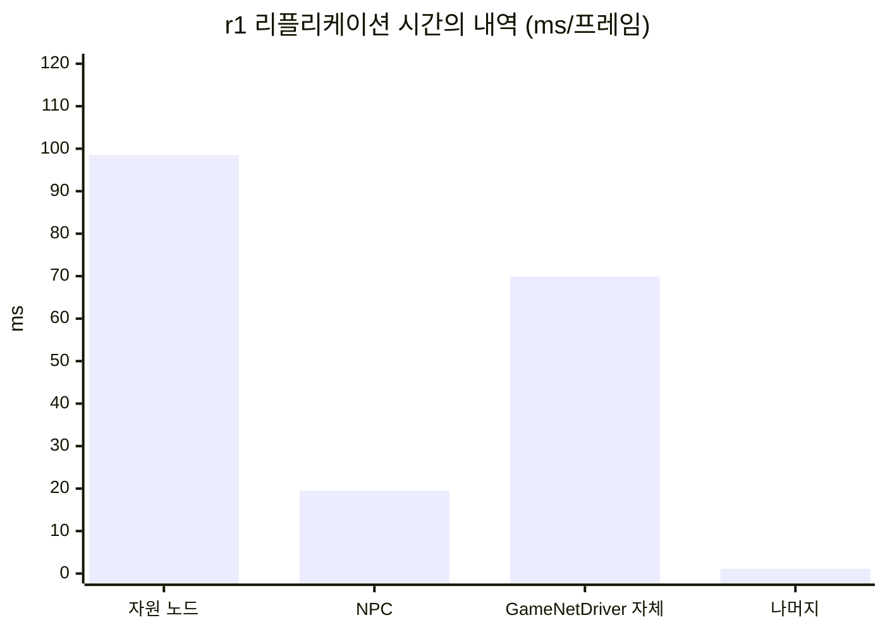

# 1. 무법지대 측정

## 요약

최적화가 없는 기준선을 같은 조건으로 세 번 측정했다. 서버는 프레임마다 약 198ms를 써서 틱 예산 33.3ms의 약 6배이고, 그 95%가 리플리케이션이다. Unreal Insights로 보면 리플리케이션 시간의 절반은 거의 바뀌지 않는 자원 노드 5,001개를 연결 8개마다 매 프레임 확인하는 데 쓰이고, 송신 비트의 76%는 NPC 300명의 이동이다. 다음 포스팅에서는 이 기준선이 일부러 끈 엔진의 거리 기반 Relevancy를 되돌린다.

| 지표 | 기준선 | 근거 |
| --- | --- | --- |
| 서버 프레임 시간 평균 | 198.43ms | Timing Insights, 세 실행의 중앙값(`baseline3-r1`) |
| 서버 프레임 시간 P99 | 262.96ms | Timing Insights `Frame` 이벤트, 세 실행의 중앙값(`r3`) |
| 리플리케이션 시간 | 188.97ms/프레임 | Timing Insights `GameNetDriver`, 세 실행의 중앙값(`r1`) |
| 연결당 송신 대역폭 | 28,048바이트/초 | Network Insights `Connection 0`, `r1` |
| 연결당 열린 액터 채널 수 | 5,314 | CSV, 세 실행 모두 같음 |
| 클라이언트에 존재하는 액터 수 | 노드 5,001, NPC 300 | `r1` 자동 스크린샷의 화면 글자 |

## 관찰

세 실행 중 서버 프레임 시간이 중앙값인 `baseline3-r1`의 트레이스를 Unreal Insights로 열어, 두 북마크(`Lab_MeasureStart`, `Lab_MeasureEnd`) 사이의 측정 구간 60.128초를 봤다.

### 서버 프레임의 대부분은 리플리케이션이다


① `GameNetDriver`, ② 그 아래의 `LabResourceNode`와 `LabNpc`, ③ 측정 구간의 양 끝인 두 북마크다.

`WorldTick` 아래에서 `GameNetDriver`가 95.17%(①의 `% Root`)를 차지한다. 측정 구간의 서버 프레임 시간은 198.43ms((선택 구간 60.128초 − 틱 속도 제한 대기 0.004초) ÷ `Frame` Count 303)이고, 그중 리플리케이션 시간이 188.97ms(`GameNetDriver` Incl 57.07초 ÷ `WorldTick` Count 302)이다.

### 가장 큰 비용은 변하지 않는 자원 노드를 매 프레임 확인하는 일이다

`GameNetDriver` 아래에서 가장 큰 타이머는 `LabResourceNode`이다. ②의 `% Parent`가 52.14%이고 프레임당 98.5ms(Incl 29.75초 ÷ 302)이다. Count 12,082,416은 자원 노드 5,001개 × 연결 8개 × `WorldTick` 302와 정확히 같다. 모든 자원 노드를 모든 연결에 대해 매 프레임 한 번씩 처리한다는 뜻이다. 한 번은 2.46μs(29.75초 ÷ 12,082,416)로 짧지만 프레임당 40,008번이다.

그런데 같은 구간에 연결 하나로 실제로 나간 노드 데이터는 9번, 576비트뿐이다(아래 Network Insights). 체력이 바뀐 검증용 노드다. 서버는 거의 바뀌지 않는 자원 노드를 확인하는 데 리플리케이션 시간의 절반을 쓰고 있다. 이것을 이 기준선의 가장 큰 비용으로 본다.

`LabNpc`는 ②의 `% Parent` 10.31%(프레임당 19.5ms)이고, 나머지 액터 클래스 일곱 개는 모두 합쳐 약 0.5%이다.

### 고려, 직렬화, 송신으로는 일부만 나뉜다

리플리케이션 비용을 고려(어떤 액터를 누구에게 보낼지 판단), 직렬화(프로퍼티 비교와 쓰기), 송신(패킷 전송)으로 나눠 보려 했지만, 이 트레이스로는 일부만 나뉜다.

- **직렬화는 클래스 타이머로 보인다.** 액터 하나를 연결 하나에 보내는 `UActorChannel::ReplicateActor`가 C++ 부모 클래스 이름으로 타이머를 남긴다(`Engine/Source/Runtime/Engine/Private/DataChannel.cpp:3622-3625`의 `SCOPE_CYCLE_UOBJECT`). 위의 `LabResourceNode` 52%와 `LabNpc` 10%가 이 타이머다. 송신 버퍼가 차서 그 자리에서 패킷을 내보내는 시간도 이 안에 섞일 수 있다.
- **고려와 송신은 나뉘지 않는다.** 나머지는 `GameNetDriver`의 Exclusive 37%(프레임당 69.9ms)에 들어 있다. 고려 목록 만들기, 연결마다의 우선순위 정렬, 프레임 끝의 송신이 모두 여기에 섞인다. 이들을 재는 `STAT_NetConsiderActorsTime` 같은 stat은 기본 트레이스(`-trace=default,net`)에 남지 않는다.
- **추정(실행으로 확인하지 않음).** 프레임 하나를 확대하면 `GameNetDriver` 아래의 자식 타이머가 덩어리 8개로 뭉쳐 있고, 덩어리 사이마다 빈 구간이 있다(눈금으로 어림해 3.6\~5.2ms). 엔진은 연결마다 `SendClientAdjustment`(`Engine/Source/Runtime/Engine/Private/NetDriver.cpp:5981`, 이하 `NetDriver.cpp`) 다음에 우선순위 정렬(`NetDriver.cpp:6007`)을 부르고, 덩어리 경계에 `ClientMoveResponsePacked` 타이머가 있다. 그래서 덩어리 하나가 연결 하나이고 그 앞의 빈 구간이 그 연결의 우선순위 정렬이라고 본다. 빈 구간 8개를 합쳐도 그 프레임 Exclusive 76.64ms의 절반쯤(3.6\~5.2ms × 8 = 29\~42ms)이라, 나머지가 어디에 쓰였는지는 이 화면으로 알 수 없다.

### 대역폭은 NPC가 쓴다


① `Actor`와 `LabNpc`의 비트, ② `LabResourceNode`의 비트, ③ 고른 측정 구간이다.

`Connection 0`의 송신(`Outgoing`)에서 측정 구간 1,801패킷(59.800초, ③)을 고르면, `Actor` 13,269,082비트 중 `LabNpc`가 10,090,719비트로 76.0%이다(①의 Incl). 그 대부분이 `ReplicatedMovement`(8,379,693비트)이다. `LabNpc` Count 90,054는 이 범위의 프레임 수 301의 약 300배다. 프레임마다 NPC 300명의 이동이 연결마다 나간다. `LabResourceNode`는 9번, 576비트다(②).

연결당 송신 대역폭은 28,048바이트/초다((`Actor` Incl 13,269,082 + `PacketHeaderAndInfo` Incl 149,181) ÷ 8 ÷ 59.800초).


① 패킷 내용의 `LabNpc` 번치들, ② 이 패킷 하나의 `Actor`와 `LabNpc` 번치 수다.

측정 구간 가운데의 패킷 하나(Sequence 3,710, 1,018바이트)를 열면 액터 번치 55개가 모두 `LabNpc`이다(②의 Count 55, 55). 번치마다 `ReplicatedMovement`가 평균 92비트다.

### 정리

CPU를 가장 많이 쓰는 대상(자원 노드 확인, 리플리케이션 시간의 52%)과 대역폭을 가장 많이 쓰는 대상(NPC 이동, 송신 비트의 76%)이 다르다. 노드는 거의 보내지 않는데 확인 비용이 크고, NPC는 확인 비용이 10%인데 보내는 양의 대부분을 차지한다.

## 선택

단기에 구현하는 세 기법을 다음 순서로 적용한다. 포스팅 하나에 기법 하나다.

| 순서 | 기법 | 바꿀 코드 | 이 기준선에서 겨냥하는 것(`r1`) |
| --- | --- | --- | --- |
| 1 | [Relevancy](../02-relevancy/README.md)(엔진 기본 Net Cull Distance 복원) | `LabResourceNode.cpp`, `LabNpc.cpp` 생성자에서 `bAlwaysRelevant = true;` 두 줄을 지움 | 자원 노드 확인 프레임당 98.5ms, NPC 프레임당 19.5ms, NPC 송신 비트 76.0% |
| 2 | [자원 노드 Dormancy](../03-dormancy/README.md) | `LabResourceNode.cpp` 생성자에 `NetDormancy = DORM_DormantAll;`, 채집과 재생에서 상태를 바꾸기 전에 `FlushNetDormancy()` | 고려 목록에 남은 자원 노드 5,001개 |
| 3 | [NPC Net Update Frequency](../04-update-frequency/README.md) | `LabNpc.cpp` 생성자에 `SetNetUpdateFrequency(10.f);` | NPC 이동 송신 |

**Relevancy 최적화를 먼저 적용한다.** 이 기준선은 엔진 기본 동작인 거리 기반 Relevancy를 일부러 끈 상태다([ADR-0003](../../Docs/Decisions/0003-lawless-baseline.md)). 기본 동작을 먼저 되돌려야 뒤의 두 기법을 "엔진 기본 동작 위의 개선"으로 읽을 수 있다. 코드 변경은 두 줄을 지우는 것으로 셋 중 가장 작고, 가장 큰 비용(자원 노드 확인)과 대역폭을 가장 많이 쓰는 대상(NPC 이동)을 함께 겨냥한다. 엔진 기본 Net Cull Distance는 150m(`SetNetCullDistanceSquared(225000000.0f)`, `Engine/Source/Runtime/Engine/Private/Actor.cpp:312`)이고, 노드와 NPC가 배치 영역(1.9km × 1.9km, `Source/DSOptLab/LabScenarioConfig.h`의 `WorldHalfExtent` 95,000cm)에 고르게 퍼져 있다면 반경 150m 안의 기대 수는 노드 약 98개(5,000 × π × 150² ÷ 1,900²), NPC 약 6명(300 × π × 150² ÷ 1,900²)이다.

**두 번째로 자원 노드에 Dormancy를 적용한다.** Relevancy를 복원해도 서버는 채널이 없는 액터마다 연결별로 거리 검사를 한다(`NetDriver.cpp:5580-5593`). 자원 노드 5,001개 × 연결 8개의 검사는 남는다. 모든 연결에서 Dormant 상태가 된 자원 노드는 활성 목록에서 빠지고(`Engine/Source/Runtime/Engine/Private/NetworkObjectList.cpp:348-376`), 고려 목록은 활성 목록만 돈다(`NetDriver.cpp:5315`). 그래서 Dormancy는 Relevancy가 남긴 몫을 줄인다. 이 몫이 실행 사이의 변동 폭(중앙값의 12.8%)보다 클지는 아직 모른다.

**NPC의 Net Update Frequency 조정은 마지막에 한다.** `NetUpdateFrequency`를 10으로 낮추면 NPC의 다음 고려 시각은 지금 + 0\~1/30초 + 0.1초가 된다(`NetDriver.cpp:5420-5425`, `6341-6348`). 기준선의 프레임 간격(약 0.18\~0.2초)에서는 다음 프레임이 올 때 이 시각이 이미 지나 있어서, 계산상 효과가 없다. 앞의 두 기법으로 프레임 간격이 0.133초보다 짧아져야 건너뛰는 프레임이 생기기 시작한다.

**구현하지 않는 후보.**

- Adaptive Net Update Frequency(`net.UseAdaptiveNetUpdateFrequency`): 보낼 것이 없는 액터의 고려 간격을 늘린다. 자원 노드의 비용을 겨냥하지만 자원 노드를 고려 목록에서 빼지는 않고, 같은 비용은 Dormancy가 겨냥한다.
- 푸시 모델: 프로퍼티 비교 비용을 줄인다. 이 트레이스에서는 비교 비용이 클래스 타이머 안에 섞여 따로 보이지 않아, 얼마나 줄지 가늠할 근거가 없다.
- 송신 한도와 우선순위: 기준선은 연결당 한도 350,000바이트/초에서 포화되지 않았다(`saturated_ratio` 0.000). 줄일 대상이 없다.

후보 기법과 엔진 소스 위치, Insights에서 읽은 값은 [후보 기법 자료](candidates.md)에 있다.

## 적용

이 글은 기법을 적용하지 않고, 출발점이 된 코드를 보여 준다. 자원 노드와 AI NPC의 생성자에 한 줄씩 들어 있다.

```cpp
// Source/DSOptLab/LabResourceNode.cpp
ALabResourceNode::ALabResourceNode()
{
	PrimaryActorTick.bCanEverTick = false;
	bReplicates = true;

	// 기준선: 거리와 무관하게 모든 연결에 보낸다.
	bAlwaysRelevant = true;
	// ...
}
```

```cpp
// Source/DSOptLab/LabNpc.cpp
ALabNpc::ALabNpc()
{
	// ...
	bReplicates = true;
	SetReplicatingMovement(true);

	// 기준선: 거리와 무관하게 모든 연결에 보낸다.
	bAlwaysRelevant = true;
	// ...
}
```

**이 기준선은 엔진 기본 동작을 일부러 끈 인위적인 출발점이다.** 레거시 리플리케이션의 `AActor`에는 아무 설정 없이도 Net Cull Distance 150m가 있다(`SetNetCullDistanceSquared(225000000.0f)`, `Engine/Source/Runtime/Engine/Private/Actor.cpp:312`). 엔진 기본값을 그대로 기준선으로 쓰면 출발점에 이미 거리 기반 Relevancy 판정이 들어 있어서, Relevancy가 비용을 얼마나 줄이는지 보여 줄 수 없다. 그래서 두 클래스에 `bAlwaysRelevant = true`를 주어 "모든 액터를 모든 플레이어에게 보내는" 가장 단순한 구현을 출발점으로 삼았다([ADR-0003](../../Docs/Decisions/0003-lawless-baseline.md)). 연결당 송신 한도도 엔진 기본값 100,000바이트/초에서 350,000바이트/초로 올렸다. 이유는 [테스트베드와 측정 방법](../00-testbed/README.md)에 있다.

그래서 이 시리즈의 개선은 두 종류다.

| 글 | 기법 | 개선의 종류 |
| --- | --- | --- |
| [Relevancy와 Net Cull Distance](../02-relevancy/README.md) | Relevancy | 기본 동작의 복원. 위의 두 줄을 지워 엔진 기본 Net Cull Distance로 돌아간다 |
| [자원 노드 Dormancy](../03-dormancy/README.md) | 자원 노드 Dormancy | 기본 동작 위의 개선 |
| [AI NPC Net Update Frequency](../04-update-frequency/README.md) | NPC Net Update Frequency | 기본 동작 위의 개선 |

[Relevancy와 Net Cull Distance](../02-relevancy/README.md)의 수치는 "최적화가 없는 서버를 얼마나 고쳤나"가 아니라 "엔진이 원래 하던 일을 끄면 얼마나 비싸지는가"로 읽어야 한다. 이 시점의 코드는 태그 [`post-01-baseline`](https://github.com/hon454/ue-dedicated-server-optimization-lab/tree/post-01-baseline)에 있다.

## 결과

`baseline3`를 같은 명령으로 세 번 실행했다(클라이언트 8, 자원 노드 5,001, NPC 300, 준비 30초, 측정 60초, 서버 논리 프로세서 2\~7, 연결당 송신 한도 350,000바이트/초). 세 실행 모두 종료 코드 0으로 끝났다.

### 기준선 조건

| 조건 | 결과 | 근거(`baseline3-r1` / `r2` / `r3`) |
| --- | --- | --- |
| 초기 전송 완료 | 예 | `open_actor_channels_per_conn` 5,314 / 5,314 / 5,314. 같은 규모의 `calib-f-r1`에서 측정 시작 22초 전에 이 값에 도달하고 더 늘지 않았다 |
| 지속적인 예산 초과 | 예 | `over_budget_frames`가 `frames`와 같다(302 / 292 / 334). 서버 프레임 시간의 중앙값 198.43ms는 틱 예산 33.3ms의 약 6.0배다 |
| 송신 한도에 포화되지 않음 | 예 | `saturated_ratio` 0.000 / 0.000 / 0.000 |
| 가장 큰 비용이 네트워크 | 예 | Timing Insights 측정 구간에서 `GameNetDriver`가 `WorldTick`의 95.17% / 95.00% / 95.80% |

### 세 실행의 수치

Insights에서 두 북마크 사이를 읽은 값이다. 중앙값 실행은 `r1`이다.

| 지표 | `r1` | `r2` | `r3` | 중앙값 | 변동 폭 |
| --- | --- | --- | --- | --- | --- |
| 서버 프레임 시간 평균(ms) | 198.43 | 204.81 | 179.45 | 198.43 | 25.36 |
| 서버 프레임 시간 P99(ms) | 268.69 | 239.03 | 262.96 | 262.96 | 29.66 |
| 리플리케이션 시간(ms/프레임) | 188.97 | 194.69 | 171.89 | 188.97 | 22.80 |
| 연결당 송신 대역폭(바이트/초, `Connection 0`) | 28,048 | 읽지 않음 | 31,012 | | |
| 연결당 열린 액터 채널 수(CSV) | 5,314 | 5,314 | 5,314 | 5,314 | 0 |
| 클라이언트에 존재하는 액터 수(화면 글자) | 노드 5,001, NPC 300 | | | | |

- 서버 프레임 시간은 프레임 시간에서 틱 속도 제한 대기(`FEngineLoop_UpdateTimeAndHandleMaxTickRate`)를 뺀 시간이다([ADR-0010](../../Docs/Decisions/0010-frame-time-without-tick-wait.md)). 기준선은 틱 예산을 늘 넘어서 이 대기가 프레임당 0.01\~0.02ms뿐이다. 평균은 (측정 구간 − 대기) ÷ `Frame` Count(`r1`: (60.128초 − 0.004초) ÷ 303), 리플리케이션 시간은 `GameNetDriver` Incl ÷ `WorldTick` Count(`r1`: 57.07초 ÷ 302)이다.
- 서버 프레임 시간 P99는 측정 구간에 걸친 GameThread `Frame` 이벤트(`r1` 303개)마다 대기를 뺀 길이를 Insights의 `TimingInsights.ExportTimingEvents` 명령으로 내보내, 정렬한 뒤 ceil(N × 0.99)번째 값을 읽은 것이다. 99백분위 경계값이며 느린 1%의 평균이 아니다.
- 연결당 송신 대역폭은 (`Actor` Incl + `PacketHeaderAndInfo` Incl) ÷ 8 ÷ 선택 범위 시간이다. `r2`는 Network Insights에서 읽지 않았다.
- 클라이언트에 존재하는 액터 수는 `r1`의 자동 스크린샷 두 장(아래)의 화면 글자다.

서버가 남긴 CSV는 다음과 같다. Insights 값과의 차이는 서버 프레임 시간 평균과 `work_avg_ms`가 -0.12\~-0.17%, P99와 `work_p99_ms`가 +0.08\~+0.12%, 리플리케이션 시간과 `netflush_avg_ms`가 -0.21\~-0.24%이다. 연결당 송신 대역폭은 CSV `out_bytes_per_sec_per_conn`이 Insights보다 3.0%(`r1`), 3.2%(`r3`) 크다.

| 라벨 | `frames` | `work_avg_ms` | `work_p99_ms` | `netflush_avg_ms` | `out_bytes_per_sec_per_conn` | `open_actor_channels_per_conn` | `saturated_ratio` |
| --- | --- | --- | --- | --- | --- | --- | --- |
| `baseline3-r1` | 302 | 198.773 | 268.485 | 189.375 | 28,896 | 5,314 | 0.000 |
| `baseline3-r2` | 292 | 205.150 | 238.737 | 195.108 | 27,997 | 5,314 | 0.000 |
| `baseline3-r3` | 334 | 179.673 | 262.736 | 172.293 | 31,990 | 5,314 | 0.000 |
| 중앙값 | 302 | 198.773 | 262.736 | 189.375 | 28,896 | 5,314 | 0.000 |
| 변동 폭 | 42 | 25.477 | 29.748 | 22.815 | 3,993 | 0 | 0.000 |

`work_avg_ms`의 변동 폭은 중앙값의 12.8%이다. 세 실행에서 하는 일의 양(타이머 호출 횟수 = 액터 수 × 연결 수 × 프레임 수)과 구성 비율(`LabResourceNode` 52.0\~52.6%, `GameNetDriver` Exclusive 37.0\~37.1%)은 같고, 느린 실행은 모든 하위 타이머가 1.12\~1.18배 느렸다(`r2` ÷ `r3`, [후보 기법 자료](candidates.md) 4절). 같은 일을 CPU가 더 느리게 처리한 것으로 보이며 원인은 확인하지 않았다. 앞으로의 비교에서는 중앙값의 변화가 이 폭보다 클 때만 차이가 있다고 적는다.









내역은 `r1`의 타이머 Incl ÷ `WorldTick` Count이다(자원 노드 29.75초, NPC 5.88초, `GameNetDriver` Exclusive 21.11초). 나머지는 188.97 - 98.5 - 19.5 - 69.9 = 1.1ms이다.

| 3인칭 화면(0번 클라이언트, t=75s) | 내려다보기 화면(1번 클라이언트, t=45s) |
| --- | --- |
|  |  |

`baseline3-r1`의 자동 스크린샷이다(3인칭 순번 04, 내려다보기 순번 02). 두 클라이언트 모두 `nodes=5001 npcs=300`으로, 맵의 모든 노드와 NPC를 받고 있다. 3인칭 화면에서는 0번 클라이언트가 채집하는 검증용 노드가 캐릭터 앞에 서 있다. 내려다보기 화면은 플레이어(흰 점)를 중심으로 350m 위에서 본 것이고, 초록 점은 자원 노드, 검은 점은 고갈된 노드, 빨간 점은 NPC이다. 화면 가장자리까지 점이 차 있다.

## 한계와 다음

이 측정이 말해 주지 않는 것은 다음과 같다.

- **`GameNetDriver` 자체 시간(37%)의 내역.** 고려 목록 만들기, 연결마다의 우선순위 정렬, 프레임 끝의 송신이 한데 섞여 있다. Relevancy나 Dormancy가 이 몫을 얼마나 줄일지는 이 트레이스로 미리 알 수 없다. 나누려면 `-statnamedevents`를 준 별도 실행이 필요하고, 그러면 측정 조건이 달라진다.
- **실행 사이 흔들림의 원인.** 변동 폭은 중앙값의 12.8%이다. 이보다 작은 효과는 이 측정으로 구별하지 못한다.
- **연결당 송신 대역폭의 일부.** `Connection 0` 하나를 읽었고(`Connection 7`은 패킷 하나만 봤다), `r2`는 읽지 않았다. CSV와 3% 다른 이유도 확인하지 않았다.
- **선택에 적은 기대 효과.** 반경 150m 안의 기대 개수, Dormancy가 줄일 몫, NPC Net Update Frequency가 효과를 내는 프레임 간격은 모두 계산이나 엔진 소스에서 읽은 추론이고 실행으로 확인하지 않았다.
- 에디터 빌드, 같은 PC의 서버와 클라이언트, 루프백 네트워크 같은 측정 환경의 한계는 [테스트베드와 측정 방법](../00-testbed/README.md)의 "한계"에 있다.

**다음: Relevancy.** [Relevancy와 Net Cull Distance](../02-relevancy/README.md)에서는 위 두 줄의 `bAlwaysRelevant = true`를 지워 엔진 기본 Net Cull Distance 150m를 되돌린다. 소스와 계산대로라면 내려다보기 화면에서는 플레이어 주변 반경 150m 원 안에만 점이 남고(노드 약 98개, NPC 약 6명), 연결당 열린 액터 채널 수도 함께 줄어야 한다. 서버 프레임 시간과 리플리케이션 시간이 얼마나 줄어드는지, 연결마다의 거리 검사가 얼마나 남는지를 같은 시나리오로 재서 보인다.
