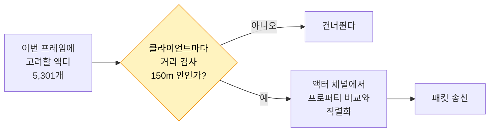
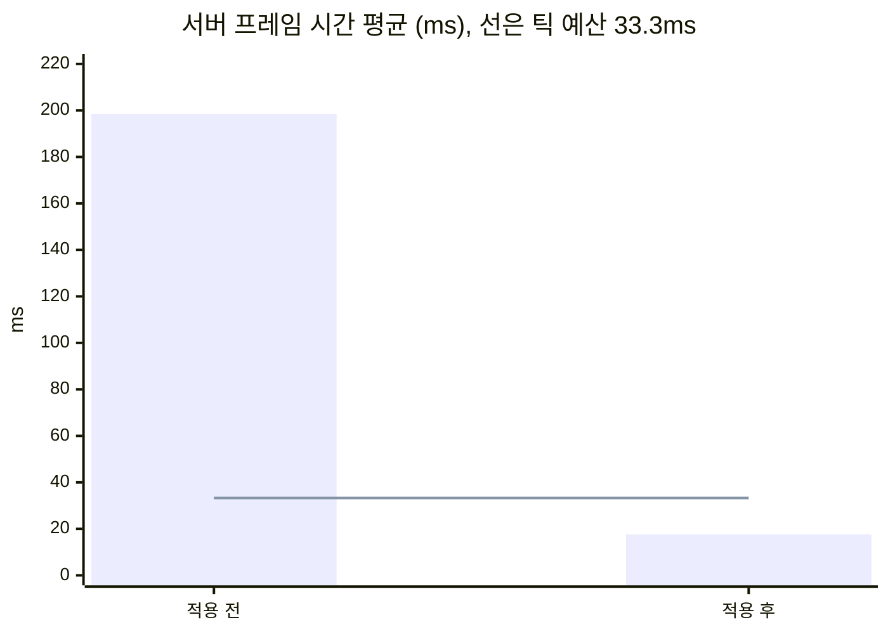

# 2. Relevancy와 Net Cull Distance

## 요약

서버는 멀리 있는 액터를 클라이언트에게 보내지 않아도 된다. 엔진은 이 판정을 기본으로 한다. [Always Relevant 기준선](../01-baseline/README.md)은 그 판정을 일부러 꺼 두었고, 이 글은 다시 켠다.

코드 두 줄을 지우자 서버 프레임 시간 평균이 198ms에서 17.6ms로 줄었다. 서버가 처음으로 틱 예산 안에 들어왔다. 틱 예산은 30Hz 서버가 한 프레임에 쓸 수 있는 시간이고, 33.3ms다.

| 지표 | 적용 전 | 적용 후 | 변화 |
| --- | --- | --- | --- |
| 서버 프레임 시간 평균 | 198ms | 17.6ms | -91% |
| 리플리케이션 시간 | 189ms | 13.1ms | -93% |
| 연결당 송신 대역폭 | 28,000바이트/초 | 2,900바이트/초 | -90% |
| 클라이언트에 존재하는 자원 노드 | 5,001개 | 114개 | -98% |

| 적용 전 | 적용 후 |
| --- | --- |
|  |  |

클라이언트 하나의 화면을 위에서 내려다본 모습이다. 초록 점은 이 클라이언트가 받은 자원 노드이고, 빨간 점은 NPC, 흰 점은 플레이어다. 적용 후에는 플레이어 주변의 원 안에만 점이 있다.

수치는 같은 시나리오를 세 번 실행한 중앙값이다. 실행별 값, 계산식, 엔진 소스 위치는 [측정 기록](measurements.md)에 있다. 표의 "연결"은 서버와 클라이언트 하나 사이의 통신을 뜻한다.

## 문제: 서버가 모든 액터를 모든 클라이언트에게 보낸다

[테스트베드](../00-testbed/README.md)의 맵에는 자원 노드 5,001개와 NPC 300명이 있다. 클라이언트는 8개가 접속한다.

기준선의 서버는 프레임마다 모든 액터를 모든 클라이언트에 대해 한 번씩 처리한다. 처리는 두 가지 일이다. 서버는 지난번에 보낸 뒤로 바뀐 프로퍼티가 있는지 비교한다. 그리고 바뀐 프로퍼티를 패킷에 쓴다. 바뀐 것이 없어도 비교는 한다.

| 기준선의 서버 | 값 |
| --- | --- |
| 한 프레임의 처리 횟수 | 42,408번(액터 5,301 × 클라이언트 8) |
| 서버 프레임 시간 평균 | 198ms(틱 예산의 약 6배) |
| 그중 리플리케이션이 차지하는 비율 | 95% |

처리 횟수는 계산값이 아니라 측정값이다. Unreal Insights가 센 호출 횟수가 이 곱셈과 정확히 같았다.

문제는 서버가 거리를 보지 않는다는 것이다. 맵은 한 변이 2km다. 플레이어는 맵 반대편의 자원 노드를 볼 수 없다. 그런데 서버는 그 노드까지 프레임마다 비교한다.

세 기법 가운데 이 기법을 먼저 적용하는 이유는 [기준선 글의 "선택"](../01-baseline/README.md#선택)에 있다.

## 원리: 값싼 거리 검사가 비싼 처리를 걸러 낸다

**Relevancy**는 서버가 "이 액터를 이 클라이언트에게 보낼 필요가 있는가"를 판정하는 기능이다. 기본 판정 기준은 거리다. 액터가 플레이어의 시점에서 **Net Cull Distance**보다 멀면 서버는 그 액터를 보내지 않는다. 엔진 기본값은 150m다.

판정을 통과한 액터에는 **액터 채널**이 열린다. 액터 채널은 액터 하나의 데이터가 클라이언트 하나로 가는 통로다. 서버는 채널이 열린 액터만 프레임마다 처리한다.

서버가 한 프레임에 하는 일의 전체 순서는 [기준선 글의 흐름도](../01-baseline/README.md#원리-서버가-한-프레임에-하는-일)에 있다. 아래는 그 가운데 거리 검사만 꺼낸 것이다.



거리 검사는 두 좌표의 거리를 비교하는 값싼 일이다. 채널에서 하는 프로퍼티 비교와 직렬화는 비싼 일이다. Relevancy는 값싼 검사로 비싼 일의 대상을 줄인다.

기준선의 `bAlwaysRelevant = true`는 이 검사가 항상 "예"라고 답하게 한다. 그래서 모든 액터가 모든 클라이언트의 채널로 갔다.


서버의 관점에서 그린 개념도다. 맵 크기, 플레이어 8명의 자리와 경로, 150m 원은 실제 비율이다. 점의 위치는 예시다.

**예상.** 반경 150m 원의 넓이는 액터를 배치한 영역의 약 2%다. 그래서 클라이언트 하나가 받는 액터는 약 50분의 1로 줄어야 한다. 자원 노드는 약 98개, NPC는 약 6명이다.

## 적용: 두 줄을 지운다

```diff
 // Source/DSOptLab/LabResourceNode.cpp
 ALabResourceNode::ALabResourceNode()
 {
 	PrimaryActorTick.bCanEverTick = false;
 	bReplicates = true;
 
-	// 기준선: 거리와 무관하게 모든 연결에 보낸다.
-	bAlwaysRelevant = true;
-
 	Mesh = CreateDefaultSubobject<UStaticMeshComponent>(TEXT("Mesh"));
```

`LabNpc.cpp`의 생성자에서도 같은 두 줄을 지웠다. Net Cull Distance는 따로 설정하지 않았다. 두 줄을 지우면 엔진 기본값 150m가 적용된다.

이 변경은 새 최적화가 아니다. 엔진 기본 동작의 복원이다. 그래서 이 글의 수치는 "거리 판정을 끄면 서버가 얼마나 비싸지는가"로 읽어야 한다. 이 시점의 코드는 태그 [`post-02-relevancy`](https://github.com/hon454/ue-dedicated-server-optimization-lab/tree/post-02-relevancy)에 있다.

## 결과

### 대상이 예상대로 약 50분의 1이 됐다

| 항목 | 적용 전 | 예상 | 실제 |
| --- | --- | --- | --- |
| 클라이언트에 존재하는 자원 노드 | 5,001개 | 약 98개 | 80\~114개 |
| 클라이언트에 존재하는 NPC | 300명 | 약 6명 | 5\~7명 |
| 서버가 클라이언트 하나에 프레임마다 처리하는 자원 노드 | 5,001개 | 약 98개 | 75\~96개 |

예상은 액터가 고르게 퍼져 있다고 가정한 평균이다. 실제 값은 클라이언트의 위치에 따라 다르다.

### 서버가 틱 예산 안에 들어왔다



적용 전에는 측정 구간의 모든 프레임이 틱 예산을 넘었다. 적용 후에는 틱 예산을 넘은 프레임이 실행마다 1\~4개였다.

세 실행의 서버 프레임 시간 평균은 17.60\~17.76ms였다. 실행 사이의 차이는 0.16ms이고, 적용 전후의 차이는 181ms다. 이 측정으로 분명히 구별되는 변화다.

### 남은 시간은 네트워크 드라이버 자체에 있다

| 리플리케이션 시간의 내역(프레임당) | 적용 전 | 적용 후 | 변화 |
| --- | --- | --- | --- |
| 액터 채널의 처리(프로퍼티 비교와 직렬화) | 118ms | 2.4ms | -98% |
| 네트워크 드라이버 자체 시간 | 69.9ms | 10.4ms | -85% |
| 그 밖 | 1.1ms | 0.3ms | |
| 합계 | 189ms | 13.1ms | -93% |

액터 채널의 처리는 대상의 수만큼 줄었다. 네트워크 드라이버 자체 시간은 덜 줄었다. 이제 리플리케이션 시간의 79%가 이 시간이다.

이 시간에는 고려할 액터 목록 만들기, 거리 검사, 우선순위 정렬, 송신이 섞여 있다. 이 측정으로는 그 안을 나눠 볼 수 없다. 거리 검사는 채널이 없는 모든 액터에 프레임마다 남는다. 그 비용이 이 시간에 들어 있다고 추정한다.

### 플레이어의 화면에서 먼 액터가 사라졌다

| 적용 전 | 적용 후 |
| --- | --- |
|  |  |

적용 전에는 지평선까지 자원 노드가 서 있다. 적용 후에는 150m 안의 자원 노드만 보인다.


플레이어가 걷는 10초다. 왼쪽은 내려다본 화면이고 오른쪽은 3인칭 화면이다. 점들은 원의 가장자리에서 나타나고 반대쪽 가장자리에서 사라진다.

이 동작은 제약이기도 하다. 150m 밖의 액터는 클라이언트에 존재하지 않는다. 멀리서도 보여야 하는 액터에는 Net Cull Distance를 따로 정해야 한다. 이 글은 기본값만 썼다.

## 배운 것과 한계

- **가장 큰 효과는 대상의 수를 줄이는 데서 나왔다.** 처리 하나를 빠르게 만들지 않았다. 처리할 클라이언트와 액터의 쌍을 약 50분의 1로 줄였다.
- **거리 검사 뒤에 남은 비용이 있다.** 리플리케이션 시간의 79%가 네트워크 드라이버 자체 시간이다. 그 내역은 아직 모른다.
- **연결당 송신 대역폭은 클라이언트 하나에서만 읽었다.** 제자리에 서 있는 클라이언트다. 서버가 기록한 8개 연결의 평균으로는 86% 줄었다.

측정 환경의 한계는 [테스트베드와 측정 방법](../00-testbed/README.md)의 "한계"에 있다.

**다음 글.** 원 안에 들어온 자원 노드 약 100개는 여전히 프레임마다 비교된다. 그런데 자원 노드는 채집될 때만 바뀐다. [자원 노드 Dormancy](../03-dormancy/README.md)는 바뀌지 않는 액터의 비교를 멈춘다.
