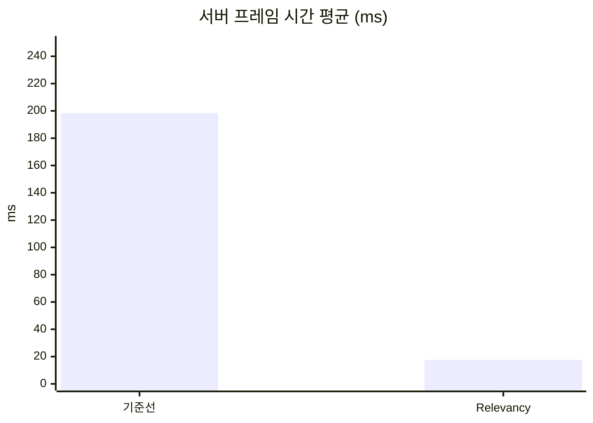
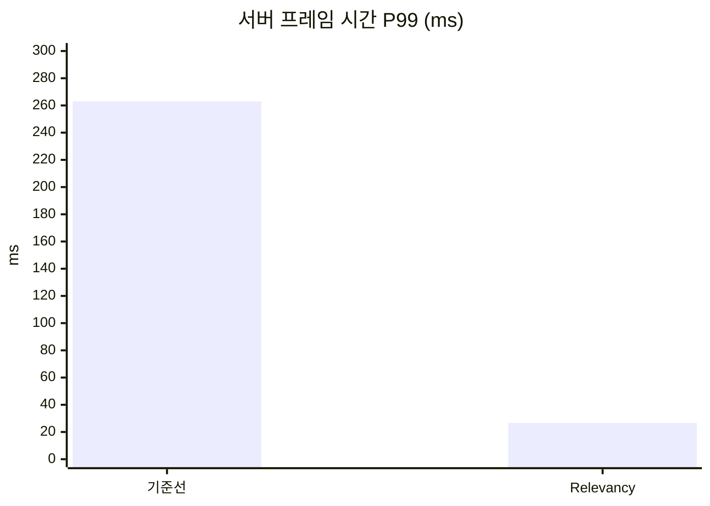
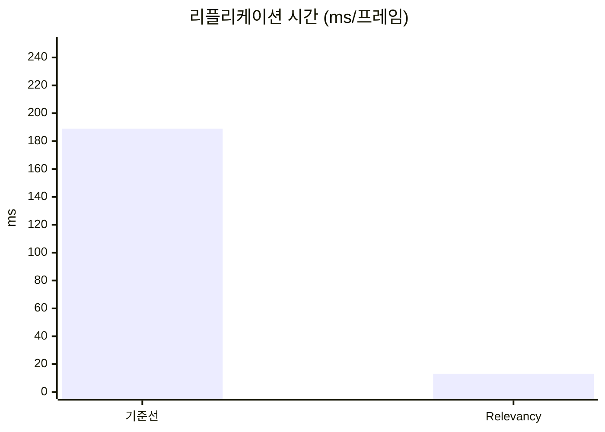
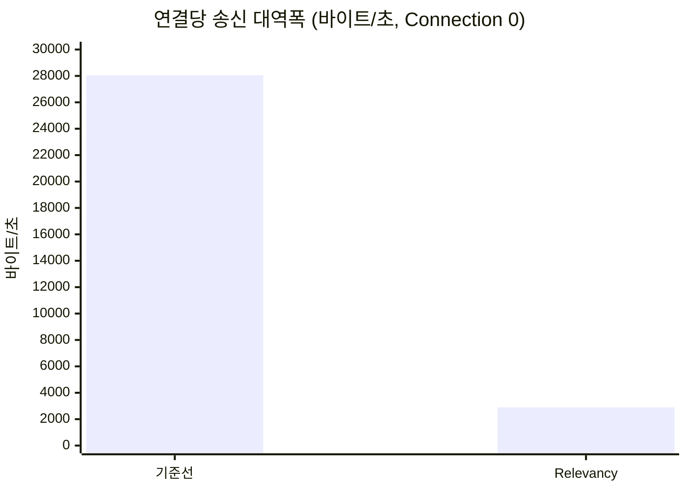

# 2. Relevancy와 Net Cull Distance

## 요약

[무법지대 측정](../01-baseline/README.md)의 기준선에서 일부러 넣어 둔 `bAlwaysRelevant = true` 두 줄을 지워, 자원 노드와 NPC에 엔진 기본 Net Cull Distance 150m를 되돌렸습니다. 같은 시나리오로 세 번 측정하니 서버 프레임 시간 평균이 198.43ms에서 17.64ms로 91.1% 줄어 틱 예산 33.3ms 안으로 들어왔고, 리플리케이션 시간은 93.0%, 연결당 열린 액터 채널 수는 97.8% 줄었습니다. 새로운 최적화가 아니라 기본 동작의 복원이므로, 이 차이는 "엔진이 원래 하던 거리 판정을 끄면 얼마나 비싸지는가"로 읽어야 합니다.

| 지표 | 기준선(`baseline3`) | Relevancy(`relevancy2`) | 변화 | 근거 |
| --- | --- | --- | --- | --- |
| 서버 프레임 시간 평균 | 198.43ms | 17.64ms | -91.1% | Timing Insights, 세 실행의 중앙값(기준선 `r1`, Relevancy `r3`) |
| 서버 프레임 시간 P99 | 262.96ms | 26.64ms | -89.9% | Timing Insights, 세 실행의 중앙값(기준선 `r3`, Relevancy `r1`) |
| 리플리케이션 시간 | 188.97ms/프레임 | 13.14ms/프레임 | -93.0% | Timing Insights `GameNetDriver`, 세 실행의 중앙값(둘 다 `r1`) |
| 연결당 송신 대역폭 | 28,048바이트/초 | 2,897바이트/초 | -89.7% | Network Insights `Connection 0`(기준선 `r1`, Relevancy `r3`) |
| 연결당 열린 액터 채널 수 | 5,314 | 118 | -97.8% | CSV, 세 실행 모두 같음 |
| 클라이언트에 존재하는 액터 수 | 노드 5,001, NPC 300 | 노드 114, NPC 7 | | 내려다보기 화면 글자(기준선 `r1`, Relevancy `r3`, t=45s) |

| 적용 전(`baseline3-r1`) | 적용 후(`relevancy2-r3`) |
| --- | --- |
|  |  |

1번 클라이언트의 내려다보기 화면(t=45s)입니다. 플레이어(흰 점)를 중심으로 350m 위에서 본 것이고, 초록 점은 자원 노드, 빨간 점은 NPC입니다. 적용 전에는 화면 가장자리까지 점이 차 있고, 적용 후에는 플레이어 주변의 원 안에만 점이 있습니다.

## 관찰

[무법지대 측정](../01-baseline/README.md)과 같은 기준선 트레이스(`baseline3-r1`, 측정 구간 60.128초)에서 Relevancy가 겨냥한 비용을 다시 봅니다. Relevancy가 줄이는 것은 특정 타이머 하나가 아니라, 서버가 프레임마다 처리하는 (연결, 액터) 쌍의 수 자체입니다.


① `GameNetDriver`, ② 그 아래의 `LabResourceNode`와 `LabNpc`, ③ 측정 구간의 양 끝인 두 북마크입니다.

### 모든 액터를 모든 연결에 매 프레임 처리합니다

②의 `LabResourceNode` Count 12,082,416은 노드 5,001개 × 연결 8개 × `WorldTick` 302와 같고, `LabNpc` Count 724,800은 NPC 300명 × 연결 8개 × 302와 같습니다. 거리와 상관없이 모든 노드와 NPC를 모든 연결에 대해 프레임마다 한 번씩 처리합니다. 이 두 클래스 타이머가 프레임당 98.5ms(`GameNetDriver`의 52.14%)와 19.5ms(10.31%)입니다. 클라이언트 쪽에서도 같은 일이 보입니다. 연결당 열린 액터 채널 수가 5,314(CSV)이고, 화면 글자가 `nodes=5001 npcs=300`입니다. 1.9km 떨어진 맵 반대편의 노드까지 모든 클라이언트가 받고 있습니다.

### 송신 비트의 대부분은 거리와 상관없이 나가는 NPC 이동입니다


① `Actor`와 `LabNpc`의 비트, ② `LabResourceNode`의 비트, ③ 고른 측정 구간입니다.

`Connection 0`의 송신에서 `LabNpc`가 `Actor` 비트의 76.0%(①, 10,090,719 ÷ 13,269,082)입니다. NPC 300명의 이동이 연결마다 매 프레임 나갑니다. Net Cull Distance 150m보다 훨씬 멀리, 맵 반대편에 있는 NPC도 똑같이 나갑니다.

### `GameNetDriver` 자체 시간도 쌍의 수를 따라 줄 것으로 봤습니다

`GameNetDriver`의 Exclusive는 프레임당 69.9ms(37%)입니다. 고려 목록 만들기, 연결마다의 우선순위 정렬, 송신이 섞여 있어 이 트레이스로는 나뉘지 않습니다. 우선순위 정렬은 연결마다 보낼 후보 액터를 정렬하므로 쌍의 수가 줄면 함께 줄 것으로 봤지만, 얼마나 줄지는 이 트레이스로 알 수 없었습니다.

## 선택

Relevancy 최적화는 세 기법 가운데 첫 번째로 골랐습니다([무법지대 측정의 "선택"](../01-baseline/README.md#선택)). 이유는 세 가지입니다. 이 기준선은 엔진 기본 동작인 거리 기반 Relevancy를 일부러 끈 상태라, 기본 동작을 먼저 되돌려야 뒤의 두 기법을 "기본 동작 위의 개선"으로 읽을 수 있습니다. 코드 변경이 두 줄을 지우는 것으로 셋 중 가장 작습니다. 그리고 가장 큰 CPU 비용(노드 확인, 리플리케이션 시간의 52%)과 대역폭을 가장 많이 쓰는 대상(NPC 이동, 송신 비트의 76%)을 함께 겨냥합니다.

그때 계산한 기대치는 다음과 같습니다. 노드와 NPC가 배치 영역(1.9km × 1.9km, `Source/DSOptLab/LabScenarioConfig.h`의 `WorldHalfExtent` 95,000cm)에 고르게 퍼져 있다면, Net Cull Distance 150m 안의 기대 수는 노드 약 98개(5,000 × π × 150² ÷ 1,900²), NPC 약 6명(300 × π × 150² ÷ 1,900²)입니다. 처리할 (연결, 액터) 쌍이 약 50분의 1로 줄어든다는 뜻입니다(5,301 ÷ 104). 실제 값은 "결과"의 "정확성 확인"에서 대조합니다.

## 적용

`LabResourceNode`와 `LabNpc`의 생성자에서 기준선이 넣어 둔 두 줄을 지웠습니다. 다른 코드는 바꾸지 않았습니다.

```diff
 // Source/DSOptLab/LabResourceNode.cpp
 ALabResourceNode::ALabResourceNode()
 {
 	PrimaryActorTick.bCanEverTick = false;
 	bReplicates = true;
 
-	// 기준선: 거리와 무관하게 모든 연결에 보낸다.
-	bAlwaysRelevant = true;
-
 	Mesh = CreateDefaultSubobject<UStaticMeshComponent>(TEXT("Mesh"));
```

```diff
 // Source/DSOptLab/LabNpc.cpp
 	bReplicates = true;
 	SetReplicatingMovement(true);
 
-	// 기준선: 거리와 무관하게 모든 연결에 보낸다.
-	bAlwaysRelevant = true;
-
 	Mesh = CreateDefaultSubobject<UStaticMeshComponent>(TEXT("Mesh"));
```

**새 기법이 아니라 기본 동작의 복원입니다.** Net Cull Distance를 따로 설정하지 않았습니다. 지우면 `AActor` 생성자가 정한 엔진 기본값 `NetCullDistanceSquared` 225,000,000(150m, `SetNetCullDistanceSquared(225000000.0f)`, `Engine/Source/Runtime/Engine/Private/Actor.cpp:312`)이 그대로 적용됩니다. 레거시 리플리케이션의 서버는 채널이 없는 액터마다 연결별로 이 거리를 검사해, 시점에서 Net Cull Distance 밖에 있는 액터는 보내지 않습니다(`Engine/Source/Runtime/Engine/Private/NetDriver.cpp:5580-5593`). Net Cull Distance를 조정하는 것은 별개의 실험이라 이 포스팅에 넣지 않았습니다.

이 시점의 코드는 태그 [`post-02-relevancy`](https://github.com/hon454/ue-dedicated-server-optimization-lab/tree/post-02-relevancy)에 있습니다. 수치를 잰 빌드는 커밋 `b438852`이고, 태그에는 그 뒤에 넣은 화면 표시 변경(채집 중인 노드의 높이를 체력에 비례해 줄이고 내려다보기 화면에서 노란 점으로 그림, `8075998`)이 함께 들어 있습니다. 이 변경은 이미 리플리케이트하던 체력을 화면에 그리는 것이라 보내는 프로퍼티는 같지만, 서버 수치로 대조하지는 않았습니다.

## 결과

`relevancy2`를 기준선과 같은 명령으로 세 번 실행했습니다(클라이언트 8, 자원 노드 5,001, NPC 300, 준비 30초, 측정 60초, 서버 논리 프로세서 2\~7, 연결당 송신 한도 350,000바이트/초). 세 실행 모두 종료 코드 0으로 끝났고 `saturated_ratio`는 0.000입니다. 앞선 `relevancy-r1`은 측정이 끝나는 시각에 클라이언트의 프로세서 선호도가 다시 설정되어 실패로 처리했고 수치를 쓰지 않았습니다.

### 세 실행의 수치

Insights에서 두 북마크 사이를 읽은 값입니다.

| 지표 | `r1` | `r2` | `r3` | 중앙값 | 변동 폭 | 기준선 중앙값 |
| --- | --- | --- | --- | --- | --- | --- |
| 서버 프레임 시간 평균(ms) | 17.60 | 17.76 | 17.64 | 17.64 | 0.16 | 198.43 |
| 서버 프레임 시간 P99(ms) | 26.64 | 30.18 | 26.12 | 26.64 | 4.06 | 262.96 |
| 리플리케이션 시간(ms/프레임) | 13.14 | 13.06 | 13.24 | 13.14 | 0.18 | 188.97 |
| 연결당 송신 대역폭(바이트/초, `Connection 0`) | 읽지 않음 | 읽지 않음 | 2,897 | | | 28,048 |
| 연결당 열린 액터 채널 수(CSV) | 118 | 118 | 118 | 118 | 0 | 5,314 |

- 세 시간 지표 모두 중앙값의 변화(180.79ms, 236.32ms, 175.83ms)가 두 구성의 변동 폭 중 큰 쪽(기준선의 25.36ms, 29.66ms, 22.80ms)보다 큽니다. 이 측정으로 구별되는 차이입니다.
- 서버 프레임 시간은 프레임 시간에서 틱 속도 제한 대기(`FEngineLoop_UpdateTimeAndHandleMaxTickRate`)를 뺀 시간입니다([ADR-0010](../../Docs/Decisions/0010-frame-time-without-tick-wait.md)). 평균은 (측정 구간 − 대기) ÷ `Frame` Count(`r3`: (60.019초 − 28.297초) ÷ 1,798), P99는 프레임마다 대기를 뺀 길이를 `TimingInsights.ExportTimingEvents`로 내보내 정렬한 ceil(N × 0.99)번째 값입니다. 서버가 틱 예산 안으로 들어와 이 대기가 생겼고, 대기를 빼지 않으면 세 실행이 33.38\~45.99ms로 흔들립니다(아래 "한계와 다음").
- 리플리케이션 시간은 `GameNetDriver` Incl ÷ `WorldTick` Count입니다(`r1`: 17.13초 ÷ 1,304).
- 연결당 송신 대역폭은 (`Actor` Incl 1,221,591 + `PacketHeaderAndInfo` Incl 164,864)비트 ÷ 8 ÷ 59.817초입니다(`r3` `Connection 0` `Outgoing`, 측정 구간 1,792패킷).

서버가 남긴 CSV는 다음과 같습니다. Insights 값과의 차이는 서버 프레임 시간 평균과 `work_avg_ms`가 +1.5\~+2.0%, P99와 `work_p99_ms`가 +1.6\~+2.5%, 리플리케이션 시간과 `netflush_avg_ms`가 -1.6\~-1.8%입니다. 연결당 송신 대역폭은 CSV(8개 연결 평균)가 `Connection 0`보다 54% 큽니다(아래 "한계와 다음").

| 라벨 | `frames` | `work_avg_ms` | `work_p99_ms` | `netflush_avg_ms` | `out_bytes_per_sec_per_conn` | `open_actor_channels_per_conn` | `saturated_ratio` |
| --- | --- | --- | --- | --- | --- | --- | --- |
| `relevancy2-r1` | 1,304 | 17.254 | 25.984 | 13.357 | 3,871 | 118 | 0.000 |
| `relevancy2-r2` | 1,488 | 17.447 | 29.711 | 13.293 | 4,076 | 118 | 0.000 |
| `relevancy2-r3` | 1,797 | 17.380 | 25.685 | 13.478 | 4,475 | 118 | 0.000 |
| 중앙값 | 1,488 | 17.380 | 25.984 | 13.357 | 4,076 | 118 | 0.000 |
| 변동 폭 | 493 | 0.193 | 4.026 | 0.185 | 604 | 0 | 0.000 |
| 기준선 중앙값 | 302 | 198.773 | 262.736 | 189.375 | 28,896 | 5,314 | 0.000 |









### 리플리케이션 시간의 내역

| 타이머(프레임당) | 기준선 `r1` | Relevancy `r1` | 변화 |
| --- | --- | --- | --- |
| `LabResourceNode` | 98.5ms (52.1%) | 1.98ms (15.1%) | -98.0% |
| `LabNpc` | 19.5ms (10.3%) | 0.42ms (3.2%) | -97.8% |
| `GameNetDriver` Exclusive | 69.9ms (37.0%) | 10.43ms (79.4%) | -85.1% |
| 나머지 | 1.1ms | 0.31ms | |
| 합계(리플리케이션 시간) | 188.97ms | 13.14ms | -93.0% |

각 값은 타이머 Incl(Exclusive는 Excl) ÷ `WorldTick` Count이고, 괄호는 리플리케이션 시간 대비 비율입니다. 나머지는 합계에서 위 세 줄을 뺀 값입니다. 클래스 타이머(노드와 NPC의 직렬화)는 처리하는 쌍의 수에 맞게 약 50분의 1로 줄었습니다. `GameNetDriver` 자체 시간도 85% 줄었지만 덜 줄어서, 이제 리플리케이션 시간의 대부분(79\~82%, 세 실행)을 차지합니다.


① `GameNetDriver`(`% Root` 76.90%), ② `LabResourceNode`와 `LabNpc`(`% Parent` 13.15%, 2.95%), ③ 두 북마크입니다. 적용 전 이미지와 같은 자리입니다.


① `Actor`와 `LabNpc`의 비트(1,221,591, 839,204), ② `LabResourceNode`의 비트(27번, 1,314), ③ 고른 측정 구간(1,792패킷, 59.817초)입니다. 송신 비트의 68.7%가 여전히 NPC 이동입니다(적용 전 76.0%). 보내는 NPC 수가 줄었을 뿐 NPC마다 매 프레임 이동을 보내는 것은 같습니다.

### 정확성 확인

엔진 기본 Net Cull Distance가 의도대로 동작하는지 화면과 트레이스로 확인했습니다.

| 항목 | 기대(계산) | 실제 | 근거 |
| --- | --- | --- | --- |
| 클라이언트에 존재하는 노드 수 | 약 98 | 114(1번, t=45s), 80(0번, t=75s) | `relevancy2-r3` 자동 스크린샷의 화면 글자 |
| 클라이언트에 존재하는 NPC 수 | 약 6 | 7(1번), 5(0번) | 같음 |
| 연결 하나가 프레임마다 처리하는 노드 | 약 98 | 75.4\~95.6번 | `LabResourceNode` Count ÷ `WorldTick` Count ÷ 8(`r3` 1,083,238 ÷ 1,797 ÷ 8, `r1` 997,693 ÷ 1,304 ÷ 8) |
| 연결 하나가 프레임마다 처리하는 NPC | 약 6 | 5.5\~7.0번 | `LabNpc` 같은 식 |

기대치는 균등 배치를 가정한 평균이라, 클라이언트 위치에 따라 위아래로 흩어지는 것이 맞습니다. 다른 플레이어는 보이지 않습니다(`players=1`). 플레이어의 시작 자리 간격(약 195m)이 Net Cull Distance 150m보다 크기 때문입니다.

| 적용 전(`baseline3-r1`) | 적용 후(`relevancy2-r3`) |
| --- | --- |
|  |  |

0번 클라이언트의 3인칭 화면(t=75s)입니다. 적용 전에는 지평선을 따라 먼 노드가 촘촘히 늘어서 있고, 적용 후에는 Net Cull Distance 안의 노드만 드문드문 남습니다(`nodes=5001`에서 `nodes=80`). 적용 후 화면에 캐릭터 앞의 검증용 노드가 없는 것은 이 시점에 채집으로 고갈되어 있기 때문입니다. 같은 순번의 `relevancy2-r1`에서는 서 있습니다.

**걸어갈 때 액터가 나타나는 거리.** 아래는 1번(왼쪽, 내려다보기)과 2번(오른쪽, 3인칭) 클라이언트가 정해진 정사각형 경로를 걷는 10초입니다. 수치를 쓰지 않는 별도 실행(적용 전 `visual3`, 적용 후 `visual2`)의 측정 구간에서 찍었습니다. 적용 전 영상은 두 줄을 잠시 되돌려 빌드한 것입니다.

적용 전(`visual3`):


적용 후(`visual2`):


적용 전에는 내려다보기 화면 전체에 점이 깔려 있어, 화면이 플레이어를 따라 움직여도 늘 가장자리까지 점이 차 있습니다(`nodes=5001 npcs=300`). 적용 후에는 점이 플레이어 주변의 원 안에만 있습니다. 화면이 플레이어를 따라가므로 원은 화면 가운데에 머물고, 점들이 원을 지나 흘러가면서 원의 가장자리에서 새로 나타나고 사라집니다. 이 10초 동안 1번 클라이언트는 x 516m에서 466m로 50m를 걸었고, 화면 글자의 노드 수는 108\~115 사이였습니다(영상 프레임의 화면 글자).

## 한계와 다음

- **서버가 틱 예산 안에 들어오면서 `frames`가 실행마다 크게 다릅니다(1,304\~1,797).** 일한 시간은 거의 같고(`work_avg_ms` 변동 폭 0.193), 틱 속도 제한 대기가 실행마다 다릅니다(프레임당 15.75\~28.41ms). 대기가 왜 다른지는 확인하지 않았습니다. 서버 프레임 시간은 대기를 빼서 읽었지만([ADR-0010](../../Docs/Decisions/0010-frame-time-without-tick-wait.md)), 초당 값인 연결당 송신 대역폭은 프레임 수를 따라 흔들립니다. CSV `out_bytes_per_sec_per_conn`은 `frames`가 많은 실행일수록 큽니다(1,304프레임 3,871, 1,488프레임 4,076, 1,797프레임 4,475).
- **연결당 송신 대역폭은 `r3`의 `Connection 0` 하나만 읽었습니다.** 2,897바이트/초는 CSV의 8개 연결 평균 4,475보다 35% 작습니다. CSV는 패킷마다 IP와 UDP 헤더 28바이트를 더하는데(`OutTotalBytes += SendBuffer.GetNumBytes() + PacketOverhead`, `Engine/Source/Runtime/Engine/Private/NetConnection.cpp:2562-2586`), 헤더를 더해도 3,736바이트/초로 평균보다 작습니다. 이제 연결마다 받는 액터가 위치에 따라 다르므로, 제자리에서 채집하는 `Connection 0`이 평균보다 적게 받는 것으로 보입니다. 나머지 연결과 `r1`, `r2`는 읽지 않았습니다. 기준선은 모든 연결이 같은 액터를 받아 차이가 3%였습니다.
- **`GameNetDriver` 자체 시간(프레임당 10.43\~10.80ms)의 내역을 모릅니다.** 리플리케이션 시간의 79\~82%인데, 고려 목록 만들기, Net Cull Distance 검사, 우선순위 정렬, 송신이 한데 섞여 이 트레이스로는 나뉘지 않습니다.
- **수치를 잰 빌드와 태그의 코드가 조금 다릅니다.** 위 "적용"의 화면 표시 변경입니다.
- 에디터 빌드, 같은 PC의 서버와 클라이언트, 루프백 네트워크 같은 측정 환경의 한계는 [테스트베드와 측정 방법](../00-testbed/README.md)의 "한계"에 있습니다.

**다음: 자원 노드 Dormancy.** Relevancy를 되돌려도 서버는 채널이 없는 액터마다 연결별로 Net Cull Distance를 검사합니다(`NetDriver.cpp:5580-5593`). 맵의 노드 5,001개는 모두 고려 목록에 남아 있고, 연결 8개마다 거리 검사를 받습니다. 이 검사는 클래스 타이머가 아니라 `GameNetDriver` 자체 시간에 들어 있다고 봅니다. Dormancy는 채널이 열린 노드의 직렬화를 건너뛰게 합니다. 노드가 활성 목록에서 빠지려면 모든 연결에서 Dormant 상태여야 하는데(`Engine/Source/Runtime/Engine/Private/NetworkObjectList.cpp:348-376`), 연결별 Dormant 상태는 채널을 통해서만 정해집니다(`Engine/Source/Runtime/Engine/Private/DataChannel.cpp:2354, 2461, 2728`). 한 노드에 채널을 여는 연결은 가까이 있는 몇 개뿐이라, 이 시나리오에서는 거리 검사가 대부분 남을 것으로 봅니다. [자원 노드 Dormancy](../03-dormancy/README.md)에서는 노드에 `DORM_DormantAll`을 주고, 실제로 얼마나 줄어드는지를 같은 시나리오로 재서 보여 드리겠습니다. 이제 서버 프레임 시간의 변동 폭이 0.16ms(중앙값의 0.9%)라서, 기준선 때보다 훨씬 작은 차이도 구별할 수 있습니다.
