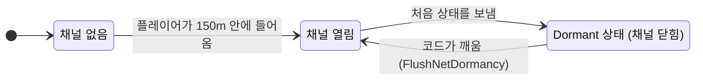
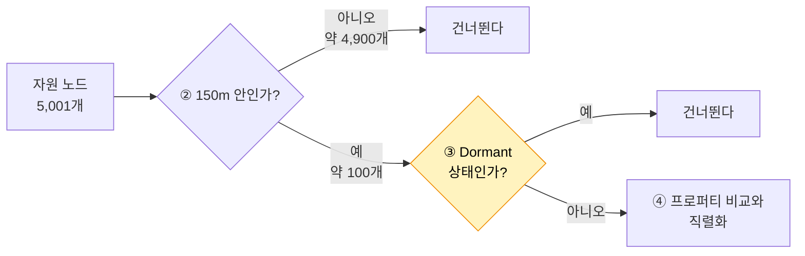
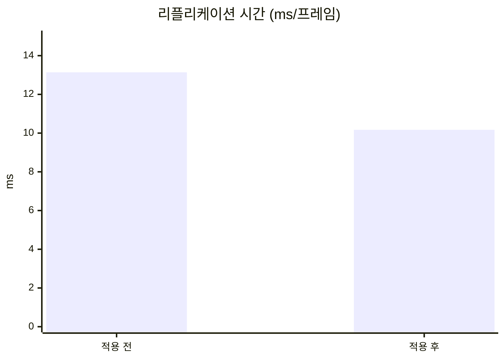
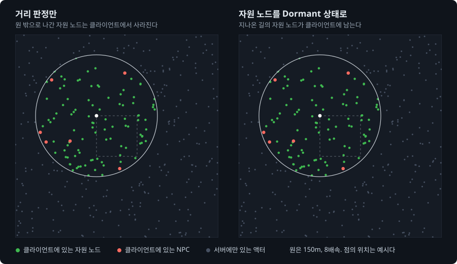

# 3. 자원 노드 Dormancy

## 요약

자원 노드는 채집될 때만 바뀐다. 그런데 서버는 가까운 자원 노드를 프레임마다 비교한다. 이 글은 자원 노드를 Dormant 상태로 재워 두고, 상태가 바뀔 때만 깨워서 보낸다.

결과는 예상과 두 가지가 달랐다. 리플리케이션 시간은 13.1ms에서 10.2ms로 줄었지만, 처음에 기대한 거리 검사는 줄지 않았다. 그리고 액터 채널은 줄었는데 클라이언트가 가진 자원 노드는 오히려 늘었다.

| 지표 | 적용 전 | 적용 후 | 변화 |
| --- | --- | --- | --- |
| 서버 프레임 시간 평균 | 17.6ms | 14.7ms | -17% |
| 리플리케이션 시간 | 13.1ms | 10.2ms | -23% |
| 연결당 열린 액터 채널 수 | 118 | 20 | -83% |
| 클라이언트에 존재하는 자원 노드 | 114개 | 301개 | 늘어남 |

| 적용 전 | 적용 후 |
| --- | --- |
|  |  |

클라이언트 하나의 화면을 위에서 내려다본 모습이다. 초록 점은 이 클라이언트가 가진 자원 노드이고, 빨간 점은 NPC, 흰 점은 플레이어다. 적용 후에는 원 밖에도 점이 남아 있다.

수치는 같은 시나리오를 세 번 실행한 중앙값이다. 실행별 값, 계산식, 엔진 소스 위치는 [측정 기록](measurements.md)에 있다. 표의 "연결"은 서버와 클라이언트 하나 사이의 통신을 뜻한다.

## 문제: 서버가 바뀌지 않는 자원 노드를 프레임마다 비교한다

[Relevancy](../02-relevancy/README.md)를 적용한 서버는 150m 안의 액터만 클라이언트에게 보낸다. 클라이언트 하나의 150m 안에는 자원 노드가 약 100개 있다. 서버는 이 자원 노드를 프레임마다 처리한다. 처리는 지난번에 보낸 값과 지금 값을 비교하고, 바뀐 프로퍼티를 패킷에 쓰는 일이다.

| 60초 동안 클라이언트 하나에 | 값 |
| --- | --- |
| 서버가 자원 노드를 처리한 횟수 | 약 13만 5천 번 |
| 서버가 자원 노드를 실제로 보낸 횟수 | 27번 |

서버는 13만 번을 비교하고 27번을 보냈다. 자원 노드의 상태는 채집될 때와 재생성될 때만 바뀌기 때문이다. 이 비교에 서버는 프레임당 1.74\~1.98ms를 쓴다.

## 원리: 바뀌지 않는 액터를 재워 둔다

**Dormancy**는 바뀌지 않는 액터를 재워 두는 기능이다. 서버는 액터의 처음 상태를 클라이언트에게 보낸 뒤 그 액터를 Dormant 상태로 둔다. 이때 서버는 액터 채널을 닫는다. 액터 채널은 액터 하나의 데이터가 클라이언트 하나로 가는 통로다. 채널이 닫혀도 클라이언트의 액터는 사라지지 않는다.

Dormant 상태인 액터는 스스로 깨어나지 않는다. 상태를 바꾸는 게임 코드가 먼저 액터를 깨워야 한다. 깨우면 서버가 바뀐 값을 한 번 보내고, 액터는 다시 Dormant 상태가 된다.



서버가 한 프레임에 하는 일의 순서는 [기준선 글의 흐름도](../01-baseline/README.md#원리-서버가-한-프레임에-하는-일)에 있다. 그 가운데 자원 노드가 지나는 부분만 꺼내면 다음과 같다.



**처음 예상은 틀렸다.** [기준선 글](../01-baseline/README.md)에서는 Dormancy가 거리 검사 ②까지 없앨 것으로 예상했다. 모든 클라이언트에서 Dormant 상태가 된 액터는 서버의 활성 목록에서 빠지기 때문이다. 활성 목록은 서버가 프레임마다 훑는 액터의 목록이다.

엔진 소스를 다시 읽고 이 예상을 고쳤다. 서버는 채널을 닫을 때에만 그 클라이언트에 대한 Dormant 상태를 기록한다. Relevancy를 적용한 뒤에는 자원 노드 하나에 채널을 여는 클라이언트가 가까운 몇 개뿐이다. 그래서 "모든 클라이언트에서 Dormant 상태"라는 조건이 채워지지 않는다. 거의 모든 자원 노드가 활성 목록에 남는다.

**고친 예상.** 처리 ④의 시간은 거의 사라진다. 거리 검사 ②는 그대로 남는다. 거리 검사는 네트워크 드라이버 자체 시간에 들어 있으므로, 그 시간은 대부분 남아야 한다.

## 적용: 재워 두고, 바꾸기 전에 깨운다

```diff
 // Source/DSOptLab/LabResourceNode.cpp
 ALabResourceNode::ALabResourceNode()
 {
 	PrimaryActorTick.bCanEverTick = false;
 	bReplicates = true;
 
+	// 상태가 바뀔 때만 깨워서 보낸다.
+	NetDormancy = DORM_DormantAll;
```

```diff
 void ALabResourceNode::Harvest()
 {
 	if (!HasAuthority() || bDepleted)
 	{
 		return;
 	}
 
+	// Dormant 상태면 깨워서 아래 변경이 전송되게 한다.
+	FlushNetDormancy();
+
 	--Health;
```

재생성하는 `Respawn()`의 첫머리에도 같은 `FlushNetDormancy()`를 넣었다. 깨우기를 빠뜨리면 바뀐 상태가 클라이언트에 전달되지 않는다. 이 시점의 코드는 태그 [`post-03-dormancy`](https://github.com/hon454/ue-dedicated-server-optimization-lab/tree/post-03-dormancy)에 있다.

## 결과

### 비교는 사라졌고 거리 검사는 남았다

| 리플리케이션 시간의 내역(프레임당) | 적용 전 | 적용 후 | 변화 |
| --- | --- | --- | --- |
| 자원 노드의 처리 | 1.98ms | 0.007ms | -99.6% |
| NPC의 처리 | 0.42ms | 0.41ms | 그대로 |
| 네트워크 드라이버 자체 시간 | 10.4ms | 9.43ms | 구별되지 않음 |
| 그 밖 | 0.31ms | 0.32ms | |
| 합계 | 13.1ms | 10.2ms | -23% |

고친 예상과 맞았다. 서버가 측정 구간에 자원 노드를 처리한 횟수는 약 100만 번에서 609번이 됐다. 네트워크 드라이버 자체 시간은 1ms 줄었지만, 실행 사이의 차이와 겹쳐서 줄었다고 말할 수 없다.



서버 프레임 시간 평균과 리플리케이션 시간의 변화는 실행 사이의 차이보다 크다. 서버 프레임 시간 P99와 연결당 송신 대역폭의 변화는 구별되지 않았다.

대역폭이 그대로인 이유는 단순하다. 자원 노드는 적용 전에도 60초에 27번만 나갔다. 보낼 것은 원래 없었고, 비용은 "보낼 것이 있는지 비교하는 일"에 있었다. Dormancy는 대역폭이 아니라 CPU를 줄인다.

### 액터 채널은 줄었는데 클라이언트의 자원 노드는 늘었다



동작을 설명하는 개념도다. 경로와 150m 원, 점의 밀도는 실제 비율이고, 점의 위치는 예시다.

Relevancy만 적용한 서버는 플레이어가 멀어지면 액터 채널을 닫고, 그때 클라이언트의 액터도 지운다. Dormant 상태인 자원 노드는 채널이 이미 닫혀 있다. 서버에는 닫을 채널이 없고, 그래서 클라이언트의 액터를 지우는 일도 일어나지 않는다. 자원 노드는 플레이어가 지나온 길을 따라 클라이언트에 쌓인다.

| 항목 | 적용 전 | 적용 후 |
| --- | --- | --- |
| 연결당 열린 액터 채널 수 | 118 | 20 |
| 클라이언트에 존재하는 자원 노드(시작 45초 뒤) | 114개 | 301개 |
| 클라이언트에 존재하는 자원 노드(시작 75초 뒤) | 111개 | 313개 |

이 동작은 오류가 아니라 엔진의 동작이다. 영향은 두 가지다. 클라이언트는 오래 돌아다닐수록 더 많은 자원 노드를 메모리에 가진다. 그리고 멀리 있는 동안 바뀐 상태는 플레이어가 150m 안으로 돌아온 뒤에 전달된다.

### 채집 결과는 다른 클라이언트에 맞게 보인다

깨우기가 제대로 동작하는지 클라이언트 두 개로 확인했다. 한 클라이언트는 자원 노드를 채집하고, 다른 클라이언트는 그 모습을 관찰한다.

| 확인한 것 | 결과 |
| --- | --- |
| 채집으로 고갈된 자원 노드가 관찰자 화면에서도 사라지고 20초 뒤 다시 나타나는가 | 예 |
| 관찰자가 270m 밖에 40초 있다가 돌아왔을 때 두 화면이 같은가 | 예 |
| 관찰자가 멀리 있는 동안 화면의 자원 노드 수가 줄지 않는가 | 예. 193개에서 312개로 늘었다 |

## 배운 것과 한계

- **기법의 효과는 앞에 적용한 기법에 따라 달라진다.** Dormancy는 액터를 활성 목록에서 뺄 수 있다. 하지만 Relevancy 뒤에서는 그 조건이 채워지지 않았다. 측정 전에 엔진 소스를 읽어서 예상을 고칠 수 있었다.
- **Dormancy는 CPU를 줄이는 기법이다.** 바뀌지 않는 액터는 원래 대역폭을 쓰지 않는다.
- **Dormant 상태인 액터는 클라이언트에 쌓인다.** 이 실험은 90초라서 300개 남짓이다. 오래 돌아다니면 클라이언트가 맵의 자원 노드를 모두 가지게 된다. 이 글은 이 문제를 해결하지 않았다.

리플리케이션 시간의 93%는 이제 네트워크 드라이버 자체 시간이다. 이 시간을 줄이려면 자원 노드가 활성 목록에 들어오지 않게 해야 하고, 그 방법은 이 시리즈의 세 기법 밖에 있다. 측정 환경의 한계는 [테스트베드와 측정 방법](../00-testbed/README.md)의 "한계"에 있다.

**다음 글.** 송신 비트의 72%는 여전히 NPC의 이동이다. [AI NPC Net Update Frequency](../04-update-frequency/README.md)는 서버가 NPC를 고려하는 횟수를 줄인다.
