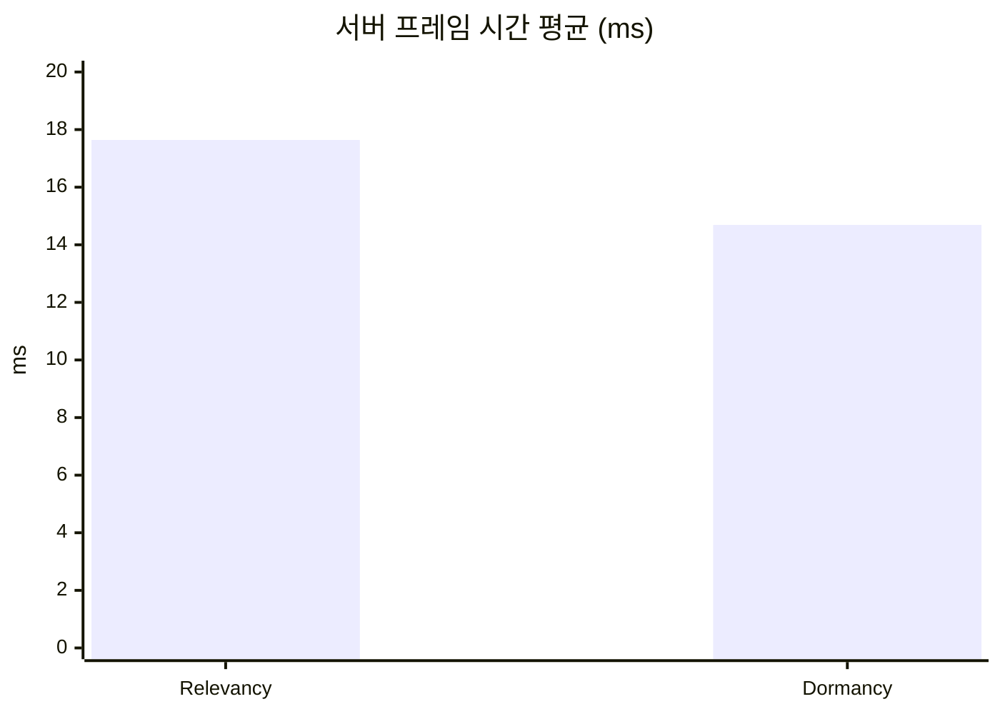
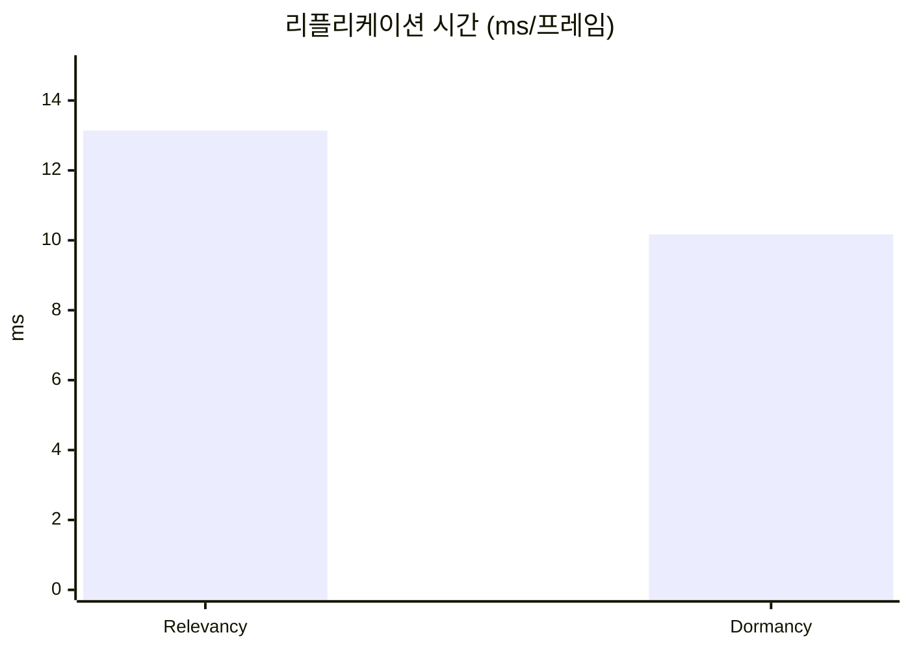
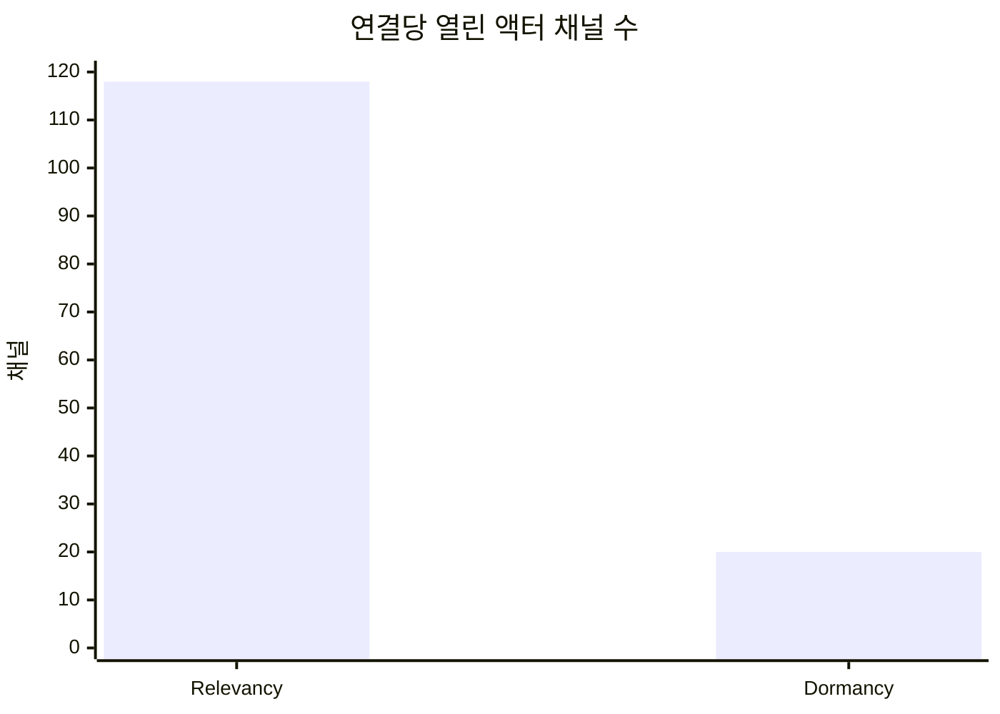

# 3. 자원 노드 Dormancy

## 요약

자원 노드에 `DORM_DormantAll`을 주고, 채집과 재생성으로 상태가 바뀔 때만 `FlushNetDormancy()`로 깨워 보내게 했다. 같은 시나리오로 세 번 측정하니 서버 프레임 시간 평균이 17.64ms에서 14.69ms로 16.7%, 리플리케이션 시간이 13.14ms에서 10.17ms로 22.6% 줄었다. 줄어든 것은 채널이 열려 있던 자원 노드를 프레임마다 확인하던 비용이고, 네트워크 드라이버 자체 시간(프레임당 9.43ms)은 대부분 남았다. 연결당 열린 액터 채널 수는 118에서 20으로 줄었지만, 클라이언트에 존재하는 노드 수는 114에서 301로 오히려 늘었다. Dormant 상태에 들어간 노드는 플레이어가 멀어져도 클라이언트에 남기 때문이다.

| 지표 | Relevancy(`relevancy2`) | Dormancy(`dormancy2`) | 변화 | 근거 |
| --- | --- | --- | --- | --- |
| 서버 프레임 시간 평균 | 17.64ms | 14.69ms | -16.7% | Timing Insights, 세 실행의 중앙값(Relevancy `r3`, Dormancy `r2`) |
| 서버 프레임 시간 P99 | 26.64ms | 22.53ms | -15.4%(구별되지 않음) | Timing Insights, 세 실행의 중앙값(Relevancy `r1`, Dormancy `r2`) |
| 리플리케이션 시간 | 13.14ms/프레임 | 10.17ms/프레임 | -22.6% | Timing Insights `GameNetDriver`, 세 실행의 중앙값(Relevancy `r1`, Dormancy `r2`) |
| 연결당 송신 대역폭 | 2,897바이트/초 | 2,772바이트/초 | -4.3%(구별되지 않음) | Network Insights `Connection 0`(Relevancy `r3`, Dormancy `r2`) |
| 연결당 열린 액터 채널 수 | 118 | 20 | -83.1% | CSV, 세 실행 모두 같음 |
| 클라이언트에 존재하는 액터 수 | 노드 114, NPC 7 | 노드 301, NPC 7 | | 내려다보기 화면 글자(Relevancy `r3`, Dormancy `r2`, t=45s) |

| 적용 전(`relevancy2-r3`) | 적용 후(`dormancy2-r2`) |
| --- | --- |
|  |  |

1번 클라이언트의 내려다보기 화면(t=75s)이다. 플레이어(흰 점)를 중심으로 350m 위에서 본 것이고, 초록 점은 자원 노드, 빨간 점은 NPC이다. 적용 전에는 플레이어 주변의 원 안에만 점이 있고(`nodes=111`), 적용 후에는 원 밖 위쪽과 오른쪽에도 점이 남아 있다(`nodes=313`).

## 관찰

Relevancy를 적용한 뒤의 트레이스(`relevancy2-r3`, 측정 구간 60.019초)에서 Dormancy가 겨냥한 비용을 본다. [Relevancy와 Net Cull Distance](../02-relevancy/README.md)의 적용 후 화면과 같은 이미지다.


① `GameNetDriver`, ② 그 아래의 `LabResourceNode`와 `LabNpc`, ③ 두 북마크다.

### 변하지 않는 자원 노드를 매 프레임 확인한다

②의 `LabResourceNode` Count 1,083,238은 연결 하나가 프레임마다 자원 노드 75.4개를 처리한다는 뜻이다(1,083,238 ÷ `WorldTick` 1,797 ÷ 연결 8. 세 실행에서 75.4\~95.6개). Net Cull Distance 안에 있어 채널이 열린 자원 노드를, 바뀐 것이 있는지 프레임마다 하나씩 확인하는 비용이다. 이 타이머가 프레임당 1.74ms(`GameNetDriver`의 13.15%, 세 실행에서 1.74\~1.98ms)이다.


① `Actor`와 `LabNpc`의 비트, ② `LabResourceNode`의 비트, ③ 고른 측정 구간이다.

그런데 같은 60초 동안 `Connection 0`으로 실제로 나간 노드 데이터는 27번, 1,314비트뿐이다(②). 노드의 상태는 채집할 때와 재생성될 때만 바뀌고, 그 일은 검증용 노드 하나에서만 일어난다. 8개 연결을 합쳐 100만 번 넘게 확인했고, `Connection 0`에 보낸 것은 27번이다. 이동하는 `Connection 1`은 새로 Net Cull Distance 안에 들어온 노드를 받느라 145번이었다. 확인 자체를 하지 않게 만드는 것이 Dormancy가 겨냥한 자리다.

### `GameNetDriver` 자체 시간의 내역은 이 트레이스로 볼 수 없다

리플리케이션 시간의 79\~82%(프레임당 10.43\~10.80ms)는 `GameNetDriver`의 Exclusive이다. Consider List 만들기, 연결마다의 거리 검사, 우선순위 정렬, 송신이 섞여 있고, 이 가운데 자원 노드 때문에 드는 몫이 얼마인지는 이 트레이스로 알 수 없다.

## 선택

자원 노드 Dormancy는 세 기법 가운데 두 번째로 골랐다([Always Relevant 기준선의 "선택"](../01-baseline/README.md#선택)). 그때의 이유는, Relevancy를 되돌려도 자원 노드 5,001개 × 연결 8개의 거리 검사가 남는데 Dormancy가 자원 노드를 활성 목록에서 빼서 그 몫을 줄인다는 것이었다.

**이 기대는 틀렸다.** 이 글의 구성을 측정하기 전에 엔진 소스를 다시 읽고 알았다. 자원 노드가 활성 목록에서 빠지려면 모든 연결에서 Dormant 상태여야 하는데(`Engine/Source/Runtime/Engine/Private/NetworkObjectList.cpp:348-376`), 연결별 Dormant 상태는 그 연결에 열린 액터 채널을 통해서만 등록된다(`Engine/Source/Runtime/Engine/Private/DataChannel.cpp:2354, 2461, 2728`). Relevancy를 적용한 뒤에는 한 자원 노드에 채널을 여는 연결이 가까이 있는 몇 개뿐이라, 8개 연결 모두에서 Dormant 상태가 되는 노드는 거의 없다. [Always Relevant 기준선](../01-baseline/README.md)에서는 "모든 연결에서 Dormant 상태가 된 자원 노드는 활성 목록에서 빠진다"까지는 맞게 읽었지만, 이 시나리오의 자원 노드가 그 조건을 채우지 못한다는 것을 놓쳤다.

그래서 측정 전에 기대를 고쳐 잡았다. Dormancy가 줄이는 것은 채널이 열린 자원 노드의 확인(위 "관찰"의 프레임당 1.74\~1.98ms)이고, 거리 검사가 들어 있는 `GameNetDriver` 자체 시간은 대부분 남을 것으로 봤다. [Relevancy와 Net Cull Distance](../02-relevancy/README.md)의 예고 문장도 이 내용으로 고쳤다.

그래도 계획대로 진행했다. 순서는 [Always Relevant 기준선](../01-baseline/README.md)에서 이미 정했고, 효과가 작더라도 "Dormancy가 무엇을 줄이고 무엇을 줄이지 못하는가"를 재서 보여 주는 것이 이 포스팅의 내용이라고 판단했다.

## 적용

`LabResourceNode`의 생성자에서 Dormant 상태를 정하고, 서버에서 상태를 바꾸는 두 함수의 첫머리에서 깨운다. 다른 코드는 바꾸지 않았다.

```diff
 // Source/DSOptLab/LabResourceNode.cpp
 ALabResourceNode::ALabResourceNode()
 {
 	PrimaryActorTick.bCanEverTick = false;
 	bReplicates = true;
 
+	// 상태가 바뀔 때만 깨워서 보낸다.
+	NetDormancy = DORM_DormantAll;
+
 	Mesh = CreateDefaultSubobject<UStaticMeshComponent>(TEXT("Mesh"));
```

```diff
 void ALabResourceNode::Harvest()
 {
 	if (!HasAuthority() || bDepleted)
 	{
 		return;
 	}
 
+	// Dormant 상태면 깨워서 아래 변경이 전송되게 한다.
+	FlushNetDormancy();
+
 	--Health;
```

```diff
 void ALabResourceNode::Respawn()
 {
+	FlushNetDormancy();
+
 	Health = MaxHealth;
```

**Dormant 상태는 연결마다, 채널을 통해서 정해진다.** 레거시 리플리케이션에서 `DORM_DormantAll`인 액터는 채널이 열려 초기 상태가 전송된 뒤, 그 연결에서 Dormant 상태에 들어가고 채널이 닫힌다(`ShouldActorGoDormant`는 채널이 없으면 false, `Engine/Source/Runtime/Engine/Private/NetDriver.cpp:5506-5526`). 그 뒤로 서버는 이 연결에 대해 이 액터를 건너뛴다(`NetDriver.cpp:5618-5624`). `FlushNetDormancy()`는 Dormant 상태를 풀어 바뀐 프로퍼티가 한 번 전송되게 하고, 액터는 다시 Dormant 상태에 들어간다(`NetDormancy` 값은 그대로다. `Engine/Source/Runtime/Engine/Classes/GameFramework/Actor.h:3176-3178`).

**활성 목록에서 빠지지는 않는다.** 서버가 프레임마다 도는 Consider List는 활성 목록에서 만들어지고(`NetDriver.cpp:5315`), 액터가 활성 목록에서 빠지는 것은 모든 연결에서 Dormant 상태가 됐을 때다(`Engine/Source/Runtime/Engine/Private/NetworkObjectList.cpp:348-376`). 연결별 Dormant 상태는 액터 채널에서만 등록되는데(`Engine/Source/Runtime/Engine/Private/DataChannel.cpp:2354, 2461, 2728`), Relevancy를 적용한 뒤에는 한 자원 노드에 채널을 여는 연결이 가까이 있는 몇 개뿐이다. 그래서 이 시나리오의 자원 노드는 거의 모두 활성 목록에 남고, 채널이 없는 연결마다 거리 검사(`NetDriver.cpp:5580-5593`)를 계속 받는다. 맵에 미리 놓인 `DORM_Initial` 액터만 예외로 처음부터 빠지는데(`NetDriver.cpp:5369-5378`), 이 프로젝트의 자원 노드는 실행 중에 스폰한다.

이 시점의 코드는 태그 [`post-03-dormancy`](https://github.com/hon454/ue-dedicated-server-optimization-lab/tree/post-03-dormancy)에 있다.

## 결과

`dormancy2`를 직전 구성과 같은 명령으로 세 번 실행했다(클라이언트 8, 자원 노드 5,001, NPC 300, 준비 30초, 측정 60초, 서버 논리 프로세서 2\~7, 연결당 송신 한도 350,000바이트/초). 세 실행 모두 종료 코드 0으로 끝났고 `saturated_ratio`는 0.000이다. 앞선 `dormancy-r1`은 측정 중에 클라이언트의 프로세서 선호도가 다시 설정되어 실패로 처리했고 수치를 쓰지 않았다.

### 세 실행의 수치

Insights에서 두 북마크 사이를 읽은 값이다.

| 지표 | `r1` | `r2` | `r3` | 중앙값 | 변동 폭 | Relevancy 중앙값(변동 폭) |
| --- | --- | --- | --- | --- | --- | --- |
| 서버 프레임 시간 평균(ms) | 16.58 | 14.69 | 14.45 | 14.69 | 2.13 | 17.64(0.16) |
| 서버 프레임 시간 P99(ms) | 25.02 | 22.53 | 21.34 | 22.53 | 3.68 | 26.64(4.06) |
| 리플리케이션 시간(ms/프레임) | 11.50 | 10.17 | 10.04 | 10.17 | 1.46 | 13.14(0.18) |
| 연결당 송신 대역폭(바이트/초, `Connection 0`) | 읽지 않음 | 2,772 | 읽지 않음 | | | 2,897(`r3`) |
| 연결당 열린 액터 채널 수(CSV) | 20 | 20 | 20 | 20 | 0 | 118(0) |

- **서버 프레임 시간 평균과 리플리케이션 시간은 구별되는 차이다.** 중앙값의 변화(2.95ms, 2.97ms)가 두 구성의 변동 폭 중 큰 쪽(2.13ms, 1.46ms)보다 크다.
- **P99는 구별된다고 보지 않는다.** 변화 4.11ms가 Relevancy의 변동 폭 4.06ms와 거의 같고, CSV `work_p99_ms`로는 변화 3.921이 변동 폭 4.026보다 작다.
- **`r1`만 느리다.** 세 지표 모두 `r1`이 `r2`, `r3`보다 1.11\~1.17배 크다. 프레임 수도 `r1`만 적다(1,289, 나머지는 1,789와 1,790). 이유는 확인하지 않았다. 그래서 변동 폭이 Relevancy 때(0.16ms)보다 크다.
- 서버 프레임 시간 평균은 (측정 구간 − 틱 속도 제한 대기) ÷ `Frame` Count이다([ADR-0010](../../Docs/Decisions/0010-frame-time-without-tick-wait.md). `r2`: (60.015초 − 33.732초) ÷ 1,789). P99는 프레임마다 대기를 뺀 길이를 정렬한 ceil(N × 0.99)번째 값이다.
- 리플리케이션 시간은 `GameNetDriver` Incl ÷ `WorldTick` Count이다(`r2`: 18.18초 ÷ 1,788).
- 연결당 송신 대역폭은 (`Actor` Incl 1,163,648 + `PacketHeaderAndInfo` Incl 164,220)비트 ÷ 8 ÷ 59.883초다(`r2` `Connection 0` `Outgoing`, 1,785패킷). Relevancy와의 차이 125바이트/초는 CSV에서 보이는 실행 사이의 흔들림(변동 폭 586\~604바이트/초)보다 작다.

서버가 남긴 CSV는 다음과 같다. Insights 값과의 차이는 서버 프레임 시간 평균과 `work_avg_ms`가 +1.9\~+2.3%, P99와 `work_p99_ms`가 +1.1\~+2.5%, 리플리케이션 시간과 `netflush_avg_ms`가 -2.3\~-2.5%이다.

| 라벨 | `frames` | `work_avg_ms` | `work_p99_ms` | `netflush_avg_ms` | `out_bytes_per_sec_per_conn` | `open_actor_channels_per_conn` | `saturated_ratio` |
| --- | --- | --- | --- | --- | --- | --- | --- |
| `dormancy2-r1` | 1,288 | 16.205 | 24.410 | 11.774 | 3,734 | 20 | 0.000 |
| `dormancy2-r2` | 1,788 | 14.409 | 22.063 | 10.430 | 4,316 | 20 | 0.000 |
| `dormancy2-r3` | 1,789 | 14.173 | 21.116 | 10.298 | 4,320 | 20 | 0.000 |
| 중앙값 | 1,788 | 14.409 | 22.063 | 10.430 | 4,316 | 20 | 0.000 |
| 변동 폭 | 501 | 2.032 | 3.294 | 1.476 | 586 | 0 | 0.000 |
| Relevancy 중앙값 | 1,488 | 17.380 | 25.984 | 13.357 | 4,076 | 118 | 0.000 |







### 리플리케이션 시간의 내역

| 타이머(프레임당) | Relevancy `r1` | Dormancy `r2` | 변화 |
| --- | --- | --- | --- |
| `LabResourceNode` | 1.98ms (15.1%) | 0.007ms (0.07%) | -99.6% |
| `LabNpc` | 0.42ms (3.2%) | 0.41ms (4.0%) | -2.4% |
| `GameNetDriver` Exclusive | 10.43ms (79.4%) | 9.43ms (92.7%) | -9.6% |
| 나머지 | 0.31ms | 0.32ms | |
| 합계(리플리케이션 시간) | 13.14ms | 10.17ms | -22.6% |

각 값은 타이머 Incl(Exclusive는 Excl) ÷ `WorldTick` Count이고, 괄호는 리플리케이션 시간 대비 비율이다. 두 구성 모두 리플리케이션 시간의 중앙값 실행이다.

- **자원 노드 직렬화가 사라졌다.** `LabResourceNode` 타이머 호출이 60초에 609번이다(Relevancy `r1`은 997,693번). 연결 하나가 프레임마다 처리하는 자원 노드가 95.6개에서 0.043개가 됐다(609 ÷ 1,788 ÷ 8). 채집으로 상태가 바뀐 노드만 깨어나 전송된다.
- **`GameNetDriver` 자체 시간은 대부분 남았다.** 1.00ms 줄었지만 세 실행의 범위(9.32\~10.60ms)가 Relevancy의 범위(10.43\~10.80ms)와 겹쳐, 줄었다고 확정할 수 없다. Dormant 상태인 자원 노드도 활성 목록에 남아 연결마다 거리 검사를 받는다는 소스의 내용과 맞는 결과다.


① `GameNetDriver`(`% Root` 71.48%, Excl 16.86초), ② `LabResourceNode`(Count 609, 12.52ms, `% Parent` 0.07%), ③ 두 북마크다.


① `Actor`와 `LabNpc`의 비트(1,163,648, 836,895), ② `LabResourceNode`의 비트(9번, 810), ③ 고른 측정 구간(1,785패킷, 59.883초)이다. 노드는 적용 전에도 60초에 27번, 1,314비트뿐이었다. 변하지 않는 노드는 보낼 내용이 없었고, 비용은 "보낼 것이 있는지 확인하는 일"에 있었다. 그래서 Dormancy는 대역폭이 아니라 CPU를 줄인다. 송신 비트의 71.9%는 여전히 NPC 이동이다.

### 정확성 확인

| 항목 | 적용 전(`relevancy2-r3`) | 적용 후(`dormancy2-r2`) | 근거 |
| --- | --- | --- | --- |
| 연결당 열린 액터 채널 수 | 118 | 20 | CSV |
| 클라이언트에 존재하는 노드 수(1번, 이동, t=45s) | 114 | 301 | 자동 스크린샷의 화면 글자 |
| 클라이언트에 존재하는 노드 수(1번, t=75s) | 111 | 313 | 같음 |
| 클라이언트에 존재하는 노드 수(0번, 채집, t=75s) | 80 | 195 | 같음 |
| 클라이언트에 존재하는 NPC 수(1번, t=45s / t=75s) | 7 / 4 | 7 / 4 | 같음 |
| 측정 구간에 `Connection 0`이 받은 노드 갱신 | 27번 | 9번(`Health` 9, `bDepleted` 9) | Network Insights |

**열린 채널 수와 클라이언트에 존재하는 노드 수가 반대로 움직인다.** 채널은 연결당 98개쯤 닫혔는데, 클라이언트가 가진 노드는 늘었다. Dormancy로 채널이 닫힌 자원 노드는 플레이어가 Net Cull Distance 밖으로 나가도 서버에 닫을 채널이 없어서(`NetDriver.cpp:5877-5889`) 클라이언트에 그대로 남는다. 플레이어가 지나온 길을 따라 노드가 쌓이고, 화면의 노드 수는 시간이 갈수록 는다(t=45s 301개, t=75s 313개). NPC는 Dormant 상태가 아니라서 전과 같이 Net Cull Distance 밖에서 사라진다. 이것은 레거시 리플리케이션의 동작이고 오류가 아니다. 영향은 두 가지다. 클라이언트는 오래 돌아다닐수록 더 많은 노드 액터를 메모리에 갖고 있게 된다. 그리고 멀리 있는 동안 바뀐 노드의 상태는 그때 전달되지 않고, 다시 Net Cull Distance 안으로 들어와 채널이 열릴 때 전달된다.

| 적용 전(`relevancy2-r3`) | 적용 후(`dormancy2-r2`) |
| --- | --- |
|  |  |

0번 클라이언트의 3인칭 화면(t=75s)이다. 보이는 모습은 같다. 화면 글자의 노드 수만 80에서 195로 다르다. 두 화면 모두 캐릭터 앞의 검증용 노드가 채집으로 고갈되어 보이지 않는 시점이다.

| 적용 전(`relevancy2-r3`) | 적용 후(`dormancy2-r2`) |
| --- | --- |
|  |  |

1번 클라이언트의 내려다보기 화면(t=45s)이다.

| 적용 전(`visual2-r1`) | 적용 후(`visual5-r1`) |
| --- | --- |
|  |  |

같은 경로를 걷는 1번(내려다보기)과 2번(3인칭) 클라이언트의 10초다(적용 전 t=49\~58s, 적용 후 t=50\~59s). 적용 전에는 원 안의 점이 플레이어를 따라 바뀌고 노드 수가 108\~115에 머문다. 적용 후에는 지나온 쪽의 점이 남아 노드 수가 306에서 313으로 는다. 두 영상은 수치를 쓰지 않는 시각 자료 전용 실행에서 찍었고, 적용 전 영상은 [Relevancy와 Net Cull Distance](../02-relevancy/README.md)의 적용 후 영상과 같은 파일이다.

**채집과 재생성이 다른 클라이언트에 맞게 보이는지 두 창에서 확인했다.** 측정과 별도로 서버 하나에 클라이언트 두 개를 띄웠다(`Scripts/run-manual.ps1`, 자원 노드 5,001, NPC 300). 하나는 검증용 노드 옆에서 채집하고, 다른 하나(관찰자)는 직접 조작했다. 두 창을 1\~4초 간격으로 찍어 비교한 결과다.

| 확인한 것 | 결과 |
| --- | --- |
| 채집 담당이 검증용 노드를 고갈시킬 때 관찰자 화면에서도 사라지고 20초 뒤 다시 나타나는가 | 예. 두 창에서 같은 표본에 사라지고 같은 표본에 다시 나타났다. 사라져 있는 시간은 표본 간격(4초) 안에서 20초와 맞았다(`RespawnSeconds` 20, `Source/DSOptLab/LabResourceNode.h`) |
| 관찰자가 200m 이상 멀어졌다가 돌아왔을 때, 그 사이에 바뀐 상태가 맞게 보이는가 | 예. 관찰자를 270m 밖에 40초 두었다가(그동안 노드는 한 번 이상 재생성되고 고갈된다. 주기 약 26초) 되돌렸다. 도착한 순간 두 창 모두 노드가 고갈된 상태였고, 7초 뒤 같은 표본에 다시 나타났다. 278m 밖에 27초 둔 다른 실행에서도 돌아온 뒤 한 주기 동안 두 창이 일치했다 |
| 관찰자가 멀리 있을 때 화면의 노드 수가 줄지 않는가 | 예. 멀어지는 동안 193에서 312로 늘었고, 278m 밖에 서 있는 27초 동안 312로 유지됐다. 돌아온 뒤에도 312였다 |

두 번째 항목에는 한계가 있다. 노드는 주기의 대부분(26초 중 20초)을 고갈 상태로 보내서, 도착한 순간의 일치만으로는 멀리 있는 동안의 변화가 전달된 것인지 가릴 수 없다. 확인한 것은 돌아온 뒤 화면이 채집 담당과 어긋나지 않았다는 것까지다.

## 한계와 다음

- **Dormancy는 이 시나리오에서 거리 검사를 줄이지 못했다.** [Always Relevant 기준선](../01-baseline/README.md)에서는 Dormancy가 자원 노드 5,001 × 연결 8의 확인을 줄일 것으로 기대했지만, Relevancy를 적용한 뒤에는 노드가 모든 연결에서 Dormant 상태가 되지 못해 활성 목록에 남는다. 줄어든 것은 채널이 열린 자원 노드(연결당 약 98개)의 직렬화뿐이다. 남은 `GameNetDriver` 자체 시간(프레임당 9.43ms)을 줄이려면 자원 노드가 Consider List에 들어오지 않게 해야 하고, 이 시리즈의 세 기법 밖이다.
- **`GameNetDriver` 자체 시간의 내역을 여전히 모른다.** 거리 검사, 우선순위 정렬, 송신이 섞여 있다. 1.00ms 줄어든 것이 실제 변화인지도 이 측정으로는 가릴 수 없다.
- **Dormant 노드가 클라이언트에 쌓인다.** 위 "정확성 확인"의 동작이다. 이 실험은 90초라서 300개 남짓이지만, 오래 돌아다니면 맵의 노드를 모두 갖게 된다. 해결은 이 포스팅에서 구현하지 않았다.
- **`r1`이 다른 두 실행보다 11\~17% 느렸다.** 이유를 확인하지 않았다. 이 때문에 변동 폭이 Relevancy 때보다 크고, P99와 연결당 송신 대역폭은 구별되는 차이가 아니다.
- **연결당 송신 대역폭은 `r2`의 `Connection 0` 하나만 읽었다.** 제자리에서 채집하는 연결이라 이동하는 연결과 다를 수 있다.
- **측정 조건이 하나 달랐다.** 측정 PC에는 두 구성 모두 원격 데스크톱으로 접속해 있었는데, Dormancy를 측정할 때의 원격 화면 크기(1728×1084)가 Relevancy 때와 달랐다. 서버 수치에 영향이 있었는지는 확인하지 않았다.
- 에디터 빌드, 같은 PC의 서버와 클라이언트, 루프백 네트워크 같은 측정 환경의 한계는 [테스트베드와 측정 방법](../00-testbed/README.md)의 "한계"에 있다.

**다음: AI NPC Net Update Frequency.** 이제 클래스 타이머로 보이는 비용은 NPC 직렬화(프레임당 0.41ms, 리플리케이션 시간의 4.0%)이고, 송신 비트의 71.9%가 NPC 이동이다. [AI NPC Net Update Frequency](../04-update-frequency/README.md)에서는 NPC의 `NetUpdateFrequency`를 낮춰, 서버가 NPC를 리플리케이션 대상으로 고려하는 횟수를 줄인다. 겨냥하는 CPU 비용이 서버 프레임 시간의 변동 폭(2.13ms)보다 작아서 시간 지표로는 차이가 구별되지 않을 수 있고, 대역폭 쪽에서 차이가 날 것으로 본다.
