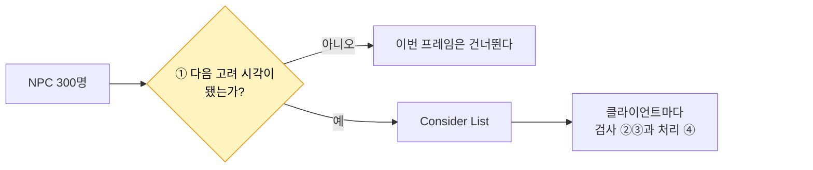
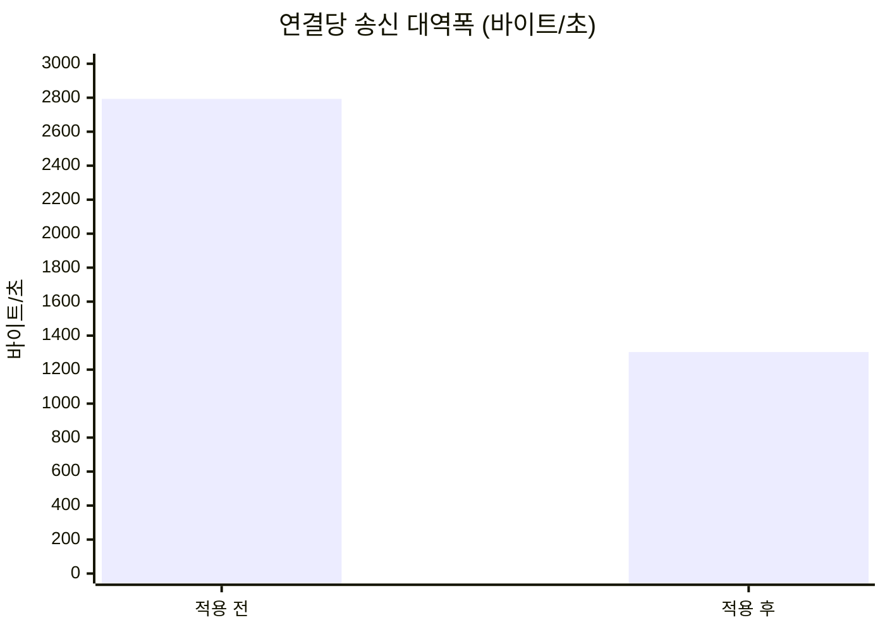

# 4. AI NPC Net Update Frequency

## 요약

NPC는 계속 움직인다. 그래서 서버는 NPC의 위치를 거의 매 프레임 보내고, 송신 비트의 72%가 NPC의 이동이다. 이 글은 NPC의 Net Update Frequency를 100에서 10으로 낮춘다.

연결당 송신 대역폭은 절반으로 줄었고, CPU는 거의 그대로였다. 그리고 값 10은 초당 10번을 뜻하지 않았다. 서버는 NPC 하나를 초당 약 7.5번 보냈다. 그만큼 NPC는 끊겨 움직인다.

| 지표 | 적용 전 | 적용 후 | 변화 |
| --- | --- | --- | --- |
| 연결당 송신 대역폭 | 2,790바이트/초 | 1,300바이트/초 | -53% |
| 리플리케이션 시간 | 9.35ms | 8.73ms | -6.6% |
| 서버 프레임 시간 평균 | 13.6ms | 13.2ms | 구별되지 않음 |
| NPC의 화면 위치가 바뀌는 간격 | 46ms | 131ms | 2.8배 |

| 적용 전(빈도 100) | 적용 후(빈도 10) |
| --- | --- |
|  |  |

클라이언트 화면을 가로지르는 NPC 하나를 4배 느리게 재생한 영상이다. 적용 후의 NPC는 한 번에 더 멀리, 더 드물게 움직인다.

수치는 같은 시나리오를 세 번 실행한 중앙값이다. 실행별 값, 계산식, 엔진 소스 위치는 [측정 기록](measurements.md)에 있다. 표의 "연결"은 서버와 클라이언트 하나 사이의 통신을 뜻한다. 적용 전 수치는 [자원 노드 Dormancy](../03-dormancy/README.md)의 적용 후 수치와 조금 다르다. 같은 코드를 이 글의 측정과 연달아 다시 측정했기 때문이다.

## 문제: NPC는 CPU를 조금 쓰고 대역폭을 많이 쓴다

[Relevancy](../02-relevancy/README.md)와 [Dormancy](../03-dormancy/README.md)를 적용한 서버는 틱 예산 33.3ms 안에서 돈다. 틱 예산은 30Hz 서버가 한 프레임에 쓸 수 있는 시간이다. 남은 대상 가운데 눈에 띄는 것은 NPC다.

| NPC가 차지하는 비율 | 값 |
| --- | --- |
| 리플리케이션 시간 | 4% |
| 송신 비트 | 72% |

NPC는 서버 프레임마다 위치가 바뀐다. 그래서 서버는 NPC를 고려할 때마다 보낼 것이 있다. 서버는 60초 동안 클라이언트 하나에 NPC 갱신을 7,622번 보냈다. 갱신 한 번은 111비트이고, 그 가운데 92비트가 이동 정보다.

NPC가 쓰는 CPU는 프레임당 0.375ms뿐이다. 그래서 이 글은 CPU가 아니라 대역폭을 겨냥한다.

## 원리: 서버가 액터를 고려하는 간격을 늘린다

**Net Update Frequency**는 서버가 액터를 리플리케이션 대상으로 고려하는 빈도다. 액터마다 다음 고려 시각이 있다. 서버는 그 시각이 되지 않은 액터를 이번 프레임에 건너뛴다. 건너뛴 액터는 어느 클라이언트에게도 보내지 않는다.



이 검사는 [기준선 글의 흐름도](../01-baseline/README.md#원리-서버가-한-프레임에-하는-일)의 ①이다. Consider List는 이번 프레임에 고려할 액터의 목록이다. 이 설정은 NPC의 움직임을 바꾸지 않는다. NPC는 서버에서 여전히 프레임마다 움직이고, 서버가 그 위치를 보내는 횟수만 준다.

**값 10은 100ms 간격을 보장하지 않는다.** 서버는 액터를 고려한 뒤 다음 고려 시각을 정한다. 그 시각은 지금부터 "1 ÷ 빈도"초에 난수를 더한 만큼 뒤다. 난수는 0에서 한 프레임 시간 사이다. 그리고 서버는 프레임이 돌 때만 이 시각을 검사한다. 30Hz 서버에서 프레임 간격은 33.3ms다.

| 빈도 | 다음 고려 시각까지 | 다시 고려하는 프레임 | 평균 간격 |
| --- | --- | --- | --- |
| 100(엔진 기본값) | 10\~43ms | 다음 프레임이거나 그다음 프레임 | 약 43ms |
| 10 | 100\~133ms | 네 번째 프레임 | 약 133ms |

| 프레임 | 1 | 2 | 3 | 4 | 5 | 6 | 7 | 8 | 9 |
| --- | --- | --- | --- | --- | --- | --- | --- | --- | --- |
| 빈도 100 | ● | ● | | ● | ● | ● | | ● | ● |
| 빈도 10 | ● | | | | ● | | | | ● |

●는 서버가 NPC를 고려하는 프레임이다. 빈도 100의 줄은 한 가지 예시다. 기본값 100에서도 서버는 NPC를 매 프레임 고려하지 않는다.

**예상.** 서버가 NPC를 고려하는 횟수는 10분의 1이 아니라 약 3분의 1이 된다. 평균 간격이 1.3프레임에서 4프레임으로 늘기 때문이다. NPC가 송신 비트의 72%이므로 대역폭은 크게 줄어야 한다. NPC가 쓰는 CPU는 작아서, 서버 프레임 시간의 변화는 실행 사이의 차이에 묻힐 수 있다.

이 기법을 세 기법 가운데 마지막에 적용한 이유는 [기준선 글의 "선택"](../01-baseline/README.md#선택-세-기법과-순서)에 있다. 서버의 프레임 간격이 133ms보다 길면 이 설정에 효과가 없다. 기준선의 프레임 간격은 약 200ms였다.

## 적용: 한 줄을 넣는다

```diff
 // Source/DSOptLab/LabNpc.cpp
 ALabNpc::ALabNpc()
 {
 	// ...
 	bReplicates = true;
 	SetReplicatingMovement(true);
+	// 초당 10회만 리플리케이션 대상으로 고려한다.
+	SetNetUpdateFrequency(10.f);
```

값 10은 NPC의 속도에서 정했다. NPC는 초당 300cm를 움직인다. 0.1초에 30cm를 간다. 이 시점의 코드는 태그 [`post-04-update-frequency`](https://github.com/hon454/ue-dedicated-server-optimization-lab/tree/post-04-update-frequency)에 있다.

## 결과

### 갱신 횟수가 예상대로 약 3분의 1이 됐다

| 항목 | 적용 전 | 예상 | 실제 |
| --- | --- | --- | --- |
| 60초 동안 클라이언트 하나가 받은 NPC 갱신 | 7,622번 | 0.325배 | 2,472번(0.324배) |
| NPC 하나의 갱신 간격 | 약 43ms(계산값) | 약 133ms | 약 134ms |
| NPC의 처리 시간(프레임당) | 0.375ms | | 0.147ms |

패킷을 하나씩 넘기며 NPC 하나가 실린 패킷을 찾았다. 그 NPC는 정확히 4패킷마다 실려 있었다. 패킷 간격이 33.4ms이므로 갱신 간격은 약 134ms다. 초당으로는 약 7.5번이다.

### 대역폭은 절반이 됐고 CPU는 거의 그대로다



서버가 보내는 패킷 수는 그대로다. 서버는 여전히 프레임마다 패킷을 보내고, 그 안에 실리는 NPC 갱신이 줄었다. 갱신 한 번의 크기도 111비트로 같다.

서버 프레임 시간 평균은 0.44ms 줄었다. 실행 사이의 차이가 0.51ms라서 이 변화는 구별되지 않는다. 리플리케이션 시간과 서버 프레임 시간 P99는 구별되는 만큼 줄었지만 폭이 작다.

### NPC가 끊겨 움직인다


요약의 영상을 60fps로 찍고, 프레임마다 NPC의 화면 위치를 읽었다. 파란 선이 적용 전이고 빨간 선이 적용 후다. 계단 하나가 갱신 한 번이다.

| 항목 | 적용 전 | 적용 후 |
| --- | --- | --- |
| 화면 위치가 바뀌는 간격(평균) | 46ms | 131ms |
| 한 번에 움직이는 거리 | 약 11cm | 약 41cm |

화면에서 읽은 간격은 계산값(43ms, 133ms)과 맞는다. 이 클라이언트는 받은 위치를 그대로 적용하고 보간하지 않는다. 그래서 줄어든 갱신이 그대로 끊김으로 보인다.

## 배운 것과 한계

- **이 시나리오에서 Net Update Frequency 조정은 대역폭을 줄이는 기법이다.** 겨냥한 대상이 CPU의 4%, 송신 비트의 72%였기 때문이다. 줄인 대역폭은 움직임의 부드러움과 맞바꾼 것이다. 실제 게임에서는 클라이언트 보간과 함께 써야 한다.
- **설정한 빈도와 실제 빈도는 다르다.** 서버는 프레임 단위로만 검사하고, 엔진은 간격에 난수를 더한다. 이 서버에서 값 10은 약 7.5Hz였다.
- **값 하나를, 대역폭이 남는 조건에서 측정했다.** 다른 값은 측정하지 않았다. 대역폭이 모자란 조건에서는 줄어든 송신이 다른 액터의 전송을 앞당길 수 있다. 그 효과도 측정하지 않았다.

측정 환경의 한계는 [테스트베드와 측정 방법](../00-testbed/README.md)의 "한계"에 있다.

**다음.** 이 글이 1막의 마지막 기법이다. 세 기법을 적용한 뒤에도 리플리케이션 시간의 95%는 네트워크 드라이버 자체 시간으로 남았다. 그 내역은 아직 모른다. 2막은 테스트베드를 확장해 새 기준선을 잡고 시작한다. 다룰 주제는 [백로그](../../Docs/backlog.md)에 있다.
