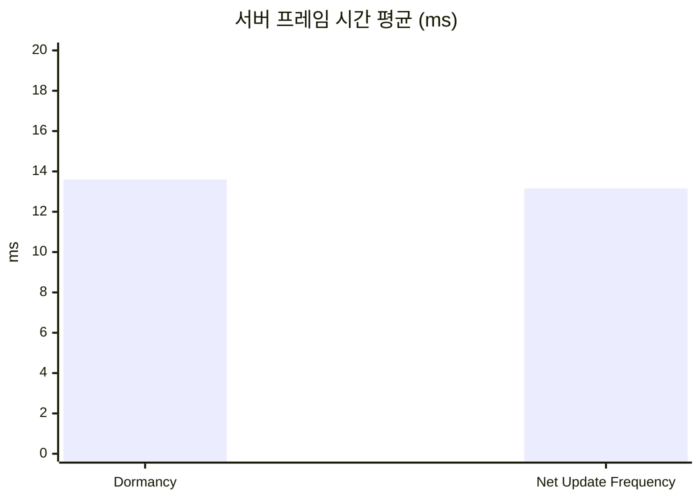
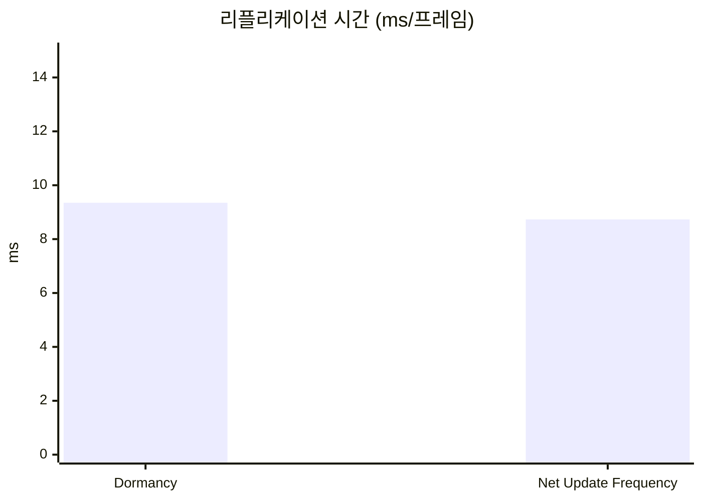
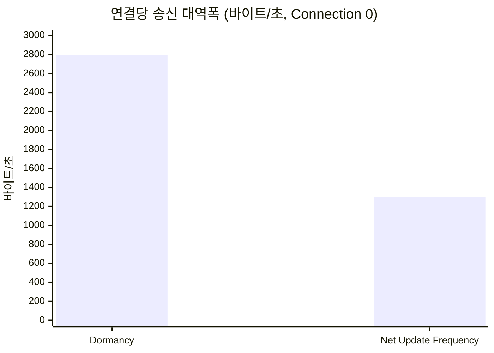

# 4. AI NPC Net Update Frequency

## 요약

AI NPC의 `NetUpdateFrequency`를 엔진 기본값 100에서 10으로 낮췄다. 같은 시나리오로 세 번 측정하니 제자리 연결(`Connection 0`)의 연결당 송신 대역폭이 2,793바이트/초에서 1,303바이트/초로 53.3% 줄었고, 리플리케이션 시간은 9.35ms에서 8.73ms로 6.6% 줄었다. 서버 프레임 시간 평균은 13.60ms에서 13.16ms로, 실행 사이의 변동 폭보다 작은 차이라 구별되지 않았다. 이 시나리오에서 Net Update Frequency 조정은 CPU가 아니라 대역폭을 줄이는 기법이었다. 값 10은 초당 10번 전송을 뜻하지 않았다. NPC 하나는 4패킷마다, 약 134ms에 한 번 갱신됐다. 그만큼 움직임은 끊겨 보였다. 화면을 가로지르는 NPC 하나를 60fps로 찍으니 위치가 바뀌는 간격이 평균 46ms에서 131ms가 됐다.

| 지표 | Dormancy(`dormancy6`) | Net Update Frequency(`update-frequency3`) | 변화 | 근거 |
| --- | --- | --- | --- | --- |
| 서버 프레임 시간 평균 | 13.60ms | 13.16ms | -3.2%(구별되지 않음) | Timing Insights, 세 실행의 중앙값(Dormancy `r1`, Net Update Frequency `r1`) |
| 서버 프레임 시간 P99 | 20.84ms | 19.50ms | -6.4% | Timing Insights, 세 실행의 중앙값(Dormancy `r1`, Net Update Frequency `r1`) |
| 리플리케이션 시간 | 9.35ms/프레임 | 8.73ms/프레임 | -6.6% | Timing Insights `GameNetDriver`, 세 실행의 중앙값(Dormancy `r1`, Net Update Frequency `r3`) |
| 연결당 송신 대역폭 | 2,793바이트/초 | 1,303바이트/초 | -53.3% | Network Insights `Connection 0`(두 구성 모두 `r1`) |
| 연결당 열린 액터 채널 수 | 20 | 20 | 0 | CSV, 세 실행 모두 같음 |
| 클라이언트에 존재하는 액터 수 | 노드 301, NPC 7 | 노드 301, NPC 7 | | 내려다보기 화면 글자(두 구성 모두 `r1`, t=45s) |
| NPC 하나의 갱신 간격 | 읽지 않음(계산값 평균 약 43ms) | 4패킷, 약 134ms | | Network Insights 패킷 순번(`update-frequency3-r1`), 계산은 "적용" |

`dormancy6`은 직전 구성([자원 노드 Dormancy](../03-dormancy/README.md)의 코드)을 이번 구성과 같은 화면 조건에서 다시 잰 것이다. 그 글의 `dormancy2`와 수치가 다른 이유는 "결과"에 적었다.

| 적용 전(`dormancy6-r1`) | 적용 후(`update-frequency3-r1`) |
| --- | --- |
|  |  |

1번 클라이언트의 내려다보기 화면(t=45s)이다. 초록 점은 자원 노드, 빨간 점은 NPC이다. 두 화면의 점과 화면 글자(`nodes=301 npcs=7`)가 같다. 이 기법은 클라이언트가 무엇을 갖고 있는지를 바꾸지 않고, 얼마나 자주 갱신받는지만 바꾼다.

## 관찰

Dormancy까지 적용한 트레이스(`dormancy6-r1`, 측정 구간 60.028초)에서 Net Update Frequency가 겨냥한 비용을 본다.

### NPC는 CPU에서는 작고 송신에서는 크다


① `GameNetDriver`(Incl 16.76초, Excl 15.55초), ② 그 아래의 `LabNpc`(Count 78,876, 671.55ms, `% Parent` 4.01%), ③ 두 북마크다.

서버가 NPC를 직렬화하는 시간은 프레임당 0.375ms이다(671.55ms ÷ `WorldTick` 1,792). 리플리케이션 시간 9.35ms의 4.0%이다. 나머지 대부분(프레임당 8.68ms)은 `GameNetDriver`의 Exclusive이고, [자원 노드 Dormancy](../03-dormancy/README.md)에서 본 대로 이 트레이스로는 내역이 나뉘지 않는다.


① `Actor`의 비트(1,177,510), ② `LabNpc`의 비트(7,622번, 846,108), ③ 고른 측정 구간(1,795패킷, 60.095초)이다.

같은 60초 동안 `Connection 0`으로 나간 액터 비트의 71.9%가 `LabNpc`이다(846,108 ÷ 1,177,510). NPC는 서버 틱마다 위치가 바뀌므로 고려될 때마다 보낼 것이 있다. 1,795패킷에 NPC 갱신이 7,622번, 패킷 하나에 평균 4.25번 실렸다. 한 번에 111비트이고, 그중 92비트가 `ReplicatedMovement`이다.

CPU에서는 4.0%, 송신에서는 71.9%이다. 그래서 고려 횟수를 줄이면 시간 지표보다 대역폭이 먼저 움직일 것으로 봤다.

## 선택

NPC의 Net Update Frequency 조정은 세 기법 가운데 세 번째로 골랐다([무법지대 측정의 "선택"](../01-baseline/README.md#선택)). 그때의 이유는 순서가 아니면 효과가 나지 않는다는 것이었다. `NetUpdateFrequency`를 10으로 낮추면 NPC의 다음 고려 시각은 지금 + 0\~1/30초 + 0.1초가 되는데, 기준선의 프레임 간격은 약 0.18\~0.2초라서 다음 프레임이 올 때 이 시각이 이미 지나 있다. 앞의 두 기법으로 프레임 간격이 0.133초보다 짧아져야 건너뛰는 프레임이 생긴다.

**이 전제는 채워졌다.** Relevancy와 Dormancy를 적용한 서버는 틱 예산 안에서 30Hz로 돈다. `dormancy6-r1`의 측정 구간은 60.028초에 1,793프레임, 프레임 간격 33.5ms이다. 이 간격이면 빈도 10인 NPC는 고려된 뒤 세 프레임을 건너뛰고 네 번째 프레임에 다시 고려된다(계산은 "적용").

측정 전의 기대는 [자원 노드 Dormancy](../03-dormancy/README.md)의 끝에 적은 대로였다. 겨냥하는 CPU 비용(NPC 직렬화 프레임당 0.4ms 안팎)이 서버 프레임 시간의 변동 폭보다 작아 시간 지표로는 구별되지 않을 수 있고, 차이는 대역폭에서 날 것으로 봤다.

## 적용

`LabNpc`의 생성자에 한 줄을 넣었다. 다른 코드는 바꾸지 않았다.

```diff
 // Source/DSOptLab/LabNpc.cpp
 ALabNpc::ALabNpc()
 {
 	PrimaryActorTick.bCanEverTick = true;
 	// 시작 신호 전에는 틱하지 않는다. 실행마다 같은 시점에 같은 위치에 있게 하기 위해서다.
 	PrimaryActorTick.bStartWithTickEnabled = false;
 	bReplicates = true;
 	SetReplicatingMovement(true);
+	// 초당 10회만 리플리케이션 대상으로 고려한다.
+	SetNetUpdateFrequency(10.f);
```

값 10의 근거는 NPC의 속도다. NPC는 초당 300cm로 움직이므로(`MoveSpeed`, `Source/DSOptLab/LabNpc.h`) 0.1초 사이에 30cm를 간다.

**이 설정은 NPC의 서버 틱을 바꾸지 않는다.** NPC는 여전히 서버 프레임마다 움직인다. 바뀌는 것은 서버가 이 액터를 리플리케이션 대상으로 고려하는 빈도다. 서버는 프레임마다 활성 목록을 돌면서, 다음 고려 시각이 아직 오지 않은 액터를 건너뛴다(`World->TimeSeconds <= ActorInfo->NextUpdateTime`, `Engine/Source/Runtime/Engine/Private/NetDriver.cpp:5319-5323`). 건너뛴 액터는 그 프레임에 어느 연결에도 고려되지 않는다.

**값 10이 100ms 간격을 보장하지 않는다.** 고려된 액터의 다음 고려 시각은 `지금 + RandDelay + 1 / NetUpdateFrequency`이고, `RandDelay`는 0에서 서버 틱 시간(1 ÷ 30초) 사이의 난수다(`NetDriver.cpp:5420-5425`, `6341-6348`). 적응형 빈도는 꺼져 있다(`net.UseAdaptiveNetUpdateFrequency` 기본값 0, `NetDriver.cpp:523-526`). 30Hz에서 계산하면 다음과 같다.

| | 다음 고려 시각까지 | 다시 고려되는 프레임 | 평균 간격 |
| --- | --- | --- | --- |
| 빈도 100(엔진 기본값, `Engine/Source/Runtime/Engine/Private/Actor.cpp:295-296`) | 10\~43.3ms | 난수가 0.7보다 작으면 다음 프레임(33.3ms), 아니면 그다음 프레임(66.7ms) | 1.3프레임, 약 43ms(0.7 × 1 + 0.3 × 2) |
| 빈도 10 | 100\~133.3ms | 세 프레임 뒤는 100ms 근처라 거의 항상 이르고, 네 프레임 뒤(133.3ms) | 4프레임, 약 133ms |

기본값 100에서도 NPC가 매 프레임 고려되지는 않았다. 그래서 고려 횟수는 10분의 1이 아니라 약 3분의 1이 된다(계산값 1.3 ÷ 4 = 0.325). 실제 전송에는 서버 틱, Relevancy, 송신 한도 포화도 영향을 준다. 이 측정에서 포화는 없었다(`saturated_ratio` 0.000).

이 시점의 코드는 태그 [`post-04-update-frequency`](https://github.com/hon454/ue-dedicated-server-optimization-lab/tree/post-04-update-frequency)에 있다.

## 결과

직전 구성과 이번 구성을 같은 명령으로 세 번씩 실행했다(클라이언트 8, 자원 노드 5,001, NPC 300, 준비 30초, 측정 60초, 서버 논리 프로세서 2\~7, 연결당 송신 한도 350,000바이트/초). 여섯 실행 모두 종료 코드 0으로 끝났고 `saturated_ratio`는 0.000이다.

**직전 구성을 다시 쟀다.** 처음에는 이번 구성(`update-frequency2`)을 [자원 노드 Dormancy](../03-dormancy/README.md)의 `dormancy2`와 비교했는데, `dormancy2`의 변동 폭이 커서(`work_avg_ms` 2.032) 서버 프레임 시간이 구별되지 않았다. 그래서 `SetNetUpdateFrequency` 한 줄을 되돌린 빌드로 직전 구성을 다시 재고(`dormancy6`), 이어서 한 줄을 다시 넣어 이번 구성을 쟀다(`update-frequency3`). 이 포스팅의 비교는 이 두 묶음이다. 두 묶음은 같은 날 같은 화면(본체 모니터, 3840×2160)에서 연달아 쟀다. `dormancy2`는 원격 데스크톱 화면에서 쟀다.

실패한 실행이 네 번 있었다. `update-frequency`, `dormancy3`, `dormancy4`, `dormancy5`는 측정 중에 클라이언트의 프로세서 선호도가 다시 설정되어 실패로 처리했고 수치를 쓰지 않았다.

### 세 실행의 수치

Insights에서 두 북마크 사이를 읽은 값이다.

| 지표 | Dormancy `r1` | `r2` | `r3` | 중앙값(변동 폭) | Net Update Frequency `r1` | `r2` | `r3` | 중앙값(변동 폭) |
| --- | --- | --- | --- | --- | --- | --- | --- | --- |
| 서버 프레임 시간 평균(ms) | 13.60 | 13.86 | 13.35 | 13.60(0.51) | 13.16 | 12.74 | 13.19 | 13.16(0.45) |
| 서버 프레임 시간 P99(ms) | 20.84 | 21.47 | 20.50 | 20.84(0.97) | 19.50 | 18.63 | 19.59 | 19.50(0.96) |
| 리플리케이션 시간(ms/프레임) | 9.35 | 9.46 | 8.98 | 9.35(0.48) | 8.82 | 8.48 | 8.73 | 8.73(0.34) |
| 연결당 송신 대역폭(바이트/초, `Connection 0`) | 2,793 | 읽지 않음 | 읽지 않음 | | 1,303 | 읽지 않음 | 읽지 않음 | |
| 연결당 열린 액터 채널 수(CSV) | 20 | 20 | 20 | 20(0) | 20 | 20 | 20 | 20(0) |

- **서버 프레임 시간 평균은 구별되지 않는다.** 중앙값의 변화 0.44ms가 두 구성의 변동 폭 중 큰 쪽(0.51ms)보다 작다. 다시 재도 구별되지 않아 이것을 결과로 삼는다. 다만 Net Update Frequency의 세 실행(12.74\~13.19)은 모두 Dormancy의 세 실행(13.35\~13.86)보다 낮다.
- **P99와 리플리케이션 시간은 구별되는 차이다.** 변화 1.34ms, 0.62ms가 변동 폭 중 큰 쪽(0.97ms, 0.48ms)보다 크다.
- **대역폭이 가장 크게 변했다.** `Connection 0`에서 -53.3%이고, 8개 연결 평균인 CSV `out_bytes_per_sec_per_conn`으로는 4,317에서 2,400으로 -44.4%이다(변동 폭 9, 2).
- 서버 프레임 시간 평균은 (측정 구간 − 틱 속도 제한 대기) ÷ `Frame` Count이다([ADR-0010](../../Docs/Decisions/0010-frame-time-without-tick-wait.md). Net Update Frequency `r1`: (60.003초 − 36.337초) ÷ 1,798). P99는 프레임마다 대기를 뺀 길이를 정렬한 ceil(N × 0.99)번째 값이다.
- 리플리케이션 시간은 `GameNetDriver` Incl ÷ `WorldTick` Count이다(Net Update Frequency `r3`: 15.69초 ÷ 1,798).
- 연결당 송신 대역폭은 (`Actor` Incl + `PacketHeaderAndInfo` Incl)비트 ÷ 8 ÷ 선택 범위의 시간이다. Dormancy `r1`: (1,177,510 + 165,140) ÷ 8 ÷ 60.095초. Net Update Frequency `r1`: (460,936 + 165,324) ÷ 8 ÷ 60.075초.

서버가 남긴 CSV는 다음과 같다. Insights 값과의 차이는 서버 프레임 시간 평균과 `work_avg_ms`가 +1.9\~+2.1%, P99와 `work_p99_ms`가 +1.1\~+2.2%, 리플리케이션 시간과 `netflush_avg_ms`가 -2.5\~-2.7%이다.

| 라벨 | `frames` | `work_avg_ms` | `work_p99_ms` | `netflush_avg_ms` | `out_bytes_per_sec_per_conn` | `open_actor_channels_per_conn` | `saturated_ratio` |
| --- | --- | --- | --- | --- | --- | --- | --- |
| `dormancy6-r1` | 1,792 | 13.343 | 20.604 | 9.600 | 4,323 | 20 | 0.000 |
| `dormancy6-r2` | 1,794 | 13.593 | 21.044 | 9.700 | 4,317 | 20 | 0.000 |
| `dormancy6-r3` | 1,797 | 13.080 | 20.109 | 9.212 | 4,314 | 20 | 0.000 |
| 중앙값 | 1,794 | 13.343 | 20.604 | 9.600 | 4,317 | 20 | 0.000 |
| 변동 폭 | 5 | 0.513 | 0.935 | 0.488 | 9 | 0 | 0.000 |
| `update-frequency3-r1` | 1,797 | 12.894 | 19.080 | 9.054 | 2,402 | 20 | 0.000 |
| `update-frequency3-r2` | 1,795 | 12.479 | 18.298 | 8.719 | 2,400 | 20 | 0.000 |
| `update-frequency3-r3` | 1,798 | 12.923 | 19.327 | 8.969 | 2,400 | 20 | 0.000 |
| 중앙값 | 1,797 | 12.894 | 19.080 | 8.969 | 2,400 | 20 | 0.000 |
| 변동 폭 | 3 | 0.444 | 1.029 | 0.335 | 2 | 0 | 0.000 |

처음 잰 `update-frequency2`의 CSV 중앙값은 `work_avg_ms` 12.595, `work_p99_ms` 19.045, `netflush_avg_ms` 8.783, `out_bytes_per_sec_per_conn` 2,408로, `update-frequency3`과 가깝다.

**같은 코드의 두 묶음이 다르다.** `dormancy2`([자원 노드 Dormancy](../03-dormancy/README.md))와 `dormancy6`은 코드가 같은데 `work_avg_ms` 중앙값이 14.409와 13.343으로 1.066ms 다르다(Insights의 서버 프레임 시간 평균으로는 14.69ms와 13.60ms). 이번 기법의 변화(0.449ms)보다 크다. 달랐던 조건으로 아는 것은 화면(원격 데스크톱과 본체 모니터)이고, 그것이 원인인지는 확인하지 않았다. 그래서 전후 비교는 연달아 잰 묶음끼리만 했다.







### 리플리케이션 시간의 내역

| 타이머(프레임당) | Dormancy `r1` | Net Update Frequency `r3` | 변화 |
| --- | --- | --- | --- |
| `LabNpc` | 0.375ms (4.0%) | 0.147ms (1.7%) | -60.8% |
| `LabResourceNode` | 0.006ms (0.07%) | 0.006ms (0.07%) | |
| `GameNetDriver` Exclusive | 8.68ms (92.8%) | 8.29ms (95.0%) | -4.5%(구별되지 않음) |
| 나머지 | 0.30ms | 0.28ms | |
| 합계(리플리케이션 시간) | 9.35ms | 8.73ms | -6.6% |

각 값은 타이머 Incl(Exclusive는 Excl) ÷ `WorldTick` Count이고, 괄호는 리플리케이션 시간 대비 비율이다. 두 구성 모두 리플리케이션 시간의 중앙값 실행이다.

- **NPC 직렬화 호출이 약 3분의 1이 됐다.** 연결 하나가 프레임마다 처리하는 NPC가 5.50개에서 1.78개가 됐다(Net Update Frequency `r1`: 25,580 ÷ 1,797 ÷ 8. 세 실행에서 1.78\~1.79, Dormancy는 5.49\~5.50). 비율 0.324는 "적용"의 계산값 0.325와 맞는다.
- **줄어든 0.62ms 가운데 NPC 타이머의 몫은 0.23ms이다.** 나머지 0.39ms는 `GameNetDriver` Exclusive에서 줄었는데, 세 실행의 범위(8.05\~8.36ms)가 Dormancy의 범위(8.33\~8.78ms)와 겹쳐 줄었다고 확정할 수 없다. 고려되지 않은 NPC는 연결마다의 Relevancy 검사와 우선순위 정렬에도 들어가지 않으므로 Exclusive가 함께 줄 수 있지만, 이 트레이스로는 그 몫을 나눠 볼 수 없다.


① `GameNetDriver`(Incl 15.84초, Excl 15.02초), ② `LabNpc`(Count 25,580, 279.12ms, `% Parent` 1.76%), ③ 두 북마크다. 적용 전 화면의 ②는 Count 78,876, 671.55ms였다.


① `Actor`의 비트(460,936), ② `LabNpc`의 비트(2,472번, 274,436), ③ 고른 측정 구간(1,797패킷, 60.075초)이다. NPC 갱신이 7,622번에서 2,472번으로 줄었고(0.324배), 한 번의 크기는 111비트로 같다. 액터 비트에서 NPC가 차지하는 비율은 71.9%에서 59.5%가 됐다. 패킷 수는 그대로다(1,795와 1,797). 서버는 여전히 프레임마다 패킷을 보내고, 그 안에 실리는 NPC 갱신이 줄었다.

### 정확성 확인

| 항목 | 적용 전(`dormancy6-r1`) | 적용 후(`update-frequency3-r1`) | 근거 |
| --- | --- | --- | --- |
| 연결당 열린 액터 채널 수 | 20 | 20 | CSV |
| 클라이언트에 존재하는 노드 수와 NPC 수(1번, 이동, t=45s) | 301, 7 | 301, 7 | 자동 스크린샷의 화면 글자 |
| 클라이언트에 존재하는 노드 수와 NPC 수(1번, t=75s) | 313, 4 | 313, 5 | 같음 |
| 클라이언트에 존재하는 노드 수와 NPC 수(0번, 채집, t=75s) | 195, 5 | 195, 5 | 같음 |
| 측정 구간에 `Connection 0`이 받은 NPC 갱신 | 7,622번 | 2,472번 | Network Insights |
| NPC 하나(NetId 1306)의 갱신 간격 | 읽지 않음 | 4패킷(약 134ms) | Network Insights 패킷 순번 |
| 시연용 NPC의 화면 위치가 바뀐 간격(평균) | 46.4ms | 130.6ms | 60fps 영상(`visual9-r1`, `visual10-r1`. 측정 실행이 아님) |

**화면의 액터 수와 열린 채널 수는 예상대로 변하지 않았다.** 한 곳만 다르다. 1번 클라이언트의 t=75s 화면에서 NPC 수가 4에서 5가 됐다(처음 잰 `update-frequency2-r3`에서도 5였다). 화면에 보이는 빨간 점은 두 화면 모두 네 개이고 위치도 같다. 다섯 번째 NPC가 왜 남아 있는지는 확인하지 않았다.

| 적용 전(`dormancy6-r1`) | 적용 후(`update-frequency3-r1`) |
| --- | --- |
|  |  |

| 적용 전(`dormancy6-r1`) | 적용 후(`update-frequency3-r1`) |
| --- | --- |
|  |  |

위는 1번 클라이언트의 내려다보기 화면, 아래는 0번 클라이언트의 3인칭 화면이다(둘 다 t=75s).

**NPC 하나는 4패킷마다 갱신된다.** `update-frequency3-r1`의 `Connection 0`에서 측정 구간 가운데의 패킷을 하나씩 넘기며 NPC 하나(NetId 1306)가 실린 패킷의 순번을 읽었다. 6,329, 6,333, 6,337, 6,341, 6,345, 6,349로 다섯 간격이 모두 4패킷이다. 패킷 간격이 33.4ms이므로(60.075초 ÷ 1,797) 약 134ms, 초당 약 7.5번이다. 같은 구간에서 다른 NPC도 4패킷마다 실렸다. NetId 1308은 1306과 같은 패킷에, 1292와 1300은 각각 다른 패킷에 실려 있었다. 빈도 10이 초당 10번이 아니라는 "적용"의 계산과 맞는다. 이 간격에 NPC는 약 40cm를 움직인다(300cm/s × 0.134초). 적용 전의 간격은 패킷에서 따로 읽지 않았다.

**적용 후의 NPC는 끊겨 보인다.** 끊김을 보려고 시각 자료 전용 실행을 따로 돌렸다. 서버 인자 `-LabShowcaseNpc`를 주면 0번 클라이언트(제자리에서 채집) 앞 10m에 NPC 하나가 더 생기고, 화면 오른쪽 절반을 가로지르는 10m 직선을 300cm/s로 왕복한다. 위치가 시작 신호 뒤의 경과 시간만으로 정해져서, 두 실행에서 같은 NPC가 같은 시각에 같은 자리를 지난다. 이 NPC는 측정 실행에는 없다. 인자를 주지 않으면 생기지 않고, `Scripts/run-scenario.ps1`의 `-ShowcaseNpc`는 시각 자료 전용 라벨(`visualN`)이 아니면 실행을 거부한다.

확정 규모에 이 NPC를 더해 한 줄을 되돌린 빌드(`visual9-r1`)와 적용한 빌드(`visual10-r1`)를 실행하고, 0번 클라이언트 창을 시작 신호 뒤 약 50초부터 8초 동안 60fps로 찍었다.

| 적용 전(빈도 100, `visual9-r1`) | 적용 후(빈도 10, `visual10-r1`) |
| --- | --- |
|  |  |

NPC가 지나가는 띠(440×120픽셀)만 줄이지 않고 잘라 4배 느리게 재생한 것이다. 두 영상은 NPC가 같은 위치에 있는 프레임에서 시작한다. 4배 느린 이 영상에서도, 실제 속도의 60fps 원본에서도 적용 후의 NPC가 끊겨 움직이는 것이 보였다.

같은 원본에서 프레임마다 NPC(빨간 원뿔)의 화면 x좌표를 읽었다(481프레임, 빨간색 픽셀의 중심).

| 항목 | 적용 전(`visual9-r1`) | 적용 후(`visual10-r1`) |
| --- | --- | --- |
| 위치가 바뀐 횟수(8초) | 172 | 61 |
| 위치가 바뀐 프레임 사이의 간격(평균) | 46.4ms | 130.6ms |
| 간격의 중앙값 / 최댓값 | 33.3ms / 116.7ms | 133.3ms / 183.3ms |
| 한 번에 움직인 픽셀(중앙값 / 최댓값) | 3.7px / 11.0px | 14.1px / 15.2px |
| 거리로 환산한 중앙값 | 약 11cm | 약 41cm |


2초 구간의 x좌표다. 파란 선이 적용 전, 빨간 선이 적용 후다. 적용 전은 33\~67ms마다 3.7px이나 7px씩, 적용 후는 약 133ms마다 14px씩 움직인다. 간격의 평균 46.4ms와 130.6ms는 "적용"의 계산값(약 43ms, 약 133ms)과 맞고, 적용 후의 간격은 패킷에서 읽은 4패킷(약 134ms)과도 맞는다. 거리는 왕복 구간 10m가 화면에서 약 348px인 것으로 환산했다(적용 전 345px, 적용 후 351px). 클라이언트는 30fps로 그리므로 간격의 최소 단위는 33.3ms이다. `LabNpc`는 받은 위치를 그대로 적용하고 보간하지 않는다.

| 적용 전(`visual5-r1`) | 적용 후(`visual6-r1`) |
| --- | --- |
|  |  |

같은 경로를 걷는 1번(내려다보기)과 2번(3인칭) 클라이언트의 10초다(8fps, 적용 전 t=50\~59s, 적용 후 t=51\~60s). 끝에 NPC 하나가 2번 클라이언트 가까이를 지나간다. 이 영상에서는 끊김을 구별하지 못했다. 프레임 수가 낮고 플레이어가 계속 움직여 NPC의 움직임이 잘 보이지 않는다. 영상은 모두 수치를 쓰지 않는 실행에서 찍었다.

## 한계와 다음

- **이 시나리오에서 Net Update Frequency 조정은 대역폭 기법이다.** 대역폭은 절반으로 줄었고, 서버 프레임 시간 평균은 구별되는 차이가 없었다. 줄인 대역폭의 값은 움직임의 부드러움과 맞바꾼 것이라, 실제 게임에서는 클라이언트 보간과 같이 써야 한다. 보간은 이 포스팅에서 구현하지 않았다.
- **끊김은 시연용 NPC 하나로만 확인했다.** 0번 자리 앞 10m에서 화면을 가로지르는 NPC 하나를 30fps 클라이언트의 화면에서 본 것이다. 거리나 이동 방향이 다른 NPC, 프레임 수가 다른 클라이언트에서는 다르게 보일 수 있다. 화면 위치는 영상에서 색으로 찾은 값이고, 클라이언트가 위치를 적용한 시각을 직접 기록한 것은 아니다. 시연용 NPC가 있는 실행은 측정 실행과 액터 수가 하나 달라 수치를 쓰지 않았다.
- **이 시나리오는 송신 한도에 포화되지 않았다.** 두 구성 모두 `saturated_ratio`가 0.000이라, 줄어든 대역폭이 다른 액터의 전송을 앞당기는 효과는 이 측정에 없다. 대역폭이 모자란 조건에서의 효과는 재지 않았다.
- **값 하나만 쟀다.** 10 하나만 적용했고, 다른 값에서 대역폭과 간격이 어떻게 변하는지는 재지 않았다. 30Hz 서버에서 10은 실제로 약 7.5Hz였다.
- **`GameNetDriver` 자체 시간은 여전히 남았다.** 프레임당 8.29ms로 리플리케이션 시간의 95%이다. 0.39ms 준 것이 실제 변화인지 이 측정으로는 가릴 수 없고, 내역도 여전히 모른다. 이것을 줄이려면 노드가 고려 목록에 들어오지 않게 해야 하고, 이 시리즈의 세 기법 밖이다.
- **연결당 송신 대역폭은 `r1`의 `Connection 0` 하나만 읽었다.** 제자리에서 채집하는 연결이다. 8개 연결 평균인 CSV로는 -44.4%이다.
- **같은 코드의 두 묶음(`dormancy2`, `dormancy6`)이 7\~8% 달랐다.** 원인을 확인하지 않았다. [자원 노드 Dormancy](../03-dormancy/README.md)의 수치와 이 글의 수치를 직접 비교하면 안 된다.
- **측정 중 선호도 재설정으로 네 묶음이 실패했다.** 원인은 여전히 모른다. 실패한 실행의 수치는 쓰지 않았다.
- 에디터 빌드, 같은 PC의 서버와 클라이언트, 루프백 네트워크 같은 측정 환경의 한계는 [테스트베드와 측정 방법](../00-testbed/README.md)의 "한계"에 있다.

**다음.** 이 포스팅이 이 시리즈의 마지막 기법이다. 세 기법을 적용한 뒤에도 리플리케이션 시간의 95%는 `GameNetDriver` 자체 시간으로 남았고, 그 안의 내역은 아직 모른다. 이 뒤에 다룰 주제(Iris 전환과 실측 비교, 자원 노드 구역 매니저, 기본 송신 한도에서의 포화와 우선순위 등)는 [README의 "다음 주제"](../../README.md#다음-주제)에 있다.
