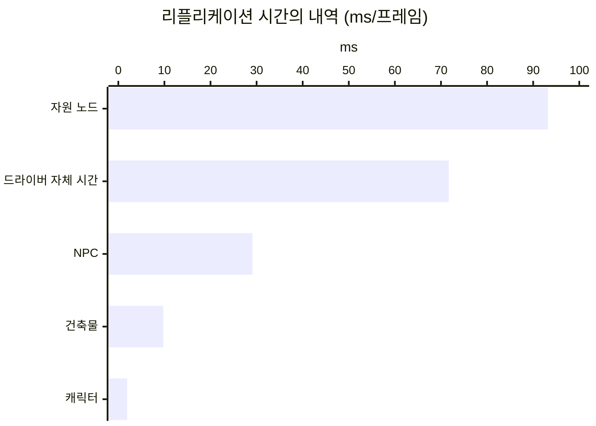

# 5. 테스트베드 확장과 새 기준선

## 요약

1막에서 세 기법을 모두 적용하자 서버에 줄일 비용이 거의 남지 않았다. 2막은 테스트베드에 요소를 더하고 기준선을 새로 잡는다. 기준선은 세 기법을 모두 끈 구성이다.

새 기준선의 서버는 한 프레임에 216ms를 쓴다. 비용의 모양은 1막의 기준선과 같다. CPU는 자원 노드가 가장 많이 쓰고, 대역폭은 NPC가 가장 많이 쓴다.

| 지표 | 새 기준선 |
| --- | --- |
| 서버 프레임 시간 평균 | 216ms(틱 예산의 6.5배) |
| 리플리케이션 시간 | 206ms(서버 프레임 시간의 약 96%) |
| 연결당 송신 대역폭 | 36,000바이트/초 |
| 클라이언트에 존재하는 액터 | 자원 노드 5,001개, NPC 350명, 건축물 500개, 플레이어 8명 |

클라이언트 하나가 위에서 내려다본 화면이다. 초록 점은 자원 노드, 빨간 점은 NPC, 주황 점은 건축물, 파란 점은 다른 플레이어다. 여덟 명이 한곳에 모여 있고, 그 둘레에 건축물과 NPC가 몰려 있다.

수치는 같은 시나리오를 세 번 실행한 중앙값이다. 실행별 값, 계산식, 보정 과정은 [측정 기록](measurements.md)에 있다. "연결"은 서버와 클라이언트 하나 사이의 통신을 뜻한다.

## 무엇을 더했는가: 1막의 최종 구성에는 재료가 남지 않았다

[1막의 마지막 글](../04-update-frequency/README.md)에서 서버 프레임 시간 평균은 13.2ms였다. 틱 예산은 30Hz 서버가 한 프레임에 쓸 수 있는 시간이고, 33.3ms다. 서버는 그 40%만 썼다.

뒤의 기법들이 줄일 비용도 없었다. 플레이어는 서로 150m 넘게 떨어져 있어 만나지 않았다. 인벤토리나 건축물처럼 게임에 흔한 데이터도 없었다.

그래서 다섯 가지를 더했다. 모두 실행 인자로 켠다. 인자를 주지 않으면 1막의 시나리오 그대로다.

| 더한 것 | 무엇인가 | 재료가 되는 글 |
| --- | --- | --- |
| 모이는 배치 | 플레이어 8명이 3m 간격으로 모여 한 변 70m의 정사각형을 돎 | NPC 보간, 지연과 패킷 손실, 송신 우선순위 |
| 플레이어 주변의 NPC | 무리 둘레 40m 안에 NPC 50명을 더 둠. 맵 전체의 300명은 그대로 | NPC 이동의 직렬화 |
| 건축물 | 무리 둘레 80m 안에 움직이지 않는 액터 500개. 1초마다 하나를 허물고 새로 지음 | Consider List, Replication Graph, Iris |
| 상태 값 | NPC와 캐릭터에 드물게 바뀌는 값 8개. 액터마다 평균 5초에 하나가 바뀜 | Push Model |
| 인벤토리 | 캐릭터마다 200칸 배열. 4초마다 맨 앞 칸을 지우고 맨 뒤에 더함 | FastArray |

모인 플레이어 가운데 가장 먼 두 사람도 120m 안에 있다. Net Cull Distance는 서버가 액터를 보내는 거리의 한계이고, 기본값은 150m다. 그래서 거리 판정을 켜도 연결마다 다른 플레이어 일곱 명을 받는다.

채집하는 플레이어의 3인칭 화면이다. 주황 상자가 건축물이고 초록 기둥이 자원 노드다. 건축물은 길 양옆에 서 있고, 멀리 다른 플레이어가 걷는다.

규모는 세 기법을 적용한 구성을 기준으로 정했다. 뒤의 기법마다 줄일 비용이 실행 사이의 흔들림보다 커야 한다. 정한 과정은 측정 기록에 있다.

## 새 기준선: CPU는 자원 노드가, 대역폭은 NPC가 쓴다

기준선은 세 기법을 끈다. 모든 액터를 거리와 상관없이 모든 클라이언트에게 보낸다(Always Relevant). 바뀌지 않는 액터도 서버가 계속 비교한다. NPC는 초당 100번까지 고려한다. 새 액터도 같다.

서버는 프레임마다 모든 액터를 모든 연결에 대해 한 번씩 처리한다. 한 프레임의 처리 횟수는 46,872번이다. 액터 5,859개에 연결 8개를 곱한 값이고, Unreal Insights가 센 횟수와 같다. 처리의 순서는 [기준선 글의 원리](../01-baseline/README.md#원리-서버가-한-프레임에-하는-일)에 있다.

리플리케이션 시간은 서버 프레임 시간의 약 96%다. 그 가운데 자원 노드의 처리가 45%로 가장 크다. 드라이버 자체 시간이 35%로 그다음이다. 드라이버 자체 시간은 네트워크 드라이버가 액터 처리 밖에서 쓰는 시간이다. 1막의 기준선에서는 두 몫이 52%와 37%였다.

대역폭은 다르게 나뉜다. 아래는 클라이언트 하나가 측정 구간 60초에 받은 데이터다.

| 액터 | 받은 비트의 비율 | 받은 횟수 |
| --- | --- | --- |
| NPC | 62.7% | 96,954번 |
| 인벤토리 | 12.8% | 127번 |
| 상태 값 | 2.1% | 4,206번 |
| 플레이어 캐릭터 | 1.9% | 2,216번 |
| 건축물 | 0.03% | 120번 |
| 자원 노드 | 0.003% | 9번 |

자원 노드와 건축물은 CPU를 쓰지만 대역폭은 거의 쓰지 않는다. 서버는 프레임마다 두 액터의 프로퍼티를 비교한다. 값이 바뀌지 않았으면 보내지 않는다. NPC는 계속 움직이므로 프레임마다 보낸다. 1막의 기준선에서도 NPC가 받은 비트의 76%였다.

| 새 요소 | 기준선의 CPU(프레임당) | 기준선의 대역폭 |
| --- | --- | --- |
| 건축물 | 9.77ms(미리 계산한 값 9.85ms) | 0.03% |
| 상태 값 | 6.37ms | 2.1% |
| 인벤토리 | 0.626ms | 12.8% |

새 요소는 기준선에서 작은 몫이다. 자원 노드와 NPC의 비용이 커서 가려진다. 세 기법을 적용하면 그 비용이 줄고 새 요소가 드러난다. 그 구성에서 인벤토리는 받은 비트의 29.4%다.

## 밀집과 분산: 플레이어가 흩어지면 서버가 더 일한다

플레이어가 모이면 여덟 연결이 같은 액터를 받는다. 흩어지면 연결마다 다른 액터를 받는다. 두 배치는 세 기법을 적용한 구성에서 비교했다. 기준선에서는 모든 연결이 모든 액터를 받아 배치의 차이가 드러나지 않는다.

분산 배치는 플레이어 사이를 300m로 벌린다. 무리가 여덟 개가 되고, 건축물과 주변 NPC도 무리마다 생긴다. 연결 하나가 받는 액터의 수는 비슷하다.

| 지표 | 밀집 3m | 분산 300m |
| --- | --- | --- |
| 서버 프레임 시간 평균 | 17.1ms | 27.6ms |
| 연결당 송신 대역폭(8개 연결 평균) | 16,600바이트/초 | 9,740바이트/초 |
| 클라이언트에 존재하는 플레이어 | 8명 | 1명 |
| 월드의 건축물 | 500개 | 4,000개 |

| 밀집 | 분산 |
| --- | --- |
|  |  |

세 기법을 적용한 구성의 같은 시점이다. 분산 배치에서는 파란 점이 없다. 다른 플레이어가 150m 밖에 있다.

분산 배치의 서버 프레임 시간은 밀집보다 62% 길다. 늘어난 시간의 대부분은 드라이버 자체 시간이다. 그 시간이 10.3ms에서 19.7ms가 됐다. 액터의 처리 시간은 거의 같다. 드라이버 자체 시간의 내역은 이 측정으로 나눌 수 없다.

송신 대역폭은 분산 배치가 41% 작다. 다른 플레이어의 캐릭터와 인벤토리를 받지 않기 때문이다. 결과가 배치에 따라 달라지므로, 액터의 밀도가 조건인 글에서는 두 배치를 함께 잰다.

## 배운 것과 한계

- **새 요소는 기준선에서 가려진다.** 자원 노드와 NPC가 리플리케이션 시간의 대부분을 쓴다. 새 요소의 몫은 세 기법을 적용한 뒤에 드러난다.
- **상태 값의 비용은 세 기법을 적용하면 작다.** 프레임당 0.264ms로 실행 사이의 흔들림보다 작다. Push Model 글은 구별되지 않는다는 결과가 될 수 있다.
- **같은 구성도 시간대에 따라 달라진다.** 같은 소스를 두 시간 간격으로 잰 두 묶음이 5% 달랐다. 그래서 비교는 연달아 잰 묶음끼리만 한다.

측정 환경의 한계는 [테스트베드와 측정 방법](../00-testbed/README.md)의 "수치를 어디까지 믿을 수 있는가"에 있다.

**다음 글.** 새 기준선에 1막의 세 기법을 다시 적용한다. 기준선에서 Relevancy, Dormancy, Net Update Frequency까지 네 구성을 연달아 잰다. 1막과 달라진 점, 특히 건축물이 몰려 있을 때 Relevancy와 Dormancy의 몫을 본다.
