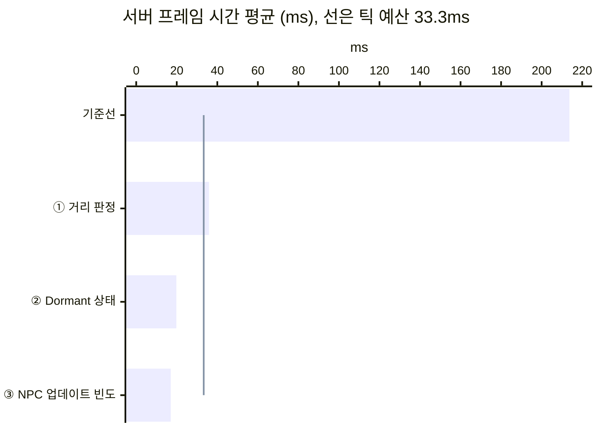

# 6. 1막의 세 최적화를 2막에 다시 적용

## 요약

[테스트베드 확장과 새 기준선](../05-expanded-testbed/README.md)에서 플레이어 여덟 명을 한곳에 모으고 건축물 500개를 더했다. 이 글은 1막의 세 최적화를 같은 순서로 다시 한다. 코드는 바꾸지 않고, 실행 인자로 하나씩 켰다.

| 단계 | 서버에서 바꾼 것 |
| --- | --- |
| ① 거리 판정 | 모든 액터를 항상 보내던 설정(`bAlwaysRelevant`)을 끈다. 서버는 플레이어에게서 150m 안의 액터만 보낸다 |
| ② Dormant 상태 | 자원 노드와 건축물을 Dormant 상태로 둔다. 서버는 이 액터들의 프로퍼티 비교를 멈춘다 |
| ③ NPC 업데이트 빈도 | NPC의 Net Update Frequency를 100에서 10으로 낮춘다 |

세 단계를 모두 거치자 서버 프레임 시간 평균이 214ms에서 17.0ms로 줄었다. 1막과 달라진 것은 단계마다의 몫이다. 거리 판정만으로는 틱 예산 안에 들어오지 못했다. Dormant 상태가 그 구성의 서버 프레임 시간을 45% 더 줄였다.

| 지표 | 기준선 | ① 거리 판정 | ② Dormant 상태 | ③ NPC 업데이트 빈도 |
| --- | ---: | ---: | ---: | ---: |
| 서버 프레임 시간 평균 | 214ms | 35.9ms | 19.8ms | 17.0ms |
| 리플리케이션 시간 | 204ms | 30.9ms | 14.7ms | 12.0ms |
| 연결당 송신 대역폭(바이트/초) | 36,400 | 30,100 | 30,300 | 15,900 |
| 연결당 열린 액터 채널 수 | 5,871 | 695 | 77 | 77 |

| 기준선 | ① 거리 판정 후 |
| --- | --- |
|  |  |

클라이언트 하나가 위에서 내려다본 화면이다. 초록 점은 자원 노드, 빨간 점은 NPC, 주황 점은 건축물이다. 거리 판정을 켜자 먼 자원 노드는 사라졌다. 플레이어 곁의 건축물 500개는 그대로 남았다.

단계는 왼쪽에서 오른쪽으로 하나씩 쌓았다. 수치는 구성마다 세 번 실행한 중앙값이다. 실행별 값, 계산식, 엔진 소스 위치는 [측정 기록](measurements.md)에 있다. "연결"은 서버와 클라이언트 하나 사이의 통신을 뜻한다.

## 문제: 거리 판정을 켜도 건축물은 매 프레임 확인한다

서버는 프레임마다 클라이언트마다 액터를 하나씩 처리한다. 처리는 지난번에 보낸 뒤로 바뀐 것이 있는지 확인하고, 바뀐 것을 보내는 일이다. 액터가 1,000개이고 클라이언트가 8개면 처리 횟수는 프레임마다 8,000번이다.

거리 판정은 먼 액터의 처리를 뺀다. 서버는 플레이어에게서 150m가 넘는 액터를 그 클라이언트에 대해 처리하지 않는다.

1막에서는 플레이어가 맵 곳곳에 흩어져 있었다. 액터 대부분이 플레이어에게서 멀어서, 거리 판정 하나로 서버가 틱 예산 안에 들어왔다. 틱 예산은 30Hz 서버가 한 프레임에 쓸 수 있는 시간이고, 33.3ms다.

2막에서는 여덟 명이 한곳에 모여 있고, 건축물 500개도 그 곁에 있다. 모든 건축물이 모든 플레이어에게 가깝다.

| 거리 판정만 켠 2막의 서버(프레임마다) | 값 |
| --- | --- |
| 처리 횟수 | 4,533번 |
| 그 가운데 건축물 | 3,302번(73%) |
| 서버 프레임 시간 평균 | 35.9ms(틱 예산을 넘음) |

건축물은 짓거나 허물 때만 바뀐다. 서버는 거의 바뀌지 않는 건축물을 확인하느라 틱 예산을 넘긴다.

기준선은 이 글의 다른 구성과 연달아 다시 쟀다. 그래서 [테스트베드 확장과 새 기준선](../05-expanded-testbed/README.md)의 216ms와 조금 다르다.

## 원리: 세 단계는 서로 다른 처리를 뺀다

서버의 일을 줄이려면 처리 횟수를 줄이면 된다. 세 단계는 각자 다른 이유로 처리를 뺀다.

| 단계 | 처리하지 않는 것 | 한 줄로 |
| --- | --- | --- |
| ① 거리 판정 | 플레이어에게서 150m 넘게 떨어진 액터 | 멀면 확인하지 않는다 |
| ② Dormant 상태 | 바뀌지 않는 액터(자원 노드, 건축물) | 바뀌지 않으면 확인하지 않는다 |
| ③ NPC 업데이트 빈도 | 이번 프레임이 차례가 아닌 NPC | 움직이는 것도 매번은 확인하지 않는다 |

엔진은 ①의 판정을 **Relevancy**라고 부른다([Relevancy와 Net Cull Distance](../02-relevancy/README.md)). ②는 **Dormancy** 기능을 쓴다([자원 노드 Dormancy](../03-dormancy/README.md)). ③은 NPC의 **Net Update Frequency** 값을 100에서 10으로 낮춘다([AI NPC Net Update Frequency](../04-update-frequency/README.md)). 서버가 세 검사를 하는 순서는 [기준선 글의 흐름도](../01-baseline/README.md#원리-서버가-한-프레임에-하는-일)에 있다.

어느 단계가 많이 빼는지는 액터가 어디에 있고, 얼마나 자주 바뀌는지에 달려 있다.

| 2막의 액터 | 어디에 있나 | 얼마나 자주 바뀌나 | 빼는 단계 |
| --- | --- | --- | --- |
| 자원 노드 5,001개 | 맵 전체(대부분 멀다) | 채집될 때만 | 대부분 ①, 남은 것은 ② |
| 건축물 500개 | 플레이어 곁(모두 가깝다) | 짓거나 허물 때만 | ② |
| NPC 350명 | 맵 전체와 플레이어 곁 | 계속 움직인다 | 먼 것은 ①, 가까운 것은 ③이 횟수를 줄인다 |

거리 판정을 켠 2막의 서버가 보는 지도다. 왼쪽은 맵 전체이고, 오른쪽은 점선 사각형 안의 400m를 확대했다. 회색 점은 서버가 처리하지 않는 액터다. 자리, 경로, 150m 원, 건축물이 놓이는 반지름은 실제 비율이고, 점의 위치는 예시다.

맵 전체에서 보면 거리 판정은 대부분의 액터를 뺀다. 그러나 가운데를 확대하면 건축물 500개가 모두 원 안에 남는다. 이 건축물은 ②가 뺀다.

**예상.** 기준선에서 건축물 처리는 프레임당 9.61ms였다. 이 비용의 대부분이 ① 뒤에 남고, ②가 0에 가깝게 줄인다. 그래서 ②의 몫이 1막의 17%보다 커야 한다.

## 적용: 실행 인자로 하나씩 켠다

코드는 [테스트베드 확장과 새 기준선](../05-expanded-testbed/README.md)의 것 그대로다. 실행 인자로 세 단계를 끄고 켰다.

| 구성 | 더한 실행 인자 |
| --- | --- |
| 기준선 | `-AlwaysRelevant -NoNodeDormancy -NpcUpdateFrequency 100` |
| ① 거리 판정 | `-NoNodeDormancy -NpcUpdateFrequency 100` |
| ② Dormant 상태 | `-NpcUpdateFrequency 100` |
| ③ NPC 업데이트 빈도 | 없음(세 단계 모두 적용) |

`-AlwaysRelevant`는 자원 노드, NPC, 건축물을 거리와 상관없이 모든 연결에 보낸다. `-NoNodeDormancy`는 자원 노드와 건축물을 Dormant 상태로 두지 않는다. `-NpcUpdateFrequency 100`은 NPC에 엔진 기본값을 준다. 2막의 요소를 켜는 인자는 네 구성에 똑같이 줬다.

네 구성을 세 번씩 연달아 쟀다. 이 시점의 코드는 태그 [`post-06-three-techniques-again`](https://github.com/hon454/ue-dedicated-server-optimization-lab/tree/post-06-three-techniques-again)에 있다.

## 결과

### 처리 횟수가 단계마다 줄었다

| 프레임마다 처리한 횟수 | 기준선 | ① 거리 판정 | ② Dormant 상태 | ③ NPC 업데이트 빈도 |
| --- | ---: | ---: | ---: | ---: |
| 전체 | 46,917 | 4,533 | 423 | 184 |
| 그 가운데 건축물 | 4,000 | 3,302 | 1 | 1 |
| 그 가운데 NPC | 2,800 | 378 | 354 | 115 |

①은 처리 횟수를 10분의 1로 줄였지만 건축물은 거의 그대로 남겼다. ②가 건축물을 뺐고, ③이 NPC의 처리를 3분의 1로 줄였다.

### Dormant 상태의 몫이 1막보다 커졌다

| 단계마다 줄인 서버 프레임 시간 평균 | 1막 | 2막 |
| --- | ---: | ---: |
| ① 거리 판정 | -91% | -83% |
| ② Dormant 상태 | -17% | -45% |
| ③ NPC 업데이트 빈도 | 구별되지 않음 | 구별되지 않음 |

각 값은 바로 앞 구성과 비교한 비율이다. 1막과 2막은 시나리오가 달라서 절댓값은 비교하지 않는다.

거리 판정은 여전히 가장 크게 줄였다. 그러나 2막에서는 Dormant 상태가 남은 시간의 절반 가까이를 줄였다.

### 건축물은 거리 판정이 아니라 Dormant 상태가 뺐다

| 항목 | 예상 | 실제 |
| --- | --- | --- |
| ① 뒤 건축물 처리(프레임당) | 9.61ms에 가깝게 남음 | 6.99ms |
| ② 뒤 건축물 처리(프레임당) | 0에 가깝게 | 0.012ms |
| ②가 줄인 서버 프레임 시간 평균 | 17%보다 크게 | 45% |

① 뒤에도 건축물 처리의 73%가 남았다. 연결 하나가 건축물 413개를 계속 처리했다.

②는 네트워크 드라이버 자체 시간도 6.78ms 줄였다. 이 시간은 액터 채널 밖에서 드라이버가 쓰는 시간이다. 액터는 모든 연결에서 Dormant 상태가 되면 Consider List에서 빠진다. Consider List는 서버가 프레임마다 리플리케이션 대상으로 고려하는 액터의 목록이다. 2막의 건축물은 여덟 연결 모두와 가까워서 이 목록에서 빠진다. 그 몫이 이 감소에 들어 있다고 추정한다.

### 거리 판정은 대역폭을 18%만 줄였다

| 연결 하나 | 기준선 | ① 거리 판정 |
| --- | ---: | ---: |
| 받는 NPC | 350명 | 47명 |
| 서버 프레임(초당) | 4.68 | 27.3 |
| NPC를 보낸 횟수(초당) | 1,640 | 1,270 |

거리 판정은 연결 하나가 받는 NPC를 86% 줄였다. 그런데 서버가 5.8배 자주 돌았다. NPC를 보낸 횟수는 받는 NPC 수와 서버 프레임 수의 곱이다. 그래서 횟수는 23%만 줄었다.

기준선 서버는 너무 느려서 NPC를 드물게 보냈다. 이 18%를 거리 판정의 대역폭 효과로 읽으면 안 된다. 대역폭은 ③이 줄였다. NPC를 보낸 횟수가 3분의 1이 되어 연결당 송신 대역폭이 47% 줄었다.

### NPC 업데이트 빈도의 시간 변화는 구별되지 않았다

③의 세 실행 가운데 하나가 다른 둘보다 3ms쯤 느렸다. 그 실행은 처리 횟수가 다른 둘과 같았고, 모든 타이머가 고르게 느렸다. 그래서 세 실행의 변동 폭이 ② 대비 변화보다 컸다. 이 글의 규칙으로는 구별되지 않는 변화다.

처리 횟수는 분명히 줄었다. NPC의 처리는 3분의 1이 됐다. 그 처리에 쓴 시간은 프레임당 2.69ms에서 0.965ms가 됐다.

① 뒤의 클라이언트 화면에는 건축물 500개와 가까운 자원 노드, NPC만 남았다. ②와 ③을 거쳐도 건축물 500개는 화면에 그대로 있었다.

## 배운 것과 한계

- **같은 최적화라도 몫은 액터가 플레이어와 얼마나 가까운지에 달려 있다.** 플레이어가 모이면 거리로 뺄 수 있는 액터가 준다. 그러면 바뀌지 않는 액터를 Dormant 상태로 두는 일이 중요해진다.
- **거리 판정의 대역폭 수치는 서버 속도에 묶여 있다.** 느린 기준선은 보내는 횟수가 적었다. 서버가 빨라지면 같은 액터를 더 자주 보낸다.
- **세 단계 뒤에 남은 비용의 내역은 아직 모른다.** 리플리케이션 시간의 85%가 네트워크 드라이버 자체 시간이다. 보낸 액터 데이터의 30%는 인벤토리다.

측정 환경의 한계는 [테스트베드와 측정 방법](../00-testbed/README.md)의 "한계"에 있다.

**다음 글.** 1막의 세 최적화로 줄일 수 있는 것은 여기까지다. 다음 글에서는 남은 리플리케이션 시간의 85%가 어디에 쓰이는지 먼저 나눠 본다. 그 뒤로 남은 비용을 겨냥한 새 최적화를 하나씩 다룬다.
