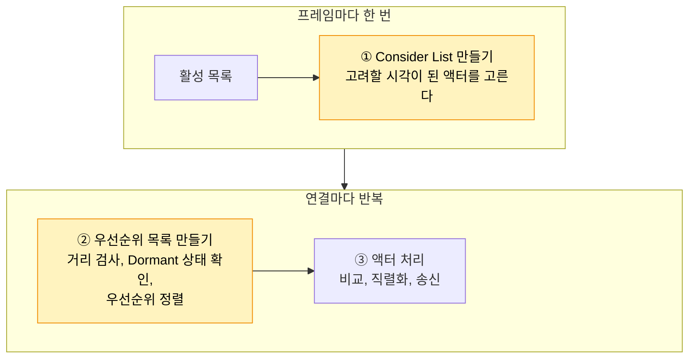
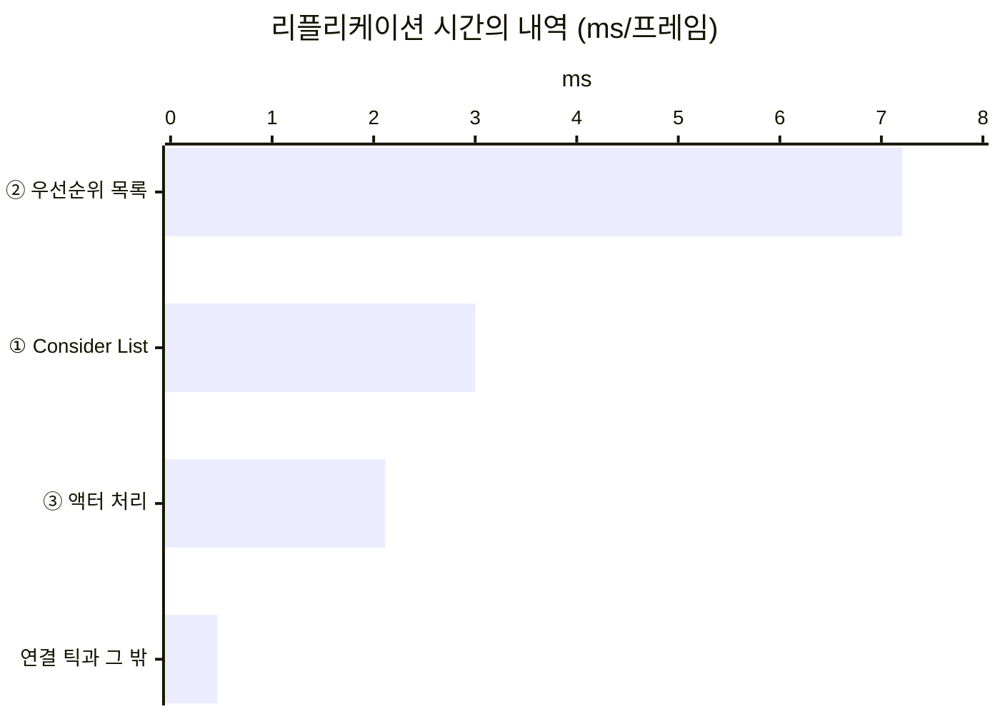

# 7. 네트워크 드라이버 자체 시간 나누기

## 요약

[1막의 세 최적화를 2막에 다시 적용](../06-three-techniques-again/README.md)한 서버에는 리플리케이션 시간 12.8ms가 남았다. 그 86%는 내역을 알 수 없는 시간이었다. 이 글은 최적화를 더하지 않고, 이 시간이 어디에 쓰이는지 나눠 본다.

남은 리플리케이션 시간의 80%는 보내는 일이 아니라 무엇을 보낼지 따지는 일이었다. 서버가 따지는 액터의 93%는 플레이어에게서 먼 자원 노드였다. 자원 노드는 Dormant 상태로 설정되어 있다. 하지만 한 번도 보낸 적 없는 클라이언트에게는 Dormant 상태가 되지 못한다.

| 리플리케이션 시간의 내역(프레임당) | 시간 | 비율 |
| --- | ---: | ---: |
| 연결마다 우선순위 목록 만들기 | 7.21ms | 56.4% |
| Consider List 만들기 | 3.00ms | 23.5% |
| 액터 처리(비교와 직렬화) | 2.11ms | 16.5% |
| 연결 틱과 그 밖 | 0.462ms | 3.6% |


클라이언트 하나가 위에서 내려다본 화면이다. 이 클라이언트에는 자원 노드가 176개 있다. 서버는 자원 노드 4,887개를 프레임마다 따진다.

수치는 구성마다 세 번 실행한 중앙값이다. 실행별 값, 계산식, 엔진 소스 위치는 [측정 기록](measurements.md)에 있다. "연결"은 서버와 클라이언트 하나 사이의 통신을 뜻한다.

## 문제: 남은 시간의 86%에 이름이 없다

Unreal Insights는 서버 시간을 타이머로 나눠 보여 준다. 타이머는 코드의 한 구간에 이름을 붙여 잰 시간이다. 이 시리즈는 `GameNetDriver` 타이머의 시간을 리플리케이션 시간으로 부른다.

`GameNetDriver` 안에는 액터 클래스마다 타이머가 있다. 서버가 그 클래스의 액터를 처리한 시간이다. 클래스 타이머 밖에 남는 시간을 네트워크 드라이버 자체 시간이라고 부른다.

| 세 최적화 뒤의 서버(프레임당) | 시간 |
| --- | ---: |
| 리플리케이션 시간 | 12.8ms |
| 클래스 타이머의 합 | 1.83ms |
| 네트워크 드라이버 자체 시간 | 10.9ms(86%) |

기본 트레이스에는 자체 시간을 더 나누는 타이머가 없다. [자원 노드 Dormancy](../03-dormancy/README.md)는 이 시간이 자원 노드 때문이라고 엔진 소스로 추정했다. 이 글은 그 추정을 직접 잰다.

## 원리: 서버는 보내기 전에 두 번 따진다

서버는 리플리케이트하는 액터를 활성 목록에 둔다. 활성 목록은 서버가 아직 보낼지 따져야 하는 액터의 목록이다. 서버는 프레임마다 이 목록에서 시작해 다음 순서로 일한다.



노란 칸이 따지는 일이다. ①은 활성 목록 전체를 한 번 돈다. ②는 Consider List 전체를 연결마다 다시 돈다. Consider List는 이번 프레임에 리플리케이션 대상으로 고려할 액터의 목록이다.

자원 노드는 프레임마다 Consider List에 들어간다. 자원 노드의 Net Update Frequency가 엔진 기본값 100이기 때문이다. 고려 간격 0.01초가 프레임 간격 0.033초보다 짧다.

액터가 활성 목록에서 빠지려면 모든 연결에서 Dormant 상태여야 한다. Dormant 상태는 연결마다 따로 정해진다. 엔진은 그 클라이언트에 한 번 보낸 액터만 그 연결에서 Dormant 상태로 만든다. 처음 보낼 때 액터 채널이 열리기 때문이다. 액터 채널은 액터 하나의 데이터가 클라이언트 하나로 가는 통로다.

| 자원 노드의 자리 | 채널이 열린 연결 | Dormant 상태인 연결 | 활성 목록 |
| --- | ---: | ---: | --- |
| 플레이어 무리 곁(150m 안) | 8개 | 8개 | 빠진다 |
| 무리에서 먼 곳 | 0개 | 0개 | 남는다 |

두 경우만 적었다. 일부 연결에서만 Dormant 상태인 자원 노드도 활성 목록에 남는다.

2막에서는 플레이어 여덟 명이 한곳에 모여 있다. 무리에서 먼 자원 노드는 어느 클라이언트에도 보낸 적이 없다. 그래서 어느 연결에서도 Dormant 상태가 되지 못하고 활성 목록에 남는다.

엔진이 먼 액터를 남겨 두는 데는 이유가 있다. 누군가 다가오면 그때 처음 보내야 한다. 서버는 그 순간을 알려고 ②에서 매 프레임 거리를 검사한다.

**예상.** 활성 목록이 먼 자원 노드로 차 있다면 ①과 ②가 자체 시간의 대부분을 차지한다. 자원 노드만 절반으로 줄이면 두 단계의 시간도 활성 목록 길이만큼 준다. 이때 활성 목록은 5,272개에서 2,835개가 된다. 두 단계의 시간도 54%가 된다.

## 측정: 타이머를 더 켜고 활성 목록을 셌다

이 글은 서버의 동작을 바꾸지 않는다. 세 가지를 더해 쟀다.

첫째, 엔진 코드의 stat을 타이머로 기록했다. stat은 엔진 곳곳에 이미 있는 시간 측정 구간이다. 서버에 `-statnamedevents` 인자를 주면 stat도 Insights 타이머로 남는다. 그러면 자체 시간이 ①\~③의 단계로 나뉜다.

이 인자는 이벤트를 더 기록해서 서버 프레임 시간을 2.0% 늘렸다. 그래서 이 실행의 값은 비율로 읽는다.

둘째, 측정이 끝난 뒤 서버가 활성 목록의 액터를 클래스별로 센다.

```cpp
// LabMetricsSubsystem.cpp의 LogNetworkObjects: 측정이 끝난 뒤 한 번 센다(줄임)
const FNetworkObjectList& List = NetDriver->GetNetworkObjectList();
for (const TSharedPtr<FNetworkObjectInfo>& Info : List.GetActiveObjects())
{
    if (const AActor* Actor = Info->WeakActor.Get())
    {
        ++Counts.FindOrAdd(Actor->GetClass()->GetFName()).Active;
    }
}
// 모든 연결에서 Dormant 상태라 활성 목록에서 빠진 액터도 같은 방식으로 센다
// (List.GetDormantObjectsOnAllConnections())
```

셋째, 자원 노드만 절반으로 줄인 구성을 더 쟀다. 예상을 확인하는 대조 실행이다.

| 구성 | 더한 실행 인자 |
| --- | --- |
| 기본 트레이스 | 없음 |
| 타이머를 더 켠 실행 | `-StatNamedEvents` |
| 자원 노드 절반 | `-StatNamedEvents -Nodes 2500` |

세 구성 모두 [1막의 세 최적화를 2막에 다시 적용](../06-three-techniques-again/README.md)의 최종 구성이다. 구성마다 세 번 연달아 쟀다. 이 시점의 코드는 태그 [`post-07-net-driver-breakdown`](https://github.com/hon454/ue-dedicated-server-optimization-lab/tree/post-07-net-driver-breakdown)에 있다.

## 결과

### 리플리케이션 시간의 80%는 따지는 일이었다



자체 시간은 거의 모두 이름을 얻었다. 단계에 속하지 않고 남은 자체 시간은 0.3%다. ①과 ②를 합하면 리플리케이션 시간의 79.9%다.

실제로 보내는 일은 작다. 액터를 비교하고 직렬화하는 ③이 16.5%다. 소켓 송신은 1.2%다.

[Always Relevant 기준선](../01-baseline/README.md)은 거리 검사가 값싸다고 했다. 한 번은 값싸다. 그러나 서버는 자원 노드 4,887개를 연결마다 검사한다. 연결 8개를 합하면 프레임마다 39,096번이다.

### 활성 목록의 93%가 자원 노드였다

| 활성 목록의 액터 | 개수 |
| --- | ---: |
| 자원 노드 | 4,887 |
| NPC | 350 |
| 플레이어마다 하나인 액터와 그 밖 | 35 |
| 합계 | 5,272 |

자원 노드 5,001개 가운데 모든 연결에서 Dormant 상태가 된 것은 114개뿐이다. 플레이어 곁의 건축물은 500개 가운데 499개가 활성 목록에서 빠졌다. 같은 Dormant 상태 설정이 가까운 액터에는 통하고 먼 액터에는 통하지 않았다.

### 자원 노드를 절반으로 줄이자 따지는 시간도 절반쯤 됐다

| 자원 노드를 5,001개에서 2,501개로 | 남은 비율 |
| --- | ---: |
| 활성 목록 | 53.8% |
| 따지는 두 단계(①+②), 예상 | 53.8% |
| 따지는 두 단계(①+②), 실제 | 51.2% |

실행마다 서버의 빠르기가 조금씩 달랐다. 그래서 따지는 시간을 ③의 시간으로 나눈 값을 비교했다. ③은 자원 노드 수와 상관없다.

예상과 실제가 가깝다. 자원 노드 하나를 따지는 비용은 다른 액터와 크게 다르지 않았다. 이 비례로 계산하면 따지는 시간의 94\~98%가 자원 노드의 몫이다.

자원 노드를 절반으로 줄인 서버는 서버 프레임 시간이 32.0% 짧았다. 줄인 시간은 거의 모두 따지는 일에서 나왔다.

### 리플리케이션 밖의 2.38ms는 틱이었다

타이머를 더 켜자 리플리케이션 시간 밖의 `TickCompletionEvents`도 나뉘었다. [1막의 세 최적화를 2막에 다시 적용](../06-three-techniques-again/README.md)에서 정체를 몰랐던 시간이다. 이 시간은 액터와 컴포넌트의 틱이었다. NPC 이동과 물리가 69%를 차지했다. 리플리케이션의 주제가 아니라서 이 글에서는 다루지 않는다.

이 글은 서버의 동작을 바꾸지 않았다. 클라이언트 화면은 [1막의 세 최적화를 2막에 다시 적용](../06-three-techniques-again/README.md)의 최종 구성과 같다.

## 배운 것과 한계

- **값싼 검사도 횟수가 크면 비싸다.** 거리 검사 한 번은 짧다. 프레임마다 4만 번이면 리플리케이션 시간의 절반을 넘는다.
- **Dormant 상태는 먼 액터를 재우지 못한다.** Dormant 상태는 연결마다 정해지고, 한 번 보낸 액터만 된다. 플레이어가 모이면 먼 액터는 끝까지 활성 목록에 남는다.
- **따지는 시간을 클래스별로 나누는 타이머는 없다.** 자원 노드의 몫은 대조 실행의 비례로 계산했다. 타이머를 더 켠 실행은 서버를 조금 느리게 해서 비율로만 읽었다.

측정 환경의 한계는 [테스트베드와 측정 방법](../00-testbed/README.md)의 "한계"에 있다.

**다음 글.** 남은 리플리케이션 시간을 줄이려면 먼 자원 노드를 활성 목록에 두지 않아야 한다. 다음 글에서는 액터를 Consider List에서 빼는 방법을 다룬다.
