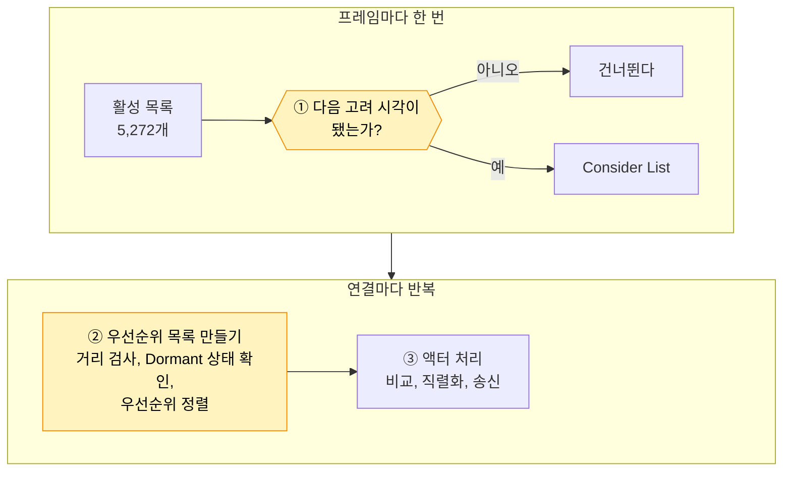
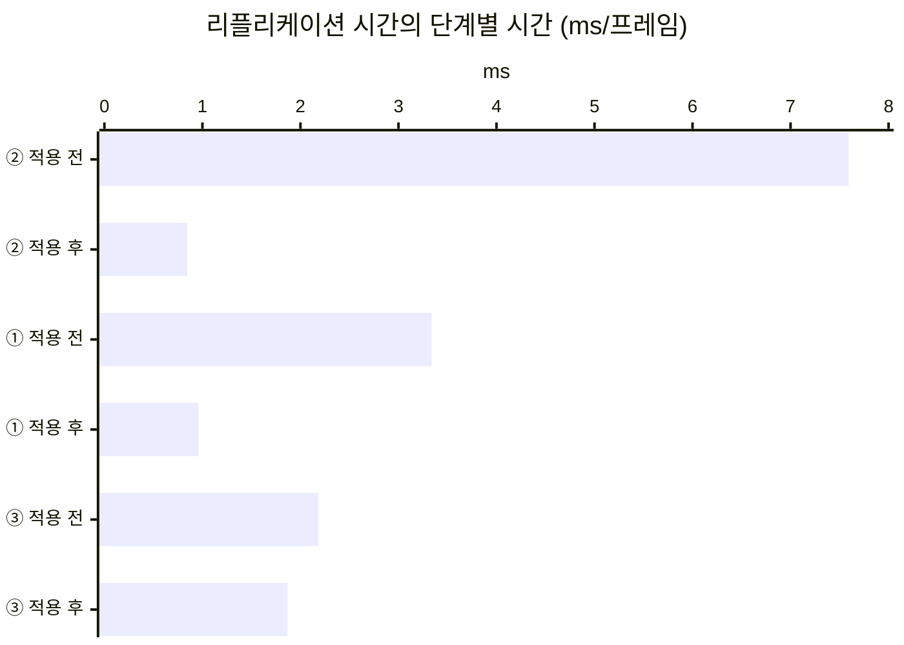

# 8. 자원 노드의 Net Update Frequency 낮추기

## 요약

[네트워크 드라이버 자체 시간 나누기](../07-net-driver-breakdown/README.md)에서 남은 리플리케이션 시간의 80%는 무엇을 보낼지 따지는 일이었다. 따지는 대상은 대부분 플레이어에게서 먼 자원 노드였다. 이 글은 자원 노드의 Net Update Frequency를 100에서 2로 낮춘다.

서버가 프레임마다 따지는 액터는 약 9분의 1이 됐다. 리플리케이션 시간은 70% 줄었고 서버 프레임 시간은 절반이 됐다. 클라이언트가 받는 데이터와 화면은 그대로였다.

| 지표 | 적용 전 | 적용 후 | 변화 |
| --- | --- | --- | --- |
| 서버 프레임 시간 평균 | 18.3ms | 8.90ms | -51.5% |
| 리플리케이션 시간 | 13.3ms | 3.93ms | -70.5% |
| 프레임마다 Consider List에 드는 액터 | 3,887개 | 413개 | -89.4% |
| 연결당 송신 대역폭 | 16,600바이트/초 | 16,600바이트/초 | 그대로 |

| 적용 전(빈도 100) | 적용 후(빈도 2) |
| --- | --- |
|  |  |

클라이언트 하나가 위에서 내려다본 화면이다. 두 화면 모두 자원 노드가 176개 있다. 서버가 따지는 양은 크게 줄었지만 클라이언트가 가진 것은 같다.

수치는 구성마다 세 번 실행한 중앙값이다. 실행별 값, 계산식, 엔진 소스 위치는 [측정 기록](measurements.md)에 있다. "연결"은 서버와 클라이언트 하나 사이의 통신을 뜻한다.

## 문제: 먼 자원 노드가 프레임마다 Consider List에 든다

서버는 리플리케이트하는 액터를 활성 목록에 둔다. 활성 목록은 서버가 아직 보낼지 따져야 하는 액터의 목록이다. 서버는 프레임마다 활성 목록에서 Consider List를 만든다. Consider List는 이번 프레임에 리플리케이션 대상으로 고려할 액터의 목록이다.

[직전 글](../07-net-driver-breakdown/README.md)은 먼 자원 노드가 활성 목록에 남는 이유를 보였다. 한 번도 보낸 적 없는 클라이언트에게는 Dormant 상태가 되지 못한다. 이 글은 서버가 Consider List에 든 액터 수를 프레임마다 세는 기록을 더했다.

| 세 최적화 뒤의 서버(프레임당) | 액터 수 |
| --- | ---: |
| 활성 목록 | 5,272개 |
| 그 가운데 자원 노드 | 4,887개 |
| Consider List | 3,887개 |

활성 목록의 4분의 3이 프레임마다 Consider List에 든다. 그 대부분은 자원 노드라고 계산된다. 자원 노드의 Net Update Frequency가 엔진 기본값 100이기 때문이다.

서버는 Consider List를 연결 8개마다 다시 돈다. 연결마다 거리 검사와 Dormant 상태 확인, 우선순위 정렬을 한다. 이 일이 리플리케이션 시간의 절반을 넘었다.

## 원리: 고려하는 간격을 늘려 Consider List에서 뺀다

**Net Update Frequency**는 서버가 액터를 리플리케이션 대상으로 고려하는 빈도다. [AI NPC Net Update Frequency](../04-update-frequency/README.md)에서 NPC의 이 값을 낮췄다. 그때는 보내는 횟수를 줄여 대역폭을 겨냥했다. 이번에는 따지는 횟수를 줄여 CPU를 겨냥한다.



노란 칸이 이 글이 줄이는 곳이다. 서버는 액터마다 다음 고려 시각을 둔다. ①에서 그 시각이 되지 않은 액터는 건너뛴다. 건너뛴 액터는 ②와 ③에 가지 않는다.

다음 고려 시각은 "1 ÷ 빈도"초 뒤에 난수를 더한 시각이다. 난수는 0에서 한 프레임 시간 사이다. 서버는 30Hz로 돌아서 프레임 간격이 33.3ms다.

| 빈도 | 다음 고려 시각까지 | 다시 고려하는 프레임 |
| --- | --- | --- |
| 100(엔진 기본값) | 10\~43ms | 평균 1.3프레임마다 |
| 2 | 500\~533ms | 16프레임마다 |

값 2는 엔진의 다른 기본값에서 가져왔다. Adaptive Net Update Frequency는 오래 보내지 않은 액터의 빈도를 줄이는 엔진 기능이다. 이 기능은 기본으로 꺼져 있다. 이 기능이 빈도를 내리는 하한의 기본값이 2다.

**활성 목록에서는 빠지지 않는다.** 건너뛰는 판단도 ①이 활성 목록을 돌며 한다. 그래서 ①은 줄지만 0이 되지는 않는다. 건너뛰는 비용은 아직 재 본 적이 없다.

**대가는 처음 보이기까지의 지연이다.** 플레이어가 다가와도 서버는 그 자원 노드를 최대 16프레임 뒤에 고려한다. 16프레임은 약 0.53초다. 달리는 플레이어는 그동안 약 5.3m를 간다. 자원 노드가 보이기 시작하는 거리는 150m다.

채집으로 바뀐 상태는 늦으면 안 된다. 그래서 상태를 바꿀 때 다음 고려 시각을 지금으로 당긴다.

**예상.** 프레임마다 Consider List에 드는 자원 노드는 약 3,760개에서 약 305개가 된다. ②는 Consider List 길이에 비례하므로 7.2ms에서 약 0.85ms가 된다. ①이 얼마나 남을지는 재 봐야 안다.

## 적용: 빈도를 낮추고 상태를 바꿀 때 당긴다

```diff
 // Source/DSOptLab/LabResourceNode.cpp
 ALabResourceNode::ALabResourceNode()
 {
 	// ...
 	if (Config.bNodeDormancy)
 	{
 		NetDormancy = DORM_DormantAll;
 	}
+
+	// -LabNodeUpdateFrequency=2. 주지 않으면 엔진 기본값 100이다.
+	SetNetUpdateFrequency(Config.NodeUpdateFrequency);
 	// ...
 }

 void ALabResourceNode::Harvest()
 {
 	// ...
-	FlushNetDormancy();
+	WakeForChange();
 	--Health;
 	// ...
 }
+
+void ALabResourceNode::WakeForChange()
+{
+	// 빈도를 낮춘 구성에서는 다음 고려 시각도 지금으로 당긴다.
+	// ForceNetUpdate는 Dormant 상태면 FlushNetDormancy도 부른다.
+	if (FLabServerConfig::Get().NodeUpdateFrequency < FLabServerConfig().NodeUpdateFrequency)
+	{
+		ForceNetUpdate();
+	}
+	else
+	{
+		FlushNetDormancy();
+	}
+}
```

되살아날 때(`Respawn`)도 같은 함수를 부른다. 전후 구성은 실행 인자 하나로 바꾼다.

| 구성 | 더한 실행 인자 |
| --- | --- |
| 적용 전 | 없음 |
| 적용 후 | `-NodeUpdateFrequency 2` |

두 구성 모두 [1막의 세 최적화를 2막에 다시 적용](../06-three-techniques-again/README.md)의 최종 구성에서 출발한다. 구성마다 세 번 연달아 쟀다. ①\~③을 나누는 타이머를 켠 실행도 두 구성에서 세 번씩 쟀다. 그 실행의 값은 서로만 비교한다. 이 시점의 코드는 태그 [`post-08-node-update-frequency`](https://github.com/hon454/ue-dedicated-server-optimization-lab/tree/post-08-node-update-frequency)에 있다.

## 결과

### Consider List와 ②는 예상대로 줄었다

| 항목(프레임당) | 적용 전 | 예상 | 실제 |
| --- | ---: | ---: | ---: |
| Consider List에 드는 액터 | 3,887개 | 약 433개 | 413개 |
| ② 우선순위 목록 만들기 | 7.59ms | 약 0.85ms | 0.845ms |
| ① Consider List 만들기 | 3.34ms | 모름 | 0.959ms |

예상은 자원 노드 약 305개에 다른 액터를 더한 값이다. 다른 액터 약 128개는 적용 전의 값에서 계산했다. ②는 Consider List가 줄어든 만큼 줄었다. 활성 목록은 5,272개로 그대로였다.



타이머를 더 켠 실행의 값이다. 줄어든 리플리케이션 시간의 96%가 ①과 ②였다.

### 남은 것: 건너뛰는 비용과 실제로 보내는 일

①은 71% 줄었지만 0.959ms가 남았다. 서버는 여전히 활성 목록 5,272개를 프레임마다 돈다. 두 구성의 값으로 나눠 계산하면 건너뛰는 액터 하나는 약 0.13µs다. 고려하는 액터 하나의 약 6분의 1이다. 남은 ①의 약 3분의 2가 건너뛰는 자원 노드의 몫이다.

이제 리플리케이션 시간에서 가장 큰 단계는 ③이다. ③은 NPC와 플레이어 캐릭터를 비교하고 직렬화하는 일이다. 리플리케이션 시간의 46%를 차지한다.

③도 14% 줄었다. 처리한 액터 수는 같았다. 클래스마다 처리 시간이 비슷한 비율로 줄었다. 원인은 확인하지 않았다. 이 글은 ③의 변화를 이 설정의 효과로 세지 않는다.

### 클라이언트 화면은 그대로다

연결당 송신 대역폭과 열린 액터 채널 수는 바뀌지 않았다. 서버가 보내는 것은 같고, 보낼지 따지는 횟수만 줄었다. 내려다보기 화면의 자원 노드 수도 176개로 같았다.

채집도 그대로 보였다. 채집하는 클라이언트의 화면에서 검증용 자원 노드는 30초에 있고 45초에 고갈되어 사라졌다. 두 구성에서 같았다. 처음 보이기까지의 지연은 화면으로 재지 않았다. 계산으로는 150m 밖에서 최대 5.3m다.

## 배운 것과 한계

- **Consider List에서 빼는 것과 활성 목록에서 빼는 것은 다르다.** 빈도를 낮추면 ②는 거의 사라진다. 하지만 건너뛰는 판단을 위해 ①은 활성 목록 전체를 계속 돈다.
- **Net Update Frequency는 CPU를 줄이는 설정이기도 하다.** NPC에서는 보내는 횟수를 줄여 대역폭이 줄었다. 자원 노드는 거의 보내지 않아서 따지는 횟수만 줄었고 CPU가 줄었다.
- **값 하나만 쟀다.** 값 2만 측정했고 처음 보이기까지의 지연은 화면으로 확인하지 않았다. ③이 함께 줄어든 원인도 모른다.

측정 환경의 한계는 [테스트베드와 측정 방법](../00-testbed/README.md)의 "한계"에 있다.

**다음 글.** 이제 리플리케이션 시간에서 가장 큰 것은 실제로 보내는 일이다. 플레이어 캐릭터의 인벤토리는 보낸 액터 데이터의 약 30%다. 다음 글에서는 인벤토리를 일반 배열에서 FastArray로 바꿔 비교한다.
