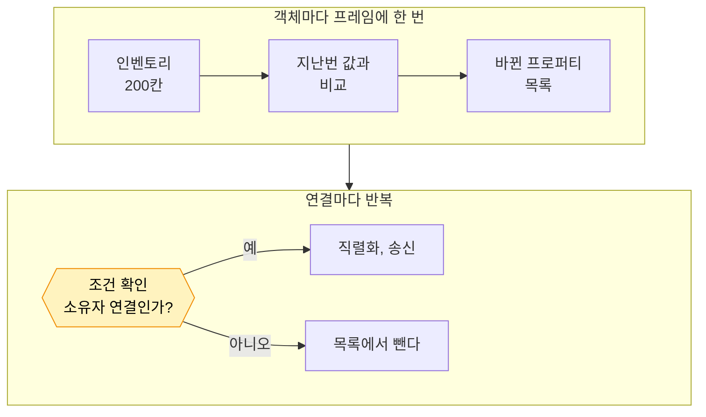
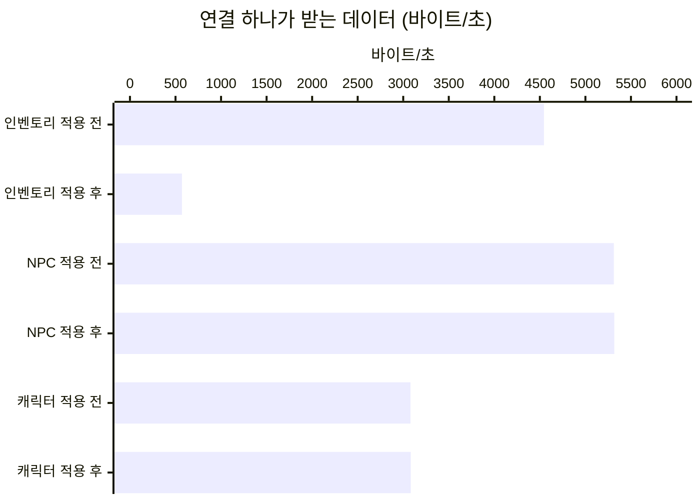

# 9. 인벤토리를 소유자에게만 보내기

## 요약

[자원 노드의 Net Update Frequency 낮추기](../08-node-update-frequency/README.md) 뒤에도 연결 하나가 받는 데이터의 28.6%는 인벤토리였다. 연결마다 여덟 플레이어의 인벤토리를 모두 받았다. 이 글은 인벤토리의 칸을 그 플레이어의 연결에만 보내게 한다.

연결당 송신 대역폭이 25% 줄었다. 줄어든 몫은 거의 모두 인벤토리였다. 서버 프레임 시간은 구별되지 않았다.

| 지표 | 적용 전 | 적용 후 | 변화 |
| --- | --- | --- | --- |
| 연결당 송신 대역폭 | 15,900바이트/초 | 11,800바이트/초 | -25.4% |
| 그 가운데 인벤토리 | 4,540바이트/초 | 571바이트/초 | -87.4% |
| 초당 패킷 수 | 35.5개 | 30.5개 | -14.2% |
| 서버 프레임 시간 평균 | 8.84ms | 8.77ms | 구별되지 않음 |

| 적용 전 | 적용 후 |
| --- | --- |
|  |  |

클라이언트 하나의 화면 왼쪽 아래에 그린 인벤토리 패널이다. 왼쪽 큰 격자가 자기 인벤토리이고, 오른쪽 일곱 격자가 다른 플레이어의 인벤토리다. 칸 색은 아이템 번호다. 이 클라이언트에서 값이 바뀐 칸은 잠깐 흰색이 된다. 적용 후에는 다른 플레이어의 격자가 회색이다. 받지 못했다는 뜻이다.

수치는 구성마다 세 번 실행해 중앙값인 실행에서 읽었다. 실행별 값, 계산식, 엔진 소스 위치는 [측정 기록](measurements.md)에 있다. "연결"은 서버와 클라이언트 하나 사이의 통신을 뜻한다.

## 문제: 연결마다 여덟 플레이어의 인벤토리를 받는다

플레이어 캐릭터 8개는 인벤토리를 하나씩 가진다. 인벤토리는 200칸이고, 칸 하나는 아이템 번호와 수량이다. 서버는 0.5초마다 인벤토리 하나를 돌아가며 바꾼다. 맨 앞 칸을 지우고 맨 뒤에 새 칸을 더한다. 그래서 인벤토리 하나는 4초마다 바뀐다.

플레이어 여덟 명은 한곳에 모여 서로 150m 안에 있다. 그래서 연결마다 여덟 캐릭터를 모두 받는다. 서버는 인벤토리를 조건 없이 리플리케이트했다. 연결 하나가 여덟 인벤토리를 모두 받았다.

| 연결 하나가 받는 데이터(적용 전) | 바이트/초 | 비율 |
| --- | ---: | ---: |
| NPC | 5,310 | 33.5% |
| 인벤토리 | 4,540 | 28.6% |
| 플레이어 캐릭터 | 3,080 | 19.4% |
| 그 밖 | 2,930 | 18.5% |

인벤토리는 NPC 다음으로 크다. 앞 칸을 지우면 뒤의 칸이 한 칸씩 당겨진다. 서버는 배열을 같은 자리끼리 비교해서, 당겨진 칸을 모두 바뀐 칸으로 본다. 그래서 바뀔 때마다 200칸을 다시 보낸다. 한 번에 약 18,200비트다.

그런데 클라이언트는 다른 플레이어의 인벤토리를 쓰지 않는다. 화면에 보이는 것은 자기 인벤토리뿐이다.

## 원리: 프로퍼티마다 받을 연결을 고른다

**리플리케이션 조건**은 프로퍼티를 어느 연결에 보낼지 정하는 값이다. 프로퍼티를 리플리케이트하도록 등록할 때 함께 적는다. `COND_OwnerOnly`는 액터의 소유자 연결에만 보내는 조건이다. 캐릭터의 소유자 연결은 그 캐릭터를 조종하는 플레이어의 연결이다.



노란 칸이 이 글이 바꾸는 곳이다. 서버는 프로퍼티 비교를 객체마다 프레임에 한 번 한다. 그 결과를 모든 연결이 함께 쓴다. 조건은 그 뒤에 연결마다 확인한다. 조건이 맞지 않는 연결에서는 바뀐 목록에서 그 프로퍼티를 뺀다.

그래서 조건은 보내는 바이트를 줄이지만 비교는 줄이지 않는다. 직렬화는 소유자 연결에서만 한다.

**대가는 게임 규칙이다.** 다른 플레이어는 이 인벤토리를 볼 수 없다. 남의 인벤토리를 보여 주는 게임이라면 이 조건을 쓸 수 없다. 이 테스트베드의 클라이언트는 자기 인벤토리만 쓴다.

**예상.** 연결 하나가 받는 인벤토리는 여덟에서 하나가 된다. 인벤토리는 약 570바이트/초가 된다. 지금의 8분의 1이다. 연결당 송신 대역폭은 약 25% 줄어든다. 서버 프레임 시간은 거의 그대로일 것이다. 인벤토리를 리플리케이트하는 시간이 프레임의 2%가 되지 않기 때문이다.

## 적용: 프로퍼티를 등록할 때 조건을 고른다

```diff
 // Source/DSOptLab/LabInventoryComponent.cpp
 void ULabInventoryComponent::GetLifetimeReplicatedProps(TArray<FLifetimeProperty>& OutLifetimeProps) const
 {
 	Super::GetLifetimeReplicatedProps(OutLifetimeProps);
-	DOREPLIFETIME(ULabInventoryComponent, Items);
+
+	// 클래스마다 한 번 불리고 서버와 클라이언트에서 모두 돈다. 인자는 서버에만 주므로 클라이언트에서는 COND_None이다.
+	// 조건은 보내는 쪽(서버)이 연결마다 바뀐 목록을 거르는 데만 쓴다(RepLayout.cpp의 FilterChangeListToActive).
+	FDoRepLifetimeParams Params;
+	Params.Condition = FLabServerConfig::Get().bInventoryOwnerOnly ? COND_OwnerOnly : COND_None;
+	DOREPLIFETIME_WITH_PARAMS(ULabInventoryComponent, Items, Params);
 }
```

조건은 서버의 실행 인자로 고른다. 전후 구성은 실행 인자 하나로 바꾼다.

| 구성 | 더한 실행 인자 |
| --- | --- |
| 적용 전 | 없음 |
| 적용 후 | `-InventoryOwnerOnly` |

두 구성 모두 [자원 노드의 Net Update Frequency 낮추기](../08-node-update-frequency/README.md)의 최종 구성에서 출발한다. 구성마다 세 번 연달아 쟀다. 요약의 인벤토리 패널은 이 글을 위해 클라이언트에 더한 화면이다. 수치를 쓰지 않는 실행에서만 그렸다. 이 시점의 코드는 태그 [`post-09-inventory-owner-only`](https://github.com/hon454/ue-dedicated-server-optimization-lab/tree/post-09-inventory-owner-only)에 있다.

## 결과

### 줄어든 것은 인벤토리뿐이다

| 항목(연결 하나) | 적용 전 | 예상 | 실제 |
| --- | ---: | ---: | ---: |
| 인벤토리(바이트/초) | 4,540 | 약 570 | 571 |
| 연결당 송신 대역폭(바이트/초) | 15,900 | 약 11,900 | 11,800 |
| 인벤토리를 받은 횟수(60초) | 127번 | 22번 | 22번 |

자기 인벤토리는 60초에 15번 바뀌었다. 나머지 7번은 채집으로 한 칸의 수량이 늘어난 것이다.



줄어든 송신량의 99%가 인벤토리였다. NPC와 플레이어 캐릭터는 그대로였다. 초당 패킷 수도 14% 줄었다. 인벤토리 한 번은 패킷 하나에 다 들어가지 않아 여러 패킷으로 나뉘어 갔다. 그 패킷이 사라진 것으로 추정한다. 패킷 그래프의 전후 캡처는 측정 기록에 있다.

### 서버 프레임 시간은 구별되지 않았다

서버 프레임 시간 평균은 8.84ms에서 8.77ms가 됐다. 이 차이는 같은 구성의 세 실행 사이의 차이보다 작았다. 리플리케이션 시간도 3.91ms에서 3.89ms로 거의 같았다.

줄어든 것은 플레이어 캐릭터를 직렬화하는 시간뿐이다. 프레임당 0.537ms에서 0.480ms가 됐다. 비교는 그대로이고 다른 연결의 직렬화만 빠졌기 때문이다.

### 남은 것: 소유자는 여전히 200칸을 받는다

적용 후 영상에서도 자기 격자는 바뀔 때마다 통째로 흰색이 된다. 자기 인벤토리는 여전히 바뀔 때마다 200칸을 받는다. 한 번에 약 18,200비트로 적용 전과 같다.

### 클라이언트 화면

다른 플레이어의 인벤토리는 더 이상 받지 않는다. 패널에는 "0 of 7 received"가 뜬다. 화면 글자의 다른 플레이어 칸 수는 1,400에서 0이 됐다. 자기 인벤토리는 그대로 바뀌어 화면에 보였다. 열린 액터 채널 수는 77로 같았다. 캐릭터는 그대로 받고 그 안의 인벤토리 칸만 받지 않는다.

## 배운 것과 한계

- **조건은 보내는 양을 줄이고 비교는 줄이지 않는다.** 비교는 객체마다 한 번이고, 조건은 그 뒤에 연결마다 확인한다. CPU를 줄이려면 비교 자체를 바꿔야 한다.
- **효과는 플레이어가 모여 있을 때 크다.** 흩어진 플레이어의 캐릭터는 150m 밖이라 원래 보내지 않는다. 이 테스트베드는 여덟 명이 한곳에 모여 있어 연결마다 일곱 인벤토리를 덜 받았다. 흩어진 배치에서는 재지 않았다.
- **누가 무엇을 아는가는 게임 규칙이다.** 이 글은 다른 플레이어가 인벤토리를 쓰지 않는 게임을 가정했다.

측정 환경의 한계는 [테스트베드와 측정 방법](../00-testbed/README.md)의 "한계"에 있다.

**다음 글.** 소유자는 여전히 4초마다 200칸을 받는다. 앞 칸 하나를 지웠을 뿐인데 칸이 당겨져 모두 바뀐 것이 되기 때문이다. 다음 글에서는 인벤토리를 FastArray로 바꿔, 바뀐 칸만 보내게 한다.
