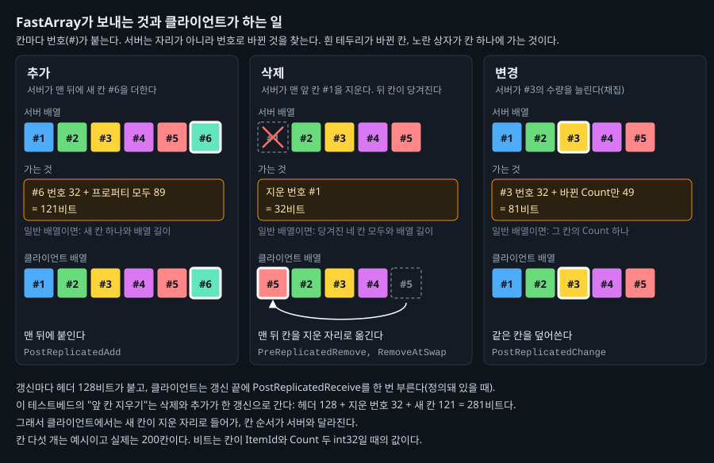
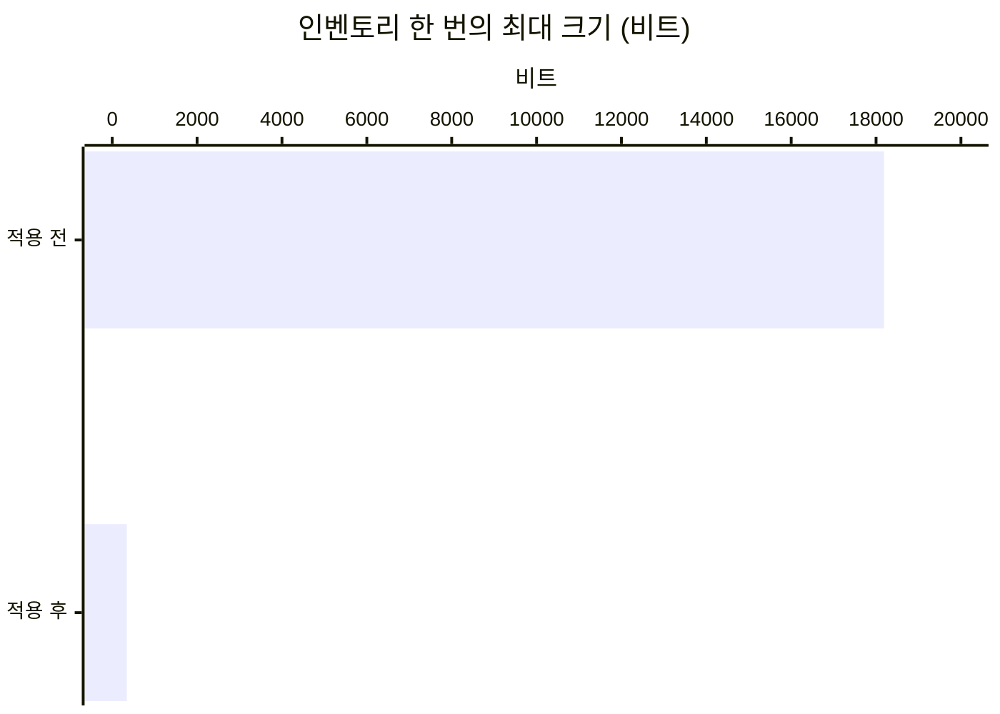

# 10. 인벤토리를 FastArray로 보내기

## 요약

[인벤토리를 소유자에게만 보내기](../09-inventory-owner-only/README.md) 뒤에도 소유자는 인벤토리가 바뀔 때마다 200칸을 다시 받았다. 이 글은 인벤토리 배열을 FastArray로 바꾼다. 서버는 바뀐 칸과 지운 칸의 번호만 보낸다.

인벤토리를 한 번 보내는 양이 약 53분의 1이 됐다. 연결당 송신 대역폭은 4.95% 줄었다. 서버 프레임 시간은 구별되지 않았고, 인벤토리를 리플리케이트하는 CPU도 줄지 않았다.

| 지표 | 적용 전 | 적용 후 | 변화 |
| --- | --- | --- | --- |
| 인벤토리 한 번의 최대 크기 | 18,200비트 | 345비트 | 약 53분의 1 |
| 그 가운데 인벤토리(연결 하나) | 571바이트/초 | 14.8바이트/초 | -97.4% |
| 연결당 송신 대역폭 | 11,800바이트/초 | 11,200바이트/초 | -4.95% |
| 서버 프레임 시간 평균 | 9.13ms | 8.87ms | 구별되지 않음 |

| 적용 전 | 적용 후 |
| --- | --- |
|  |  |

클라이언트 하나의 화면 왼쪽 아래에 그린 인벤토리 패널이다. 왼쪽 큰 격자가 자기 인벤토리이고, 칸 색은 아이템 번호다. 이 클라이언트에서 값이 바뀐 칸은 잠깐 흰색이 된다. 적용 전에는 200칸이 통째로 번쩍이고, 적용 후에는 한 칸만 번쩍인다.

수치는 구성마다 세 번 실행해 중앙값인 실행에서 읽었다. 실행별 값, 계산식, 엔진 소스 위치는 [측정 기록](measurements.md)에 있다. "연결"은 서버와 클라이언트 하나 사이의 통신을 뜻한다.

## 문제: 칸 하나를 지웠는데 200칸을 보낸다

플레이어 캐릭터 8개는 200칸짜리 인벤토리를 하나씩 가진다. 칸 하나는 아이템 번호와 수량이다. 서버는 인벤토리 하나를 4초마다 바꾼다. 맨 앞 칸을 지우고 맨 뒤에 새 칸을 더한다. 직전 글에서 인벤토리를 소유자의 연결에만 보내게 했다.

| 연결 하나가 받은 인벤토리(60초) | 횟수 | 한 번의 크기 |
| --- | ---: | ---: |
| 앞 칸 지우기 | 15번 | 18,200비트 |
| 채집(한 칸의 수량) | 7번 | 약 118비트 |

앞 칸 하나를 지웠는데 한 번에 약 18,200비트를 보낸다. 지운 칸 뒤의 칸이 한 칸씩 당겨지기 때문이다. 서버는 일반 배열을 같은 자리끼리 비교한다. 그래서 당겨진 칸이 모두 바뀐 칸이 된다. 채집은 한 칸의 수량만 바꿔서 그 칸만 보낸다.

## 원리: 칸에 번호를 붙여 번호로 비교한다

**FastArray**는 배열을 감싸는 엔진의 구조체 `FFastArraySerializer`다. 칸마다 번호와 바뀐 횟수가 붙는다. 코드가 칸을 더하거나 바꾸면 서버가 그 칸의 바뀐 횟수를 올린다. 서버는 연결마다 지난번에 보낸 번호와 바뀐 횟수의 표를 기억한다.

리플리케이트할 때 서버는 번호로 칸을 찾아 표와 비교한다. 바뀐 횟수가 달라진 칸, 새 번호, 표에서 사라진 번호만 보낸다. 자리가 당겨진 칸은 번호와 바뀐 횟수가 그대로라 보내지 않는다. 배열이 통째로 그대로면 칸을 보지 않고 끝낸다.



도식은 칸 다섯 개로 그린 예시다. 노란 상자가 실제로 가는 것이다. 머리는 매번 붙는 128비트로, 배열의 바뀐 횟수와 지운 칸 수 같은 값이다. 이 테스트베드의 앞 칸 지우기는 삭제와 추가가 한 번에 간다.

**대가는 칸 순서와 CPU다.** 클라이언트는 지운 자리에 맨 뒤 칸을 옮겨 채운다. 그래서 클라이언트의 칸 순서가 서버와 달라진다. 일반 배열의 비교는 객체마다 프레임에 한 번이다. FastArray는 연결마다 리플리케이트할 때 배열이 바뀌었는지 확인한다.

**예상.** 앞 칸 지우기 한 번은 약 340비트가 된다. 머리, 지운 번호, 새 칸의 256비트에 덧붙는 비트를 더한 값이다. 연결 하나의 인벤토리는 약 15바이트/초가 되고, 연결당 송신 대역폭은 약 4.5% 줄어든다. 인벤토리의 CPU는 비교가 빠져 조금 줄 것으로 보았다. 그래도 서버 프레임 시간으로는 구별되지 않을 것이다.

## 적용: 배열을 FastArray 구조체로 감싼다

```cpp
// Source/DSOptLab/LabInventoryFastArrayComponent.h (요약)
USTRUCT()
struct FLabFastItem : public FFastArraySerializerItem  // 부모가 번호와 바뀐 횟수를 가진다
{
	GENERATED_BODY()
	UPROPERTY() int32 ItemId = 0;
	UPROPERTY() int32 Count = 0;
};

USTRUCT()
struct FLabFastItemArray : public FFastArraySerializer
{
	GENERATED_BODY()
	UPROPERTY() TArray<FLabFastItem> Items;

	bool NetDeltaSerialize(FNetDeltaSerializeInfo& DeltaParms)
	{
		return FFastArraySerializer::FastArrayDeltaSerialize<FLabFastItem, FLabFastItemArray>(Items, DeltaParms, *this);
	}
};
// TStructOpsTypeTraits<FLabFastItemArray>에 WithNetDeltaSerializer = true

// Source/DSOptLab/LabInventoryFastArrayComponent.cpp: 앞 칸 지우기
Inventory.Items.RemoveAt(0);
Inventory.MarkArrayDirty();                                           // 지웠음을 알린다
Inventory.MarkItemDirty(Inventory.Items.Add_GetRef(MakeFastItem()));  // 새 칸에 번호를 붙인다
```

일반 배열의 인벤토리는 그대로 두고, FastArray의 인벤토리를 새 컴포넌트로 만들었다. 서버의 실행 인자가 둘 중 하나를 캐릭터에 붙인다. 두 컴포넌트는 같은 아이템을 같은 순서로 만들고, 같은 간격으로 앞 칸을 지운다.

| 구성 | 더한 실행 인자 |
| --- | --- |
| 적용 전 | 없음 |
| 적용 후 | `-InventoryFastArray` |

두 구성 모두 [인벤토리를 소유자에게만 보내기](../09-inventory-owner-only/README.md)의 최종 구성에서 출발한다. 구성마다 세 번 연달아 쟀다. 요약의 인벤토리 패널은 수치를 쓰지 않는 실행에서만 그렸다. 이 시점의 코드는 태그 [`post-10-inventory-fastarray`](https://github.com/hon454/ue-dedicated-server-optimization-lab/tree/post-10-inventory-fastarray)에 있다.

## 결과

### 한 번에 보내는 양이 53분의 1이 됐다

| 항목(연결 하나) | 적용 전 | 예상 | 실제 |
| --- | ---: | ---: | ---: |
| 인벤토리 한 번의 최대 크기(비트) | 18,200 | 약 340 | 345 |
| 인벤토리(바이트/초) | 571 | 약 15 | 14.8 |
| 연결당 송신 대역폭(바이트/초) | 11,800 | 약 11,300 | 11,200 |



세 값 모두 예상과 맞았다. 줄어든 송신량의 95%가 인벤토리였다. 연결당 송신 대역폭이 4.95%만 준 것은 직전 글에서 인벤토리가 이미 4.8%로 줄었기 때문이다. 적용 전에는 약 4초마다 큰 패킷이 솟았다. 적용 후 패킷 그래프에서는 그 막대가 사라졌다. 캡처는 측정 기록에 있다.

### 서버 프레임 시간은 구별되지 않았고, 인벤토리의 CPU는 줄지 않았다

서버 프레임 시간 평균은 9.13ms에서 8.87ms가 됐다. 이 차이는 같은 구성의 세 실행 사이의 차이보다 작았다. 타이머를 더 켠 실행에서 인벤토리를 리플리케이트하는 시간을 나눠 봤다.

| 인벤토리 컴포넌트(프레임당) | 적용 전 | 적용 후 |
| --- | ---: | ---: |
| 비교 | 0.024ms | 없음 |
| 바뀐 프로퍼티 처리 | 0.032ms | 없음 |
| FastArray 처리 | 없음 | 0.055ms |
| 컴포넌트 전체 | 0.104ms | 0.117ms |

비교는 없어졌다. 대신 연결마다 리플리케이트할 때 FastArray 처리가 돌았다. 프레임에 약 50번이다. 인벤토리는 대부분의 프레임에서 바뀌지 않지만, 그때도 연결마다 배열이 바뀌었는지 확인한다. 조금 줄 것이라는 예상은 맞지 않았다. 실행 하나씩이라 줄지 않았다는 것까지만 말할 수 있다.

### 클라이언트 화면

적용 후 패널에서는 바뀔 때 한 칸만 흰색이 된다. 번쩍이는 칸은 바뀔 때마다 오른쪽으로 한 칸씩 옮겨 간다. 클라이언트가 새 칸을 지운 자리에 넣기 때문이다. 그래서 클라이언트의 칸 순서는 서버와 다르다. 화면 글자는 맨 앞 칸 대신 가장 최근에 더한 칸의 아이템 번호를 보이게 바꿨다. 이 번호는 적용 전과 같은 순서로 바뀌었다.

## 배운 것과 한계

- **FastArray는 칸이 자리를 옮기는 배열에서 효과가 크다.** 앞 칸을 지우면 일반 배열은 당겨진 칸을 모두 보낸다. 한 칸의 값만 바뀌면 일반 배열도 그 칸만 보낸다. 이때 FastArray는 머리가 더 붙어 오히려 크다.
- **보내는 양이 줄어도 CPU는 줄지 않을 수 있다.** FastArray는 연결마다 배열을 확인한다. 이 테스트베드처럼 칸이 드물게 바뀌면, 비교를 없앤 이득이 그 비용에 묻힌다.
- **클라이언트의 칸 순서는 서버와 다르다.** 순서가 의미 있는 인벤토리라면 칸에 정렬할 값을 따로 둬야 한다.

측정 환경의 한계는 [테스트베드와 측정 방법](../00-testbed/README.md)의 "한계"에 있다.

**다음 글.** 인벤토리는 이제 연결 하나가 받는 데이터의 0.1%다. 다음 글은 NPC 이동으로 돌아간다. [AI NPC Net Update Frequency](../04-update-frequency/README.md)는 갱신을 줄인 대신 클라이언트의 NPC를 끊겨 보이게 했다. 클라이언트에서 위치를 보간해 그 끊김을 줄인다.
