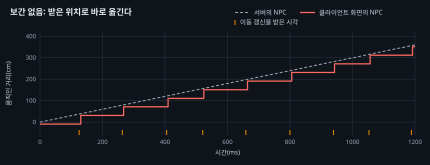
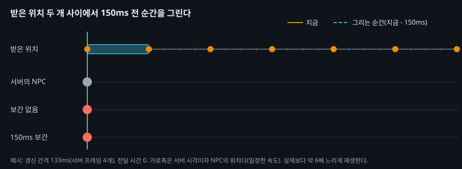
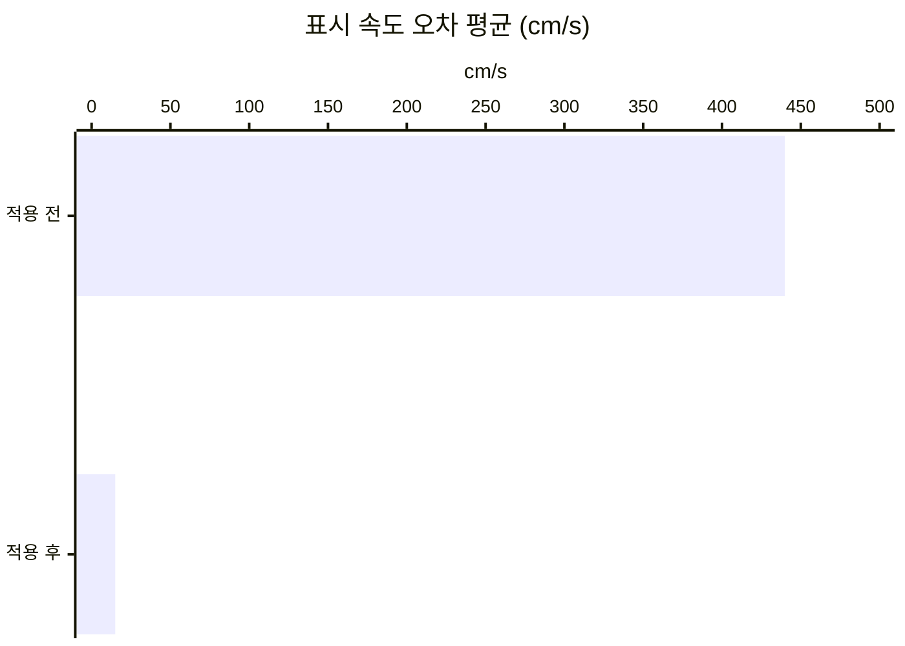
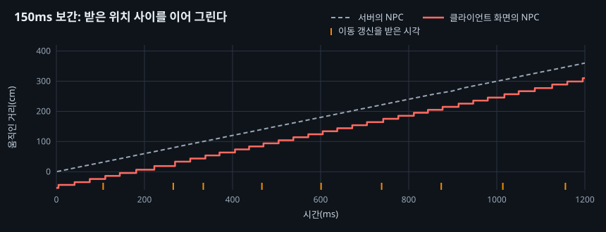

# 11. 클라이언트에서 NPC 위치를 보간하기

## 요약

[AI NPC Net Update Frequency](../04-update-frequency/README.md)에서 NPC의 Net Update Frequency를 10으로 낮췄다. 클라이언트는 받은 위치로 NPC를 바로 옮겨서, NPC가 멈췄다가 건너뛰었다. 이 글은 클라이언트가 받은 위치 두 개 사이를 150ms 늦게 이어 그리게 한다.

화면 속 NPC의 속도 오차가 96.6% 줄었다. 대신 NPC가 81ms 더 늦게 보이고, 연결당 송신 대역폭이 7.29% 늘었다. 서버 프레임 시간은 구별되지 않았다.

| 지표 | 적용 전 | 적용 후 | 변화 |
| --- | --- | --- | --- |
| 표시 속도 오차 평균 | 440cm/s | 15.0cm/s | -96.6% |
| 표시 지연 | 74ms | 155ms | +81ms |
| 연결당 송신 대역폭 | 11,800바이트/초 | 12,700바이트/초 | +7.29% |
| 서버 프레임 시간 평균 | 8.88ms | 8.89ms | 구별되지 않음 |


0번 클라이언트 화면에서 NPC가 지나는 띠를 잘라 4배 느리게 재생했다. 위가 보간 없음, 아래가 150ms 보간이다. 가장 큰 원뿔이 10m를 왕복하는 시연용 NPC다. 두 영상은 이 NPC가 같은 자리에 오도록 맞췄다.

수치는 구성마다 세 번 실행해 중앙값을 적었다. 실행별 값, 계산식, 엔진 소스 위치는 [측정 기록](measurements.md)에 있다. "연결"은 서버와 클라이언트 하나 사이의 통신을 뜻한다.

## 문제: NPC가 134ms마다 40cm씩 건너뛴다

NPC는 300cm/s로 걷는다. 서버는 NPC 하나의 위치를 약 134ms마다 보낸다. 이 간격을 **갱신 간격**이라고 부른다. 엔진의 클라이언트는 위치를 받으면 액터를 그 자리로 바로 옮긴다. 그래서 NPC는 갱신 사이에 멈춰 있다가 약 40cm를 건너뛴다.



실제 기록에서 NPC 하나를 1.2초 동안 그렸다. 회색 점선이 서버의 위치, 빨간 선이 0번 클라이언트 화면의 위치다. 주황 눈금은 클라이언트가 갱신을 받은 시각이다.

이 글은 끊김을 두 값으로 잰다. **표시 속도 오차**는 클라이언트 프레임 한 칸 동안 화면 속 NPC의 속도와 서버 NPC의 속도의 차다. 위 그래프의 NPC는 세 프레임 동안 멈췄다가 한 프레임에 크게 움직인다. 그래서 평균이 NPC의 속도보다 큰 440cm/s였다. **표시 위치 오차**는 같은 순간의 화면 위치와 서버 위치의 거리이고, 평균 22.3cm였다.

서버와 클라이언트 8개가 같은 PC의 같은 시계로 NPC 위치를 기록했다. 두 값은 그 기록을 측정 구간 60초 동안 비교해 얻었다.

## 원리: 받은 위치 두 개 사이를 늦게 이어 그린다

**보간**은 두 위치 사이의 점을 시간의 비율로 계산하는 것이다. 지금 그릴 위치를 보간하려면 그 뒤의 위치를 이미 받았어야 한다. 그래서 클라이언트는 받은 위치를 쌓아 두고, 지금보다 조금 앞선 순간을 그린다. 이 시간 차이를 **보간 지연**이라고 부른다. 보간 지연은 갱신 간격보다 길어야 하고, 이 글은 150ms로 정했다.



예시로 그린 도식이다. 주황 점이 받은 위치이고, 청록 상자가 지금 이어 그리는 두 위치다. 보간 없음의 NPC는 받을 때마다 건너뛴다. 150ms 보간의 NPC는 서버의 NPC와 같은 속도로 뒤따른다.

받은 위치는 서버 시각으로 늘어놓아야 한다. 받은 시각을 쓰면 간격이 흔들린다. 클라이언트가 패킷을 프레임마다 한 번 처리하기 때문이다. 그래서 서버가 위치마다 **서버 프레임 번호**를 붙여 보낸다. 서버 프레임은 서버 틱 한 번이고, 번호는 8비트다. 클라이언트는 가장 빨리 도착한 갱신들로 서버의 시계와 프레임 길이를 추정한다.

**대가는 지연과 대역폭이다.** NPC는 보간 지연만큼 늦게 보이고, 그만큼 표시 위치 오차가 커진다. 갱신마다 프레임 번호와 그 머리가 더 간다.

**예상.** 표시 속도 오차는 거의 0이 되고, NPC가 방향을 바꾸는 순간만 남는다. 표시 지연은 약 157ms가 된다. 150ms에 전달 시간 약 7ms를 더한 값이다. 표시 위치 오차는 약 47cm로 커진다. NPC의 속도에 표시 지연을 곱한 값이다. 갱신 한 번에 16비트가 붙어 송신 대역폭은 약 7.2% 늘 것이다.

## 적용: 받은 위치를 쌓고 프레임마다 보간한다

```cpp
// Source/DSOptLab/LabNpc.h
UPROPERTY(Replicated)
uint8 ServerFrame = 0;  // 이 위치를 정한 서버 프레임 번호의 아래 8비트

// Source/DSOptLab/LabNpc.cpp (요약)
void ALabNpc::PreReplication(IRepChangedPropertyTracker& Tracker)
{
	ServerFrame = static_cast<uint8>(GFrameCounter & 0xFF);  // 서버: 보내기 직전에 번호를 붙인다
	Super::PreReplication(Tracker);
}

void ALabNpc::PostNetReceiveLocationAndRotation()  // 클라이언트: 엔진은 여기서 바로 옮긴다
{
	const int64 Frame = Clock.Unwrap(ServerFrame);       // 8비트 번호를 펼친다
	Clock.AddSample(FPlatformTime::Seconds(), Frame);    // 서버 시계와 프레임 길이를 고친다
	Snapshots.Add({ double(Frame), ReceivedLocation, ReceivedRotation });  // 옮기지 않고 쌓는다
}

void ALabNpc::TickInterpolation()  // 클라이언트: 프레임마다
{
	const double RenderFrame = Clock.GetRenderFrame(FPlatformTime::Seconds(), 0.150);
	// RenderFrame을 끼는 두 위치 From, To를 찾는다. 다음 위치가 아직 없으면 마지막 위치에 멈춘다.
	SetActorLocationAndRotation(FMath::Lerp(From.Location, To.Location, Alpha), FQuat::Slerp(From.Rotation, To.Rotation, Alpha));
}
```

| 구성 | 더한 실행 인자 |
| --- | --- |
| 적용 전 | 없음 |
| 적용 후 | `-NpcInterpDelay 150` |

두 구성 모두 [인벤토리를 FastArray로 보내기](../10-inventory-fastarray/README.md)의 최종 구성에서 출발한다. 두 구성 모두 위치 기록을 켜고, 구성마다 세 번 연달아 쟀다. 이 시점의 코드는 태그 [`post-11-npc-interpolation`](https://github.com/hon454/ue-dedicated-server-optimization-lab/tree/post-11-npc-interpolation)에 있다.

## 결과

### 끊김은 사라졌고, NPC는 81ms 늦게 보인다

| 항목 | 적용 전 | 예상 | 실제 |
| --- | ---: | ---: | ---: |
| 표시 속도 오차 평균(cm/s) | 440 | 거의 0 | 15.0 |
| 표시 지연(ms) | 74 | 약 157 | 155 |
| 표시 위치 오차 평균(cm) | 22.3 | 약 47 | 46.4 |
| 연결당 송신 대역폭(바이트/초) | 11,800 | 약 12,700 | 12,700 |





네 값 모두 예상과 맞았다. 화면 속 NPC는 서버의 NPC와 같은 기울기로 움직인다. 대신 서버보다 약 155ms 뒤에 있다. 표시 속도 오차의 P99는 339cm/s로 남았다. NPC가 방향을 바꾸는 순간의 오차로 추정한다.

### 서버 프레임 시간은 구별되지 않았다

서버 프레임 시간 평균은 8.88ms에서 8.89ms가 됐다. NPC를 리플리케이트하는 시간도 프레임당 0.857ms에서 0.886ms로 비슷했다. 서버가 하는 일은 번호 하나를 더 보내는 것뿐이다. 보간의 계산은 모두 클라이언트에서 한다.

### 클라이언트 화면

요약의 영상에서 위의 원뿔은 멈칫거리며 건너뛰고, 아래의 원뿔은 고르게 움직인다. 두 영상은 시연용 NPC의 위치로 맞췄다. 그래서 늦게 보이는 것은 영상에서 보이지 않는다. NPC가 걷는 경로는 두 구성이 같았다.

## 배운 것과 한계

- **보간은 끊김을 지연으로 바꾼다.** 표시 속도 오차는 거의 사라졌고, 표시 위치 오차는 두 배가 됐다. 화면의 위치로 무언가를 판정한다면 이 지연을 함께 따져야 한다.
- **프레임 번호를 시각으로 쓰려면 프레임 길이도 추정해야 한다.** 처음 구현은 서버 프레임을 33.3ms로 보았다. 서버가 30Hz를 조금 못 지킨 실행에서 표시 지연이 139\~144ms로 짧아졌다. 클라이언트가 받은 시각으로 프레임 길이를 추정하게 고쳤다.
- **루프백에서는 다음 위치가 늦게 오지 않는다.** 실제 네트워크에서는 지연이 흔들리고 패킷을 잃는다. 그때 다음 위치가 늦으면 NPC가 멈춘다. 이 글은 멈추게 두었다.

측정 환경의 한계는 [테스트베드와 측정 방법](../00-testbed/README.md)의 "한계"에 있다.

**다음 글.** NPC 갱신 한 번은 111비트였고, 그중 92비트가 이동 데이터였다. 다음 글은 이동 데이터를 직렬화하는 코드를 직접 써서 이 비트를 줄인다. 낮춘 정밀도가 화면에 주는 영향은 이 글의 두 값으로 잰다.
