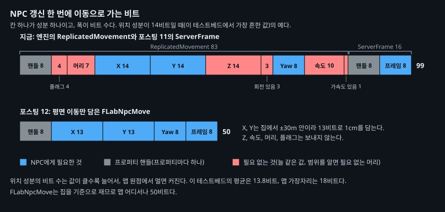
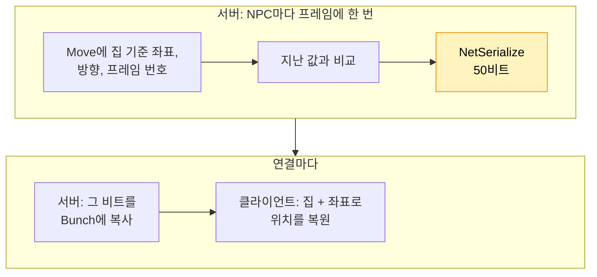
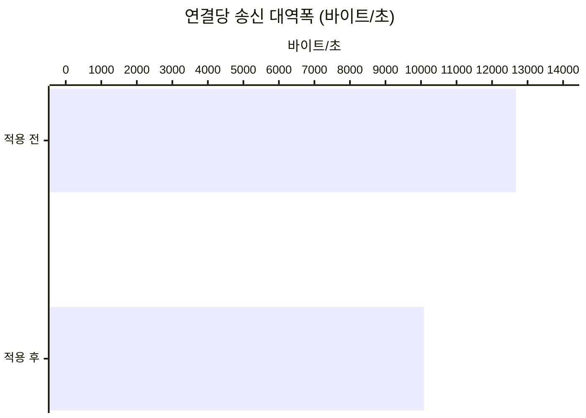

# 12. NPC 이동을 필요한 비트만 담은 구조체로 보내기

## 요약

서버는 NPC 갱신마다 엔진의 이동 데이터를 보낸다. 이 데이터는 NPC에게 늘 같은 높이와 늘 0인 속도까지 담는다. 이 글은 NPC의 평면 위치, 방향, 서버 프레임 번호만 담은 구조체를 만든다. 그리고 그 구조체를 비트로 바꾸는 `NetSerialize`를 직접 짠다.

NPC 갱신 한 번이 117비트에서 69.0비트가 됐다. 연결당 송신 대역폭은 20.4% 줄었다. 화면 속 NPC의 품질은 구별되지 않았다.

| 지표 | 적용 전 | 적용 후 | 변화 |
| --- | --- | --- | --- |
| NPC 갱신 한 번 | 117비트 | 69.0비트 | -41.1% |
| 연결당 송신 대역폭 | 12,700바이트/초 | 10,100바이트/초 | -20.4% |
| 표시 위치 오차 평균 | 46.6cm | 45.9cm | 구별되지 않음 |
| 서버 프레임 시간 평균 | 8.96ms | 8.76ms | -2.20% |



NPC 갱신 한 번에 이동으로 가는 비트를 값별로 그렸다. 칸의 폭이 비트 수다. 위치를 축마다 14비트로 쓸 때의 예시이고, 이 테스트베드에서 가장 흔한 경우다.

수치는 구성마다 세 번 실행해 중앙값을 적었다. 실행별 값, 계산식, 엔진 소스 위치는 [측정 기록](measurements.md)에 있다. "연결"은 서버와 클라이언트 하나 사이의 통신을 뜻한다.

## 문제: NPC에게 필요 없는 값까지 보낸다

[클라이언트에서 NPC 위치를 보간하기](../11-npc-interpolation/README.md)의 최종 구성에서 시작한다. 연결 하나는 1초에 NPC 갱신을 약 428번 받는다. 0번 연결이 보낸 액터 데이터의 52.3%가 NPC다.

| NPC 갱신 한 번 | 비트 |
| --- | ---: |
| 이동 데이터 `ReplicatedMovement` | 82.3 |
| 서버 프레임 번호 `ServerFrame` | 16 |
| 그 밖의 헤더 | 19.0 |
| 합계 | 117 |

`ReplicatedMovement`는 위치, 회전, 속도를 담는 엔진의 구조체다. 엔진은 이 구조체를 어떤 액터에나 쓴다. 그래서 위치는 X, Y, Z를 모두 보내고, 속도도 늘 보낸다.

NPC는 평면에서만 걸어서 높이가 늘 같다. 서버는 NPC의 속도를 채우지 않아서 속도가 늘 0이다. 그래도 엔진은 갱신마다 높이와 속도를 보낸다. 요약 그림의 빨간 칸이 이런 비트다. 위치를 축마다 14비트로 쓰면 39비트가 된다.

엔진은 이동 데이터의 정밀도를 설정으로 바꾸게 해 준다. 그런데 기본값이 이미 가장 거친 단계다. 설정만으로는 더 줄일 수 없다.

## 원리: 구조체가 자신을 직접 비트로 쓰게 한다

**직렬화**는 값을 패킷에 넣을 비트로 바꾸는 일이다. 엔진은 보통 구조체의 필드를 하나씩 직렬화한다. 구조체에 `NetSerialize` 함수를 두면 엔진은 그 함수에 직렬화를 맡긴다. `ReplicatedMovement`도 이렇게 직렬화된다. 그러니 NPC에게 맞춘 구조체도 같은 방식으로 만들 수 있다.

새 구조체 `FLabNpcMove`는 세 가지로 비트를 줄인다.

- **필요 없는 값을 뺀다.** 높이, 속도, 늘 같은 값인 플래그를 보내지 않는다.
- **범위를 알고 고정 길이로 쓴다.** 엔진은 위치 값의 크기에 맞춰 축마다 쓸 길이를 정하고, 그 길이를 7비트 헤더에 적는다. NPC는 집에서 가로세로 30m 안에서만 걷는다. 집을 기준으로 1cm 단위로 쓰면 축마다 13비트로 충분하다.
- **프레임 번호를 같은 구조체에 넣는다.** 바뀐 프로퍼티 앞에는 어느 프로퍼티인지 가리키는 **프로퍼티 핸들**이 붙는다. 프로퍼티 둘을 하나로 합치면 핸들 하나가 줄어든다.



노란 칸이 이 글이 바꾸는 곳이다. 서버는 구조체를 프레임에 한 번만 직렬화한다. 그 결과를 모든 연결이 함께 쓴다. 이것을 **공유 직렬화**라고 부른다.

그래서 기준점은 연결마다 다를 수 없고, NPC마다 하나로 정해진 집이어야 한다. **액터 채널**은 서버가 액터 하나를 클라이언트 하나에 보내는 통로다. 집의 위치는 채널이 열릴 때 한 번만 보낸다.

**대가는 유지 비용이다.** 13비트는 NPC가 집 근처에만 있다는 규칙에 기댄다. 규칙이 바뀌면 비트 수도 바꿔야 한다. 그래서 서버는 범위를 벗어난 좌표를 잘라 보내고 로그에 남긴다.

또 방향처럼 가끔 바뀌는 값을 "바뀐 때만 보내는 필드"로 만들 수도 없다. 패킷을 잃으면 엔진은 그때의 현재 값을 다시 직렬화한다. 그 순간에는 "바뀌지 않음"이라서, 클라이언트는 바뀐 값을 끝내 받지 못한다.

**예상.** 이동과 프레임 번호는 갱신 한 번에 약 98.4비트에서 50비트가 된다. 연결당 송신 대역폭은 약 2,590바이트/초, 20.4% 줄어든다. 위치는 엔진과 같은 1cm이고 방향도 같은 1바이트다. 그래서 화면 속 NPC의 품질은 그대로일 것이다.

## 적용: 평면 이동 구조체와 그 NetSerialize

```cpp
// Source/DSOptLab/LabNpc.h
USTRUCT()
struct FLabNpcMove
{
	GENERATED_BODY()
	UPROPERTY() FVector2D Offset;  // 집에서 잰 평면 위치(cm)
	UPROPERTY() float Yaw = 0.f;
	UPROPERTY() uint8 ServerFrame = 0;  // 포스팅 11의 서버 프레임 번호
	bool NetSerialize(FArchive& Ar, UPackageMap* Map, bool& bOutSuccess);
};
template<> struct TStructOpsTypeTraits<FLabNpcMove> : public TStructOpsTypeTraitsBase2<FLabNpcMove>
{
	enum { WithNetSerializer = true, WithNetSharedSerialization = true };  // 직접 직렬화, 공유 직렬화
};

// Source/DSOptLab/LabNpc.cpp (요약)
bool FLabNpcMove::NetSerialize(FArchive& Ar, UPackageMap* Map, bool& bOutSuccess)
{
	SerializeMoveOffset(Ar, Offset.X);  // 1cm로 반올림해 13비트
	SerializeMoveOffset(Ar, Offset.Y);
	uint8 YawByte = Ar.IsSaving() ? FRotator::CompressAxisToByte(Yaw) : 0;  // 엔진과 같은 1바이트
	Ar << YawByte;
	Ar << ServerFrame;
	...
}

ALabNpc::ALabNpc()
{
	SetReplicatingMovement(!IsCompactMove());  // 엔진의 ReplicatedMovement를 끈다
}

void ALabNpc::PreReplication(IRepChangedPropertyTracker& Tracker)  // 서버: 보내기 직전
{
	Move.Offset = FVector2D(GetActorLocation() - MoveOrigin);  // MoveOrigin은 집, 채널이 열릴 때 한 번 보낸다
	Move.Yaw = GetActorRotation().Yaw;
	Move.ServerFrame = static_cast<uint8>(GFrameCounter & 0xFF);
	Super::PreReplication(Tracker);
}

void ALabNpc::OnRep_Move()  // 클라이언트: 위치를 되살려 포스팅 11의 보간 버퍼에 넣는다
{
	const FVector Location(MoveOrigin.X + Move.Offset.X, MoveOrigin.Y + Move.Offset.Y, MoveOrigin.Z);
	AddSnapshot(Location, FRotator(0.f, Move.Yaw, 0.f).Quaternion(), Move.ServerFrame);
}
```

| 구성 | 더한 실행 인자 |
| --- | --- |
| 적용 전 | 없음 |
| 적용 후 | `-NpcCompactMove` |

두 구성 모두 [클라이언트에서 NPC 위치를 보간하기](../11-npc-interpolation/README.md)의 최종 구성에서 출발한다. 두 구성 모두 위치 기록을 켜고, 구성마다 세 번 연달아 쟀다. 이 시점의 코드는 태그 [`post-12-npc-move-netserialize`](https://github.com/hon454/ue-dedicated-server-optimization-lab/tree/post-12-npc-move-netserialize)에 있다.

## 결과

### NPC 갱신이 48.2비트 줄고, 송신 대역폭이 20.4% 줄었다

| 항목 | 적용 전 | 예상 | 실제 |
| --- | ---: | ---: | ---: |
| NPC 갱신 한 번(비트) | 117 | 약 68.8 | 69.0 |
| 새 구조체 한 번(비트) | 없음 | 50 | 50 |
| 연결당 송신 대역폭(바이트/초) | 12,700 | 약 10,100 | 10,100 |
| 표시 위치 오차 평균(cm) | 46.6 | 그대로 | 45.9 |



네 값 모두 예상과 맞았다. 새 구조체는 갱신 25,189번에서 모두 50비트였다. 서버 프레임 번호는 따로 가지 않았다. 0번 연결에는 집의 위치가 60초 동안 네 번 갔다. 합쳐서 246비트라 무시할 만하다.

### 서버 프레임 시간은 조금 줄었다

서버 프레임 시간 평균은 8.96ms에서 8.76ms가 됐다. 서버가 남긴 기록으로 보면 이 차이는 같은 구성의 세 실행 사이의 차이를 겨우 넘었다. NPC를 리플리케이트하는 시간은 프레임당 0.884ms에서 0.842ms가 됐다. 직렬화할 비트가 줄고 엔진이 이동 데이터를 모으지 않게 된 몫으로 추정한다.

### 클라이언트 화면

화면 속 NPC의 품질 지표는 모두 구별되지 않았다. 표시 지연은 155ms와 154ms였다. 표시 지연만큼 늦춘 서버 위치와의 오차도 1.37cm와 1.22cm로 같았다. 위치는 두 구성 모두 1cm 단위로 반올림된다. 집을 기준으로 반올림해도 받는 위치가 같다.

## 배운 것과 한계

- **엔진의 이동 데이터는 범용이다.** 줄인 48.4비트 가운데 38.8비트가 NPC에게 필요 없는 값이었다. 범위를 아는 몫은 두 축을 합쳐 1.62비트였다. 이 테스트베드의 NPC가 맵 가운데 가까이에 있어서다. 맵 가장자리라면 엔진은 축마다 18비트를 쓴다.
- **직접 쓴 직렬화는 게임 규칙에 묶인다.** 13비트는 NPC가 집에서 가로세로 30m 안에서 걷는다는 규칙에 기댄다. 범위를 벗어나면 위치가 틀린다. 그래서 잘라 보낸 횟수를 로그로 지켜봤고, 이번 측정에서는 한 번도 없었다.
- **Iris는 확인하지 않았다.** Iris가 이 `NetSerialize`를 그대로 쓰는지는 보지 않았다.

측정 환경의 한계는 [테스트베드와 측정 방법](../00-testbed/README.md)의 "한계"에 있다.

**다음 글.** 지금까지는 루프백이라 패킷이 늦지 않고 사라지지 않았다. 다음 글은 지연과 패킷 손실을 넣는다. 그리고 보간과 이 구조체가 화면 속 NPC를 얼마나 흔들리게 두는지 잰다.
