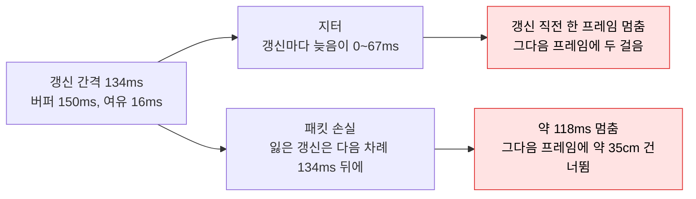
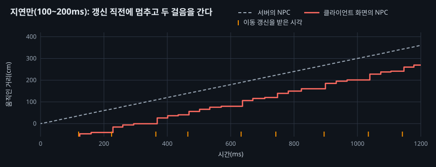
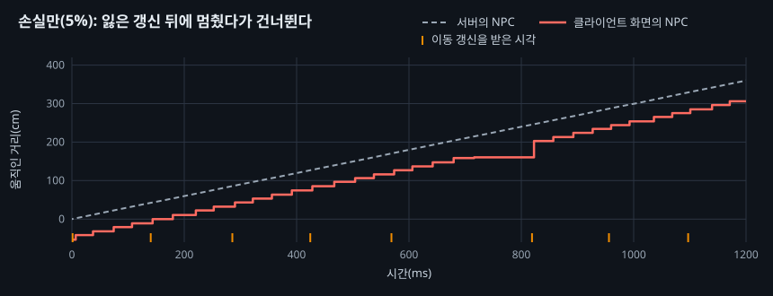
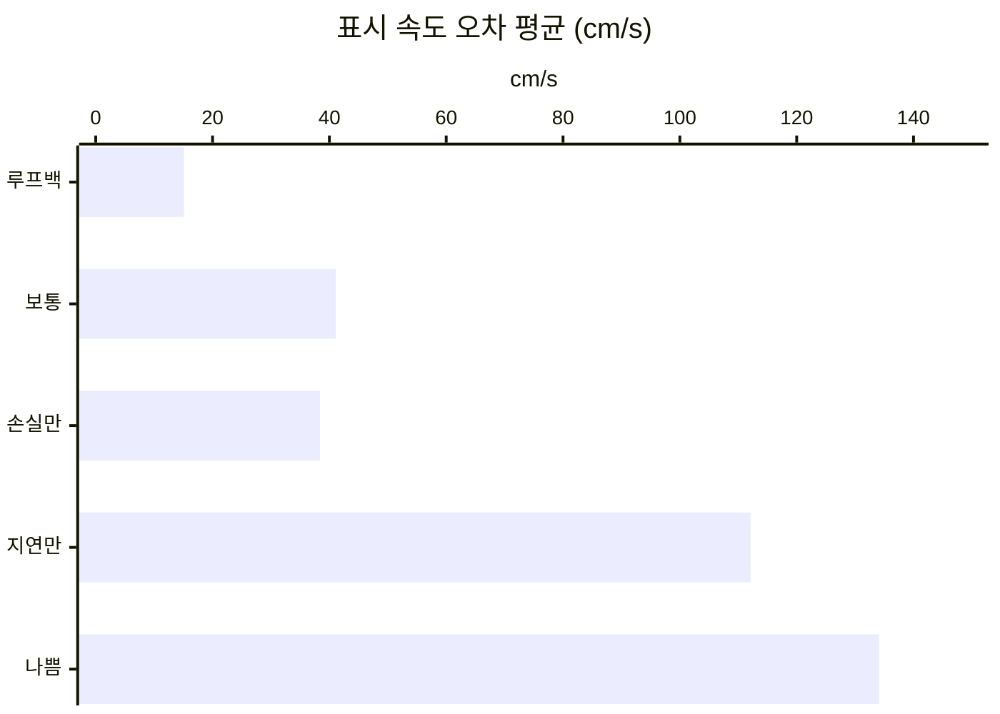

# 13. 지연과 패킷 손실에서의 동기화 품질

## 요약

[NPC 이동을 필요한 비트만 담은 구조체로 보내기](../12-npc-move-netserialize/README.md)까지의 서버와 클라이언트는 같은 PC 안에서 통신했다. 패킷은 바로 도착하고 사라지지 않았다. 이 글은 서버를 바꾸지 않는다. 클라이언트의 연결에 지연과 패킷 손실을 넣고, 화면 속 NPC가 얼마나 흔들리는지 잰다.

지연이 패킷마다 달라지면 NPC는 늦게 보일 뿐 아니라 갱신마다 한 프레임 멈췄다. 패킷 손실은 잃을 때마다 NPC를 약 118ms 멈추게 했다. 원인은 같다. [클라이언트에서 NPC 위치를 보간하기](../11-npc-interpolation/README.md)의 150ms 버퍼가 갱신 간격 134ms에 16ms의 여유만 두었기 때문이다.

| 구성 | 표시 지연 | 표시 위치 오차 평균 | 표시 속도 오차 평균 | 수신 간격 P99 |
| --- | ---: | ---: | ---: | ---: |
| 루프백 | 154ms | 45.7cm | 15.1cm/s | 167ms |
| 보통(손실 1%, 지연 30\~60ms) | 196ms | 58.8cm | 41.1cm/s | 233ms |
| 나쁨(손실 5%, 지연 100\~200ms) | 287ms | 87.2cm | 134cm/s | 305ms |
| 지연만(100\~200ms) | 286ms | 85.8cm | 112cm/s | 221ms |
| 손실만(5%) | 154ms | 46.6cm | 38.4cm/s | 282ms |


0번 클라이언트 화면에서 NPC가 지나는 띠를 잘라 4배 느리게 재생했다. 위가 루프백, 아래가 나쁨이다. 가장 큰 원뿔이 10m를 왕복하는 시연용 NPC다. 두 영상은 이 NPC가 같은 자리에 오도록 맞췄다. 그래서 영상에는 표시 지연의 차이가 보이지 않고 멈칫거림만 보인다.

수치는 구성마다 세 번 실행해 중앙값을 적었다. 실행별 값, 계산식, 엔진 소스 위치는 [측정 기록](measurements.md)에 있다. "연결"은 서버와 클라이언트 하나 사이의 통신을 뜻한다.

## 문제: 지금까지의 품질은 루프백에서만 쟀다

[클라이언트에서 NPC 위치를 보간하기](../11-npc-interpolation/README.md)는 NPC의 끊김을 없앴다. 표시 속도 오차 평균이 440에서 15.0cm/s가 됐다. 그 글은 한 가지를 미뤘다. 실제 네트워크에는 지터와 패킷 손실이 있다. 지터는 패킷마다 지연이 달라지는 정도다. 그때 다음 위치가 늦으면 NPC가 멈춘다.

보간은 받은 위치를 쌓아 두고 150ms 앞선 순간을 그린다. NPC 하나의 갱신은 약 134ms마다 온다. 그러면 버퍼에는 다음 갱신을 기다릴 여유가 16ms뿐이다.

| 150ms 버퍼의 내역 | 시간 |
| --- | ---: |
| 갱신 하나를 기다리는 시간 | 134ms |
| 다음 갱신이 늦어도 되는 여유 | 16ms |

루프백에서는 갱신이 거의 같은 시각에 도착한다. 여유 16ms로 충분했다. 지터가 있거나 갱신을 잃으면 이 여유를 넘는다.

## 원리: 버퍼의 여유를 넘는 갱신마다 NPC가 멈춘다

보간 시계는 가장 빨리 도착한 갱신들로 서버의 시각을 맞춘다. 그래서 "늦음"은 가장 빠른 도착과 견준 값이다. 늦음이 여유 16ms를 넘으면, 클라이언트는 다음 위치가 없어 마지막 위치에 멈춘다. 다음 갱신이 오면 밀린 거리를 한 프레임에 건너뛴다.

지연과 손실은 다른 모양으로 여유를 넘는다.



**지터.** 엔진의 시뮬레이션은 늦춘 패킷을 클라이언트 프레임에서 받고 프레임에서 다시 넣는다. 그래서 100\~200ms 지연은 4\~6프레임으로 반올림된다. 시계는 그중 가장 빠른 쪽에 맞춰진다. 나머지 갱신은 0\~67ms 늦게 온다. 늦음이 여유를 넘는 갱신마다 그 직전 프레임에 NPC가 멈춘다.

**패킷 손실.** 잃은 패킷의 프로퍼티는 재전송 대상으로 표시된다. 그러나 실제로 가는 것은 그 액터의 다음 리플리케이션 차례다. NPC의 차례는 134ms마다 오므로, 갱신 하나를 잃으면 수신 간격이 약 268ms가 된다. 버퍼 150ms를 다 쓰고 약 118ms를 더 기다린다.

**예상.** 지연만 넣으면 표시 지연이 약 290ms가 된다. 150ms에 반올림된 최소 지연 133ms를 더한 값이다. 표시 위치 오차는 지연에 비례해 약 86cm가 된다. 손실만 넣으면 수신 간격 P99가 약 267ms가 된다. 1초에 약 0.37번 118ms씩 멈추고 35cm를 건너뛰어, 표시 속도 오차 평균은 약 40cm/s가 된다. 서버는 바꾸지 않으므로 서버 수치는 달라지지 않는다.

## 측정: 클라이언트 연결에 엔진의 패킷 시뮬레이션을 걸었다

이 글은 서버의 동작을 바꾸지 않는다. 엔진에는 패킷을 일부러 버리거나 늦추는 설정이 있다. `FPacketSimulationSettings`이고, Shipping이 아닌 빌드에서만 컴파일된다. 송신 쪽은 보내기 직전에 버리거나 늦추고, 수신 쪽은 받은 패킷을 다음 프레임 이후에 처리한다.

설정은 클라이언트에 걸었다. 클라이언트 여덟에 명령줄 `-PktEmulationProfile=<이름>`을 주면, 각 클라이언트가 자기 연결의 송수신을 늦추거나 버린다. 서버에 걸면 서버가 늦춘 패킷을 들고 있어 서버 수치가 섞인다. 품질 지표가 보는 NPC 갱신은 서버에서 클라이언트로 가는 방향이다.

프로필은 `Engine.ini`의 섹션이다. 엔진이 `Average`와 `Bad`를 정의해 두었다. 어느 요인이 NPC를 멈추게 하는지 가르려고, 프로젝트에 지연만과 손실만인 프로필을 더했다.

| 구성 | 프로필 | 손실(양방향) | 지연(양방향) |
| --- | --- | ---: | ---: |
| 루프백 | 없음 | 0 | 0 |
| 보통 | 엔진의 `Average` | 1% | 30\~60ms |
| 나쁨 | 엔진의 `Bad` | 5% | 100\~200ms |
| 지연만 | `LabLagOnly` | 0 | 100\~200ms |
| 손실만 | `LabLossOnly` | 5% | 0 |

```ini
; Config/DefaultEngine.ini. 엔진의 Bad에서 지연만 남긴 프로필
[PacketSimulationProfile.LabLagOnly]
PktLoss=0
PktIncomingLoss=0
PktLagMin=100
PktLagMax=200
PktIncomingLagMin=100
PktIncomingLagMax=200
```

다섯 구성 모두 [NPC 이동을 필요한 비트만 담은 구조체로 보내기](../12-npc-move-netserialize/README.md)의 최종 구성이다. 구성마다 세 번 연달아 쟀다. 품질 지표는 [클라이언트에서 NPC 위치를 보간하기](../11-npc-interpolation/README.md)와 같다. 표시 지연을 찾는 범위만 600ms로 넓혔다. 이 시점의 코드는 태그 [`post-13-lag-and-packet-loss`](https://github.com/hon454/ue-dedicated-server-optimization-lab/tree/post-13-lag-and-packet-loss)에 있다.

## 결과

### 지터는 갱신마다 한 프레임 멈추게 했다

| 지연만(100\~200ms) | 루프백 | 예상 | 실제 |
| --- | ---: | ---: | ---: |
| 표시 지연 | 154ms | 약 290ms | 286ms |
| 표시 위치 오차 평균 | 45.7cm | 약 86cm | 85.8cm |
| 표시 속도 오차 평균 | 15.1cm/s | 늘어남 | 112cm/s |
| 수신 간격 평균 | 134ms | 그대로 | 134ms |

표시 지연과 위치 오차는 예상과 맞았다. 갱신이 오는 간격은 그대로였다. 그런데 표시 속도 오차가 일곱 배가 됐다. 아래 그래프가 그 모양이다. 갱신을 받기 직전 프레임마다 NPC가 멈추고, 받은 프레임에 두 걸음을 간다. 계산으로는 프레임의 약 11%가 멈춘 프레임이다.



지연만 넣은 실행에서 NPC 하나가 1.2초 동안 움직인 거리다. 회색 점선이 서버, 붉은 선이 클라이언트 화면이다. 아래의 눈금은 이동 갱신을 받은 시각이다. 갱신 직전마다 붉은 선이 평평해지고, 갱신 직후에 두 배로 오른다.

### 손실은 잃을 때마다 118ms 멈추게 했다

| 손실만(5%) | 루프백 | 예상 | 실제 |
| --- | ---: | ---: | ---: |
| 수신 간격 P99 | 167ms | 약 267ms | 282ms |
| 표시 속도 오차 평균 | 15.1cm/s | 약 40cm/s | 38.4cm/s |
| 표시 위치 오차 평균 | 45.7cm | 조금 늘어남 | 46.6cm |
| 표시 지연 | 154ms | 그대로 | 154ms |



네 값 모두 예상과 맞았다. 그래프의 가운데에서 갱신 하나가 빠졌다. 붉은 선이 세 프레임 동안 평평하다가 약 40cm를 한 번에 오른다. 표시 위치가 바뀐 간격의 P99는 45.5에서 110ms가 됐다. 멈춘 시간이 그대로 보인다.

### 나쁨은 둘을 더한 것이었다



나쁨의 표시 지연은 287ms로 지연만과 같다. 표시 속도 오차는 134cm/s로 지연만과 손실만을 더한 값에 가깝다. 보통은 지연 30\~60ms가 1\~2프레임이라 지터가 작다. 그래도 표시 속도 오차가 2.7배였다.

### 서버는 오히려 덜 일했다

지연을 넣은 두 구성에서 연결당 송신 대역폭이 9% 줄었다. 서버 프레임 시간도 0.4ms 짧았다. 리플리케이션 시간은 0.04ms만 달랐다. 클라이언트에서 서버로 가는 패킷도 늦어서, 플레이어의 이동이 몰려 도착한 것으로 추정한다. 이 원인은 확인하지 않았다.

## 배운 것과 한계

- **보간 버퍼는 갱신 간격이 아니라 지터에 맞춰야 한다.** 150ms는 루프백의 갱신 간격에 16ms를 더한 값이었다. 지터가 16ms를 넘는 갱신마다 NPC가 멈췄다.
- **손실의 값은 재전송의 시점이 정한다.** 엔진은 잃은 프로퍼티를 다음 리플리케이션 차례에 보낸다. 갱신 빈도를 낮춘 액터일수록 한 번의 손실이 길게 보인다.
- **엔진의 시뮬레이션은 프레임 단위다.** 늦춘 패킷을 프레임에서 받고 프레임에서 다시 넣어, 지연이 프레임 길이로 반올림된다. 실제 회선의 지터와 모양이 다르다.

이 글은 재기만 하고 고치지 않았다. 버퍼를 늘리기, 비면 짧게 외삽하기, 손실을 안 액터를 바로 다시 보내기 같은 대처는 다루지 않았다. 측정 환경의 한계는 [테스트베드와 측정 방법](../00-testbed/README.md)의 "한계"에 있다.

**다음 글.** [자원 노드의 Net Update Frequency 낮추기](../08-node-update-frequency/README.md)는 활성 목록에 남은 자원 노드를 건너뛰게 했다. 다음 글은 같은 문제를 Replication Graph의 공간 격자로 푼다. 자원 노드를 활성 목록 자체에서 빼고, 두 방법의 비용을 비교한다.
