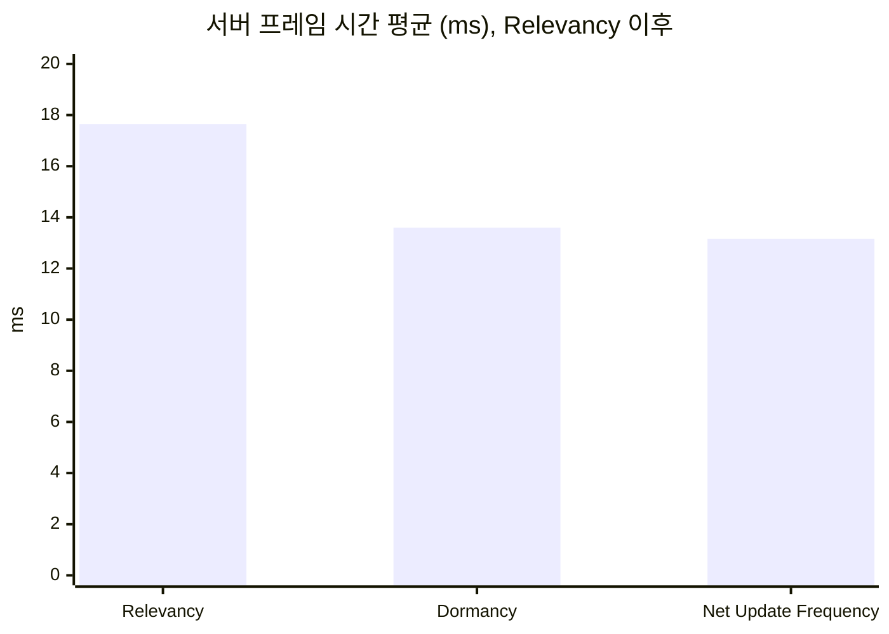
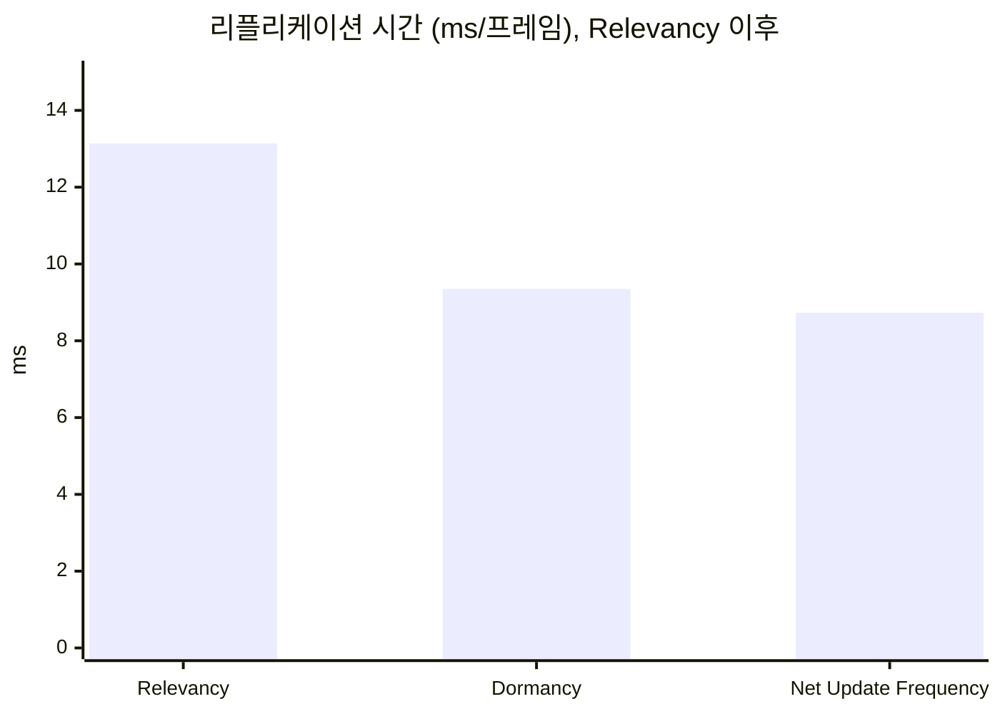
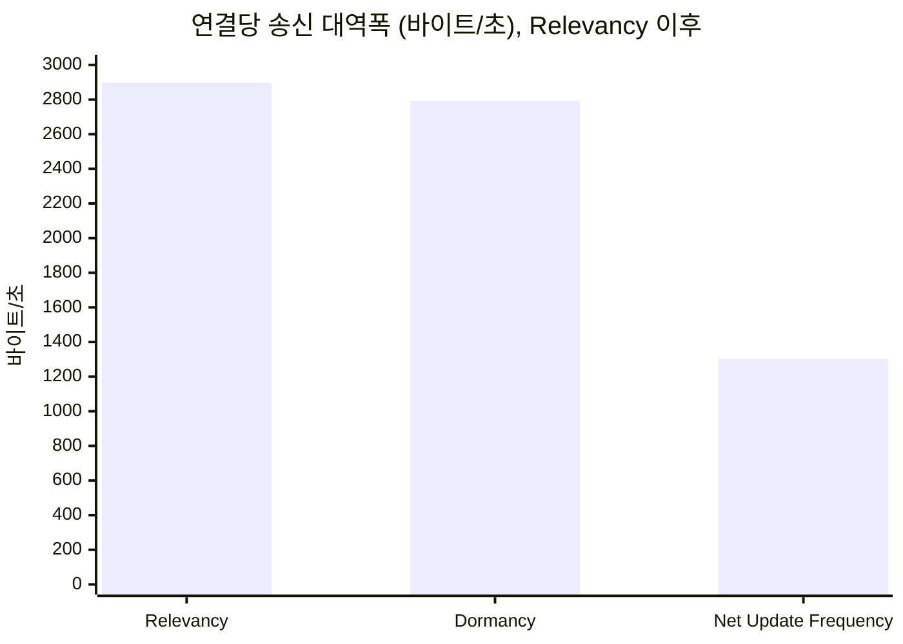

# 누적 수치의 측정 기록

[루트 README](../README.md)가 쓰는 수치의 근거다. README는 유효 숫자 세 자리로 줄여 쓰고, 정밀한 값과 실행 라벨은 여기에 둔다. 구성마다의 실행별 값과 계산식은 각 포스팅의 측정 기록에 있다. README의 "결과 한눈에 보기"는 2막의 수치이고(2026-10-05부터), 1막의 수치는 아래 "1막"에 남긴다.

## 2막

| 구성(README의 단계 이름) | 실행 라벨 | 측정 기록 |
| --- | --- | --- |
| 기준선 | `act2-baseline11` | [1막의 세 최적화를 2막에 다시 적용](06-three-techniques-again/measurements.md) |
| ① 거리 판정 | `act2-relevancy1` | 같은 문서 |
| ② Dormant 상태 | `act2-dormancy1` | 같은 문서 |
| ③ NPC 업데이트 빈도 | `act2-update-frequency1` | 같은 문서 |

네 구성을 2026-10-05에 구성마다 세 번씩 연달아 쟀다. 조건과 실행 경위는 위 측정 기록의 1절, Insights 값은 [관찰 자료](06-three-techniques-again/candidates.md)에 있다. [테스트베드 확장과 새 기준선](05-expanded-testbed/measurements.md)의 `act2-baseline1`은 같은 기준선을 다른 날 잰 묶음이라 이 표와 섞지 않는다.

### 1. 구성별 값

서버 프레임 시간과 리플리케이션 시간은 구성마다 `work_avg_ms` 중앙값 실행의 Timing Insights 값이다(`act2-baseline11-r2`, `act2-relevancy1-r2`, `act2-dormancy1-r2`, `act2-update-frequency1-r1`). 연결당 송신 대역폭은 같은 실행의 Networking Insights `Connection 0`이고, 연결당 열린 액터 채널 수는 서버 CSV다.

| 지표 | 기준선 | ① 거리 판정 | ② Dormant 상태 | ③ NPC 업데이트 빈도 |
| --- | ---: | ---: | ---: | ---: |
| 서버 프레임 시간 평균(ms) | 213.713 | 35.904 | 19.814 | 17.022 |
| 서버 프레임 시간 P99(ms) | 262.209 | 54.276 | 28.277 | 24.490 |
| 리플리케이션 시간(ms/프레임) | 204.327 | 30.934 | 14.744 | 11.967 |
| 연결당 송신 대역폭(바이트/초) | 36,449 | 30,055 | 30,254 | 15,926 |
| 연결당 열린 액터 채널 수 | 5,871 | 695 | 77 | 77 |

### 2. README의 수치와 출처

| README의 수치 | 정밀한 값 | 출처 |
| --- | --- | --- |
| 서버 프레임 시간 평균 214ms → 17.0ms | 213.713ms → 17.022ms(-92.0%) | 2막 1절 |
| 틱 예산 33.3ms, 6배 넘게 쓰다가 절반 남짓 | 213.713 ÷ 33.333 = 6.41, 17.022 ÷ 33.333 = 0.51 | 틱 예산은 1000 ÷ `NetServerMaxTickRate` 30(`Engine/Config/BaseEngine.ini:1867`) |
| 표의 값(서버 프레임 시간 평균, 리플리케이션 시간, 연결당 송신 대역폭, 연결당 열린 액터 채널 수) | 2막 1절 | 같음 |
| ① 150m, ③ 100에서 10으로 | `NetCullDistanceSquared` 225,000,000(`Engine/Source/Runtime/Engine/Private/Actor.cpp:312`), `NetUpdateFrequency` 기본값 100(`Actor.cpp:295-296`), NPC 10(`Source/DSOptLab/LabScenarioConfig.h:40`) | 엔진 소스, 코드 |
| ②가 서버 프레임 시간을 45% 더 줄였다 | 19.814 ÷ 35.904 − 1 = -44.8% | 2막 3절 |
| ③의 서버 프레임 시간 변화는 구별되지 않았다 | 2막 3절 | 같음 |
| ③은 연결당 송신 대역폭을 47% 줄였다 | 15,926 ÷ 30,254 − 1 = -47.4% | 2막 3절 |
| 건축물 500개 | `-Buildings 500` | [1막의 세 최적화를 2막에 다시 적용의 측정 기록](06-three-techniques-again/measurements.md) 1절 |
| 지도: 자리, 경로, 150m 원, 건축물이 놓이는 반지름 | `Scripts/make-relevancy-map.ps1 -Act2` | 같은 측정 기록 2절 |
| 1막: 198ms → 13.2ms | 198.43ms → 13.16ms | 아래 1막 1절 |
| 클라이언트 8개의 창, 서버는 논리 프로세서 2\~7, 클라이언트는 8번부터 | 서버 마스크 252, 클라이언트 마스크 4294967040 | 화면은 시각 자료 전용 실행 `visual13-r1`(2026-10-05, 2막 구성, 세 단계 모두 적용)의 측정 구간에서 찍었다. [테스트베드 확장의 측정 기록](05-expanded-testbed/measurements.md) 11절. 마스크는 [ADR-0009](../Docs/Decisions/0009-server-cores-without-dpc-load.md) |
| 맵 2km, 플레이어 여덟 명이 3m 간격으로 모여 서로 다른 방향으로 돈다 | 바닥 2km, `-PlayerSpacing 3`, 한 변 70m 정사각형, 홀수 자리는 반대 방향 | [2막 설계](../Docs/Planning/2026-10-03-act-2-design.md) 3.1, `Source/DSOptLab/LabGameMode.cpp`의 `GetSlotLocation` |
| 요소 표: 자원 노드 5,001, NPC 350(맵 300, 플레이어 곁 50), 건축물 500(1초마다 하나), 인벤토리 200칸, 상태 값 | 2막 확정값 | [STATUS.md](../Docs/STATUS.md) "확정할 값"의 2막 줄, [테스트베드 확장과 새 기준선](05-expanded-testbed/README.md) "무엇을 더했는가" |
| 1막의 플레이어는 반지름 500m 원 위 | `PlayerRingRadius` 50,000cm | `Source/DSOptLab/LabScenarioConfig.h` |
| UE 프로세스의 메모리 합계 27.5GB | 같음 | [테스트베드의 측정 기록](00-testbed/measurements.md) 1절(`calib-a-r1`, 1막 규모) |

### 3. 단계별 변화

각 단계는 바로 앞 구성과 비교한다. 비율은 1절의 Insights 값으로 계산했다. "구별되지 않음"은 CSV 중앙값의 변화가 두 구성 중 큰 쪽의 변동 폭보다 작다는 뜻이다(CSV 값과 변동 폭은 [측정 기록](06-three-techniques-again/measurements.md) 3절).

| 단계 | 줄어든 것 | 구별되지 않음 |
| --- | --- | --- |
| ① 거리 판정 | 서버 프레임 시간 평균 -83.2%, P99 -79.3%, 리플리케이션 시간 -84.9%, 연결당 송신 대역폭 -17.5%, 연결당 열린 액터 채널 수 5,871 → 695 | 없음 |
| ② Dormant 상태 | 서버 프레임 시간 평균 -44.8%, P99 -47.9%, 리플리케이션 시간 -52.3%, 연결당 열린 액터 채널 수 695 → 77 | 연결당 송신 대역폭(+0.7%. CSV +55, 변동 폭 411) |
| ③ NPC 업데이트 빈도 | 연결당 송신 대역폭 -47.4%, 서버 프레임 시간 P99 -13.4% | 서버 프레임 시간 평균(-14.1%. CSV -2.804, 변동 폭 3.616), 리플리케이션 시간(-18.8%. CSV `netflush_avg_ms` -2.799, 변동 폭 2.905) |

## 1막

README의 "결과 한눈에 보기"가 2026-10-05 전까지 쓰던 수치다. 지금 README는 1막에서 서버 프레임 시간 평균 198ms → 13.2ms 한 줄만 쓴다.

| 구성 | 실행 라벨 | 측정 기록 |
| --- | --- | --- |
| 기준선 | `baseline3` | [Always Relevant 기준선](01-baseline/measurements.md) |
| Relevancy | `relevancy2` | [Relevancy와 Net Cull Distance](02-relevancy/measurements.md) |
| Dormancy | `dormancy6`(README의 표와 차트), `dormancy2`(Dormancy 글) | [자원 노드 Dormancy](03-dormancy/measurements.md), [AI NPC Net Update Frequency](04-update-frequency/measurements.md) |
| Net Update Frequency | `update-frequency3` | [AI NPC Net Update Frequency](04-update-frequency/measurements.md) |

규모와 측정 절차의 근거는 [테스트베드와 측정 방법의 측정 기록](00-testbed/measurements.md)에 있다.

### 1. 구성별 중앙값

모든 값은 구성마다 3회 실행한 중앙값이다.

| 지표 | 기준선 `baseline3` | Relevancy `relevancy2` | Dormancy `dormancy6` | Net Update Frequency `update-frequency3` |
| --- | ---: | ---: | ---: | ---: |
| 서버 프레임 시간 평균(ms) | 198.43 | 17.64 | 13.60 | 13.16 |
| 서버 프레임 시간 P99(ms) | 262.96 | 26.64 | 20.84 | 19.50 |
| 리플리케이션 시간(ms/프레임) | 188.97 | 13.14 | 9.35 | 8.73 |
| 연결당 송신 대역폭(바이트/초) | 28,048 | 2,897 | 2,793 | 1,303 |
| 연결당 열린 액터 채널 수 | 5,314 | 118 | 20 | 20 |

- **출처.** 서버 프레임 시간과 리플리케이션 시간은 Timing Insights, 연결당 송신 대역폭은 Network Insights(`Connection 0`)에서 측정 구간을 읽은 값이고, 연결당 열린 액터 채널 수는 서버 CSV다.
- **서버 프레임 시간**은 프레임 시간에서 틱 속도 제한 대기를 뺀 시간이다([ADR-0010](../Docs/Decisions/0010-frame-time-without-tick-wait.md)). P99는 측정 구간의 프레임마다 이 값을 Insights에서 내보내 읽은 99백분위 경계값이다.
- **Dormancy 값.** README의 표와 차트의 Dormancy는 Net Update Frequency와 연달아 잰 `dormancy6`이다. 같은 코드를 Relevancy 직후에 잰 `dormancy2`는 서버 프레임 시간 평균이 14.69ms로 1.09ms 컸고(측정한 화면 조건이 달랐다), 기법별 변화는 연달아 잰 묶음끼리 계산했다. 기준선과 `update-frequency3`도 화면 조건이 다르지만, 이 1.09ms는 둘의 차이 185.27ms에 비해 작다.
- **연결당 송신 대역폭**은 세 실행 가운데 일부만 Network Insights에서 읽었고, 어느 실행의 값인지는 각 포스팅의 측정 기록에 있다. Relevancy부터는 연결마다 받는 액터가 위치에 따라 달라, `Connection 0`(제자리에서 채집하는 클라이언트)이 서버 CSV의 8개 연결 평균보다 35% 작다([Relevancy의 측정 기록](02-relevancy/measurements.md) 4절).

### 2. README가 쓰던 수치와 출처

| README의 수치 | 정밀한 값 | 출처 |
| --- | --- | --- |
| 서버 프레임 시간 평균 198ms → 13.2ms | 198.43ms → 13.16ms(-93.4%) | 1절 |
| 틱 예산 33.3ms, 6배에서 절반 이하로 | 198.43 ÷ 33.3 = 5.96, 13.16 ÷ 33.3 = 0.40 | 틱 예산은 1000 ÷ `NetServerMaxTickRate` 30(`Engine/Config/BaseEngine.ini:1867`) |
| 줄어든 시간의 대부분은 Relevancy | 줄어든 185.27ms 가운데 180.79ms | 198.43 − 13.16, 198.43 − 17.64 |
| 처리 대상을 50분의 1로 | 연결 하나가 프레임마다 처리하는 자원 노드 5,001 → 75\~96개 | [Relevancy의 측정 기록](02-relevancy/measurements.md) 6절 |
| 클라이언트 8, 자원 노드 5,001, NPC 300, 맵 2km × 2km | 같음 | [테스트베드의 측정 기록](00-testbed/measurements.md) 1절 |
| UE 프로세스의 메모리 합계 27.5GB | 같음 | 같은 문서 1절(`calib-a-r1`) |

### 3. 기준선과 최종 구성

| 지표 | 기준선(`baseline3`) | 세 기법 적용(`update-frequency3`) | 변화 |
| --- | ---: | ---: | ---: |
| 서버 프레임 시간 평균(ms) | 198.43 | 13.16 | -93.4% |
| 서버 프레임 시간 P99(ms) | 262.96 | 19.50 | -92.6% |
| 리플리케이션 시간(ms/프레임) | 188.97 | 8.73 | -95.4% |
| 연결당 송신 대역폭(바이트/초) | 28,048 | 1,303 | -95.4% |
| 연결당 열린 액터 채널 수 | 5,314 | 20 | -99.6% |

### 4. 기법별 변화

각 기법은 바로 앞 구성과 비교한다. "구별되지 않음"은 중앙값의 변화가 두 구성 중 큰 쪽의 변동 폭(세 실행의 최댓값 − 최솟값)보다 작다는 뜻이다.

| 기법 | 비교한 실행 | 줄어든 것 | 구별되지 않음 |
| --- | --- | --- | --- |
| [Relevancy](02-relevancy/README.md) | `baseline3` → `relevancy2` | 서버 프레임 시간 평균 -91.1%, P99 -89.9%, 리플리케이션 시간 -93.0%, 연결당 송신 대역폭 -89.7%, 연결당 열린 액터 채널 수 5,314 → 118 | 없음 |
| [자원 노드 Dormancy](03-dormancy/README.md) | `relevancy2` → `dormancy2` | 서버 프레임 시간 평균 -16.7%, 리플리케이션 시간 -22.6%, 연결당 열린 액터 채널 수 118 → 20 | 서버 프레임 시간 P99, 연결당 송신 대역폭 |
| [AI NPC Net Update Frequency](04-update-frequency/README.md) | `dormancy6` → `update-frequency3` | 연결당 송신 대역폭 -53.3%, 서버 프레임 시간 P99 -6.4%, 리플리케이션 시간 -6.6% | 서버 프레임 시간 평균 |

### 5. 차트

기준선이 다른 구성보다 열 배 이상 커서, Relevancy 이후의 구성만 따로 그린다. "Dormancy"는 `dormancy6`이다.

