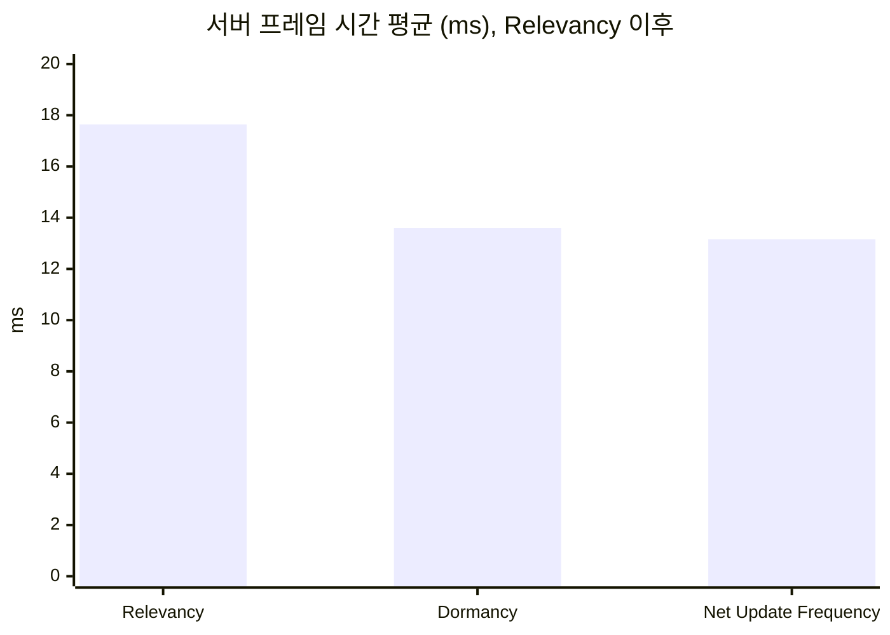
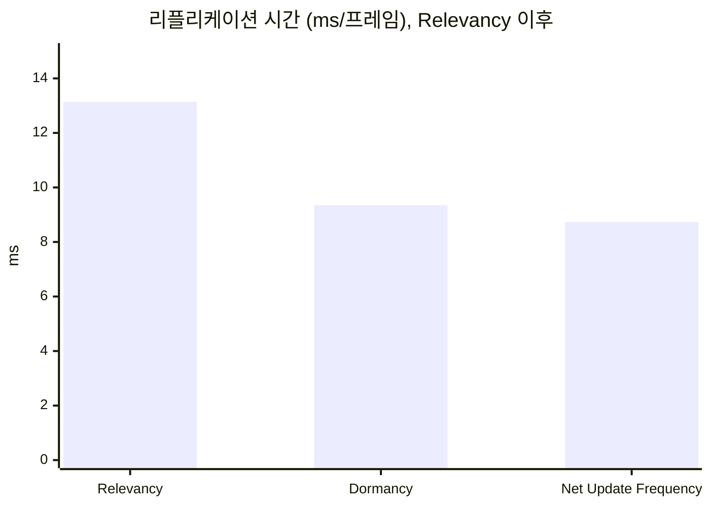
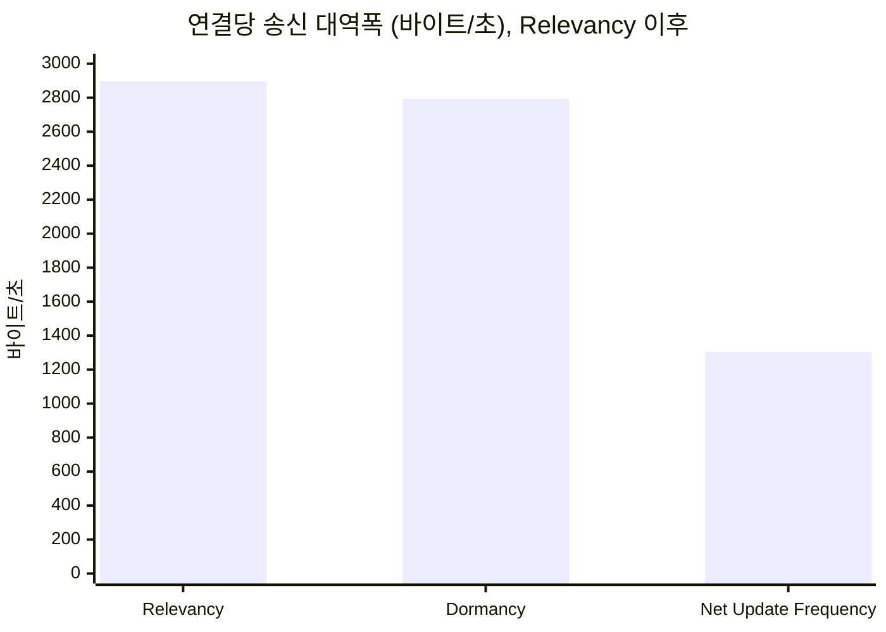

# 누적 수치의 측정 기록

[루트 README](../README.md)가 쓰는 수치의 근거다. README는 유효 숫자 세 자리로 줄여 쓰고, 정밀한 값과 실행 라벨은 여기에 둔다. 구성마다의 실행별 값과 계산식은 각 포스팅의 측정 기록에 있다. README의 "결과 한눈에 보기"는 2막 일곱 단계의 수치다(2026-10-07부터). 그 전에 쓰던 2막 여섯 단계의 수치는 "2막: 여섯 단계"에, 2막 세 단계의 수치는 "2막: 1막의 세 단계"에, 1막의 수치는 "1막"에 남긴다.

## 2막: 일곱 단계

README의 "결과 한눈에 보기"가 2026-10-07부터 쓰는 수치다. 포스팅 11(⑦)을 단계로 더하면서 여덟 구성을 다시 쟀다(2026-10-07 사용자 결정, [AGENTS.md](../AGENTS.md) "규칙").

| 구성(README의 단계 이름) | 실행 라벨 | 2막 요소 인자에 더한 인자 | 그 단계를 다룬 글 |
| --- | --- | --- | --- |
| 기준선 | `act2-all-baseline2` | `-AlwaysRelevant -NoNodeDormancy -NpcUpdateFrequency 100` | [테스트베드 확장과 새 기준선](05-expanded-testbed/README.md) |
| ① 거리 판정 | `act2-all-relevancy2` | `-NoNodeDormancy -NpcUpdateFrequency 100` | [1막의 세 최적화를 2막에 다시 적용](06-three-techniques-again/README.md) |
| ② Dormant 상태 | `act2-all-dormancy2` | `-NpcUpdateFrequency 100` | 같은 글 |
| ③ NPC 업데이트 빈도 | `act2-all-npcuf2` | 없음 | 같은 글 |
| ④ 자원 노드 업데이트 빈도 | `act2-all-nodeuf2` | `-NodeUpdateFrequency 2` | [자원 노드의 Net Update Frequency 낮추기](08-node-update-frequency/README.md) |
| ⑤ 인벤토리를 소유자에게만 | `act2-all-invown2` | ④에 `-InventoryOwnerOnly` | [인벤토리를 소유자에게만 보내기](09-inventory-owner-only/README.md) |
| ⑥ 인벤토리 FastArray | `act2-all-fastarr2` | ⑤에 `-InventoryFastArray` | [인벤토리를 FastArray로 보내기](10-inventory-fastarray/README.md) |
| ⑦ NPC 보간 | `act2-all-interp2` | ⑥에 `-NpcInterpDelay 150` | [클라이언트에서 NPC 위치를 보간하기](11-npc-interpolation/README.md) |

- 여덟 구성을 2026-10-07 09:04\~10:07에 구성마다 세 번씩 연달아 쟀다. 본체 화면이었고, 사용자가 무거운 프로그램을 닫은 뒤 실행 중에 PC를 조작하지 않았다. 소스는 `6274fd5`다(포스팅 11과 같다). 빌드는 이미 최신이었다.
- 공통 인자는 STATUS.md "명령"의 확정 명령에 `-Runs 3`과 2막 요소 인자 `-PlayerSpacing 3 -NpcsNearPlayers 50 -StateInterval 5 -InventoryItems 200 -InventoryChurn 4 -Buildings 500 -BuildInterval 1`이다. 모션 기록(`-MotionLog`)은 켜지 않았다.
- 서버 로그의 `lab_config`, `lab_buildings clusters=1 per_cluster=500`, `lab_npcs_near_players clusters=1`을 24개 실행에서 모두 확인했다. ⑦의 클라이언트 명령줄에 `-LabNpcInterpDelay=150`이 있고 ⑥에는 없다(`client0-act2-all-interp2-r2.log`, `client0-act2-all-fastarr2-r2.log`). 모든 실행이 종료 코드 0으로 끝났다.
- 각 글의 값과 섞지 않는다. 이 묶음은 ①을 빼면 각 글의 묶음과 -3.8\~+5.3% 다르다(6절).
- ⑦의 화면 품질(표시 속도 오차, 표시 지연)은 이 묶음에서 재지 않았다. 모션 기록을 켜면 서버가 기록에 시간을 쓰므로, 켠 묶음과 끈 묶음을 섞지 않는다. 품질 수치는 [포스팅 11 측정 기록](11-npc-interpolation/measurements.md) 4절의 `act2-interp-base2`, `act2-interp2`다.

### 1. 구성별 값

서버 프레임 시간과 리플리케이션 시간은 구성마다 `work_avg_ms` 중앙값 실행의 Timing Insights 값이다(`export-insights.ps1`). 실행은 기준선 `r3`, ① `r2`, ② `r1`, ③ `r3`, ④ `r2`, ⑤ `r2`, ⑥ `r2`, ⑦ `r2`다. 연결당 송신 대역폭과 연결당 열린 액터 채널 수는 서버 CSV의 세 실행 중앙값이다(CSV `out_bytes_per_sec_per_conn`, 8개 연결의 평균).

| 지표 | 기준선 | ① 거리 판정 | ② Dormant 상태 | ③ NPC 업데이트 빈도 | ④ 자원 노드 업데이트 빈도 | ⑤ 인벤토리를 소유자에게만 | ⑥ 인벤토리 FastArray | ⑦ NPC 보간 |
| --- | ---: | ---: | ---: | ---: | ---: | ---: | ---: | ---: |
| 서버 프레임 시간 평균(ms) | 222.285 | 44.071 | 20.866 | 17.818 | 8.792 | 8.790 | 8.866 | 8.788 |
| 서버 프레임 시간 P99(ms) | 266.278 | 61.626 | 29.251 | 25.529 | 12.979 | 12.940 | 12.698 | 13.700 |
| 리플리케이션 시간(ms/프레임) | 212.611 | 38.816 | 15.779 | 12.872 | 3.882 | 3.923 | 3.891 | 3.851 |
| 그중 `LabNpc`(ms/프레임) | 28.024 | 4.016 | 2.666 | 0.976 | 0.843 | 0.867 | 0.859 | 0.867 |
| 연결당 송신 대역폭(바이트/초, CSV) | 36,128 | 29,888 | 31,265 | 16,608 | 16,616 | 12,397 | 11,807 | 12,701 |
| 연결당 열린 액터 채널 수 | 5,871 | 695 | 77 | 77 | 77 | 77 | 77 | 77 |
| Consider List 길이(프레임당, 중앙값 실행의 서버 로그) | 5,878.6 | 5,501.9 | 4,058.4 | 3,888.2 | 414.4 | 415.7 | 412.9 | 413.2 |

### 2. CSV 실행별 값

| 라벨 | `frames` | `work_avg_ms` | `work_p99_ms` | `over_budget_frames` | `netflush_avg_ms` | `out_bytes_per_sec_per_conn` | `open_actor_channels_per_conn` | `saturated_ratio` |
| --- | --- | --- | --- | --- | --- | --- | --- | --- |
| `act2-all-baseline2-r1` | 269 | 223.544 | 269.150 | 269 | 214.608 | 35,932 | 5,871 | 0.000 |
| `act2-all-baseline2-r2` | 271 | 221.113 | 262.926 | 271 | 212.143 | 36,243 | 5,871 | 0.000 |
| `act2-all-baseline2-r3` | 270 | 221.928 | 266.099 | 270 | 213.005 | 36,128 | 5,871 | 0.000 |
| 중앙값 | 270 | 221.928 | 266.099 | 270 | 213.005 | 36,128 | 5,871 | 0.000 |
| 변동 폭 | 2 | 2.431 | 6.224 | 2 | 2.465 | 311 | 0 | 0.000 |
| `act2-all-relevancy2-r1` | 1,309 | 45.575 | 60.138 | 1,296 | 40.756 | 29,603 | 695 | 0.000 |
| `act2-all-relevancy2-r2` | 1,359 | 43.878 | 61.443 | 1,328 | 39.133 | 29,888 | 695 | 0.000 |
| `act2-all-relevancy2-r3` | 1,442 | 41.352 | 58.009 | 1,419 | 36.846 | 30,951 | 695 | 0.000 |
| 중앙값 | 1,359 | 43.878 | 60.138 | 1,328 | 39.133 | 29,888 | 695 | 0.000 |
| 변동 폭 | 133 | 4.223 | 3.434 | 123 | 3.910 | 1,348 | 0 | 0.000 |
| `act2-all-dormancy2-r1` | 1,795 | 20.579 | 28.872 | 1 | 16.050 | 31,262 | 77 | 0.000 |
| `act2-all-dormancy2-r2` | 1,796 | 20.910 | 30.021 | 5 | 16.429 | 31,357 | 77 | 0.000 |
| `act2-all-dormancy2-r3` | 1,788 | 20.555 | 28.957 | 2 | 16.126 | 31,265 | 77 | 0.000 |
| 중앙값 | 1,795 | 20.579 | 28.957 | 2 | 16.126 | 31,265 | 77 | 0.000 |
| 변동 폭 | 8 | 0.355 | 1.149 | 4 | 0.379 | 95 | 0 | 0.000 |
| `act2-all-npcuf2-r1` | 1,797 | 17.098 | 25.128 | 1 | 12.745 | 16,639 | 77 | 0.000 |
| `act2-all-npcuf2-r2` | 1,797 | 17.924 | 25.844 | 1 | 13.396 | 16,608 | 77 | 0.000 |
| `act2-all-npcuf2-r3` | 1,787 | 17.537 | 25.210 | 1 | 13.137 | 16,546 | 77 | 0.000 |
| 중앙값 | 1,797 | 17.537 | 25.210 | 1 | 13.137 | 16,608 | 77 | 0.000 |
| 변동 폭 | 10 | 0.826 | 0.716 | 0 | 0.651 | 93 | 0 | 0.000 |
| `act2-all-nodeuf2-r1` | 1,796 | 8.435 | 13.446 | 1 | 4.099 | 16,637 | 77 | 0.000 |
| `act2-all-nodeuf2-r2` | 1,791 | 8.511 | 12.577 | 1 | 4.131 | 16,568 | 77 | 0.000 |
| `act2-all-nodeuf2-r3` | 1,796 | 9.005 | 13.722 | 0 | 4.382 | 16,616 | 77 | 0.000 |
| 중앙값 | 1,796 | 8.511 | 13.446 | 1 | 4.131 | 16,616 | 77 | 0.000 |
| 변동 폭 | 5 | 0.570 | 1.145 | 1 | 0.283 | 69 | 0 | 0.000 |
| `act2-all-invown2-r1` | 1,797 | 8.558 | 12.668 | 0 | 4.068 | 12,417 | 77 | 0.000 |
| `act2-all-invown2-r2` | 1,786 | 8.514 | 12.631 | 1 | 4.178 | 12,397 | 77 | 0.000 |
| `act2-all-invown2-r3` | 1,793 | 8.432 | 11.987 | 1 | 4.040 | 12,387 | 77 | 0.000 |
| 중앙값 | 1,793 | 8.514 | 12.631 | 1 | 4.068 | 12,397 | 77 | 0.000 |
| 변동 폭 | 11 | 0.126 | 0.681 | 1 | 0.138 | 30 | 0 | 0.000 |
| `act2-all-fastarr2-r1` | 1,797 | 8.511 | 13.383 | 0 | 4.044 | 11,813 | 77 | 0.000 |
| `act2-all-fastarr2-r2` | 1,794 | 8.591 | 12.377 | 0 | 4.145 | 11,807 | 77 | 0.000 |
| `act2-all-fastarr2-r3` | 1,797 | 8.684 | 13.601 | 0 | 4.182 | 11,806 | 77 | 0.000 |
| 중앙값 | 1,797 | 8.591 | 13.383 | 0 | 4.145 | 11,807 | 77 | 0.000 |
| 변동 폭 | 3 | 0.173 | 1.224 | 0 | 0.138 | 7 | 0 | 0.000 |
| `act2-all-interp2-r1` | 1,787 | 8.483 | 12.334 | 1 | 4.124 | 12,701 | 77 | 0.000 |
| `act2-all-interp2-r2` | 1,796 | 8.501 | 13.286 | 1 | 4.104 | 12,707 | 77 | 0.000 |
| `act2-all-interp2-r3` | 1,787 | 8.779 | 12.961 | 0 | 4.266 | 12,670 | 77 | 0.000 |
| 중앙값 | 1,787 | 8.501 | 12.961 | 1 | 4.124 | 12,701 | 77 | 0.000 |
| 변동 폭 | 9 | 0.296 | 0.952 | 1 | 0.162 | 37 | 0 | 0.000 |

### 3. README의 수치와 출처

| README의 수치 | 정밀한 값 | 출처 |
| --- | --- | --- |
| 서버 프레임 시간 평균 222ms → 8.87ms(여섯 단계) | 222.285ms → 8.866ms(⑥, -96.0%) | 1절 |
| 틱 예산 33.3ms, 6.7배를 쓰다가 약 4분의 1 | 222.285 ÷ 33.333 = 6.67, 8.866 ÷ 33.333 = 0.266 | 틱 예산은 1000 ÷ `NetServerMaxTickRate` 30(`Engine/Config/BaseEngine.ini:1867`) |
| 표와 두 차트의 값 | 1절 | 같음 |
| ① 150m, ③ 100에서 10으로 | `NetCullDistanceSquared` 225,000,000(`Engine/Source/Runtime/Engine/Private/Actor.cpp:312`), `NetUpdateFrequency` 기본값 100(`Actor.cpp:295-296`), NPC 10(`Source/DSOptLab/LabScenarioConfig.h:40`) | 엔진 소스, 코드 |
| ④ 100에서 2로, 16프레임에 한 번 | `-LabNodeUpdateFrequency=2`(`Source/DSOptLab/LabResourceNode.cpp`의 `SetNetUpdateFrequency`). 다음 고려 시각이 500\~533ms 뒤라 16프레임마다 | [포스팅 8 측정 기록](08-node-update-frequency/measurements.md) 2절 |
| ⑤ 조종하는 플레이어에게만(`COND_OwnerOnly`) | `COND_OwnerOnly`(`Engine/Source/Runtime/CoreUObject/Public/UObject/CoreNetTypes.h:20`), 캐릭터의 소유자 연결은 조종하는 플레이어의 연결 | [포스팅 9 측정 기록](09-inventory-owner-only/measurements.md) 2절 |
| ⑥ 칸에 번호를 붙여 바뀐 칸만(`FFastArraySerializer`) | `FFastArraySerializerItem`의 `ReplicationID`, `BuildChangedAndDeletedBuffers` | [포스팅 10 측정 기록](10-inventory-fastarray/measurements.md) 2절 |
| ⑦ 받은 위치 두 개 사이를 150ms 늦게, 서버 프레임 번호 | `-LabNpcInterpDelay=150`, `ALabNpc`의 `ServerFrame`(`uint8`, 서버 프레임 번호의 아래 8비트) | [포스팅 11 측정 기록](11-npc-interpolation/measurements.md) 2절, `Source/DSOptLab/LabNpc.h` |
| ①은 같은 구성이 35.9ms였다 | 35.904ms(`act2-relevancy1-r2`, 2026-10-05) | 아래 "2막: 1막의 세 단계" 1절 |
| ①이 잰 날마다 크게 다르다, 프레임이 길어지면 고려할 시각이 된 액터가 늘어 다시 길어진다 | 5절 | 아래 "2막: 여섯 단계" 5절, engine-notes.md 12절 |
| ①의 연결당 송신 대역폭이 ②보다 작다 | 29,888 대 31,265. 60초의 `frames` 1,359 대 1,795 | 2절 |
| ②가 서버 프레임 시간을 절반 넘게 더 줄였다 | 20.866 ÷ 44.071 − 1 = -52.7% | 1절, 4절 |
| ④가 서버 프레임 시간을 절반으로 줄였다 | 8.792 ÷ 17.818 − 1 = -50.7% | 1절, 4절 |
| 먼 자원 노드는 Dormant 상태가 되지 못하고 프레임마다 Consider List에 든다 | 포스팅 7, 8의 결과. 이 묶음의 Consider List 3,888.2 → 414.4(③ → ④) | [포스팅 8 측정 기록](08-node-update-frequency/measurements.md), 1절 |
| ③은 연결당 송신 대역폭을 47% 줄였다 | 16,608 ÷ 31,265 − 1 = -46.9% | 1절, 4절 |
| ⑤는 4분의 1을, ⑥은 약 5%를 더 줄였다 | 12,397 ÷ 16,616 − 1 = -25.4%, 11,807 ÷ 12,397 − 1 = -4.8% | 1절, 4절 |
| ⑤와 ⑥의 서버 프레임 시간 변화는 구별되지 않았다 | 4절 | 같음 |
| ⑦: NPC 하나의 위치가 약 134ms마다 오고, NPC가 약 40cm를 건너뛴다 | 수신 간격 평균 133.6ms(`act2-interp-base2` 중앙값), 300cm/s × 0.1336 = 40.1cm | [포스팅 11 측정 기록](11-npc-interpolation/measurements.md) 2절, 4절 |
| ⑦: 표시 속도 오차 평균 440cm/s → 15.0cm/s | 중앙값 439.9 → 15.0(`act2-interp-base2`, `act2-interp2`, 모션 기록을 켠 묶음). 표시 속도 오차는 클라이언트 프레임 한 칸 동안 화면 속 NPC의 속도와 서버 NPC의 속도의 차다([ADR-0020](../Docs/Decisions/0020-npc-motion-quality-metrics.md)) | 포스팅 11 측정 기록 4절 |
| ⑦: NPC가 81ms 더 늦게 보인다 | 표시 지연 중앙값 74 → 155ms. 155 − 74 = 81 | 포스팅 11 측정 기록 4절 |
| ⑦: 연결당 송신 대역폭 7.6% 증가 | 12,701 ÷ 11,807 − 1 = 7.57%. 포스팅 11의 묶음에서는 11,820 → 12,682(+7.29%)였다 | 1절, 4절, 포스팅 11 측정 기록 3절 |
| ⑦: 서버 프레임 시간의 변화는 구별되지 않았다 | 4절 | 같음 |
| 건축물 500개 | `-Buildings 500` | 위 공통 인자 |
| 지도: 자리, 경로, 150m 원, 건축물이 놓이는 반지름 | `Scripts/make-relevancy-map.ps1 -Act2` | [1막의 세 최적화를 2막에 다시 적용의 측정 기록](06-three-techniques-again/measurements.md) 2절 |
| 클라이언트 8개의 창, 서버는 논리 프로세서 2\~7, 클라이언트는 8번부터 | 서버 마스크 252, 클라이언트 마스크 4294967040 | 화면은 시각 자료 전용 실행 `visual13-r1`(2026-10-05, 2막 구성, ①\~③ 적용)의 측정 구간에서 찍었다. [테스트베드 확장의 측정 기록](05-expanded-testbed/measurements.md) 11절. 마스크는 [ADR-0009](../Docs/Decisions/0009-server-cores-without-dpc-load.md) |
| 맵 2km, 플레이어 여덟 명이 3m 간격으로 모여 서로 다른 방향으로 돈다 | 바닥 2km, `-PlayerSpacing 3`, 한 변 70m 정사각형, 홀수 자리는 반대 방향 | [2막 설계](../Docs/Planning/2026-10-03-act-2-design.md) 3.1, `Source/DSOptLab/LabGameMode.cpp`의 `GetSlotLocation` |
| 요소 표: 자원 노드 5,001, NPC 350(맵 300, 플레이어 곁 50), 건축물 500(1초마다 하나), 인벤토리 200칸, 상태 값 | 2막 확정값 | [STATUS.md](../Docs/STATUS.md) "확정할 값"의 2막 줄, [테스트베드 확장과 새 기준선](05-expanded-testbed/README.md) "무엇을 더했는가" |
| UE 프로세스의 메모리 합계 27.5GB | 같음 | [테스트베드의 측정 기록](00-testbed/measurements.md) 1절(`calib-a-r1`, 1막 규모) |

### 4. 단계별 변화

각 단계는 바로 앞 구성과 비교한다. 비율은 1절의 Insights 값으로, 연결당 송신 대역폭은 CSV 중앙값으로 계산했다. "구별되지 않음"은 CSV 중앙값의 변화가 두 구성 중 큰 쪽의 변동 폭보다 작다는 뜻이다(2절).

| 단계 | 줄어든 것 | 구별되지 않음 |
| --- | --- | --- |
| ① 거리 판정 | 서버 프레임 시간 평균 -80.2%, P99 -76.9%, 리플리케이션 시간 -81.7%, 연결당 송신 대역폭 -17.3%(CSV -6,240, 변동 폭 1,348), 연결당 열린 액터 채널 수 5,871 → 695 | 없음 |
| ② Dormant 상태 | 서버 프레임 시간 평균 -52.7%, P99 -52.5%, 리플리케이션 시간 -59.3%, 연결당 열린 액터 채널 수 695 → 77. 연결당 송신 대역폭은 +4.6%(CSV +1,377, 변동 폭 1,348)로 늘었다 | 없음 |
| ③ NPC 업데이트 빈도 | 연결당 송신 대역폭 -46.9%, 서버 프레임 시간 평균 -14.6%(CSV -3.042, 변동 폭 0.826), P99 -12.7%, 리플리케이션 시간 -18.4% | 없음 |
| ④ 자원 노드 업데이트 빈도 | 서버 프레임 시간 평균 -50.7%, P99 -49.2%, 리플리케이션 시간 -69.8%, Consider List 3,888.2 → 414.4 | 연결당 송신 대역폭(CSV +8, 변동 폭 93) |
| ⑤ 인벤토리를 소유자에게만 | 연결당 송신 대역폭 -25.4% | 서버 프레임 시간 평균(Insights -0.0%. CSV +0.003, 변동 폭 0.570), 리플리케이션 시간(CSV `netflush_avg_ms` -0.063, 변동 폭 0.283) |
| ⑥ 인벤토리 FastArray | 연결당 송신 대역폭 -4.8%(CSV -590, 변동 폭 30) | 서버 프레임 시간 평균(Insights +0.9%. CSV +0.077, 변동 폭 0.173), 리플리케이션 시간(CSV `netflush_avg_ms` +0.077, 변동 폭 0.138) |
| ⑦ NPC 보간 | 없음. 연결당 송신 대역폭은 +7.6%(CSV +894, 변동 폭 37)로 늘었다 | 서버 프레임 시간 평균(Insights -0.9%. CSV -0.090, 변동 폭 0.296), 리플리케이션 시간(CSV `netflush_avg_ms` -0.021, 변동 폭 0.162), `LabNpc`(0.859 → 0.867ms/프레임) |

②의 연결당 송신 대역폭 증가(+1,377)는 ①의 변동 폭(1,348)을 겨우 넘는다. ①의 서버가 60초에 1,359프레임만 돌아 보낸 것이 적었기 때문이다(②는 1,795프레임). ⑦의 증가는 NPC 갱신마다 붙는 서버 프레임 번호다. 포스팅 11은 갱신 한 번이 101비트에서 117비트가 된 것을 Networking Insights로 확인했다([포스팅 11 측정 기록](11-npc-interpolation/measurements.md) 5.1절).

### 5. ①

이 묶음의 ①은 41.352\~45.575ms(`work_avg_ms`)이고, 중앙값 실행의 Consider List는 5,501.9로 활성 목록 5,885개보다 조금 짧다. 같은 구성의 Insights 서버 프레임 시간 평균은 2026-10-05에 35.904ms, 2026-10-06에 55.079ms였다. ①은 틱 예산을 조금 넘어 잰 날의 PC 상태에 따라 크게 달라진다. 이유는 아래 "2막: 여섯 단계" 5절에 있다.

### 6. 각 글의 값과의 차이

| 구성 | 이 묶음의 `work_avg_ms` 중앙값 | 그 구성을 잰 다른 묶음 | 차이 |
| --- | ---: | --- | ---: |
| 기준선 | 221.928 | 213.555(`act2-baseline11`, 2026-10-05) | +3.9% |
| ① 거리 판정 | 43.878 | 35.674(`act2-relevancy1`, 2026-10-05) | +23.0% |
| ② Dormant 상태 | 20.579 | 19.536(`act2-dormancy1`, 2026-10-05) | +5.3% |
| ③ NPC 업데이트 빈도 | 17.537 | 18.060(`act2-nodeuf-base1`, 2026-10-06) | -2.9% |
| ④ 자원 노드 업데이트 빈도 | 8.511 | 8.615(`act2-nodeuf1`, 2026-10-06) | -1.2% |
| ⑤ 인벤토리를 소유자에게만 | 8.514 | 8.852(`act2-fastarr-base1`, 2026-10-06) | -3.8% |
| ⑥ 인벤토리 FastArray | 8.591 | 8.586(`act2-fastarr1`, 2026-10-06) | +0.1% |
| ⑦ NPC 보간 | 8.501 | 8.616(`act2-interp2`, 2026-10-07, 모션 기록을 켬) | -1.3% |

지난 묶음 `act2-all-*1`은 ④\~⑥이 각 글의 묶음보다 4\~12% 컸다("2막: 여섯 단계" 6절). 그때는 다른 프로그램이 떠 있었다([Worklog/10-inventory-fastarray.md](../Docs/Worklog/10-inventory-fastarray.md) "README와 시각화 페이지 갱신"). 이 묶음은 ①을 빼면 각 글의 묶음과 -3.8\~+5.3% 다르다.

## 2막: 여섯 단계

README의 "결과 한눈에 보기"가 2026-10-06부터 2026-10-07까지 쓰던 수치다. 아래 3절의 "README의 수치"는 그때의 README를 가리킨다.

| 구성(README의 단계 이름) | 실행 라벨 | 2막 요소 인자에 더한 인자 | 그 단계를 다룬 글 |
| --- | --- | --- | --- |
| 기준선 | `act2-all-baseline1` | `-AlwaysRelevant -NoNodeDormancy -NpcUpdateFrequency 100` | [테스트베드 확장과 새 기준선](05-expanded-testbed/README.md) |
| ① 거리 판정 | `act2-all-relevancy1` | `-NoNodeDormancy -NpcUpdateFrequency 100` | [1막의 세 최적화를 2막에 다시 적용](06-three-techniques-again/README.md) |
| ② Dormant 상태 | `act2-all-dormancy1` | `-NpcUpdateFrequency 100` | 같은 글 |
| ③ NPC 업데이트 빈도 | `act2-all-npcuf1` | 없음 | 같은 글 |
| ④ 자원 노드 업데이트 빈도 | `act2-all-nodeuf1` | `-NodeUpdateFrequency 2` | [자원 노드의 Net Update Frequency 낮추기](08-node-update-frequency/README.md) |
| ⑤ 인벤토리를 소유자에게만 | `act2-all-invown1` | ④에 `-InventoryOwnerOnly` | [인벤토리를 소유자에게만 보내기](09-inventory-owner-only/README.md) |
| ⑥ 인벤토리 FastArray | `act2-all-fastarr1` | ⑤에 `-InventoryFastArray` | [인벤토리를 FastArray로 보내기](10-inventory-fastarray/README.md) |

- 일곱 구성을 2026-10-06 19:56\~20:52에 구성마다 세 번씩 연달아 쟀다. 본체 화면이었고 실행 중에 PC를 조작하지 않았다. 소스는 `243be3d`다(포스팅 10과 같다).
- 공통 인자는 STATUS.md "명령"의 확정 명령에 `-Runs 3`과 2막 요소 인자 `-PlayerSpacing 3 -NpcsNearPlayers 50 -StateInterval 5 -InventoryItems 200 -InventoryChurn 4 -Buildings 500 -BuildInterval 1`이다.
- 서버 로그의 `lab_config`, `lab_buildings clusters=1 per_cluster=500`, `lab_npcs_near_players clusters=1`을 21개 실행에서 모두 확인했다. 모든 실행이 종료 코드 0으로 끝났다.
- 각 글의 값과 섞지 않는다. 같은 소스인 포스팅 10의 묶음보다 ④\~⑥의 `work_avg_ms`가 4\~12% 크다(6절). ①은 실행마다 크게 흔들린다(5절).

### 1. 구성별 값

서버 프레임 시간과 리플리케이션 시간은 구성마다 `work_avg_ms` 중앙값 실행의 Timing Insights 값이다(`export-insights.ps1`). 실행은 기준선 `r1`, ① `r3`, ② `r3`, ③ `r2`, ④ `r2`, ⑤ `r3`, ⑥ `r2`다. 연결당 송신 대역폭과 연결당 열린 액터 채널 수는 서버 CSV의 세 실행 중앙값이다. 연결당 송신 대역폭은 2026-10-05의 표와 출처가 다르다. 그 표는 Networking Insights의 `Connection 0`이었고, 이 표는 CSV `out_bytes_per_sec_per_conn`(8개 연결의 평균)이다. 일곱 구성의 창을 열어 읽지 않으려고 바꿨다. 같은 실행에서 두 값은 5% 다를 수 있다(포스팅 9 `act2-invown-base1`: `Connection 0` 15,864, CSV 16,635).

| 지표 | 기준선 | ① 거리 판정 | ② Dormant 상태 | ③ NPC 업데이트 빈도 | ④ 자원 노드 업데이트 빈도 | ⑤ 인벤토리를 소유자에게만 | ⑥ 인벤토리 FastArray |
| --- | ---: | ---: | ---: | ---: | ---: | ---: | ---: |
| 서버 프레임 시간 평균(ms) | 245.131 | 55.079 | 24.501 | 19.985 | 9.451 | 9.800 | 9.219 |
| 서버 프레임 시간 P99(ms) | 283.858 | 80.956 | 39.452 | 31.471 | 14.854 | 16.798 | 13.866 |
| 리플리케이션 시간(ms/프레임) | 235.055 | 49.374 | 19.032 | 14.783 | 4.312 | 4.473 | 4.196 |
| 연결당 송신 대역폭(바이트/초, CSV) | 33,233 | 26,504 | 31,110 | 16,510 | 16,513 | 12,294 | 11,731 |
| 연결당 열린 액터 채널 수 | 5,871 | 695 | 77 | 77 | 77 | 77 | 77 |
| Consider List 길이(프레임당, 중앙값 실행의 서버 로그) | 5,878.6 | 5,876.2 | 4,092.8 | 3,892.9 | 413.2 | 415.6 | 415.2 |

### 2. CSV 실행별 값

| 라벨 | `frames` | `work_avg_ms` | `work_p99_ms` | `over_budget_frames` | `netflush_avg_ms` | `out_bytes_per_sec_per_conn` | `open_actor_channels_per_conn` | `saturated_ratio` |
| --- | --- | --- | --- | --- | --- | --- | --- | --- |
| `act2-all-baseline1-r1` | 245 | 245.187 | 283.622 | 245 | 235.854 | 33,233 | 5,871 | 0.000 |
| `act2-all-baseline1-r2` | 225 | 266.852 | 332.072 | 225 | 256.201 | 31,047 | 5,871 | 0.000 |
| `act2-all-baseline1-r3` | 246 | 244.364 | 292.108 | 246 | 234.947 | 33,324 | 5,871 | 0.000 |
| 중앙값 | 245 | 245.187 | 292.108 | 245 | 235.854 | 33,233 | 5,871 | 0.000 |
| 변동 폭 | 21 | 22.488 | 48.450 | 21 | 21.254 | 2,277 | 0 | 0.000 |
| `act2-all-relevancy1-r1` | 1,159 | 51.549 | 72.384 | 1,159 | 46.676 | 27,851 | 695 | 0.000 |
| `act2-all-relevancy1-r2` | 931 | 64.203 | 93.332 | 931 | 57.978 | 23,465 | 695 | 0.000 |
| `act2-all-relevancy1-r3` | 1,089 | 54.860 | 80.674 | 1,089 | 49.690 | 26,504 | 695 | 0.000 |
| 중앙값 | 1,089 | 54.860 | 80.674 | 1,089 | 49.690 | 26,504 | 695 | 0.000 |
| 변동 폭 | 228 | 12.654 | 20.948 | 228 | 11.302 | 4,386 | 0 | 0.000 |
| `act2-all-dormancy1-r1` | 1,765 | 27.276 | 40.654 | 188 | 22.224 | 31,044 | 77 | 0.000 |
| `act2-all-dormancy1-r2` | 1,782 | 23.199 | 34.643 | 30 | 18.512 | 31,192 | 77 | 0.000 |
| `act2-all-dormancy1-r3` | 1,775 | 24.201 | 39.064 | 88 | 19.329 | 31,110 | 77 | 0.000 |
| 중앙값 | 1,775 | 24.201 | 39.064 | 88 | 19.329 | 31,110 | 77 | 0.000 |
| 변동 폭 | 17 | 4.077 | 6.011 | 158 | 3.712 | 148 | 0 | 0.000 |
| `act2-all-npcuf1-r1` | 1,791 | 20.516 | 33.000 | 16 | 15.691 | 16,547 | 77 | 0.000 |
| `act2-all-npcuf1-r2` | 1,785 | 19.695 | 31.132 | 8 | 15.058 | 16,510 | 77 | 0.000 |
| `act2-all-npcuf1-r3` | 1,786 | 19.289 | 28.325 | 4 | 14.737 | 16,487 | 77 | 0.000 |
| 중앙값 | 1,786 | 19.695 | 31.132 | 8 | 15.058 | 16,510 | 77 | 0.000 |
| 변동 폭 | 6 | 1.227 | 4.675 | 12 | 0.954 | 60 | 0 | 0.000 |
| `act2-all-nodeuf1-r1` | 1,797 | 9.036 | 14.509 | 1 | 4.624 | 16,489 | 77 | 0.000 |
| `act2-all-nodeuf1-r2` | 1,796 | 9.163 | 14.485 | 1 | 4.586 | 16,520 | 77 | 0.000 |
| `act2-all-nodeuf1-r3` | 1,784 | 9.419 | 15.009 | 1 | 4.722 | 16,513 | 77 | 0.000 |
| 중앙값 | 1,796 | 9.163 | 14.509 | 1 | 4.624 | 16,513 | 77 | 0.000 |
| 변동 폭 | 13 | 0.383 | 0.524 | 0 | 0.136 | 31 | 0 | 0.000 |
| `act2-all-invown1-r1` | 1,796 | 8.893 | 13.765 | 1 | 4.316 | 12,298 | 77 | 0.000 |
| `act2-all-invown1-r2` | 1,783 | 9.599 | 14.894 | 1 | 4.833 | 12,287 | 77 | 0.000 |
| `act2-all-invown1-r3` | 1,783 | 9.472 | 16.257 | 1 | 4.738 | 12,294 | 77 | 0.000 |
| 중앙값 | 1,783 | 9.472 | 14.894 | 1 | 4.738 | 12,294 | 77 | 0.000 |
| 변동 폭 | 13 | 0.706 | 2.492 | 0 | 0.517 | 11 | 0 | 0.000 |
| `act2-all-fastarr1-r1` | 1,785 | 9.387 | 13.807 | 1 | 4.691 | 11,718 | 77 | 0.000 |
| `act2-all-fastarr1-r2` | 1,786 | 8.937 | 13.380 | 1 | 4.459 | 11,731 | 77 | 0.000 |
| `act2-all-fastarr1-r3` | 1,786 | 8.763 | 12.896 | 1 | 4.314 | 11,733 | 77 | 0.000 |
| 중앙값 | 1,786 | 8.937 | 13.380 | 1 | 4.459 | 11,731 | 77 | 0.000 |
| 변동 폭 | 1 | 0.624 | 0.911 | 0 | 0.377 | 15 | 0 | 0.000 |

### 3. README의 수치와 출처

| README의 수치 | 정밀한 값 | 출처 |
| --- | --- | --- |
| 서버 프레임 시간 평균 245ms → 9.2ms | 245.131ms → 9.219ms(-96.2%) | 1절 |
| 틱 예산 33.3ms, 7배 넘게 쓰다가 3분의 1이 안 되게 | 245.131 ÷ 33.333 = 7.35, 9.219 ÷ 33.333 = 0.277 | 틱 예산은 1000 ÷ `NetServerMaxTickRate` 30(`Engine/Config/BaseEngine.ini:1867`) |
| 표와 두 차트의 값 | 1절 | 같음 |
| ① 150m, ③ 100에서 10으로 | `NetCullDistanceSquared` 225,000,000(`Engine/Source/Runtime/Engine/Private/Actor.cpp:312`), `NetUpdateFrequency` 기본값 100(`Actor.cpp:295-296`), NPC 10(`Source/DSOptLab/LabScenarioConfig.h:40`) | 엔진 소스, 코드 |
| ④ 100에서 2로, 16프레임에 한 번 | `-LabNodeUpdateFrequency=2`(`Source/DSOptLab/LabResourceNode.cpp`의 `SetNetUpdateFrequency`). 다음 고려 시각이 500\~533ms 뒤라 16프레임마다 | [포스팅 8 측정 기록](08-node-update-frequency/measurements.md) 2절 |
| ⑤ 조종하는 플레이어에게만(`COND_OwnerOnly`) | `COND_OwnerOnly`(`Engine/Source/Runtime/CoreUObject/Public/UObject/CoreNetTypes.h:20`), 캐릭터의 소유자 연결은 조종하는 플레이어의 연결 | [포스팅 9 측정 기록](09-inventory-owner-only/measurements.md) 2절 |
| ⑥ 칸에 번호를 붙여 바뀐 칸만(`FFastArraySerializer`) | `FFastArraySerializerItem`의 `ReplicationID`, `BuildChangedAndDeletedBuffers` | [포스팅 10 측정 기록](10-inventory-fastarray/measurements.md) 2절 |
| ①은 같은 구성이 35.9ms였다 | 35.904ms(`act2-relevancy1-r2`, 2026-10-05) | 아래 "2막: 1막의 세 단계" 1절 |
| ①이 흔들린다, 프레임이 길어지면 고려할 시각이 된 액터가 늘어 다시 길어진다 | 5절 | engine-notes.md 12절 |
| ①의 연결당 송신 대역폭이 ②보다 작다 | 26,504 대 31,110. 60초의 `frames` 1,089 대 1,775 | 2절 |
| ②가 서버 프레임 시간을 절반 넘게 더 줄였다 | 24.501 ÷ 55.079 − 1 = -55.5% | 1절, 4절 |
| ④가 서버 프레임 시간을 절반으로 줄였다 | 9.451 ÷ 19.985 − 1 = -52.7% | 1절, 4절 |
| 먼 자원 노드는 Dormant 상태가 되지 못하고 프레임마다 Consider List에 든다 | 포스팅 7, 8의 결과. 이 묶음의 Consider List 3,892.9 → 413.2(③ → ④) | [포스팅 8 측정 기록](08-node-update-frequency/measurements.md), 1절 |
| ③은 연결당 송신 대역폭을 47% 줄였다 | 16,510 ÷ 31,110 − 1 = -46.9% | 1절, 4절 |
| ⑤는 4분의 1을, ⑥은 약 5%를 더 줄였다 | 12,294 ÷ 16,513 − 1 = -25.5%, 11,731 ÷ 12,294 − 1 = -4.6% | 1절, 4절 |
| ⑤와 ⑥의 서버 프레임 시간 변화는 구별되지 않았다 | 4절 | 같음 |
| 건축물 500개 | `-Buildings 500` | 위 공통 인자 |
| 지도: 자리, 경로, 150m 원, 건축물이 놓이는 반지름 | `Scripts/make-relevancy-map.ps1 -Act2` | [1막의 세 최적화를 2막에 다시 적용의 측정 기록](06-three-techniques-again/measurements.md) 2절 |
| 클라이언트 8개의 창, 서버는 논리 프로세서 2\~7, 클라이언트는 8번부터 | 서버 마스크 252, 클라이언트 마스크 4294967040 | 화면은 시각 자료 전용 실행 `visual13-r1`(2026-10-05, 2막 구성, ①\~③ 적용)의 측정 구간에서 찍었다. [테스트베드 확장의 측정 기록](05-expanded-testbed/measurements.md) 11절. 마스크는 [ADR-0009](../Docs/Decisions/0009-server-cores-without-dpc-load.md) |
| 맵 2km, 플레이어 여덟 명이 3m 간격으로 모여 서로 다른 방향으로 돈다 | 바닥 2km, `-PlayerSpacing 3`, 한 변 70m 정사각형, 홀수 자리는 반대 방향 | [2막 설계](../Docs/Planning/2026-10-03-act-2-design.md) 3.1, `Source/DSOptLab/LabGameMode.cpp`의 `GetSlotLocation` |
| 요소 표: 자원 노드 5,001, NPC 350(맵 300, 플레이어 곁 50), 건축물 500(1초마다 하나), 인벤토리 200칸, 상태 값 | 2막 확정값 | [STATUS.md](../Docs/STATUS.md) "확정할 값"의 2막 줄, [테스트베드 확장과 새 기준선](05-expanded-testbed/README.md) "무엇을 더했는가" |
| UE 프로세스의 메모리 합계 27.5GB | 같음 | [테스트베드의 측정 기록](00-testbed/measurements.md) 1절(`calib-a-r1`, 1막 규모) |

### 4. 단계별 변화

각 단계는 바로 앞 구성과 비교한다. 비율은 1절의 Insights 값으로, 연결당 송신 대역폭은 CSV 중앙값으로 계산했다. "구별되지 않음"은 CSV 중앙값의 변화가 두 구성 중 큰 쪽의 변동 폭보다 작다는 뜻이다(2절).

| 단계 | 줄어든 것 | 구별되지 않음 |
| --- | --- | --- |
| ① 거리 판정 | 서버 프레임 시간 평균 -77.5%, P99 -71.5%, 리플리케이션 시간 -79.0%, 연결당 송신 대역폭 -20.2%(CSV -6,729, 변동 폭 4,386), 연결당 열린 액터 채널 수 5,871 → 695 | 없음 |
| ② Dormant 상태 | 서버 프레임 시간 평균 -55.5%, P99 -51.3%, 리플리케이션 시간 -61.5%, 연결당 열린 액터 채널 수 695 → 77. 연결당 송신 대역폭은 +17.4%(CSV +4,606, 변동 폭 4,386)로 늘었다 | 없음 |
| ③ NPC 업데이트 빈도 | 연결당 송신 대역폭 -46.9%, 서버 프레임 시간 평균 -18.4%(CSV -4.506, 변동 폭 4.077), P99 -20.2%, 리플리케이션 시간 -22.3% | 없음 |
| ④ 자원 노드 업데이트 빈도 | 서버 프레임 시간 평균 -52.7%, P99 -52.8%, 리플리케이션 시간 -70.8%, Consider List 3,892.9 → 413.2 | 연결당 송신 대역폭(CSV +3, 변동 폭 60) |
| ⑤ 인벤토리를 소유자에게만 | 연결당 송신 대역폭 -25.5% | 서버 프레임 시간 평균(Insights +3.7%. CSV +0.309, 변동 폭 0.706), 리플리케이션 시간(CSV `netflush_avg_ms` +0.114, 변동 폭 0.517) |
| ⑥ 인벤토리 FastArray | 연결당 송신 대역폭 -4.6%(CSV -563, 변동 폭 15) | 서버 프레임 시간 평균(Insights -5.9%. CSV -0.535, 변동 폭 0.706), 리플리케이션 시간(CSV `netflush_avg_ms` -0.279, 변동 폭 0.517) |

①과 ③의 일부 변화는 변동 폭을 겨우 넘는다. ②의 연결당 송신 대역폭이 늘어난 것은 ①의 서버가 60초에 1,089프레임만 돌아 보낸 것이 적었기 때문이다(②는 1,775프레임). [1막의 세 최적화를 2막에 다시 적용](06-three-techniques-again/README.md)에서는 ①이 1,640프레임을 돌았고 ②의 변화(+0.2%)가 구별되지 않았다.

### 5. ①이 흔들리는 이유

①의 서버는 틱 예산 33.3ms를 조금 넘는다. 이런 구성에서는 프레임이 길어질수록 다음 고려 시각이 된 액터가 늘어 Consider List가 길어지고, 프레임이 다시 길어진다. 프레임이 43.3ms를 넘으면 빈도 100인 활성 목록의 액터가 모두 매 프레임 든다(engine-notes.md 12절). 이 묶음의 ①은 Consider List가 5,876.2로 활성 목록 5,885개와 거의 같다. 2026-10-05의 ①은 35.904ms였다.

같은 날 같은 구성을 소스만 바꿔 쟀더니 `243be3d`는 49.510\~50.061ms, 포스팅 6의 소스는 37.320\~39.477ms였다(`act2-all-check2`, `act2-all-check-old2`, 각 세 번). `243be3d`는 이 구성에서 새로 하는 일이 없다. 경위와 나머지 진단 실행은 [Worklog/10-inventory-fastarray.md](../Docs/Worklog/10-inventory-fastarray.md) "README와 시각화 페이지 갱신"에 있다.

②부터는 서버가 틱 예산 안이라 프레임 간격이 33.3ms로 고정되고, 기준선은 이미 245ms라 모든 액터가 매 프레임 든다. 그래서 이 되먹임은 ①에만 해당한다.

### 6. 각 글의 값과의 차이

| 구성 | 이 묶음의 `work_avg_ms` 중앙값 | 그 구성을 잰 다른 묶음 | 차이 |
| --- | ---: | --- | ---: |
| 기준선 | 245.187 | 213.555(`act2-baseline11`, 2026-10-05) | +14.8% |
| ① 거리 판정 | 54.860 | 35.674(`act2-relevancy1`, 2026-10-05) | +53.8% |
| ② Dormant 상태 | 24.201 | 19.536(`act2-dormancy1`, 2026-10-05) | +23.9% |
| ③ NPC 업데이트 빈도 | 19.695 | 18.060(`act2-nodeuf-base1`, 2026-10-06) | +9.1% |
| ④ 자원 노드 업데이트 빈도 | 9.163 | 8.615(`act2-nodeuf1`, 2026-10-06) | +6.4% |
| ⑤ 인벤토리를 소유자에게만 | 9.472 | 8.852(`act2-fastarr-base1`, 2026-10-06, 소스 `243be3d`) | +7.0% |
| ⑥ 인벤토리 FastArray | 8.937 | 8.586(`act2-fastarr1`, 2026-10-06, 소스 `243be3d`) | +4.1% |

⑤와 ⑥은 같은 소스를 세 시간 전에 잰 묶음보다 4\~7% 크다. PC 상태가 달라진 것으로 보고, 원인은 확인하지 않았다. 그래서 이 묶음의 값은 이 묶음 안에서만 비교한다.

## 2막: 1막의 세 단계

README의 "결과 한눈에 보기"가 2026-10-05부터 2026-10-06까지 쓰던 수치다. 아래 표의 "README의 수치"는 그때의 README를 가리킨다.

| 구성(README의 단계 이름) | 실행 라벨 | 측정 기록 |
| --- | --- | --- |
| 기준선 | `act2-baseline11` | [1막의 세 최적화를 2막에 다시 적용](06-three-techniques-again/measurements.md) |
| ① 거리 판정 | `act2-relevancy1` | 같은 문서 |
| ② Dormant 상태 | `act2-dormancy1` | 같은 문서 |
| ③ NPC 업데이트 빈도 | `act2-update-frequency1` | 같은 문서 |

네 구성을 2026-10-05에 구성마다 세 번씩 연달아 쟀다. 조건과 실행 경위는 위 측정 기록의 1절, Insights 값은 [관찰 자료](06-three-techniques-again/candidates.md)에 있다. [테스트베드 확장과 새 기준선](05-expanded-testbed/measurements.md)의 `act2-baseline1`은 같은 기준선을 다른 날 잰 묶음이라 이 표와 섞지 않는다.

### 1. 구성별 값

서버 프레임 시간과 리플리케이션 시간은 구성마다 `work_avg_ms` 중앙값 실행의 Timing Insights 값이다(`act2-baseline11-r2`, `act2-relevancy1-r2`, `act2-dormancy1-r2`, `act2-update-frequency1-r1`). 연결당 송신 대역폭은 같은 실행의 Networking Insights `Connection 0`이고, 연결당 열린 액터 채널 수는 서버 CSV다.

| 지표 | 기준선 | ① 거리 판정 | ② Dormant 상태 | ③ NPC 업데이트 빈도 |
| --- | ---: | ---: | ---: | ---: |
| 서버 프레임 시간 평균(ms) | 213.713 | 35.904 | 19.814 | 17.022 |
| 서버 프레임 시간 P99(ms) | 262.209 | 54.276 | 28.277 | 24.490 |
| 리플리케이션 시간(ms/프레임) | 204.327 | 30.934 | 14.744 | 11.967 |
| 연결당 송신 대역폭(바이트/초) | 36,449 | 30,055 | 30,254 | 15,926 |
| 연결당 열린 액터 채널 수 | 5,871 | 695 | 77 | 77 |

### 2. README의 수치와 출처

| README의 수치 | 정밀한 값 | 출처 |
| --- | --- | --- |
| 서버 프레임 시간 평균 214ms → 17.0ms | 213.713ms → 17.022ms(-92.0%) | 2막 1절 |
| 틱 예산 33.3ms, 6배 넘게 쓰다가 절반 남짓 | 213.713 ÷ 33.333 = 6.41, 17.022 ÷ 33.333 = 0.51 | 틱 예산은 1000 ÷ `NetServerMaxTickRate` 30(`Engine/Config/BaseEngine.ini:1867`) |
| 표의 값(서버 프레임 시간 평균, 리플리케이션 시간, 연결당 송신 대역폭, 연결당 열린 액터 채널 수) | 2막 1절 | 같음 |
| ① 150m, ③ 100에서 10으로 | `NetCullDistanceSquared` 225,000,000(`Engine/Source/Runtime/Engine/Private/Actor.cpp:312`), `NetUpdateFrequency` 기본값 100(`Actor.cpp:295-296`), NPC 10(`Source/DSOptLab/LabScenarioConfig.h:40`) | 엔진 소스, 코드 |
| ②가 서버 프레임 시간을 45% 더 줄였다 | 19.814 ÷ 35.904 − 1 = -44.8% | 2막 3절 |
| ③의 서버 프레임 시간 변화는 구별되지 않았다 | 2막 3절 | 같음 |
| ③은 연결당 송신 대역폭을 47% 줄였다 | 15,926 ÷ 30,254 − 1 = -47.4% | 2막 3절 |
| 건축물 500개 | `-Buildings 500` | [1막의 세 최적화를 2막에 다시 적용의 측정 기록](06-three-techniques-again/measurements.md) 1절 |
| 지도: 자리, 경로, 150m 원, 건축물이 놓이는 반지름 | `Scripts/make-relevancy-map.ps1 -Act2` | 같은 측정 기록 2절 |
| 1막: 198ms → 13.2ms | 198.43ms → 13.16ms | 아래 1막 1절 |
| 클라이언트 8개의 창, 서버는 논리 프로세서 2\~7, 클라이언트는 8번부터 | 서버 마스크 252, 클라이언트 마스크 4294967040 | 화면은 시각 자료 전용 실행 `visual13-r1`(2026-10-05, 2막 구성, 세 단계 모두 적용)의 측정 구간에서 찍었다. [테스트베드 확장의 측정 기록](05-expanded-testbed/measurements.md) 11절. 마스크는 [ADR-0009](../Docs/Decisions/0009-server-cores-without-dpc-load.md) |
| 맵 2km, 플레이어 여덟 명이 3m 간격으로 모여 서로 다른 방향으로 돈다 | 바닥 2km, `-PlayerSpacing 3`, 한 변 70m 정사각형, 홀수 자리는 반대 방향 | [2막 설계](../Docs/Planning/2026-10-03-act-2-design.md) 3.1, `Source/DSOptLab/LabGameMode.cpp`의 `GetSlotLocation` |
| 요소 표: 자원 노드 5,001, NPC 350(맵 300, 플레이어 곁 50), 건축물 500(1초마다 하나), 인벤토리 200칸, 상태 값 | 2막 확정값 | [STATUS.md](../Docs/STATUS.md) "확정할 값"의 2막 줄, [테스트베드 확장과 새 기준선](05-expanded-testbed/README.md) "무엇을 더했는가" |
| 1막의 플레이어는 반지름 500m 원 위 | `PlayerRingRadius` 50,000cm | `Source/DSOptLab/LabScenarioConfig.h` |
| UE 프로세스의 메모리 합계 27.5GB | 같음 | [테스트베드의 측정 기록](00-testbed/measurements.md) 1절(`calib-a-r1`, 1막 규모) |

### 3. 단계별 변화

각 단계는 바로 앞 구성과 비교한다. 비율은 1절의 Insights 값으로 계산했다. "구별되지 않음"은 CSV 중앙값의 변화가 두 구성 중 큰 쪽의 변동 폭보다 작다는 뜻이다(CSV 값과 변동 폭은 [측정 기록](06-three-techniques-again/measurements.md) 3절).

| 단계 | 줄어든 것 | 구별되지 않음 |
| --- | --- | --- |
| ① 거리 판정 | 서버 프레임 시간 평균 -83.2%, P99 -79.3%, 리플리케이션 시간 -84.9%, 연결당 송신 대역폭 -17.5%, 연결당 열린 액터 채널 수 5,871 → 695 | 없음 |
| ② Dormant 상태 | 서버 프레임 시간 평균 -44.8%, P99 -47.9%, 리플리케이션 시간 -52.3%, 연결당 열린 액터 채널 수 695 → 77 | 연결당 송신 대역폭(+0.7%. CSV +55, 변동 폭 411) |
| ③ NPC 업데이트 빈도 | 연결당 송신 대역폭 -47.4%, 서버 프레임 시간 P99 -13.4% | 서버 프레임 시간 평균(-14.1%. CSV -2.804, 변동 폭 3.616), 리플리케이션 시간(-18.8%. CSV `netflush_avg_ms` -2.799, 변동 폭 2.905) |

## 1막

README의 "결과 한눈에 보기"가 2026-10-05 전까지 쓰던 수치다. 지금 README는 1막의 수치를 쓰지 않는다.

| 구성 | 실행 라벨 | 측정 기록 |
| --- | --- | --- |
| 기준선 | `baseline3` | [Always Relevant 기준선](01-baseline/measurements.md) |
| Relevancy | `relevancy2` | [Relevancy와 Net Cull Distance](02-relevancy/measurements.md) |
| Dormancy | `dormancy6`(README의 표와 차트), `dormancy2`(Dormancy 글) | [자원 노드 Dormancy](03-dormancy/measurements.md), [AI NPC Net Update Frequency](04-update-frequency/measurements.md) |
| Net Update Frequency | `update-frequency3` | [AI NPC Net Update Frequency](04-update-frequency/measurements.md) |

규모와 측정 절차의 근거는 [테스트베드와 측정 방법의 측정 기록](00-testbed/measurements.md)에 있다.

### 1. 구성별 중앙값

모든 값은 구성마다 3회 실행한 중앙값이다.

| 지표 | 기준선 `baseline3` | Relevancy `relevancy2` | Dormancy `dormancy6` | Net Update Frequency `update-frequency3` |
| --- | ---: | ---: | ---: | ---: |
| 서버 프레임 시간 평균(ms) | 198.43 | 17.64 | 13.60 | 13.16 |
| 서버 프레임 시간 P99(ms) | 262.96 | 26.64 | 20.84 | 19.50 |
| 리플리케이션 시간(ms/프레임) | 188.97 | 13.14 | 9.35 | 8.73 |
| 연결당 송신 대역폭(바이트/초) | 28,048 | 2,897 | 2,793 | 1,303 |
| 연결당 열린 액터 채널 수 | 5,314 | 118 | 20 | 20 |

- **출처.** 서버 프레임 시간과 리플리케이션 시간은 Timing Insights, 연결당 송신 대역폭은 Network Insights(`Connection 0`)에서 측정 구간을 읽은 값이고, 연결당 열린 액터 채널 수는 서버 CSV다.
- **서버 프레임 시간**은 프레임 시간에서 틱 속도 제한 대기를 뺀 시간이다([ADR-0010](../Docs/Decisions/0010-frame-time-without-tick-wait.md)). P99는 측정 구간의 프레임마다 이 값을 Insights에서 내보내 읽은 99백분위 경계값이다.
- **Dormancy 값.** README의 표와 차트의 Dormancy는 Net Update Frequency와 연달아 잰 `dormancy6`이다. 같은 코드를 Relevancy 직후에 잰 `dormancy2`는 서버 프레임 시간 평균이 14.69ms로 1.09ms 컸고(측정한 화면 조건이 달랐다), 기법별 변화는 연달아 잰 묶음끼리 계산했다. 기준선과 `update-frequency3`도 화면 조건이 다르지만, 이 1.09ms는 둘의 차이 185.27ms에 비해 작다.
- **연결당 송신 대역폭**은 세 실행 가운데 일부만 Network Insights에서 읽었고, 어느 실행의 값인지는 각 포스팅의 측정 기록에 있다. Relevancy부터는 연결마다 받는 액터가 위치에 따라 달라, `Connection 0`(제자리에서 채집하는 클라이언트)이 서버 CSV의 8개 연결 평균보다 35% 작다([Relevancy의 측정 기록](02-relevancy/measurements.md) 4절).

### 2. README가 쓰던 수치와 출처

| README의 수치 | 정밀한 값 | 출처 |
| --- | --- | --- |
| 서버 프레임 시간 평균 198ms → 13.2ms | 198.43ms → 13.16ms(-93.4%) | 1절 |
| 틱 예산 33.3ms, 6배에서 절반 이하로 | 198.43 ÷ 33.3 = 5.96, 13.16 ÷ 33.3 = 0.40 | 틱 예산은 1000 ÷ `NetServerMaxTickRate` 30(`Engine/Config/BaseEngine.ini:1867`) |
| 줄어든 시간의 대부분은 Relevancy | 줄어든 185.27ms 가운데 180.79ms | 198.43 − 13.16, 198.43 − 17.64 |
| 처리 대상을 50분의 1로 | 연결 하나가 프레임마다 처리하는 자원 노드 5,001 → 75\~96개 | [Relevancy의 측정 기록](02-relevancy/measurements.md) 6절 |
| 클라이언트 8, 자원 노드 5,001, NPC 300, 맵 2km × 2km | 같음 | [테스트베드의 측정 기록](00-testbed/measurements.md) 1절 |
| UE 프로세스의 메모리 합계 27.5GB | 같음 | 같은 문서 1절(`calib-a-r1`) |

### 3. 기준선과 최종 구성

| 지표 | 기준선(`baseline3`) | 세 기법 적용(`update-frequency3`) | 변화 |
| --- | ---: | ---: | ---: |
| 서버 프레임 시간 평균(ms) | 198.43 | 13.16 | -93.4% |
| 서버 프레임 시간 P99(ms) | 262.96 | 19.50 | -92.6% |
| 리플리케이션 시간(ms/프레임) | 188.97 | 8.73 | -95.4% |
| 연결당 송신 대역폭(바이트/초) | 28,048 | 1,303 | -95.4% |
| 연결당 열린 액터 채널 수 | 5,314 | 20 | -99.6% |

### 4. 기법별 변화

각 기법은 바로 앞 구성과 비교한다. "구별되지 않음"은 중앙값의 변화가 두 구성 중 큰 쪽의 변동 폭(세 실행의 최댓값 − 최솟값)보다 작다는 뜻이다.

| 기법 | 비교한 실행 | 줄어든 것 | 구별되지 않음 |
| --- | --- | --- | --- |
| [Relevancy](02-relevancy/README.md) | `baseline3` → `relevancy2` | 서버 프레임 시간 평균 -91.1%, P99 -89.9%, 리플리케이션 시간 -93.0%, 연결당 송신 대역폭 -89.7%, 연결당 열린 액터 채널 수 5,314 → 118 | 없음 |
| [자원 노드 Dormancy](03-dormancy/README.md) | `relevancy2` → `dormancy2` | 서버 프레임 시간 평균 -16.7%, 리플리케이션 시간 -22.6%, 연결당 열린 액터 채널 수 118 → 20 | 서버 프레임 시간 P99, 연결당 송신 대역폭 |
| [AI NPC Net Update Frequency](04-update-frequency/README.md) | `dormancy6` → `update-frequency3` | 연결당 송신 대역폭 -53.3%, 서버 프레임 시간 P99 -6.4%, 리플리케이션 시간 -6.6% | 서버 프레임 시간 평균 |

### 5. 차트

기준선이 다른 구성보다 열 배 이상 커서, Relevancy 이후의 구성만 따로 그린다. "Dormancy"는 `dormancy6`이다.

