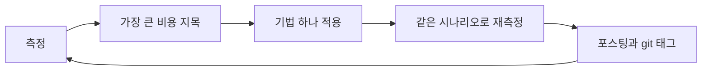
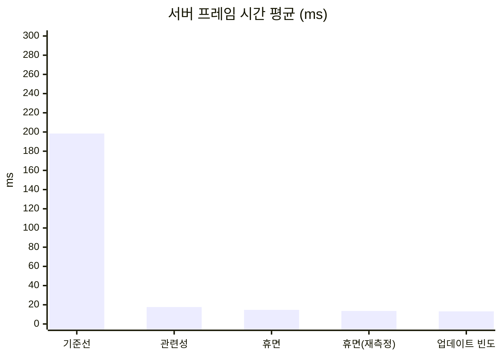
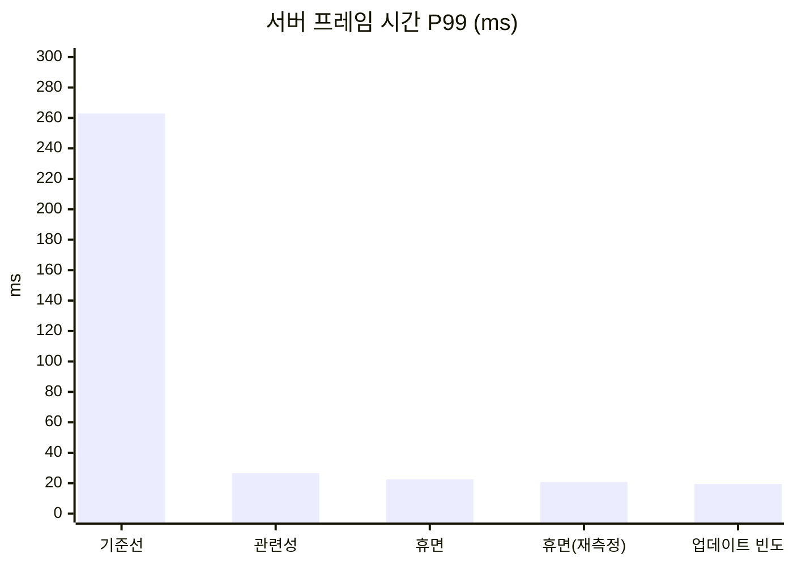
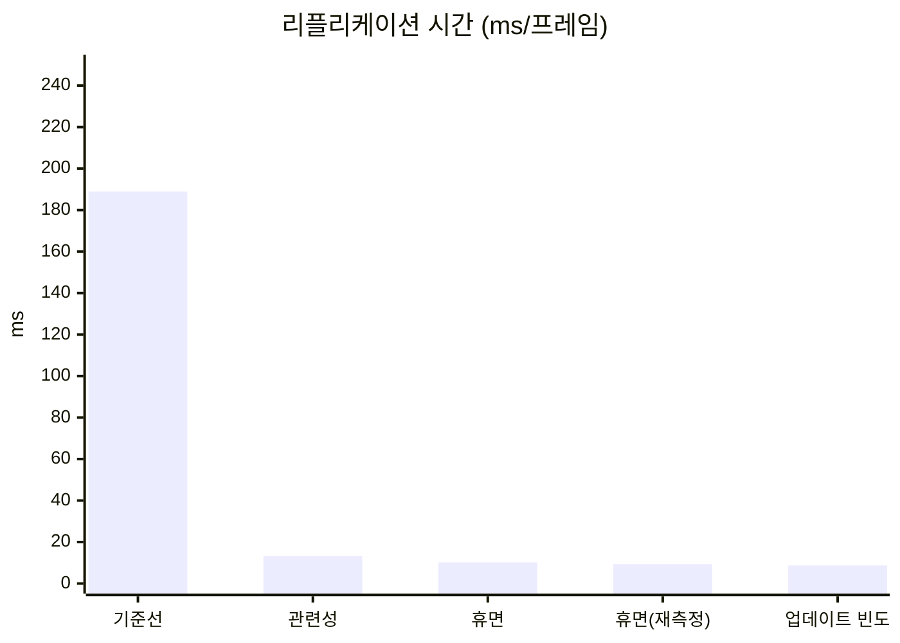
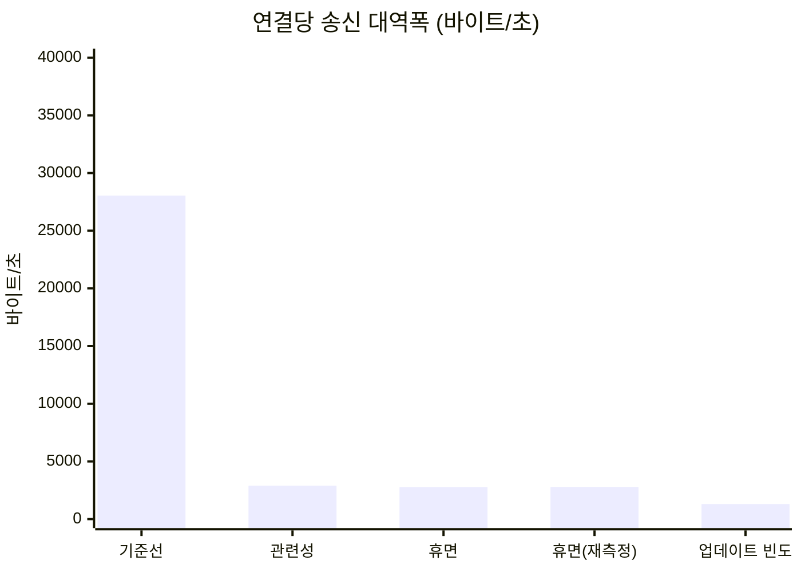

# UE5 Dedicated Server 최적화 실험실


언리얼 엔진 5.8.3 Dedicated Server의 네트워크와 서버 부하를 Unreal Insights로 측정하고, 최적화 기법을 하나씩 적용하면서 전후를 비교한 기록입니다.

아주 단순한 오픈월드 서바이벌 환경을 최적화가 전혀 없는 상태에서 시작합니다. 포스팅 하나에 기법 하나만 적용하고, 같은 시나리오를 다시 측정해 무엇이 얼마나 달라졌는지 수치와 화면으로 보여줍니다.

- **대상**: 레거시 리플리케이션(기본 NetDriver). 게임 코드는 표준 `UPROPERTY` 리플리케이션과 RPC만 씁니다.
- **다루는 기법**: 관련성(컬 거리), 액터 휴면, 업데이트 빈도.
- **측정 도구**: Unreal Insights(Timing, Network)와 서버가 남기는 수치 CSV.
- **상태**: 기준선 측정(포스팅 1), 관련성(포스팅 2), 자원 노드 휴면(포스팅 3), AI NPC 업데이트 빈도(포스팅 4)를 마쳤습니다. 세 기법을 모두 적용했고, 남은 것은 테스트베드 포스팅의 시각 자료와 전체 다듬기입니다.

## 포스팅

| # | 제목 | 내용 | 상태 |
| --- | --- | --- | --- |
| 0 | [테스트베드와 측정 방법](Posts/00-testbed/README.md) | 시나리오 규모와 근거, 트레이스 수집법, 지표의 정의, 측정의 한계 | 초안(전체 화면과 영상을 넣으면 완료) |
| 1 | [무법지대 측정](Posts/01-baseline/README.md) | 최적화가 없는 기준선의 수치, Insights에서 가장 큰 비용을 찾는 과정 | 완료 |
| 2 | [관련성과 컬 거리](Posts/02-relevancy/README.md) | 멀리 있는 액터를 보내지 않기. 기준선이 끈 엔진 기본 컬 거리 150m의 복원 | 완료 |
| 3 | [자원 노드 휴면](Posts/03-dormancy/README.md) | 거의 변하지 않는 액터를 프레임마다 확인하지 않기. 휴면이 줄인 비용과 줄이지 못한 비용 | 완료 |
| 4 | [AI NPC 업데이트 빈도](Posts/04-update-frequency/README.md) | 계속 움직이는 다수 액터의 리플리케이션 빈도 낮추기. 대역폭은 절반이 됐고 CPU는 거의 그대로였던 이유 | 완료 |

포스팅 2\~4의 순서는 기준선에서 가장 큰 비용을 보고 정했습니다. 이유는 [포스팅 1의 "선택"](Posts/01-baseline/README.md#선택)에 있습니다.

## 진행 방식



- 포스팅 하나에 기법 하나만 적용합니다. 여러 기법을 한꺼번에 넣으면 어느 것이 효과를 냈는지 알 수 없기 때문입니다.
- 포스팅마다 git 태그가 하나씩 있습니다(`post-01-baseline` 형식). 태그를 체크아웃하면 그 포스팅 시점의 코드로 같은 시나리오를 실행할 수 있습니다.
- 모든 포스팅이 같은 틀을 따릅니다: 요약, 관찰, 선택, 적용, 결과, 한계와 다음.
- 포스팅에 쓰는 수치와 설정값에는 근거를 함께 적습니다. 직접 측정한 값(조건 명시), 엔진 소스에서 확인한 값(파일과 심볼 명시), 계산한 값(식 명시) 중 하나입니다.

## 테스트베드 한눈에 보기

2km × 2km 바닥 위에 세 가지 요소를 둡니다. 세 요소의 비용 패턴이 서로 달라서, 기법마다 겨냥하는 대상이 겹치지 않습니다.

| 요소 | 구현 | 비용 패턴 | 겨냥하는 기법 |
| --- | --- | --- | --- |
| 플레이어 캐릭터 | 실제 클라이언트가 접속해 조종하는 3인칭 캐릭터. 고정 경유점을 따라 자동으로 걷습니다 | 수는 적고 연결마다 비용이 듭니다 | 연결당 비용 읽기 |
| 자원 노드 | 실린더 액터. 체력과 고갈 여부만 리플리케이트하고 채집 RPC가 하나 있습니다 | 수가 많고 거의 변하지 않습니다 | 관련성, 휴면 |
| AI NPC | 원뿔 액터. 서버에서 단순 배회합니다 | 수가 많고 계속 움직입니다 | 업데이트 빈도 |

시나리오 규모는 클라이언트 8개, 자원 노드 5,000개(와 검증용 1개), AI NPC 300명입니다. 기준선이 네 조건(초기 전송 완료, 지속적인 틱 예산 초과, 송신 한도에 포화되지 않음, 가장 큰 비용이 네트워크)을 만족하는 것을 확인하고 고정했습니다. 이 규모에서 최적화가 없는 서버는 한 프레임에 약 168ms를 쓰고(틱 예산 33.3ms의 5.0배), 그 96%가 네트워크 드라이버의 송신 쪽 처리입니다(보정 실행 `calib-f-r1` 한 번의 값). 보정 과정과 근거는 [테스트베드와 측정 방법](Posts/00-testbed/README.md)에 있습니다.

| 3인칭 화면 | 내려다보기 화면 |
| --- | --- |
|  |  |

위 두 장은 확정 규모 실행(`calib-g-r1`)의 자동 스크린샷입니다. 화면 왼쪽 위 상자의 첫 줄은 실행 라벨, 클라이언트 자리 번호와 역할, 시작 신호 후 경과 시간이고, 둘째 줄은 그 클라이언트에 실제로 존재하는 노드와 NPC의 수와 플레이어 위치입니다. 내려다보기 화면은 플레이어를 중심으로 350m 위에서 본 것이고, 초록 점은 자원 노드, 검은 점은 고갈된 노드, 빨간 점은 NPC입니다. 클라이언트가 받지 않은 액터에는 점이 찍히지 않으므로, 최적화 전후에 클라이언트가 가진 것이 어떻게 달라지는지 이 화면으로 비교합니다.

### 측정 방식

- **실제 클라이언트를 띄웁니다.** 서버와 클라이언트 모두 에디터 빌드 실행 파일을 쿠킹 없이 실행합니다. 클라이언트는 실제로 렌더링하고, 그 화면이 포스팅의 시각 자료입니다.
- **스크립트 하나가 전부 실행합니다.** 서버와 클라이언트를 띄우고, 측정이 끝나면 정리하고, 실패한 실행을 성공으로 돌려주지 않습니다.
- **실행마다 같은 조건에서 출발합니다.** 노드와 NPC는 고정 시드로 배치하고, 모든 클라이언트가 준비되면 서버가 공통 시작 신호를 냅니다. 이동, 채집, 배회, 자동 스크린샷의 시계가 모두 이 신호에서 출발합니다.
- **서버와 클라이언트를 서로 다른 코어에 고정합니다.** 서버는 논리 프로세서 2\~7, 클라이언트는 8\~31을 씁니다. 최적화로 클라이언트 부하가 줄어든 효과가 서버 수치에 섞이는 것을 줄이기 위해서입니다. 0번과 1번은 이 PC에서 DPC 부하가 몰려 쓰지 않습니다.
- **준비 구간 뒤에 측정합니다.** 시작 신호 뒤 준비 구간 30초를 버리고 측정 구간 60초를 잽니다. 구성마다 3회 실행해 중앙값과 변동 폭을 적습니다.
- **연결 수가 바뀐 실행은 버립니다.** 시작 신호 뒤에 클라이언트가 하나라도 빠지면 서버가 수치를 남기지 않고 실패로 끝납니다.

서버 틱은 30Hz(틱 예산 1000ms ÷ 30 = 33.3ms)입니다. 엔진 기본값이며 `Engine/Config/BaseEngine.ini`의 `NetServerMaxTickRate`에서 확인했습니다.

### 지표

| 지표 | 출처 |
| --- | --- |
| 서버 프레임 시간(평균, P99) | Timing Insights |
| 리플리케이션 시간(프레임당) | Timing Insights 타이머 `GameNetDriver`의 프레임당 Incl. 모든 포스팅에서 같은 타이머를 씁니다 |
| 연결당 송신 대역폭 | Network Insights, 서버 CSV와 대조 |
| 연결당 열린 액터 채널 수 | 서버 CSV |
| 클라이언트에 존재하는 액터 수 | 클라이언트 화면 위 글자 |

열린 액터 채널 수와 클라이언트에 존재하는 액터 수는 다른 수치입니다. 휴면에 들어간 액터는 채널이 닫혀도 클라이언트에 남습니다.

## 누적 수치

구성마다 3회 실행한 중앙값을 적습니다. 서버 프레임 시간과 리플리케이션 시간은 Timing Insights, 연결당 송신 대역폭은 Network Insights(`Connection 0`)에서 측정 구간을 읽은 값이고, 연결당 열린 액터 채널 수는 서버 CSV입니다. 세 실행의 값과 변동 폭은 각 포스팅의 "결과"에 있습니다.

| 구성 | 서버 프레임 시간 평균 | 서버 프레임 시간 P99 | 리플리케이션 시간 | 연결당 송신 대역폭 | 연결당 열린 액터 채널 수 |
| --- | --- | --- | --- | --- | --- |
| [기준선](Posts/01-baseline/README.md)(`baseline3`) | 198.43ms | 262.96ms | 188.97ms | 28,048바이트/초 | 5,314 |
| [관련성](Posts/02-relevancy/README.md)(`relevancy2`) | 17.64ms | 26.64ms | 13.14ms | 2,897바이트/초 | 118 |
| [휴면](Posts/03-dormancy/README.md)(`dormancy2`) | 14.69ms | 22.53ms | 10.17ms | 2,772바이트/초 | 20 |
| 휴면, 다시 잰 값(`dormancy6`) | 13.60ms | 20.84ms | 9.35ms | 2,793바이트/초 | 20 |
| [업데이트 빈도](Posts/04-update-frequency/README.md)(`update-frequency3`) | 13.16ms | 19.50ms | 8.73ms | 1,303바이트/초 | 20 |

- 업데이트 빈도는 바로 앞에서 다시 잰 휴면(`dormancy6`)과 비교합니다. 같은 코드의 `dormancy2`와 `dormancy6`이 서버 프레임 시간 평균에서 1.09ms 달라(측정한 화면 조건이 달랐고 원인은 확인하지 않았습니다), 연달아 잰 묶음끼리만 비교했습니다. 휴면과 업데이트 빈도 사이에서 서버 프레임 시간 평균의 차이는 변동 폭보다 작아 구별되는 차이가 아니고, P99와 리플리케이션 시간, 연결당 송신 대역폭은 구별됩니다([포스팅 4의 "결과"](Posts/04-update-frequency/README.md#결과)).
- 관련성과 휴면 사이에서 서버 프레임 시간 P99와 연결당 송신 대역폭의 차이는 실행 사이의 변동 폭보다 작아, 구별되는 차이가 아닙니다([포스팅 3의 "결과"](Posts/03-dormancy/README.md#결과)).
- 연결당 송신 대역폭은 기준선이 중앙값 실행 `r1`, 관련성이 `r3`, 휴면이 `r2`, 다시 잰 휴면과 업데이트 빈도가 `r1`의 값입니다. 나머지 실행은 Network Insights에서 읽지 않았습니다. 관련성부터는 연결마다 받는 액터가 위치에 따라 달라, `Connection 0`(제자리에서 채집하는 클라이언트)이 서버 CSV의 8개 연결 평균보다 35% 작습니다([포스팅 2의 "한계와 다음"](Posts/02-relevancy/README.md#한계와-다음)).
- 서버 프레임 시간은 프레임 시간에서 틱 속도 제한 대기를 뺀 시간입니다([ADR-0010](Docs/Decisions/0010-frame-time-without-tick-wait.md)). P99는 측정 구간의 프레임마다 이 값을 Insights에서 내보내 읽은 99백분위 경계값입니다. 세 실행 중 중앙값인 실행의 값이고, 기준선은 `r3`, 관련성은 `r1`, 휴면은 `r2`, 다시 잰 휴면과 업데이트 빈도는 `r1`입니다.

차트의 "휴면"은 `dormancy2`, "휴면(재측정)"은 `dormancy6`입니다.









## 측정의 한계

- 에디터 빌드 실행 파일을 쿠킹 없이 사용합니다. 절대 수치는 출시 빌드와 다릅니다.
- 서버와 클라이언트가 같은 PC에서 돕니다. 서로 다른 물리 코어에 고정하지만 캐시와 메모리 대역폭 경합은 남습니다. 네트워크는 루프백입니다.
- 수치는 같은 조건의 전후 비교로만 해석해 주세요. 서버 코드만의 CPU 개선률이 아닙니다.
- 기준선은 인위적인 출발점입니다. 엔진의 기본 관련성 판정을 의도적으로 끄고(`bAlwaysRelevant = true`), 기준선이 엔진 기본 송신 한도(연결당 100,000바이트/초)에 포화되어 한도를 350,000바이트/초로 올려 고정했습니다(기준선 송신량을 30Hz로 환산한 172,638바이트/초의 약 두 배). 그래서 관련성 포스팅의 개선은 "엔진 기본 동작의 복원"이고, 그 뒤의 포스팅들이 "기본 동작 위의 개선"입니다.
- AI NPC는 움직이는 리플리케이트 액터의 대역입니다. 길 찾기나 행동 트리 같은 AI 비용은 측정하지 않습니다.
- 채집 RPC는 자동 실험용입니다. 서버가 대상 탐색과 거리 검사, 호출 간격 제한을 하지만 그 밖의 악의적 호출은 막지 않습니다.

## 실행 방법

1. 언리얼 엔진 5.8.3 소스 빌드가 필요합니다.
2. `DSOptLab.uproject`를 우클릭해 "Switch Unreal Engine version"으로 그 엔진을 고릅니다. 스크립트는 여기서 고른 엔진을 씁니다.
3. 빌드합니다.

   ```powershell
   powershell -ExecutionPolicy Bypass -File Scripts/build.ps1
   ```

4. 시나리오를 실행합니다. 먼저 동작 확인용 작은 규모로 실행해 봅니다.

   ```powershell
   powershell -ExecutionPolicy Bypass -File Scripts/run-scenario.ps1 -Label try1 -Clients 2 -Nodes 100 -Npcs 10 -Warmup 20 -Measure 30
   ```

   확정 규모의 명령입니다. 클라이언트 8개가 뜨며, 측정 PC에서 UE 프로세스의 메모리 합계가 27.5GB였습니다. 서버를 논리 프로세서 2\~7, 클라이언트를 8\~31에 고정하므로 논리 프로세서가 32개인 PC를 전제로 합니다.

   ```powershell
   powershell -ExecutionPolicy Bypass -File Scripts/run-scenario.ps1 -Label try2 -Clients 8 -Nodes 5000 -Npcs 300 -Warmup 30 -Measure 60
   ```

   트레이스는 `Scripts/open-insights.ps1 -Label try2-r1`로 엽니다.

   서버 콘솔 창과 클라이언트 창이 뜨고, 측정이 끝나면 모두 닫힙니다. 결과는 다음 위치에 남습니다.

   | 결과 | 위치 |
   | --- | --- |
   | 수치 CSV | `Saved/LabMetrics/summary.csv` |
   | Insights 트레이스 | `Saved/Traces/<라벨>-r1.utrace` |
   | 자동 스크린샷 | `Saved/Screenshots/Lab/` |
   | 로그 | `Saved/Logs/` |

   같은 라벨은 다시 쓸 수 없습니다. 다시 실행할 때는 라벨을 바꿉니다. 실행 중에는 클라이언트 창에 키 입력을 하지 않습니다.

5. 클라이언트 두 개를 같은 자리에 띄워 직접 조작해 보려면 `Scripts/run-manual.ps1`을 씁니다. 왼쪽 Shift를 누르고 있는 동안 걷기의 두 배 속도로 달립니다. 측정 시나리오에서는 달리지 않습니다.

## 레포 구조

```
README.md                  이 문서
Posts/NN-이름/README.md    포스팅 본문과 이미지
DSOptLab.uproject          언리얼 프로젝트(레포 루트가 프로젝트 폴더)
Source/DSOptLab/           게임 코드. 이 프로젝트에서 만든 클래스는 접두사 Lab
Config/  Content/          설정과 에셋
Scripts/                   빌드, 측정 실행, 수동 확인용 PowerShell 스크립트
Docs/                      작업 문서
```

| 코드 | 역할 |
| --- | --- |
| [LabScenarioConfig](Source/DSOptLab/LabScenarioConfig.h) | 실행 인자에서 시나리오 값을 읽습니다 |
| [LabResourceNode](Source/DSOptLab/LabResourceNode.cpp) | 자원 노드 |
| [LabNpc](Source/DSOptLab/LabNpc.cpp) | AI NPC |
| [LabGameMode](Source/DSOptLab/LabGameMode.cpp) | 월드 생성, 공통 시작 신호, 플레이어 배치 |
| [LabPlayerController](Source/DSOptLab/LabPlayerController.cpp) | 자동 이동과 채집, 화면 표시, 자동 스크린샷 |
| [LabCharacterMovement](Source/DSOptLab/LabCharacterMovement.cpp) | 수동 조작용 달리기(왼쪽 Shift). 저장된 이동의 플래그 한 비트로 서버에 보냅니다 |
| [LabHUD](Source/DSOptLab/LabHUD.cpp) | 클라이언트 화면 글자(라벨, 역할, 그 클라이언트에 있는 노드와 NPC 수, 위치) |
| [LabMetricsSubsystem](Source/DSOptLab/LabMetricsSubsystem.cpp) | 서버 측정과 CSV 기록 |
| [run-scenario.ps1](Scripts/run-scenario.ps1) | 측정 실행, 코어 배정, 실패 검출 |

작업 과정의 문서도 함께 둡니다.

| 문서 | 내용 |
| --- | --- |
| [설계 문서](Docs/Planning/2026-10-01-short-term-portfolio-design.md) | 확정된 결정과 이유, 측정 규약 |
| [결정 기록(ADR)](Docs/Decisions/README.md) | 대안을 비교해 내린 결정, 버린 대안, 그 결과 |
| [구현 계획](Docs/Planning/2026-10-01-short-term-implementation-plan.md) | 태스크별 체크리스트, 수치의 이름과 출처 |
| [엔진 소스 확인 기록](Docs/Planning/engine-notes.md) | 5.8.3 소스에서 확인한 기본값과 동작 순서(파일과 줄 번호) |
| [현재 상태](Docs/STATUS.md) | 진행 상황, 확정값, 측정 결과 |
| 작업 기록: [테스트베드](Docs/Worklog/00-testbed.md), [포스팅 1](Docs/Worklog/01-baseline.md), [포스팅 2](Docs/Worklog/02-relevancy.md), [포스팅 3](Docs/Worklog/03-dormancy.md), [포스팅 4](Docs/Worklog/04-update-frequency.md) | 끝낸 작업의 경위, 실패한 실행, 보정 실행 수치 |
| [Insights 읽는 순서](Docs/Guides/insights-reading.md), [단계별 기록](Docs/Guides/insights-walkthrough-calib-f.md) | 트레이스에서 수치를 읽는 절차와, 화면을 하나씩 캡처하며 읽은 예 |
| [문제 해결](Docs/Guides/troubleshooting.md) | 빌드나 실행이 실패했을 때의 증상별 대처와 근거 위치 |
| [PC 사양](Docs/Planning/pc-specs.md) | 측정 환경 |

## 다음 주제

이 시리즈가 끝난 뒤에 다룰 주제입니다. 전체 목록은 [백로그](Docs/Planning/backlog.md)에 있습니다.

1. **Iris 전환과 실측 비교**: 튜닝한 레거시와 같은 시나리오를 Iris로 실행해 비교합니다.
2. **인벤토리와 FastArray**: 일반 `TArray` 리플리케이션과 FastArray의 전송 바이트 비교, 소유자 전용 전송.
3. **자원 노드 구역 매니저**: 노드당 액터 하나에서 구역별 매니저와 FastArray로 전환.
4. **기본 송신 한도에서의 포화와 우선순위**: 엔진 기본 한도로 되돌렸을 때 무엇이 미뤄지는지, `NetPriority`로 무엇을 먼저 보낼지.
5. **건축물**: 플레이어가 배치하는 정적 액터의 휴면과 초기 전송 비용.
6. **Replication Graph**: 레거시, Replication Graph, Iris 세 시스템 비교.
7. **Test 패키지로 재측정**: 기준선과 세 기법을 모두 적용한 구성을 출시 빌드에 가까운 Test 패키지로 다시 재서, 에디터 빌드에서 본 개선이 유지되는지 확인합니다.
