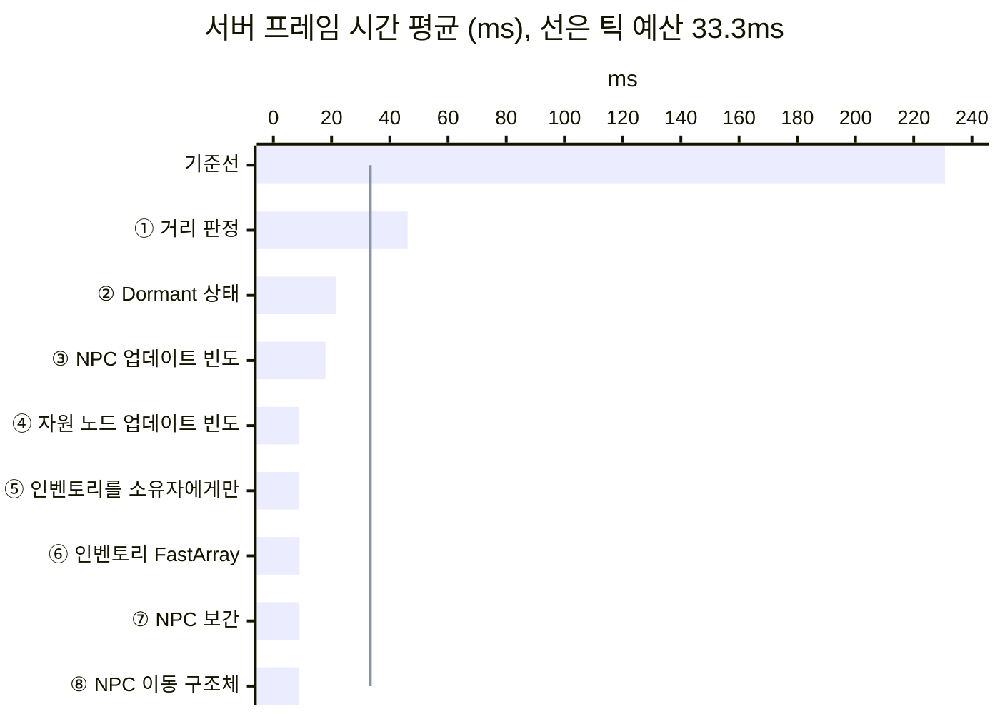
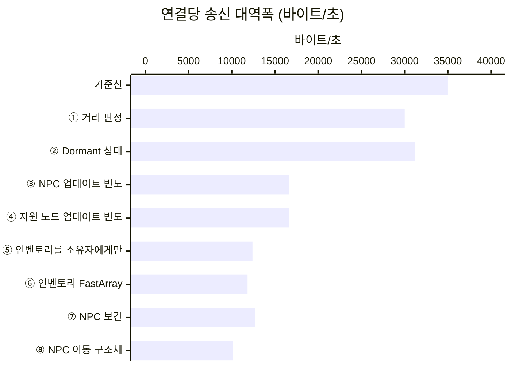
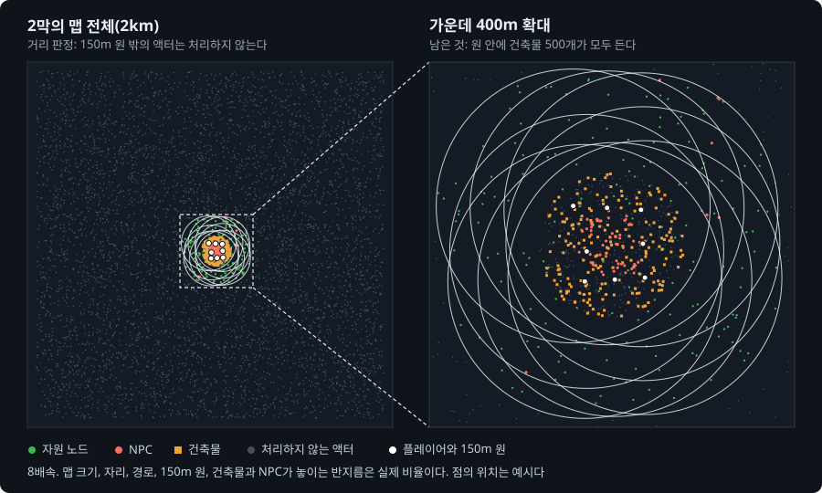

# UE5 Dedicated Server 최적화 실험실


언리얼 엔진 5.8.3 Dedicated Server의 리플리케이션 비용을 측정하고, 최적화 기법을 하나씩 적용한 기록이다. 최적화가 전혀 없는 단순한 오픈월드 서버에서 시작한다. 포스팅 하나에 기법 하나만 적용하고, 같은 시나리오를 다시 측정해 달라진 것을 수치와 화면으로 보인다.

- **대상**: 엔진의 기본 리플리케이션 시스템. 게임 코드는 표준 프로퍼티 리플리케이션과 RPC만 쓴다.
- **최적화**: 거리 판정, Dormant 상태, NPC와 자원 노드의 업데이트 빈도, 인벤토리를 소유자에게만 보내기, 인벤토리의 바뀐 칸만 보내기, 클라이언트의 NPC 위치 보간, NPC 이동만 담은 구조체. 엔진의 Relevancy, Dormancy, Net Update Frequency, 리플리케이션 조건, FastArray, 구조체의 `NetSerialize`를 쓴다.
- **측정 도구**: Unreal Insights와 서버가 남기는 수치 CSV.

기법을 하나씩 켜면서 서버의 일과 클라이언트 화면이 달라지는 모습을 보는 페이지가 있다: [UE Dedicated Server, 단계별로 최적화해 보기](https://hon454.github.io/ue-dedicated-server-optimization-lab/).

## 결과 한눈에 보기

서버는 여덟 단계를 거쳐 서버 프레임 시간 평균이 231ms에서 8.77ms로 줄었다. 30Hz 서버가 한 프레임에 쓸 수 있는 시간은 33.3ms이고, 이 시간을 틱 예산이라고 부른다. 서버는 틱 예산의 6.9배를 쓰다가 약 4분의 1을 쓰게 됐다. ⑦은 서버의 일을 줄이지 않고 클라이언트 화면의 끊김을 없앴다. ⑧은 NPC 갱신을 작게 만들어 연결당 송신 대역폭을 20.4% 줄였다.

| 단계 | 바꾼 것 |
| --- | --- |
| ① 거리 판정 | 모든 액터를 항상 보내던 설정(`bAlwaysRelevant`)을 끈다. 서버는 플레이어에게서 150m 안의 액터만 보낸다 |
| ② Dormant 상태 | 자원 노드와 건축물을 Dormant 상태로 둔다. 서버는 이 액터들의 프로퍼티 비교를 멈춘다 |
| ③ NPC 업데이트 빈도 | NPC의 Net Update Frequency를 100에서 10으로 낮춘다 |
| ④ 자원 노드 업데이트 빈도 | 자원 노드의 Net Update Frequency를 100에서 2로 낮춘다. 서버는 먼 자원 노드를 16프레임에 한 번만 따진다 |
| ⑤ 인벤토리를 소유자에게만 | 인벤토리를 그 캐릭터를 조종하는 플레이어에게만 보낸다(`COND_OwnerOnly`) |
| ⑥ 인벤토리 FastArray | 인벤토리의 칸에 번호를 붙여 바뀐 칸만 보낸다(`FFastArraySerializer`) |
| ⑦ NPC 보간 | 클라이언트가 받은 NPC 위치 두 개 사이를 150ms 늦게 이어 그린다. 서버는 위치마다 서버 프레임 번호를 붙여 보낸다 |
| ⑧ NPC 이동 구조체 | NPC의 평면 위치, 방향, 서버 프레임 번호만 담은 구조체를 직접 직렬화해 보낸다(`NetSerialize`). 엔진의 이동 데이터(`ReplicatedMovement`)는 보내지 않는다 |





| 단계 | 서버 프레임 시간 평균 | 리플리케이션 시간 | 연결당 송신 대역폭(바이트/초) | 연결당 열린 액터 채널 수 |
| --- | ---: | ---: | ---: | ---: |
| 기준선 | 231ms | 221ms | 35,000 | 5,871 |
| ① 거리 판정 | 46.1ms | 40.9ms | 30,000 | 695 |
| ② Dormant 상태 | 21.6ms | 16.6ms | 31,200 | 77 |
| ③ NPC 업데이트 빈도 | 17.9ms | 13.0ms | 16,600 | 77 |
| ④ 자원 노드 업데이트 빈도 | 8.86ms | 3.93ms | 16,600 | 77 |
| ⑤ 인벤토리를 소유자에게만 | 8.83ms | 3.94ms | 12,400 | 77 |
| ⑥ 인벤토리 FastArray | 9.01ms | 4.00ms | 11,800 | 77 |
| ⑦ NPC 보간 | 8.97ms | 3.98ms | 12,700 | 77 |
| ⑧ NPC 이동 구조체 | 8.77ms | 3.88ms | 10,100 | 77 |

단계는 위에서 아래로 하나씩 쌓았다. 아홉 구성을 같은 날 연달아 세 번씩 실행했고, 수치는 그 중앙값이다. "연결"은 서버와 클라이언트 하나 사이의 통신을 뜻한다. 실행별 값과 계산식은 [누적 수치의 측정 기록](Posts/measurements.md)에 있다.

이 표를 읽을 때 알아야 할 것이 일곱 가지 있다.

- **①의 수치는 기본 동작을 되살린 결과다.** 기준선은 엔진의 기본 거리 판정을 일부러 끈 서버다. 뒤의 단계가 기본 동작 위의 개선이다.
- **①은 잰 날마다 크게 다르다.** ①의 서버는 틱 예산을 조금 넘는다. 프레임이 길어지면 고려할 시각이 된 액터가 늘어 프레임이 더 길어진다. 같은 구성이 [1막의 세 최적화를 2막에 다시 적용](Posts/06-three-techniques-again/README.md)에서는 35.9ms였다. ①의 연결당 송신 대역폭이 ②보다 작은 것도 프레임을 덜 돌았기 때문이다.
- **②의 몫이 크다.** 플레이어가 모인 곳에 건축물 500개가 있어서, ①은 이 건축물을 빼지 못한다. ②가 건축물을 빼 서버 프레임 시간을 절반 넘게 더 줄였다.
- **④가 남은 서버 프레임 시간을 절반으로 줄였다.** 플레이어 무리에서 먼 자원 노드는 Dormant 상태가 되지 못한다. 그래서 프레임마다 Consider List에 든다. ④는 서버가 이들을 따지는 간격을 늘렸다.
- **③, ⑤, ⑥은 주로 대역폭을 줄였다.** ③은 연결당 송신 대역폭을 47% 줄였다. ⑤는 4분의 1을, ⑥은 약 5%를 더 줄였다. ⑤의 서버 프레임 시간 변화는 구별되지 않았다. ⑥은 이 묶음에서 서버 프레임 시간을 2.0% 늘렸다. 이 차이는 세 실행 사이의 차이를 겨우 넘었고, [인벤토리를 FastArray로 보내기](Posts/10-inventory-fastarray/README.md)에서는 구별되지 않았다.
- **⑦은 서버 대신 클라이언트 화면을 바꿨다.** ③ 뒤로 NPC 하나의 위치는 약 134ms마다 온다. 클라이언트는 받은 위치로 NPC를 바로 옮겨서, NPC가 멈췄다가 약 40cm를 건너뛰었다. ⑦은 받은 위치 두 개 사이를 150ms 늦게 이어 그린다. 화면 속 NPC와 서버 NPC의 속도 차(표시 속도 오차)는 평균 440cm/s에서 15.0cm/s가 됐다. 대가로 NPC가 81ms 더 늦게 보인다. 연결당 송신 대역폭은 7.2% 늘었다. 서버 프레임 시간의 변화는 구별되지 않았다. 화면 품질의 수치는 [클라이언트에서 NPC 위치를 보간하기](Posts/11-npc-interpolation/README.md)에서 잰 값이다.
- **⑧은 서버의 CPU보다 송신 대역폭을 줄였다.** 직렬화는 값을 패킷에 넣을 비트로 바꾸는 일이다. 엔진의 이동 데이터는 NPC에게 늘 같은 높이와 늘 0인 속도까지 직렬화한다. ⑧의 구조체는 평면 위치, 방향, 서버 프레임 번호만 정해진 비트 수로 쓴다. NPC 갱신 한 번은 117비트에서 69.0비트가 됐다. 연결당 송신 대역폭은 20.4% 줄었고, 줄어든 양은 ⑦이 늘린 양의 약 세 배다. 서버 프레임 시간과 화면 속 NPC의 품질 변화는 구별되지 않았다. 갱신 한 번의 크기와 화면 품질은 [NPC 이동을 필요한 비트만 담은 구조체로 보내기](Posts/12-npc-move-netserialize/README.md)에서 잰 값이다.



거리 판정을 켠 서버가 보는 지도다. 왼쪽은 맵 전체이고, 오른쪽은 점선 사각형 안의 400m를 확대했다. 회색 점은 서버가 처리하지 않는 액터다. 자리, 경로, 150m 원, 건축물이 놓이는 반지름은 실제 비율이고, 점의 위치는 예시다.

## 포스팅

| # | 제목 | 알게 된 것 |
| --- | --- | --- |
| 0 | [테스트베드와 측정 방법](Posts/00-testbed/README.md) | 무엇을 띄우고 어떻게 측정하는가. 수치를 어디까지 믿을 수 있는가 |
| 1 | [Always Relevant 기준선](Posts/01-baseline/README.md) | 서버가 한 프레임에 하는 일. CPU는 자원 노드가 쓰고 대역폭은 NPC가 쓴다 |
| 2 | [Relevancy와 Net Cull Distance](Posts/02-relevancy/README.md) | 값싼 거리 검사가 처리 대상을 50분의 1로 줄였다. 서버가 틱 예산 안에 들어왔다 |
| 3 | [자원 노드 Dormancy](Posts/03-dormancy/README.md) | 프로퍼티 비교는 사라졌고 거리 검사는 남았다. 클라이언트의 자원 노드는 오히려 늘었다 |
| 4 | [AI NPC Net Update Frequency](Posts/04-update-frequency/README.md) | 대역폭은 절반이 됐고 CPU는 그대로였다. 값 10은 초당 10번이 아니었다 |
| 5 | [테스트베드 확장과 새 기준선](Posts/05-expanded-testbed/README.md) | 플레이어를 모으고 건축물, 인벤토리, 상태 값을 더했다. 새 기준선도 CPU는 자원 노드가, 대역폭은 NPC가 쓴다 |
| 6 | [1막의 세 최적화를 2막에 다시 적용](Posts/06-three-techniques-again/README.md) | 플레이어가 모이면 거리 판정으로 뺄 수 없는 액터가 늘어, Dormant 상태의 몫이 커진다 |
| 7 | [네트워크 드라이버 자체 시간 나누기](Posts/07-net-driver-breakdown/README.md) | 남은 리플리케이션 시간의 대부분은 보낼지 따지는 일이었다. 따지는 액터는 대부분 Dormant 상태가 되지 못한 먼 자원 노드다 |
| 8 | [자원 노드의 Net Update Frequency 낮추기](Posts/08-node-update-frequency/README.md) | 먼 자원 노드를 고려하는 간격을 늘리자 서버가 따지는 액터가 약 9분의 1이 됐다. 서버 프레임 시간은 절반이 됐다 |
| 9 | [인벤토리를 소유자에게만 보내기](Posts/09-inventory-owner-only/README.md) | 인벤토리를 소유자의 연결에만 보내자 연결당 송신 대역폭이 25% 줄었다. 비교는 그대로라 서버 프레임 시간은 구별되지 않았다 |
| 10 | [인벤토리를 FastArray로 보내기](Posts/10-inventory-fastarray/README.md) | 칸에 번호를 붙여 바뀐 칸만 보내자 인벤토리 한 번의 크기가 약 53분의 1이 됐다. 연결마다 배열을 확인해서 CPU는 줄지 않았다 |
| 11 | [클라이언트에서 NPC 위치를 보간하기](Posts/11-npc-interpolation/README.md) | 받은 위치 두 개 사이를 150ms 늦게 이어 그리자 화면 속 NPC의 끊김이 사라졌다. 대신 NPC가 81ms 늦게 보이고 대역폭이 7.29% 늘었다 |
| 12 | [NPC 이동을 필요한 비트만 담은 구조체로 보내기](Posts/12-npc-move-netserialize/README.md) | 엔진의 이동 데이터 대신 평면 위치, 방향, 프레임 번호만 직접 직렬화하자 NPC 갱신이 117비트에서 69비트가 되고 대역폭이 20.4% 줄었다. 화면은 그대로였다 |

0\~4는 처음 테스트베드에서 쓴 글(1막)이고, 5부터는 넓힌 테스트베드에서 쓴 글(2막)이다. 2막은 새 기준선을 잡고 1막의 최적화를 다시 적용한 뒤 새 최적화를 하나씩 다룬다. 포스팅 폴더마다 본문 `README.md`와 측정 기록 `measurements.md`가 있다. 본문은 원리와 결과를 설명하고, 측정 기록은 그 수치의 근거를 담는다.

## 테스트베드

측정할 때는 PC 한 대에 서버 하나와 클라이언트 8개를 띄운다. 아래는 측정 중인 클라이언트 8개의 창이다.


클라이언트는 사람이 조작하지 않는다. 0번 창(위 왼쪽)의 캐릭터는 제자리에서 자원 노드를 채집한다. 나머지 일곱은 정해진 정사각형 경로를 자동으로 돈다. 1번 창은 움직이는 캐릭터를 위에서 내려다본 화면이다. 서버는 논리 프로세서 2\~7에, 클라이언트는 8번부터에 고정한다. 클라이언트의 렌더링이 서버의 CPU를 빼앗지 않게 하려는 것이다. 0번과 1번은 운영체제의 인터럽트 처리가 몰려 비워 둔다([테스트베드와 측정 방법](Posts/00-testbed/README.md)). 고정은 [run-scenario.ps1](Scripts/run-scenario.ps1)이 Windows Job 객체로 한다. 엔진이 스레드를 만들 때 프로세스의 코어 지정이 전체 코어로 넓어지는 것을 막기 위해서다.

맵은 한 변이 2km다. 플레이어 여덟 명이 3m 간격으로 모여 서로 다른 방향으로 돈다. 맵에는 비용 패턴이 다른 네 가지 액터가 있다.

| 요소 | 수 | 비용 패턴 | 줄이는 단계 |
| --- | --- | --- | --- |
| 플레이어 캐릭터 | 8 | 수가 적고 클라이언트마다 비용이 든다. 인벤토리 200칸과 상태 값을 가진다 | ⑤ 인벤토리를 소유자에게만, ⑥ 인벤토리 FastArray |
| 자원 노드 | 5,001 | 맵 전체에 있고 채집될 때만 바뀐다 | ① 거리 판정, ② Dormant 상태, ④ 자원 노드 업데이트 빈도 |
| AI NPC | 350 | 맵 전체에 300명, 플레이어 곁에 50명. 계속 움직인다 | ① 거리 판정, ③ NPC 업데이트 빈도, ⑧ NPC 이동 구조체 |
| 건축물 | 500 | 모두 플레이어 곁에 있고, 1초마다 하나를 허물고 새로 짓는다 | ② Dormant 상태 |

| 3인칭 화면 | 내려다보기 화면 |
| --- | --- |
|  |  |

화면 왼쪽 위의 글자는 이 클라이언트에 존재하는 액터의 수다. 내려다보기 화면에서 초록 점은 자원 노드, 빨간 점은 NPC, 주황 점은 건축물이다. 클라이언트가 받지 않은 액터에는 점이 없다. 그래서 이 화면으로 최적화 전후에 클라이언트가 가진 것을 비교한다.

테스트베드를 넓히며 무엇을 왜 더했는지는 [테스트베드 확장과 새 기준선](Posts/05-expanded-testbed/README.md)에 있다.

측정은 다음과 같이 한다. 자세한 내용은 [테스트베드와 측정 방법](Posts/00-testbed/README.md)에 있다.

- **실제 클라이언트를 띄운다.** 클라이언트 8개가 실제로 렌더링한다. 서버와 클라이언트는 에디터 빌드 실행 파일로 실행한다.
- **실행마다 같은 조건에서 출발한다.** 서버는 액터를 고정 시드로 배치한다. 모든 클라이언트가 준비되면 서버가 시작 신호를 낸다.
- **준비 구간 뒤에 측정한다.** 시작 신호 뒤 30초를 버리고 60초를 측정한다. 구성마다 세 번 실행해 중앙값을 쓴다.
- **변동 폭보다 큰 변화만 차이로 본다.** 변동 폭은 세 실행의 최댓값과 최솟값의 차이다.

## 측정의 한계

- **절대 수치는 출시 빌드와 다르다.** 에디터 빌드 실행 파일을 쿠킹 없이 쓰기 때문이다.
- **수치는 같은 조건의 전후 비교로만 읽어야 한다.** 서버와 클라이언트가 같은 PC에서 돌고, 네트워크는 루프백이다.
- **기준선은 인위적인 출발점이다.** 엔진의 기본 거리 판정을 일부러 껐고, 연결당 송신 한도를 엔진 기본값보다 올렸다.
- **AI NPC는 움직이는 액터의 대역이다.** 길 찾기나 행동 트리 같은 AI 비용은 측정하지 않는다.

## 실행 방법

1. 언리얼 엔진 5.8.3 소스 빌드를 준비한다.
2. `DSOptLab.uproject`를 우클릭해 "Switch Unreal Engine version"으로 그 엔진을 고른다. 스크립트는 여기서 고른 엔진을 쓴다.
3. 빌드한다.

   ```powershell
   powershell -ExecutionPolicy Bypass -File Scripts/build.ps1
   ```

4. 작은 규모로 먼저 실행해 본다.

   ```powershell
   powershell -ExecutionPolicy Bypass -File Scripts/run-scenario.ps1 -Label try1 -Clients 2 -Nodes 100 -Npcs 10 -Warmup 20 -Measure 30
   ```

5. 확정 규모로 실행한다.

   ```powershell
   powershell -ExecutionPolicy Bypass -File Scripts/run-scenario.ps1 -Label try2 -Clients 8 -Nodes 5000 -Npcs 300 -Warmup 30 -Measure 60 -PlayerSpacing 3 -NpcsNearPlayers 50 -StateInterval 5 -InventoryItems 200 -InventoryChurn 4 -Buildings 500 -BuildInterval 1
   ```

   `-PlayerSpacing`부터 뒤의 인자를 빼면 테스트베드를 넓히기 전의 시나리오다. ①\~③을 끄는 인자는 [1막의 세 최적화를 2막에 다시 적용](Posts/06-three-techniques-again/README.md)의 "적용"에 있고, ④\~⑥을 켜는 인자는 각 글의 "적용"에 있다. 이 명령은 클라이언트 8개를 띄운다. 측정 PC에서 UE 프로세스의 메모리 합계는 27.5GB였다. 스크립트는 서버와 클라이언트를 정해진 코어에 고정하므로, 논리 프로세서가 32개인 PC를 전제로 한다.

6. 결과를 확인한다. 서버 창과 클라이언트 창은 측정이 끝나면 모두 닫힌다.

   | 결과 | 위치 |
   | --- | --- |
   | 수치 CSV | `Saved/LabMetrics/summary.csv` |
   | Insights 트레이스 | `Saved/Traces/<라벨>-r1.utrace` |
   | 자동 스크린샷 | `Saved/Screenshots/Lab/` |
   | 로그 | `Saved/Logs/` |

   트레이스는 `Scripts/open-insights.ps1 -Label try2-r1`로 연다.

같은 라벨은 다시 쓸 수 없다. 다시 실행할 때는 라벨을 바꾼다. 실행 중에는 클라이언트 창에 키를 입력하지 않는다. 클라이언트 두 개를 직접 조작해 보려면 `Scripts/run-manual.ps1`을 쓴다.

## 코드

포스팅은 `Posts/NN-이름/README.md`에 있고, 본문 수치의 근거(실행별 값, 계산식, 엔진 소스 위치)는 같은 폴더의 `measurements.md`에 있다. 게임 코드는 `Source/DSOptLab/`에 있고, 이 프로젝트에서 만든 클래스는 접두사 `Lab`을 쓴다.

| 코드 | 역할 |
| --- | --- |
| [LabScenarioConfig](Source/DSOptLab/LabScenarioConfig.h) | 실행 인자에서 시나리오 값과, 최적화를 켜고 끄는 값을 읽는다 |
| [LabResourceNode](Source/DSOptLab/LabResourceNode.cpp) | 자원 노드 |
| [LabNpc](Source/DSOptLab/LabNpc.cpp) | AI NPC, 영상용 왕복 NPC, 클라이언트의 NPC 보간과 평면 이동만 담은 이동 구조체(둘 다 실행 인자를 줄 때만 켜진다) |
| [LabGameMode](Source/DSOptLab/LabGameMode.cpp) | 월드 생성, 시작 신호, 플레이어 배치 |
| [LabPlayerController](Source/DSOptLab/LabPlayerController.cpp) | 준비 보고, 자동 이동과 채집, 채집 RPC |
| [LabCharacterMovement](Source/DSOptLab/LabCharacterMovement.cpp) | 수동 조작용 달리기 |
| [LabStateComponent](Source/DSOptLab/LabStateComponent.cpp) | 드물게 바뀌는 상태 값. 실행 인자를 줄 때만 붙는다 |
| [LabInventoryComponent](Source/DSOptLab/LabInventoryComponent.cpp) | 플레이어 인벤토리(일반 배열)와 두 인벤토리의 공통 부모. 실행 인자를 줄 때만 붙는다 |
| [LabInventoryFastArrayComponent](Source/DSOptLab/LabInventoryFastArrayComponent.cpp) | FastArray로 칸을 보내는 플레이어 인벤토리. 실행 인자를 줄 때만 붙는다 |
| [LabBuilding](Source/DSOptLab/LabBuilding.cpp) | 플레이어 주변에 모아 놓는 건축물. 실행 인자를 줄 때만 놓는다 |
| [LabHUD](Source/DSOptLab/LabHUD.cpp) | 화면 글자, 내려다보기 화면의 점과 카메라, 자동 스크린샷 |
| [LabMetricsSubsystem](Source/DSOptLab/LabMetricsSubsystem.cpp) | 서버 측정과 CSV 기록 |
| [LabMotionLogSubsystem](Source/DSOptLab/LabMotionLogSubsystem.cpp) | NPC 움직임의 품질을 재려고 서버와 클라이언트의 NPC 위치를 기록한다. 실행 인자를 줄 때만 켜진다 |
| [run-scenario.ps1](Scripts/run-scenario.ps1) | 측정 실행, 코어 배정, 실패 검출 |
| [analyze-motion.ps1](Scripts/analyze-motion.ps1) | NPC 위치 기록에서 품질 지표(표시 위치 오차, 표시 속도 오차)를 계산한다 |
