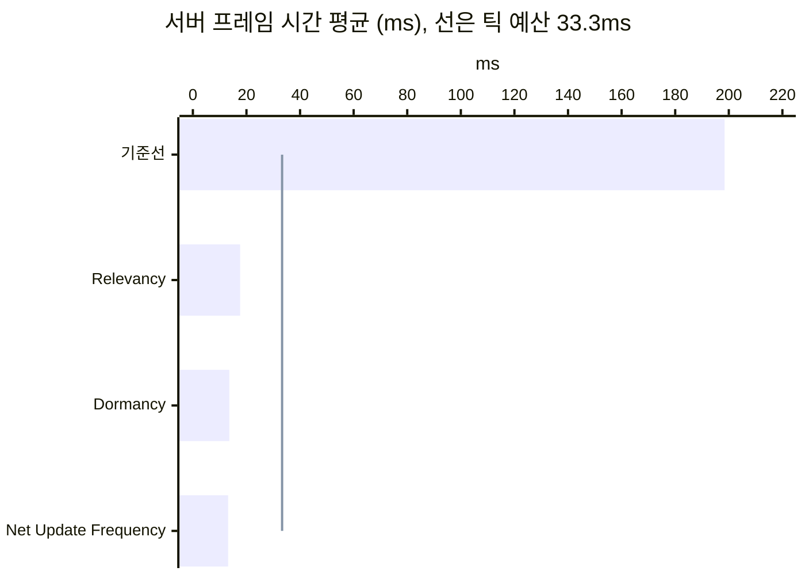
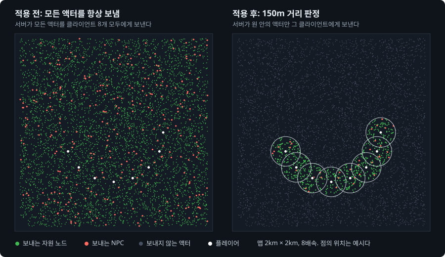

# UE5 Dedicated Server 최적화 실험실


언리얼 엔진 5.8.3 Dedicated Server의 리플리케이션 비용을 측정하고, 최적화 기법을 하나씩 적용한 기록이다. 최적화가 전혀 없는 단순한 오픈월드 서버에서 시작한다. 포스팅 하나에 기법 하나만 적용하고, 같은 시나리오를 다시 측정해 달라진 것을 수치와 화면으로 보인다.

- **대상**: 엔진의 기본 리플리케이션 시스템. 게임 코드는 표준 프로퍼티 리플리케이션과 RPC만 쓴다.
- **기법**: Relevancy, 액터 Dormancy, Net Update Frequency.
- **측정 도구**: Unreal Insights와 서버가 남기는 수치 CSV.

기법을 하나씩 켜면서 서버의 일이 줄어드는 모습을 보는 페이지가 있다: [UE Dedicated Server, 단계별로 최적화해 보기](https://hon454.github.io/ue-dedicated-server-optimization-lab/).

## 결과 한눈에 보기

세 기법을 적용한 서버는 서버 프레임 시간 평균이 198ms에서 13.2ms로 줄었다. 30Hz 서버가 한 프레임에 쓸 수 있는 시간은 33.3ms이고, 이 시간을 틱 예산이라고 부른다. 서버는 틱 예산의 6배를 쓰다가 절반 이하를 쓰게 됐다.



| 지표 | 기준선 | Relevancy | Dormancy | Net Update Frequency |
| --- | ---: | ---: | ---: | ---: |
| 서버 프레임 시간 평균 | 198ms | 17.6ms | 13.6ms | 13.2ms |
| 리플리케이션 시간 | 189ms | 13.1ms | 9.35ms | 8.73ms |
| 연결당 송신 대역폭(바이트/초) | 28,000 | 2,900 | 2,790 | 1,300 |
| 연결당 열린 액터 채널 수 | 5,314 | 118 | 20 | 20 |

기법은 왼쪽에서 오른쪽으로 하나씩 쌓았다. 수치는 구성마다 세 번 실행한 중앙값이다. "연결"은 서버와 클라이언트 하나 사이의 통신을 뜻한다.

이 표를 읽을 때 알아야 할 것이 두 가지 있다.

- **줄어든 시간의 대부분은 Relevancy에서 나왔다.** 기준선은 엔진의 기본 거리 판정을 일부러 끈 서버다. 그래서 Relevancy의 수치는 최적화의 성과가 아니라 기본 동작을 복원한 결과다. 뒤의 두 기법이 기본 동작 위의 개선이다.
- **Dormancy 열은 다시 측정한 값이다.** Net Update Frequency와 연달아 측정해서, Dormancy 글의 수치와 조금 다르다.

실행별 값과 계산식, 구별되지 않은 차이는 [누적 수치의 측정 기록](Posts/measurements.md)에 있다.



가장 큰 변화인 거리 판정을 서버의 관점에서 그린 개념도다. 맵 크기, 플레이어 8명의 자리와 경로, 150m 원은 실제 비율이다. 점의 위치는 예시다.

## 포스팅

| # | 제목 | 알게 된 것 |
| --- | --- | --- |
| 0 | [테스트베드와 측정 방법](Posts/00-testbed/README.md) | 무엇을 띄우고 어떻게 측정하는가. 수치를 어디까지 믿을 수 있는가 |
| 1 | [Always Relevant 기준선](Posts/01-baseline/README.md) | 서버가 한 프레임에 하는 일. CPU는 자원 노드가 쓰고 대역폭은 NPC가 쓴다 |
| 2 | [Relevancy와 Net Cull Distance](Posts/02-relevancy/README.md) | 값싼 거리 검사가 처리 대상을 50분의 1로 줄였다. 서버가 틱 예산 안에 들어왔다 |
| 3 | [자원 노드 Dormancy](Posts/03-dormancy/README.md) | 프로퍼티 비교는 사라졌고 거리 검사는 남았다. 클라이언트의 자원 노드는 오히려 늘었다 |
| 4 | [AI NPC Net Update Frequency](Posts/04-update-frequency/README.md) | 대역폭은 절반이 됐고 CPU는 그대로였다. 값 10은 초당 10번이 아니었다 |
| 5 | [테스트베드 확장과 새 기준선](Posts/05-expanded-testbed/README.md) | 플레이어를 모으고 건축물, 인벤토리, 상태 값을 더했다. 새 기준선도 CPU는 자원 노드가, 대역폭은 NPC가 쓴다 |
| 6 | [1막의 세 최적화를 2막에 다시 적용](Posts/06-three-techniques-again/README.md)(작성 중) | 플레이어가 모이면 거리 판정으로 뺄 수 없는 액터가 늘어, Dormant 상태의 몫이 커진다 |

0\~4는 1막이고, 5부터는 2막이다. 2막은 테스트베드를 넓혀 새 기준선을 잡고, 1막의 최적화를 다시 적용한 뒤 새 최적화를 하나씩 다룬다. 포스팅 폴더마다 본문 `README.md`와 측정 기록 `measurements.md`가 있다. 본문은 원리와 결과를 설명하고, 측정 기록은 그 수치의 근거를 담는다.

## 테스트베드

측정할 때는 PC 한 대에 서버 하나와 클라이언트 8개를 띄운다. 아래는 측정 중인 클라이언트 8개의 창이다.


클라이언트는 사람이 조작하지 않는다. 0번 창(위 왼쪽)의 캐릭터는 제자리에서 자원 노드를 채집한다. 나머지 일곱은 정해진 정사각형 경로를 자동으로 돈다. 1번 창은 움직이는 캐릭터를 위에서 내려다본 화면이다. 서버는 논리 프로세서 2\~7에, 클라이언트는 8번부터에 고정한다. 클라이언트의 렌더링이 서버의 CPU를 빼앗지 않게 하려는 것이다.

이 화면은 2막의 구성이다([테스트베드 확장과 새 기준선](Posts/05-expanded-testbed/README.md)). 플레이어 여덟 명이 3m 간격으로 모여 서로 다른 방향으로 돈다. 주황색 상자는 2막에서 더한 건축물이다.

맵은 한 변이 2km이고, 클라이언트 8개가 접속한다. 맵에는 비용 패턴이 다른 세 가지 액터가 있다.

| 요소 | 수 | 비용 패턴 | 겨냥하는 기법 |
| --- | --- | --- | --- |
| 플레이어 캐릭터 | 8 | 수가 적고 클라이언트마다 비용이 든다 | |
| 자원 노드 | 5,001 | 수가 많고 거의 바뀌지 않는다 | Relevancy, Dormancy |
| AI NPC | 300 | 수가 많고 계속 움직인다 | Net Update Frequency |

| 3인칭 화면 | 내려다보기 화면 |
| --- | --- |
|  |  |

화면 왼쪽 위의 글자는 이 클라이언트에 존재하는 자원 노드와 NPC의 수다. 내려다보기 화면에서 초록 점은 자원 노드이고, 빨간 점은 NPC다. 클라이언트가 받지 않은 액터에는 점이 없다. 그래서 이 화면으로 최적화 전후에 클라이언트가 가진 것을 비교한다.

측정은 다음과 같이 한다. 자세한 내용은 [테스트베드와 측정 방법](Posts/00-testbed/README.md)에 있다.

- **실제 클라이언트를 띄운다.** 클라이언트 8개가 실제로 렌더링한다. 서버와 클라이언트는 에디터 빌드 실행 파일로 실행한다.
- **실행마다 같은 조건에서 출발한다.** 서버는 자원 노드와 NPC를 고정 시드로 배치한다. 모든 클라이언트가 준비되면 서버가 시작 신호를 낸다.
- **준비 구간 뒤에 측정한다.** 시작 신호 뒤 30초를 버리고 60초를 측정한다. 구성마다 세 번 실행해 중앙값을 쓴다.
- **변동 폭보다 큰 변화만 차이로 본다.** 변동 폭은 세 실행의 최댓값과 최솟값의 차이다.

## 측정의 한계

- **절대 수치는 출시 빌드와 다르다.** 에디터 빌드 실행 파일을 쿠킹 없이 쓰기 때문이다.
- **수치는 같은 조건의 전후 비교로만 읽어야 한다.** 서버와 클라이언트가 같은 PC에서 돌고, 네트워크는 루프백이다.
- **기준선은 인위적인 출발점이다.** 엔진의 기본 거리 판정을 일부러 껐고, 연결당 송신 한도를 엔진 기본값보다 올렸다.
- **AI NPC는 움직이는 액터의 대역이다.** 길 찾기나 행동 트리 같은 AI 비용은 측정하지 않는다.

## 실행 방법

1. 언리얼 엔진 5.8.3 소스 빌드를 준비한다.
2. `DSOptLab.uproject`를 우클릭해 "Switch Unreal Engine version"으로 그 엔진을 고른다. 스크립트는 여기서 고른 엔진을 쓴다.
3. 빌드한다.

   ```powershell
   powershell -ExecutionPolicy Bypass -File Scripts/build.ps1
   ```

4. 작은 규모로 먼저 실행해 본다.

   ```powershell
   powershell -ExecutionPolicy Bypass -File Scripts/run-scenario.ps1 -Label try1 -Clients 2 -Nodes 100 -Npcs 10 -Warmup 20 -Measure 30
   ```

5. 확정 규모로 실행한다.

   ```powershell
   powershell -ExecutionPolicy Bypass -File Scripts/run-scenario.ps1 -Label try2 -Clients 8 -Nodes 5000 -Npcs 300 -Warmup 30 -Measure 60
   ```

   이 명령은 클라이언트 8개를 띄운다. 측정 PC에서 UE 프로세스의 메모리 합계는 27.5GB였다. 스크립트는 서버와 클라이언트를 정해진 코어에 고정하므로, 논리 프로세서가 32개인 PC를 전제로 한다.

6. 결과를 확인한다. 서버 창과 클라이언트 창은 측정이 끝나면 모두 닫힌다.

   | 결과 | 위치 |
   | --- | --- |
   | 수치 CSV | `Saved/LabMetrics/summary.csv` |
   | Insights 트레이스 | `Saved/Traces/<라벨>-r1.utrace` |
   | 자동 스크린샷 | `Saved/Screenshots/Lab/` |
   | 로그 | `Saved/Logs/` |

   트레이스는 `Scripts/open-insights.ps1 -Label try2-r1`로 연다.

같은 라벨은 다시 쓸 수 없다. 다시 실행할 때는 라벨을 바꾼다. 실행 중에는 클라이언트 창에 키를 입력하지 않는다. 클라이언트 두 개를 직접 조작해 보려면 `Scripts/run-manual.ps1`을 쓴다.

## 레포 구조

```
README.md                      이 문서
Posts/NN-이름/README.md        포스팅 본문과 이미지
Posts/NN-이름/measurements.md  본문 수치의 근거(실행별 값, 계산식, 엔진 소스 위치)
Posts/measurements.md          이 문서의 누적 수치의 근거
DSOptLab.uproject              언리얼 프로젝트(레포 루트가 프로젝트 폴더)
Source/DSOptLab/               게임 코드. 이 프로젝트에서 만든 클래스는 접두사 Lab
Config/  Content/              설정과 에셋
Scripts/                       빌드, 측정 실행, 수동 확인, 개념도 생성용 PowerShell 스크립트
Site/                          인터랙티브 설명 페이지(GitHub Pages로 공개)
Docs/                          작업 문서
```

| 코드 | 역할 |
| --- | --- |
| [LabScenarioConfig](Source/DSOptLab/LabScenarioConfig.h) | 실행 인자에서 시나리오 값과, 세 기법을 켜고 끄는 값을 읽는다 |
| [LabResourceNode](Source/DSOptLab/LabResourceNode.cpp) | 자원 노드 |
| [LabNpc](Source/DSOptLab/LabNpc.cpp) | AI NPC, 영상용 왕복 NPC |
| [LabGameMode](Source/DSOptLab/LabGameMode.cpp) | 월드 생성, 시작 신호, 플레이어 배치 |
| [LabPlayerController](Source/DSOptLab/LabPlayerController.cpp) | 준비 보고, 자동 이동과 채집, 채집 RPC |
| [LabCharacterMovement](Source/DSOptLab/LabCharacterMovement.cpp) | 수동 조작용 달리기 |
| [LabStateComponent](Source/DSOptLab/LabStateComponent.cpp) | 드물게 바뀌는 상태 값. 실행 인자를 줄 때만 붙는다 |
| [LabInventoryComponent](Source/DSOptLab/LabInventoryComponent.cpp) | 플레이어 인벤토리. 실행 인자를 줄 때만 붙는다 |
| [LabBuilding](Source/DSOptLab/LabBuilding.cpp) | 플레이어 주변에 모아 놓는 건축물. 실행 인자를 줄 때만 놓는다 |
| [LabHUD](Source/DSOptLab/LabHUD.cpp) | 화면 글자, 내려다보기 화면의 점과 카메라, 자동 스크린샷 |
| [LabMetricsSubsystem](Source/DSOptLab/LabMetricsSubsystem.cpp) | 서버 측정과 CSV 기록 |
| [run-scenario.ps1](Scripts/run-scenario.ps1) | 측정 실행, 코어 배정, 실패 검출 |
