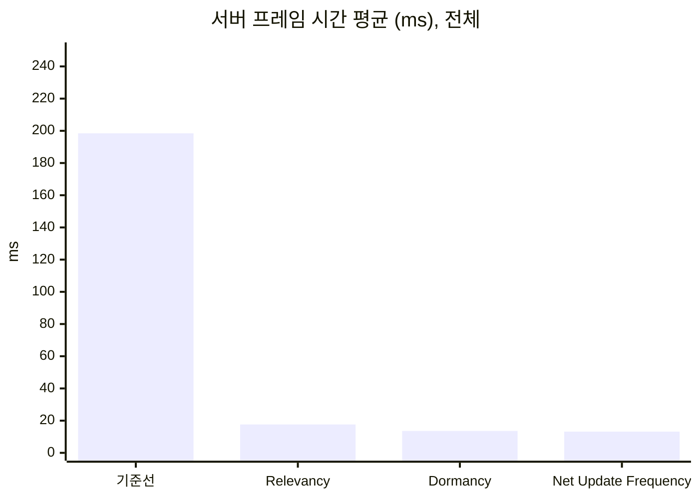
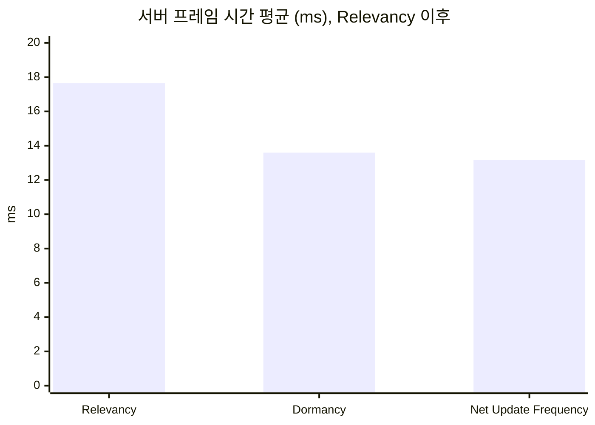
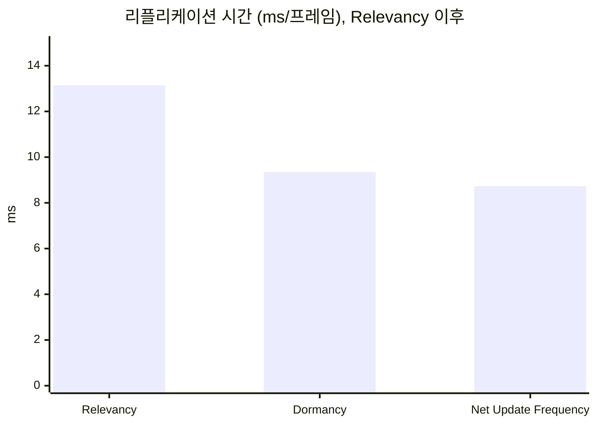
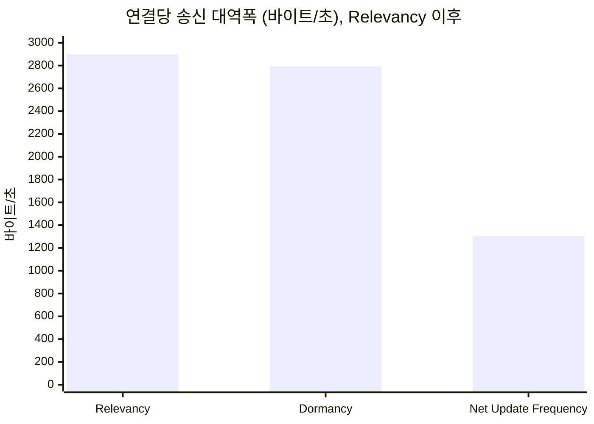

# UE5 Dedicated Server 최적화 실험실


언리얼 엔진 5.8.3 Dedicated Server의 네트워크와 서버 부하를 Unreal Insights로 측정하고, 최적화 기법을 하나씩 적용하면서 전후를 비교한 기록이다.

아주 단순한 오픈월드 서바이벌 환경을 최적화가 전혀 없는 상태에서 시작한다. 포스팅 하나에 기법 하나만 적용하고, 같은 시나리오를 다시 측정해 무엇이 얼마나 달라졌는지 수치와 화면으로 보여준다.

- **대상**: 레거시 리플리케이션(기본 NetDriver). 게임 코드는 표준 `UPROPERTY` 리플리케이션과 RPC만 쓴다.
- **다루는 기법**: Relevancy(Net Cull Distance), 액터 Dormancy, Net Update Frequency.
- **측정 도구**: Unreal Insights(Timing, Network)와 서버가 남기는 수치 CSV.

## 포스팅

| # | 제목 | 내용 |
| --- | --- | --- |
| 0 | [테스트베드와 측정 방법](Posts/00-testbed/README.md) | 시나리오 규모와 근거, 트레이스 수집법, 지표의 정의, 측정의 한계 |
| 1 | [Always Relevant 기준선](Posts/01-baseline/README.md) | 최적화가 없는 기준선의 수치, Insights에서 가장 큰 비용을 찾는 과정 |
| 2 | [Relevancy와 Net Cull Distance](Posts/02-relevancy/README.md) | 멀리 있는 액터를 보내지 않기. 기준선이 끈 엔진 기본 Net Cull Distance 150m의 복원 |
| 3 | [자원 노드 Dormancy](Posts/03-dormancy/README.md) | 거의 변하지 않는 액터를 프레임마다 확인하지 않기. Dormancy가 줄인 비용과 줄이지 못한 비용 |
| 4 | [AI NPC Net Update Frequency](Posts/04-update-frequency/README.md) | 계속 움직이는 다수 액터의 리플리케이션 빈도 낮추기. 대역폭은 절반이 됐고 CPU는 거의 그대로였던 이유 |

## 테스트베드 한눈에 보기

2km × 2km 바닥 위에 세 가지 요소를 둔다. 세 요소의 비용 패턴이 서로 달라서, 기법마다 겨냥하는 대상이 겹치지 않는다.

| 요소 | 구현 | 비용 패턴 | 겨냥하는 기법 |
| --- | --- | --- | --- |
| 플레이어 캐릭터 | 실제 클라이언트가 접속해 조종하는 3인칭 캐릭터. 고정 경유점을 따라 자동으로 걷는다 | 수는 적고 연결마다 비용이 든다 | 연결당 비용 읽기 |
| 자원 노드 | 실린더 액터. 체력과 고갈 여부만 리플리케이트하고 채집 RPC가 하나 있다 | 수가 많고 거의 변하지 않는다 | Relevancy, Dormancy |
| AI NPC | 원뿔 액터. 서버에서 단순 배회한다 | 수가 많고 계속 움직인다 | Net Update Frequency |

시나리오 규모는 클라이언트 8개, 자원 노드 5,000개(와 검증용 1개), AI NPC 300명이다. 기준선이 네 조건(초기 전송 완료, 지속적인 틱 예산 초과, 송신 한도에 포화되지 않음, 가장 큰 비용이 네트워크)을 만족하는 것을 확인하고 고정했다. 이 규모에서 최적화가 없는 서버는 한 프레임에 약 168ms를 쓰고(틱 예산 33.3ms의 5.0배), 그 96%가 네트워크 드라이버의 송신 쪽 처리다(보정 실행 `calib-f-r1` 한 번의 값). 같은 규모를 3회 측정한 기준선의 서버 프레임 시간 평균은 198.43ms다(아래 "누적 수치"). 보정 과정과 근거는 [테스트베드와 측정 방법](Posts/00-testbed/README.md)에 있다.

| 3인칭 화면 | 내려다보기 화면 |
| --- | --- |
|  |  |

위 두 장은 확정 규모 실행(`calib-g-r1`)의 자동 스크린샷이다. 화면 왼쪽 위 상자의 첫 줄은 실행 라벨, 클라이언트 자리 번호와 역할, 시작 신호 후 경과 시간이고, 둘째 줄은 그 클라이언트에 실제로 존재하는 노드와 NPC의 수와 플레이어 위치다. 내려다보기 화면은 플레이어를 중심으로 350m 위에서 본 것이고, 초록 점은 자원 노드, 검은 점은 고갈된 노드, 빨간 점은 NPC이다. 클라이언트가 받지 않은 액터에는 점이 찍히지 않으므로, 최적화 전후에 클라이언트가 가진 것이 어떻게 달라지는지 이 화면으로 비교한다.

### 측정 방식

- **실제 클라이언트를 띄운다.** 서버와 클라이언트 모두 에디터 빌드 실행 파일을 쿠킹 없이 실행한다. 클라이언트는 실제로 렌더링하고, 그 화면이 포스팅의 시각 자료다.
- **스크립트 하나가 전부 실행한다.** 서버와 클라이언트를 띄우고, 측정이 끝나면 정리하고, 실패한 실행을 성공으로 돌려주지 않는다.
- **실행마다 같은 조건에서 출발한다.** 노드와 NPC는 고정 시드로 배치하고, 모든 클라이언트가 준비되면 서버가 공통 시작 신호를 낸다. 이동, 채집, 배회, 자동 스크린샷의 시계가 모두 이 신호에서 출발한다.
- **서버와 클라이언트를 서로 다른 코어에 고정한다.** 서버는 논리 프로세서 2\~7, 클라이언트는 8\~31을 쓴다. 최적화로 클라이언트 부하가 줄어든 효과가 서버 수치에 섞이는 것을 줄이기 위해서다. 0번과 1번은 이 PC에서 DPC 부하가 몰려 쓰지 않는다.
- **준비 구간 뒤에 측정한다.** 시작 신호 뒤 준비 구간 30초를 버리고 측정 구간 60초를 잰다. 구성마다 3회 실행해 중앙값과 변동 폭을 적는다.
- **연결 수가 바뀐 실행은 버린다.** 시작 신호 뒤에 클라이언트가 하나라도 빠지면 서버가 수치를 남기지 않고 실패로 끝난다.

서버 틱은 30Hz(틱 예산 1000ms ÷ 30 = 33.3ms)이다. 엔진 기본값이며 `Engine/Config/BaseEngine.ini`의 `NetServerMaxTickRate`에서 확인했다.

### 지표

| 지표 | 출처 |
| --- | --- |
| 서버 프레임 시간(평균, P99) | Timing Insights |
| 리플리케이션 시간(프레임당) | Timing Insights 타이머 `GameNetDriver`의 프레임당 Incl. 모든 포스팅에서 같은 타이머를 쓴다 |
| 연결당 송신 대역폭 | Network Insights, 서버 CSV와 대조 |
| 연결당 열린 액터 채널 수 | 서버 CSV |
| 클라이언트에 존재하는 액터 수 | 클라이언트 화면 위 글자 |

열린 액터 채널 수와 클라이언트에 존재하는 액터 수는 다른 수치다. Dormant 상태에 들어간 액터는 채널이 닫혀도 클라이언트에 남는다.

## 누적 수치

세 기법을 모두 적용한 서버는 기준선보다 서버 프레임 시간 평균이 93.4%, 연결당 송신 대역폭이 95.4% 줄었다. 줄어든 서버 프레임 시간 평균 185.27ms 가운데 180.79ms는 첫 단계인 Relevancy에서 나왔고, 이것은 기준선이 일부러 끈 엔진 기본 동작을 되돌린 것이다(아래 "측정의 한계"). 모든 값은 구성마다 3회 실행한 중앙값이다.

### 기준선과 최종 구성

| 지표 | 기준선(`baseline3`) | 세 기법 적용(`update-frequency3`) | 변화 |
| --- | ---: | ---: | ---: |
| 서버 프레임 시간 평균(ms) | 198.43 | 13.16 | -93.4% |
| 서버 프레임 시간 P99(ms) | 262.96 | 19.50 | -92.6% |
| 리플리케이션 시간(ms/프레임) | 188.97 | 8.73 | -95.4% |
| 연결당 송신 대역폭(바이트/초) | 28,048 | 1,303 | -95.4% |
| 연결당 열린 액터 채널 수 | 5,314 | 20 | -99.6% |

### 기법별 변화

각 기법은 바로 앞 구성과 비교한다. "구별되지 않음"은 중앙값의 변화가 두 구성 중 큰 쪽의 변동 폭(세 실행의 최댓값 − 최솟값)보다 작다는 뜻이다.

| 기법 | 비교한 실행 | 줄어든 것 | 구별되지 않음 |
| --- | --- | --- | --- |
| [Relevancy](Posts/02-relevancy/README.md) | `baseline3` → `relevancy2` | 서버 프레임 시간 평균 -91.1%, P99 -89.9%, 리플리케이션 시간 -93.0%, 연결당 송신 대역폭 -89.7%, 연결당 열린 액터 채널 수 5,314 → 118 | 없음 |
| [자원 노드 Dormancy](Posts/03-dormancy/README.md) | `relevancy2` → `dormancy2` | 서버 프레임 시간 평균 -16.7%, 리플리케이션 시간 -22.6%, 연결당 열린 액터 채널 수 118 → 20 | 서버 프레임 시간 P99, 연결당 송신 대역폭 |
| [AI NPC Net Update Frequency](Posts/04-update-frequency/README.md) | `dormancy6` → `update-frequency3` | 연결당 송신 대역폭 -53.3%, 서버 프레임 시간 P99 -6.4%, 리플리케이션 시간 -6.6% | 서버 프레임 시간 평균 |

### 구성별 중앙값

| 지표 | 기준선<br>`baseline3` | Relevancy<br>`relevancy2` | Dormancy<br>`dormancy6` | Net Update Frequency<br>`update-frequency3` |
| --- | ---: | ---: | ---: | ---: |
| 서버 프레임 시간 평균(ms) | 198.43 | 17.64 | 13.60 | 13.16 |
| 서버 프레임 시간 P99(ms) | 262.96 | 26.64 | 20.84 | 19.50 |
| 리플리케이션 시간(ms/프레임) | 188.97 | 13.14 | 9.35 | 8.73 |
| 연결당 송신 대역폭(바이트/초) | 28,048 | 2,897 | 2,793 | 1,303 |
| 연결당 열린 액터 채널 수 | 5,314 | 118 | 20 | 20 |

- **출처.** 서버 프레임 시간과 리플리케이션 시간은 Timing Insights, 연결당 송신 대역폭은 Network Insights(`Connection 0`)에서 측정 구간을 읽은 값이고, 연결당 열린 액터 채널 수는 서버 CSV이다. 세 실행의 값과 변동 폭은 각 포스팅의 "결과"에 있다.
- **서버 프레임 시간**은 프레임 시간에서 틱 속도 제한 대기를 뺀 시간이다([ADR-0010](Docs/Decisions/0010-frame-time-without-tick-wait.md)). P99는 측정 구간의 프레임마다 이 값을 Insights에서 내보내 읽은 99백분위 경계값이다.
- **Dormancy 값.** 표와 차트의 Dormancy는 Net Update Frequency와 연달아 잰 `dormancy6`이다. 같은 코드를 Relevancy 직후에 잰 `dormancy2`는 서버 프레임 시간 평균이 14.69ms로 1.09ms 컸고(측정한 화면 조건이 달랐다), 기법별 변화는 연달아 잰 묶음끼리 계산했다. 기준선과 `update-frequency3`도 화면 조건이 다르지만, 이 1.09ms는 둘의 차이 185.27ms에 비해 작다([AI NPC Net Update Frequency의 "결과"](Posts/04-update-frequency/README.md#결과)).
- **연결당 송신 대역폭**은 세 실행 가운데 일부만 Network Insights에서 읽었고, 어느 실행의 값인지는 각 포스팅의 "결과"에 있다. Relevancy부터는 연결마다 받는 액터가 위치에 따라 달라, `Connection 0`(제자리에서 채집하는 클라이언트)이 서버 CSV의 8개 연결 평균보다 35% 작다([Relevancy와 Net Cull Distance의 "한계와 다음"](Posts/02-relevancy/README.md#한계와-다음)).

### 차트

기준선이 다른 구성보다 열 배 이상 커서, 첫 차트에만 기준선을 넣고 나머지는 Relevancy 이후의 구성만 보여준다. "Dormancy"는 `dormancy6`이다.









## 측정의 한계

- 에디터 빌드 실행 파일을 쿠킹 없이 사용한다. 절대 수치는 출시 빌드와 다르다.
- 서버와 클라이언트가 같은 PC에서 돈다. 서로 다른 물리 코어에 고정하지만 캐시와 메모리 대역폭 경합은 남는다. 네트워크는 루프백이다.
- 수치는 같은 조건의 전후 비교로만 해석해야 한다. 서버 코드만의 CPU 개선률이 아니다.
- 기준선은 인위적인 출발점이다. 엔진의 기본 Relevancy 판정을 의도적으로 끄고(`bAlwaysRelevant = true`), 기준선이 엔진 기본 송신 한도(연결당 100,000바이트/초)에 포화되어 한도를 350,000바이트/초로 올려 고정했다(기준선 송신량을 30Hz로 환산한 172,638바이트/초의 약 두 배). 그래서 Relevancy로 얻은 개선은 "엔진 기본 동작의 복원"이고, 그 뒤의 두 기법이 "기본 동작 위의 개선"이다.
- AI NPC는 움직이는 리플리케이트 액터의 대역이다. 길 찾기나 행동 트리 같은 AI 비용은 측정하지 않는다.
- 채집 RPC는 자동 실험용이다. 서버가 대상 탐색과 거리 검사, 호출 간격 제한을 하지만 그 밖의 악의적 호출은 막지 않는다.

## 실행 방법

1. 언리얼 엔진 5.8.3 소스 빌드가 필요하다.
2. `DSOptLab.uproject`를 우클릭해 "Switch Unreal Engine version"으로 그 엔진을 고른다. 스크립트는 여기서 고른 엔진을 쓴다.
3. 빌드한다.

   ```powershell
   powershell -ExecutionPolicy Bypass -File Scripts/build.ps1
   ```

4. 시나리오를 실행한다. 먼저 동작 확인용 작은 규모로 실행해 본다.

   ```powershell
   powershell -ExecutionPolicy Bypass -File Scripts/run-scenario.ps1 -Label try1 -Clients 2 -Nodes 100 -Npcs 10 -Warmup 20 -Measure 30
   ```

   확정 규모의 명령이다. 클라이언트 8개가 뜨며, 측정 PC에서 UE 프로세스의 메모리 합계가 27.5GB였다. 서버를 논리 프로세서 2\~7, 클라이언트를 8\~31에 고정하므로 논리 프로세서가 32개인 PC를 전제로 한다.

   ```powershell
   powershell -ExecutionPolicy Bypass -File Scripts/run-scenario.ps1 -Label try2 -Clients 8 -Nodes 5000 -Npcs 300 -Warmup 30 -Measure 60
   ```

   트레이스는 `Scripts/open-insights.ps1 -Label try2-r1`로 연다.

   서버 콘솔 창과 클라이언트 창이 뜨고, 측정이 끝나면 모두 닫힌다. 결과는 다음 위치에 남는다.

   | 결과 | 위치 |
   | --- | --- |
   | 수치 CSV | `Saved/LabMetrics/summary.csv` |
   | Insights 트레이스 | `Saved/Traces/<라벨>-r1.utrace` |
   | 자동 스크린샷 | `Saved/Screenshots/Lab/` |
   | 로그 | `Saved/Logs/` |

   같은 라벨은 다시 쓸 수 없다. 다시 실행할 때는 라벨을 바꾼다. 실행 중에는 클라이언트 창에 키 입력을 하지 않는다.

5. 클라이언트 두 개를 같은 자리에 띄워 직접 조작해 보려면 `Scripts/run-manual.ps1`을 쓴다. 왼쪽 Shift로 달린다.

## 레포 구조

```
README.md                  이 문서
Posts/NN-이름/README.md    포스팅 본문과 이미지
DSOptLab.uproject          언리얼 프로젝트(레포 루트가 프로젝트 폴더)
Source/DSOptLab/           게임 코드. 이 프로젝트에서 만든 클래스는 접두사 Lab
Config/  Content/          설정과 에셋
Scripts/                   빌드, 측정 실행, 수동 확인용 PowerShell 스크립트
Docs/                      작업 문서
```

| 코드 | 역할 |
| --- | --- |
| [LabScenarioConfig](Source/DSOptLab/LabScenarioConfig.h) | 실행 인자에서 시나리오 값을 읽는다 |
| [LabResourceNode](Source/DSOptLab/LabResourceNode.cpp) | 자원 노드 |
| [LabNpc](Source/DSOptLab/LabNpc.cpp) | AI NPC, 영상용 왕복 NPC(`ALabShowcaseNpc`) |
| [LabGameMode](Source/DSOptLab/LabGameMode.cpp) | 월드 생성, 공통 시작 신호, 플레이어 배치 |
| [LabPlayerController](Source/DSOptLab/LabPlayerController.cpp) | 준비 보고, 자동 이동과 채집, 채집 RPC |
| [LabCharacterMovement](Source/DSOptLab/LabCharacterMovement.cpp) | 수동 조작용 달리기(왼쪽 Shift). 저장된 이동의 플래그 한 비트로 서버에 보낸다 |
| [LabHUD](Source/DSOptLab/LabHUD.cpp) | 클라이언트 화면 표시: 화면 글자(라벨, 역할, 그 클라이언트에 있는 노드와 NPC 수, 위치), 내려다보기 화면의 점과 카메라, 자동 스크린샷 |
| [LabMetricsSubsystem](Source/DSOptLab/LabMetricsSubsystem.cpp) | 서버 측정과 CSV 기록 |
| [run-scenario.ps1](Scripts/run-scenario.ps1) | 측정 실행, 코어 배정, 실패 검출 |
